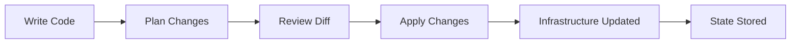
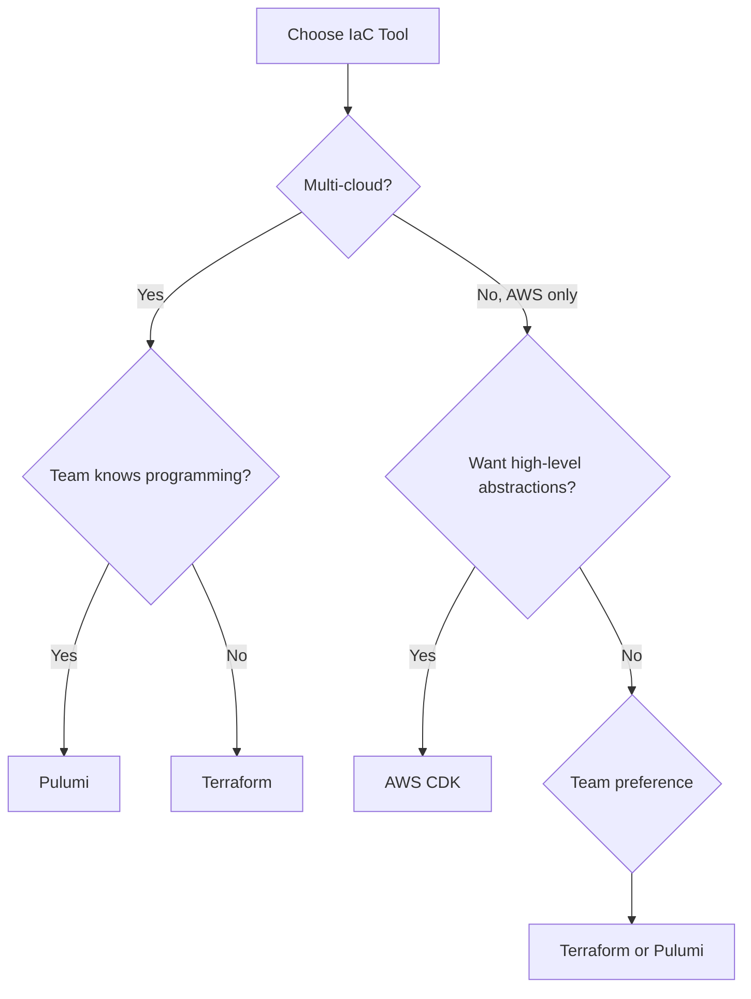

# Comparing Infrastructure as Code Tools: Terraform, Pulumi, and CDK

Author: [nawazdhandala](https://www.github.com/nawazdhandala)

Tags: Infrastructure as Code, Terraform, Pulumi, CDK, Comparison

Description: A practical comparison of Infrastructure as Code tools including Terraform, Pulumi, and AWS CDK for different use cases.

---

Infrastructure as Code (IaC) lets you define, provision, and manage infrastructure through configuration files instead of manual processes. The three most popular tools are Terraform, Pulumi, and AWS CDK. Each has different strengths. This guide compares them so you can choose the right one for your team.

## How IaC Works

All IaC tools follow the same basic workflow: define desired state, plan the changes, and apply them.



## Terraform: The Industry Standard

Terraform uses its own language, HCL (HashiCorp Configuration Language). It is cloud-agnostic and has the largest ecosystem of providers.

```hcl
# main.tf
# Terraform configuration for a web application on AWS

# Specify the required provider and version
terraform {
  required_providers {
    aws = {
      source  = "hashicorp/aws"
      version = "~> 5.0"
    }
  }

  # Store state remotely in S3
  backend "s3" {
    bucket = "my-terraform-state"
    key    = "prod/terraform.tfstate"
    region = "us-east-1"
  }
}

provider "aws" {
  region = var.aws_region
}

# Variables for configuration
variable "aws_region" {
  description = "AWS region to deploy into"
  type        = string
  default     = "us-east-1"
}

variable "environment" {
  description = "Environment name (dev, staging, prod)"
  type        = string
}

# VPC for network isolation
resource "aws_vpc" "main" {
  cidr_block           = "10.0.0.0/16"
  enable_dns_hostnames = true
  enable_dns_support   = true

  tags = {
    Name        = "${var.environment}-vpc"
    Environment = var.environment
  }
}

# Public subnet for load balancers
resource "aws_subnet" "public" {
  count             = 2
  vpc_id            = aws_vpc.main.id
  cidr_block        = "10.0.${count.index + 1}.0/24"
  availability_zone = data.aws_availability_zones.available.names[count.index]

  map_public_ip_on_launch = true

  tags = {
    Name = "${var.environment}-public-${count.index + 1}"
  }
}

# ECS cluster for running containers
resource "aws_ecs_cluster" "main" {
  name = "${var.environment}-cluster"

  setting {
    name  = "containerInsights"
    value = "enabled"
  }
}

# ECS task definition for the web application
resource "aws_ecs_task_definition" "web" {
  family                   = "${var.environment}-web"
  network_mode             = "awsvpc"
  requires_compatibilities = ["FARGATE"]
  cpu                      = 256
  memory                   = 512

  container_definitions = jsonencode([
    {
      name      = "web"
      image     = "my-app:latest"
      essential = true
      portMappings = [
        {
          containerPort = 8080
          hostPort      = 8080
          protocol      = "tcp"
        }
      ]
      # Health check ensures the container is responding
      healthCheck = {
        command     = ["CMD-SHELL", "curl -f http://localhost:8080/health || exit 1"]
        interval    = 30
        timeout     = 5
        retries     = 3
        startPeriod = 60
      }
    }
  ])
}

# Output the cluster ARN for reference
output "cluster_arn" {
  value = aws_ecs_cluster.main.arn
}
```

### Terraform Strengths

- Mature ecosystem with 3000+ providers
- Cloud-agnostic
- Large community and extensive documentation
- Well-understood state management
- Strong module system for reusable components

### Terraform Weaknesses

- HCL is not a general-purpose language (limited loops, no functions beyond built-ins)
- State management can be complex at scale
- No built-in testing framework

## Pulumi: General-Purpose Languages for IaC

Pulumi lets you write infrastructure code in TypeScript, Python, Go, or C#. You get full language features: loops, conditionals, classes, and packages.

```typescript
// index.ts
// Pulumi program for the same web application in TypeScript

import * as pulumi from "@pulumi/pulumi";
import * as aws from "@pulumi/aws";

// Configuration values
const config = new pulumi.Config();
const environment = config.require("environment");

// VPC with full language features for construction
const vpc = new aws.ec2.Vpc("main-vpc", {
  cidrBlock: "10.0.0.0/16",
  enableDnsHostnames: true,
  enableDnsSupport: true,
  tags: {
    Name: `${environment}-vpc`,
    Environment: environment,
  },
});

// Create subnets using a loop - not possible in HCL without count/for_each
const publicSubnets: aws.ec2.Subnet[] = [];
const azs = aws.getAvailabilityZones({ state: "available" });

azs.then((availableAzs) => {
  for (let i = 0; i < 2; i++) {
    const subnet = new aws.ec2.Subnet(`public-subnet-${i}`, {
      vpcId: vpc.id,
      cidrBlock: `10.0.${i + 1}.0/24`,
      availabilityZone: availableAzs.names[i],
      mapPublicIpOnLaunch: true,
      tags: {
        Name: `${environment}-public-${i + 1}`,
      },
    });
    publicSubnets.push(subnet);
  }
});

// ECS cluster
const cluster = new aws.ecs.Cluster("main-cluster", {
  name: `${environment}-cluster`,
  settings: [
    {
      name: "containerInsights",
      value: "enabled",
    },
  ],
});

// Reusable function for creating task definitions
// This is the power of using a real language
function createTaskDefinition(
  name: string,
  image: string,
  port: number,
  cpu: number = 256,
  memory: number = 512
): aws.ecs.TaskDefinition {
  return new aws.ecs.TaskDefinition(`${name}-task`, {
    family: `${environment}-${name}`,
    networkMode: "awsvpc",
    requiresCompatibilities: ["FARGATE"],
    cpu: cpu.toString(),
    memory: memory.toString(),
    containerDefinitions: JSON.stringify([
      {
        name: name,
        image: image,
        essential: true,
        portMappings: [
          {
            containerPort: port,
            hostPort: port,
            protocol: "tcp",
          },
        ],
      },
    ]),
  });
}

// Create multiple services using the helper function
const webTask = createTaskDefinition("web", "my-app:latest", 8080);
const apiTask = createTaskDefinition("api", "my-api:latest", 3000, 512, 1024);

// Export outputs
export const clusterArn = cluster.arn;
export const vpcId = vpc.id;
```

### Pulumi Strengths

- Use real programming languages with full IDE support
- Native testing with standard test frameworks
- Strong typing catches errors at compile time
- Reusable components as regular classes and functions
- Built-in secrets management

### Pulumi Weaknesses

- Smaller provider ecosystem than Terraform
- Requires programming language knowledge
- Fewer community examples and modules

## AWS CDK: AWS-Native IaC

AWS CDK (Cloud Development Kit) generates CloudFormation templates from TypeScript, Python, or other languages. It is tightly integrated with AWS.

```typescript
// lib/web-app-stack.ts
// AWS CDK stack for the same web application

import * as cdk from "aws-cdk-lib";
import * as ec2 from "aws-cdk-lib/aws-ec2";
import * as ecs from "aws-cdk-lib/aws-ecs";
import * as ecs_patterns from "aws-cdk-lib/aws-ecs-patterns";
import { Construct } from "constructs";

// CDK uses the construct pattern for composable infrastructure
export class WebAppStack extends cdk.Stack {
  constructor(scope: Construct, id: string, props?: cdk.StackProps) {
    super(scope, id, props);

    const environment = this.node.tryGetContext("environment") || "dev";

    // VPC with sensible defaults - CDK creates subnets, NAT, IGW automatically
    const vpc = new ec2.Vpc(this, "MainVpc", {
      maxAzs: 2,
      natGateways: 1,
    });

    // ECS cluster with container insights enabled
    const cluster = new ecs.Cluster(this, "MainCluster", {
      vpc,
      clusterName: `${environment}-cluster`,
      containerInsights: true,
    });

    // High-level pattern: Fargate service behind an ALB
    // CDK creates the ALB, target group, security groups, and IAM roles
    const service = new ecs_patterns.ApplicationLoadBalancedFargateService(
      this,
      "WebService",
      {
        cluster,
        cpu: 256,
        memoryLimitMiB: 512,
        desiredCount: 2,
        taskImageOptions: {
          image: ecs.ContainerImage.fromRegistry("my-app:latest"),
          containerPort: 8080,
        },
        // Enable health checks
        healthCheck: {
          command: [
            "CMD-SHELL",
            "curl -f http://localhost:8080/health || exit 1",
          ],
          interval: cdk.Duration.seconds(30),
          timeout: cdk.Duration.seconds(5),
          retries: 3,
        },
      }
    );

    // Auto-scaling based on CPU utilization
    const scaling = service.service.autoScaleTaskCount({
      minCapacity: 2,
      maxCapacity: 10,
    });

    scaling.scaleOnCpuUtilization("CpuScaling", {
      targetUtilizationPercent: 70,
      scaleInCooldown: cdk.Duration.seconds(60),
      scaleOutCooldown: cdk.Duration.seconds(60),
    });

    // Output the load balancer DNS name
    new cdk.CfnOutput(this, "LoadBalancerDNS", {
      value: service.loadBalancer.loadBalancerDnsName,
    });
  }
}
```

### CDK Strengths

- Highest level of abstraction with L2 and L3 constructs
- Deep AWS integration with best-practice defaults
- Generates CloudFormation, which is well understood by AWS support
- Rich construct library reduces boilerplate significantly

### CDK Weaknesses

- AWS-only (CDKTF exists for Terraform providers but is less mature)
- Debugging CloudFormation errors can be difficult
- Tight coupling to AWS services

## Side-by-Side Comparison



| Feature | Terraform | Pulumi | AWS CDK |
|---|---|---|---|
| Language | HCL | TS, Python, Go, C# | TS, Python, Java, Go |
| Cloud Support | Multi-cloud | Multi-cloud | AWS (primarily) |
| State Management | Remote backends | Pulumi Cloud or self-managed | CloudFormation |
| Learning Curve | Medium | Low (if you know the language) | Low (if you know AWS) |
| Abstraction Level | Low to medium | Low to medium | Medium to high |
| Testing | Terratest (external) | Native test frameworks | CDK assertions |
| Community Size | Very large | Growing | Large (AWS ecosystem) |

## Testing Infrastructure Code

```typescript
// test/web-app.test.ts
// CDK assertion tests validate the generated CloudFormation

import * as cdk from "aws-cdk-lib";
import { Template } from "aws-cdk-lib/assertions";
import { WebAppStack } from "../lib/web-app-stack";

describe("WebAppStack", () => {
  const app = new cdk.App();
  const stack = new WebAppStack(app, "TestStack");
  const template = Template.fromStack(stack);

  test("creates an ECS cluster", () => {
    template.resourceCountIs("AWS::ECS::Cluster", 1);
  });

  test("creates a Fargate service with 2 desired tasks", () => {
    template.hasResourceProperties("AWS::ECS::Service", {
      DesiredCount: 2,
      LaunchType: "FARGATE",
    });
  });

  test("configures auto-scaling", () => {
    template.hasResourceProperties(
      "AWS::ApplicationAutoScaling::ScalableTarget",
      {
        MinCapacity: 2,
        MaxCapacity: 10,
      }
    );
  });
});
```

## Summary

Choose Terraform for multi-cloud setups and the largest ecosystem. Choose Pulumi if your team prefers writing infrastructure in familiar programming languages. Choose AWS CDK if you are all-in on AWS and want high-level abstractions that encode best practices.

Regardless of which IaC tool you choose, use [OneUptime](https://oneuptime.com) to monitor the infrastructure you provision. Track uptime, performance, and health of your deployed services so you know immediately when something goes wrong.
