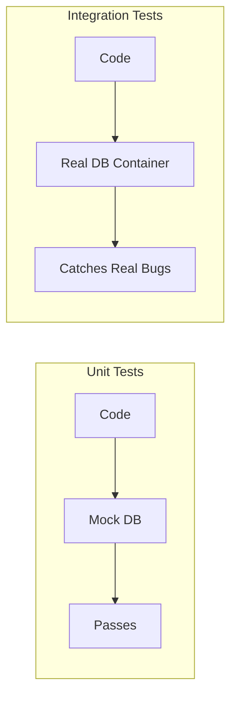
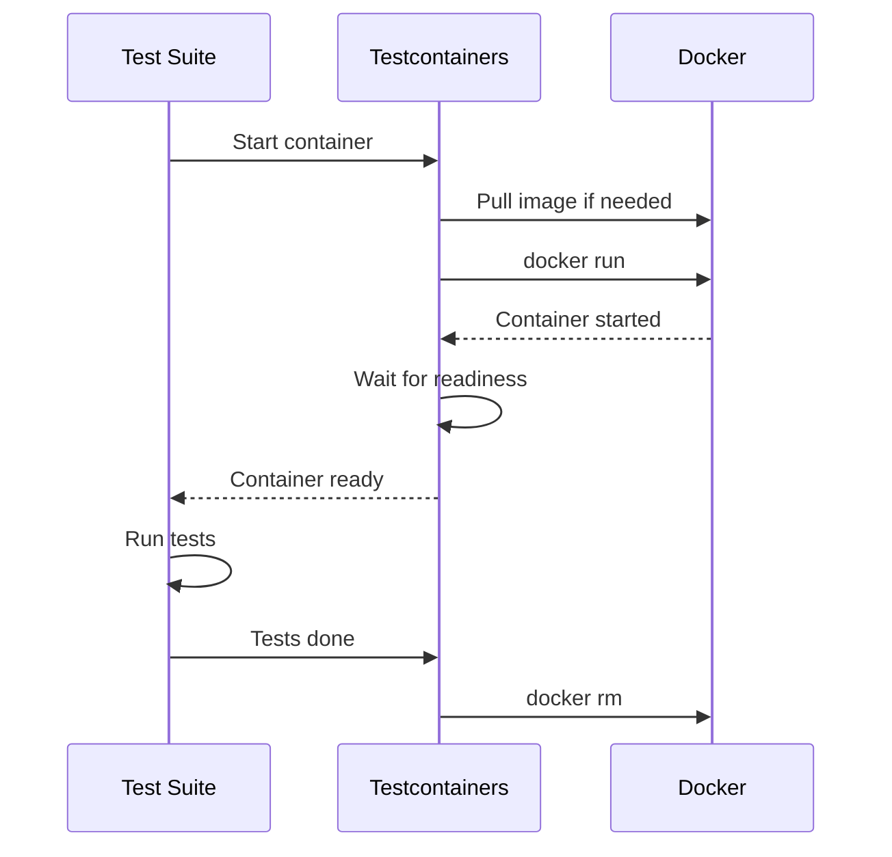
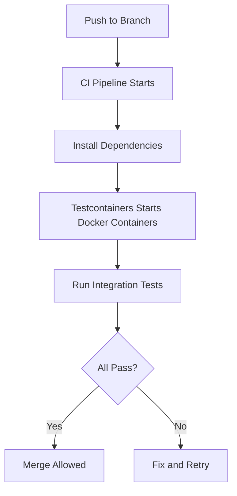

# How to Write Integration Tests with Testcontainers

Author: [nawazdhandala](https://www.github.com/nawazdhandala)

Tags: Testing, Testcontainers, Integration Tests, Docker, CI/CD

Description: Learn how to write integration tests with Testcontainers for testing against real databases, message queues, and services.

---

Unit tests mock external dependencies. Integration tests use real ones. Testcontainers lets you spin up real databases, message queues, and services in Docker containers during your test runs. No more shared test databases, no more flaky tests due to stale state.

## The Problem with Mocks

Mocks verify that your code calls the right methods with the right arguments. But they do not verify that the real database accepts your query, that your Redis commands actually work, or that your Kafka consumer handles real messages correctly.



## How Testcontainers Works

Testcontainers manages the lifecycle of Docker containers within your test suite. It pulls images, starts containers, waits for them to be ready, and cleans them up when tests finish.



## Testing with PostgreSQL

```python
# test_user_repository.py
# Integration tests for a user repository using a real PostgreSQL database

import pytest
from testcontainers.postgres import PostgresContainer
import psycopg2

# Module-scoped fixture: one container shared across all tests in this file
@pytest.fixture(scope="module")
def postgres_container():
    """
    Start a PostgreSQL container for the test module.
    The container is automatically stopped and removed after all tests complete.
    """
    with PostgresContainer("postgres:16-alpine") as postgres:
        yield postgres

@pytest.fixture(scope="module")
def db_connection(postgres_container):
    """
    Create a database connection and set up the schema.
    This runs once per module, not once per test.
    """
    conn = psycopg2.connect(postgres_container.get_connection_url())
    cursor = conn.cursor()

    # Create the schema for testing
    cursor.execute("""
        CREATE TABLE users (
            id SERIAL PRIMARY KEY,
            name VARCHAR(255) NOT NULL,
            email VARCHAR(255) UNIQUE NOT NULL,
            created_at TIMESTAMP DEFAULT NOW()
        )
    """)
    conn.commit()

    yield conn

    # Cleanup
    conn.close()

@pytest.fixture(autouse=True)
def clean_tables(db_connection):
    """
    Truncate tables before each test to ensure isolation.
    autouse=True means this runs automatically for every test.
    """
    cursor = db_connection.cursor()
    cursor.execute("TRUNCATE TABLE users RESTART IDENTITY CASCADE")
    db_connection.commit()
    yield

def test_create_user(db_connection):
    """Test that we can insert a user and read it back."""
    cursor = db_connection.cursor()

    # Insert a user
    cursor.execute(
        "INSERT INTO users (name, email) VALUES (%s, %s) RETURNING id",
        ("Alice", "alice@example.com"),
    )
    user_id = cursor.fetchone()[0]
    db_connection.commit()

    # Read it back
    cursor.execute("SELECT name, email FROM users WHERE id = %s", (user_id,))
    row = cursor.fetchone()

    assert row[0] == "Alice"
    assert row[1] == "alice@example.com"

def test_unique_email_constraint(db_connection):
    """Test that the unique constraint on email is enforced."""
    cursor = db_connection.cursor()

    cursor.execute(
        "INSERT INTO users (name, email) VALUES (%s, %s)",
        ("Alice", "alice@example.com"),
    )
    db_connection.commit()

    # Second insert with the same email should fail
    with pytest.raises(psycopg2.errors.UniqueViolation):
        cursor.execute(
            "INSERT INTO users (name, email) VALUES (%s, %s)",
            ("Bob", "alice@example.com"),
        )
        db_connection.commit()

    # Roll back so other tests are not affected
    db_connection.rollback()
```

## Testing with Redis

```python
# test_cache_service.py
# Integration tests for a caching layer backed by Redis

import pytest
import json
from testcontainers.redis import RedisContainer
import redis

@pytest.fixture(scope="module")
def redis_container():
    """Start a Redis container for cache testing."""
    with RedisContainer("redis:7-alpine") as container:
        yield container

@pytest.fixture(scope="module")
def redis_client(redis_container):
    """Create a Redis client connected to the test container."""
    client = redis.Redis(
        host=redis_container.get_container_host_ip(),
        port=redis_container.get_exposed_port(6379),
        decode_responses=True,
    )
    yield client
    client.close()

@pytest.fixture(autouse=True)
def flush_redis(redis_client):
    """Clear all keys before each test."""
    redis_client.flushall()
    yield

def test_cache_set_and_get(redis_client):
    """Test basic cache set and get operations."""
    user_data = {"id": "1", "name": "Alice", "email": "alice@example.com"}

    # Store user data as JSON with a 60-second TTL
    redis_client.setex("user:1", 60, json.dumps(user_data))

    # Retrieve and deserialize
    cached = json.loads(redis_client.get("user:1"))

    assert cached["name"] == "Alice"
    assert cached["email"] == "alice@example.com"

def test_cache_expiration(redis_client):
    """Test that cached values expire after TTL."""
    redis_client.setex("temp_key", 1, "temporary_value")

    # Key exists immediately
    assert redis_client.get("temp_key") == "temporary_value"

    # Wait for expiration
    import time
    time.sleep(2)

    # Key should be gone
    assert redis_client.get("temp_key") is None
```

## Testing with Kafka

```python
# test_event_processor.py
# Integration tests for a Kafka event processing pipeline

import pytest
import json
import time
from testcontainers.kafka import KafkaContainer
from kafka import KafkaProducer, KafkaConsumer

@pytest.fixture(scope="module")
def kafka_container():
    """Start a Kafka container with KRaft mode (no ZooKeeper needed)."""
    with KafkaContainer("confluentinc/cp-kafka:7.6.0") as kafka:
        yield kafka

@pytest.fixture(scope="module")
def producer(kafka_container):
    """Create a Kafka producer connected to the test broker."""
    return KafkaProducer(
        bootstrap_servers=kafka_container.get_bootstrap_server(),
        value_serializer=lambda v: json.dumps(v).encode("utf-8"),
    )

@pytest.fixture(scope="module")
def consumer(kafka_container):
    """Create a Kafka consumer subscribed to the test topic."""
    consumer = KafkaConsumer(
        "test-events",
        bootstrap_servers=kafka_container.get_bootstrap_server(),
        value_deserializer=lambda v: json.loads(v.decode("utf-8")),
        auto_offset_reset="earliest",
        consumer_timeout_ms=5000,
        group_id="test-group",
    )
    yield consumer
    consumer.close()

def test_produce_and_consume_event(producer, consumer):
    """Test that events flow through Kafka correctly."""
    # Produce an event
    event = {"type": "user.created", "user_id": "123", "name": "Alice"}
    producer.send("test-events", value=event)
    producer.flush()

    # Give Kafka a moment to process
    time.sleep(2)

    # Consume the event
    messages = list(consumer)
    assert len(messages) >= 1

    received = messages[0].value
    assert received["type"] == "user.created"
    assert received["user_id"] == "123"
```

## Using Docker Compose with Testcontainers

For testing multi-service setups, use the Docker Compose module.

```python
# test_full_stack.py
# Integration test using Docker Compose for a multi-service setup

import pytest
from testcontainers.compose import DockerCompose

@pytest.fixture(scope="module")
def compose():
    """
    Start all services defined in docker-compose.test.yml.
    This is useful when your application depends on multiple services
    that need to communicate with each other.
    """
    with DockerCompose(
        filepath=".",
        compose_file_name="docker-compose.test.yml",
        pull=True,
    ) as compose:
        # Wait for the API service to be ready
        compose.wait_for("http://localhost:8080/health")
        yield compose
```

## CI/CD Configuration

Testcontainers works in CI environments that support Docker.

```yaml
# .github/workflows/integration-tests.yml

name: Integration Tests
on: [push, pull_request]

jobs:
  test:
    runs-on: ubuntu-latest
    steps:
      - uses: actions/checkout@v4

      - name: Set up Python
        uses: actions/setup-python@v5
        with:
          python-version: "3.12"

      - name: Install dependencies
        run: pip install -r requirements-test.txt

      # Docker is available by default on GitHub Actions Ubuntu runners
      - name: Run integration tests
        run: pytest tests/integration/ -v --tb=short
```



## Summary

Testcontainers removes the gap between unit tests and production. You test against real databases, real message queues, and real caches. Each test run gets a fresh, isolated environment. No shared state, no flaky tests, no manual setup.

Monitor the services that back your integration tests in production with [OneUptime](https://oneuptime.com). Track database health, cache hit rates, and message queue lag to catch issues before they affect your users.
