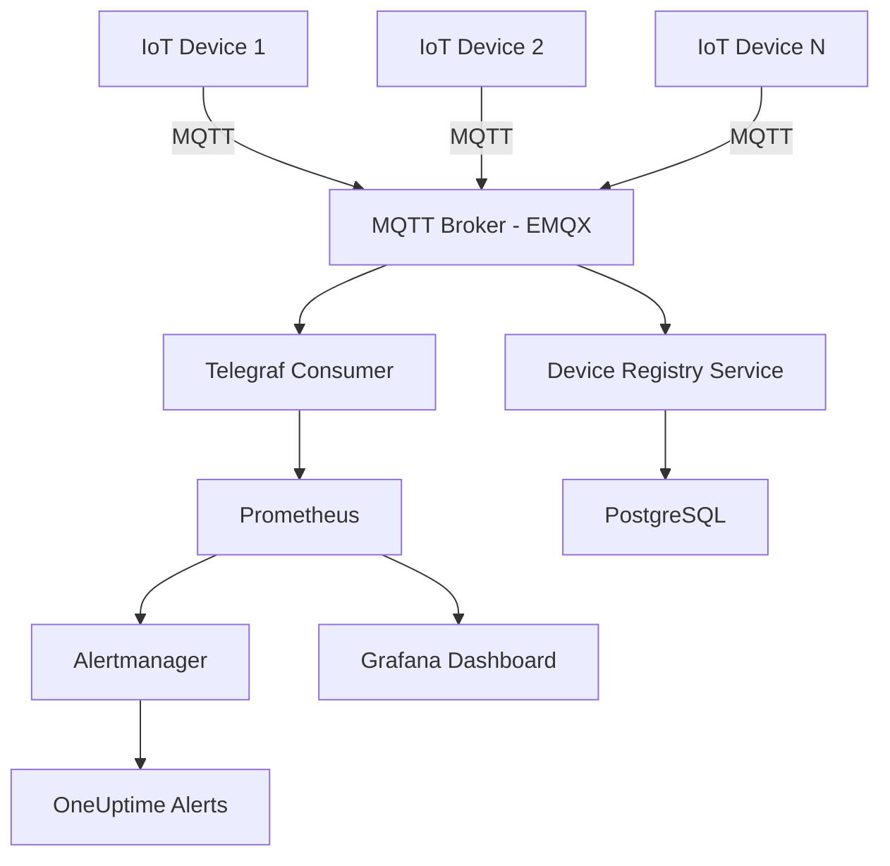
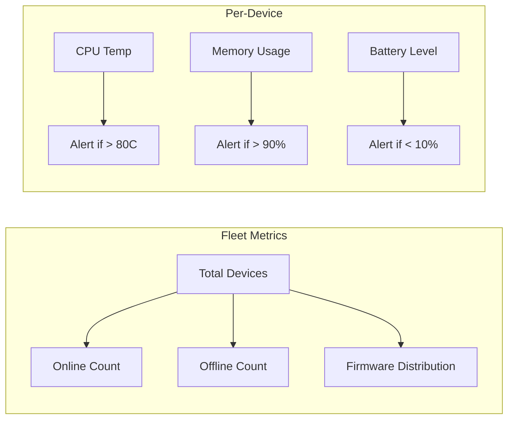
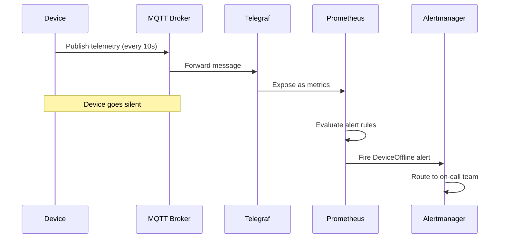

# How to Monitor IoT Device Fleets with Kubernetes

Author: [nawazdhandala](https://www.github.com/nawazdhandala)

Tags: IoT, Kubernetes, Monitoring, Edge Computing, MQTT

Description: Learn how to monitor IoT device fleets using Kubernetes for centralized data collection, alerting, and fleet management.

---

Managing thousands of IoT devices scattered across locations is a challenge. Devices go offline, firmware drifts, and telemetry data floods in at unpredictable rates. Kubernetes provides the orchestration layer to centralize monitoring, scale ingestion, and automate responses.

This guide walks through building a fleet monitoring system on Kubernetes using MQTT for device communication, Telegraf for metrics collection, and Prometheus for alerting.

## Architecture Overview



## Deploying the MQTT Broker

EMQX is a scalable MQTT broker that runs well on Kubernetes. Deploy it as a StatefulSet for stable network identities.

```yaml
# emqx-statefulset.yaml
# Deploys EMQX MQTT broker with persistent storage
apiVersion: apps/v1
kind: StatefulSet
metadata:
  name: emqx
  namespace: iot-monitoring
spec:
  serviceName: emqx-headless
  replicas: 3
  selector:
    matchLabels:
      app: emqx
  template:
    metadata:
      labels:
        app: emqx
    spec:
      containers:
        - name: emqx
          image: emqx/emqx:5.4.0
          ports:
            # MQTT standard port
            - containerPort: 1883
              name: mqtt
            # MQTT over WebSocket
            - containerPort: 8083
              name: mqtt-ws
            # Management dashboard
            - containerPort: 18083
              name: dashboard
          env:
            # Enable cluster discovery via Kubernetes DNS
            - name: EMQX_CLUSTER__DISCOVERY_STRATEGY
              value: dns
            - name: EMQX_CLUSTER__DNS__RECORD_TYPE
              value: srv
            - name: EMQX_CLUSTER__DNS__NAME
              value: emqx-headless.iot-monitoring.svc.cluster.local
          volumeMounts:
            - name: emqx-data
              mountPath: /opt/emqx/data
  volumeClaimTemplates:
    - metadata:
        name: emqx-data
      spec:
        accessModes: ["ReadWriteOnce"]
        resources:
          requests:
            storage: 10Gi
```

## Telegraf for MQTT-to-Prometheus Bridge

Telegraf subscribes to MQTT topics and exposes metrics in Prometheus format.

```yaml
# telegraf-configmap.yaml
# Configures Telegraf to consume MQTT messages and expose Prometheus metrics
apiVersion: v1
kind: ConfigMap
metadata:
  name: telegraf-config
  namespace: iot-monitoring
data:
  telegraf.conf: |
    # Global agent configuration
    [agent]
      interval = "10s"
      flush_interval = "10s"

    # Subscribe to all device telemetry topics
    [[inputs.mqtt_consumer]]
      servers = ["tcp://emqx-headless:1883"]
      # Wildcard subscription for all devices
      topics = [
        "devices/+/telemetry",
        "devices/+/status",
        "devices/+/diagnostics"
      ]
      data_format = "json"
      # Extract device_id from topic path
      topic_tag = "topic"
      # Parse JSON payload fields as metrics
      json_string_fields = ["firmware_version", "device_type"]

    # Expose metrics for Prometheus scraping
    [[outputs.prometheus_client]]
      listen = ":9273"
      metric_version = 2
      export_timestamp = true
```

## Device Heartbeat Monitor

A lightweight service that tracks device heartbeats and flags devices that stop reporting.

```python
# device_heartbeat_monitor.py
# Tracks the last-seen timestamp for each IoT device
# and generates alerts when devices go silent

import time
import json
from datetime import datetime, timedelta
from prometheus_client import start_http_server, Gauge, Counter
import paho.mqtt.client as mqtt

# Prometheus metrics for fleet visibility
# Tracks the last heartbeat epoch for each device
device_last_seen = Gauge(
    "iot_device_last_seen_timestamp",
    "Last seen timestamp for each device",
    ["device_id", "device_type"]
)

# Count of devices currently considered offline
devices_offline = Gauge(
    "iot_devices_offline_total",
    "Number of devices currently offline"
)

# Total heartbeats received across the fleet
heartbeat_count = Counter(
    "iot_heartbeats_total",
    "Total heartbeats received",
    ["device_id"]
)

# In-memory registry of device states
device_registry = {}

# Devices silent for more than 5 minutes are offline
OFFLINE_THRESHOLD = timedelta(minutes=5)


def on_message(client, userdata, msg):
    """Handle incoming MQTT heartbeat messages."""
    try:
        payload = json.loads(msg.payload.decode())
        # Extract device_id from topic: devices/{device_id}/status
        parts = msg.topic.split("/")
        device_id = parts[1]
        device_type = payload.get("device_type", "unknown")

        now = datetime.utcnow()
        device_registry[device_id] = {
            "last_seen": now,
            "device_type": device_type,
            "firmware": payload.get("firmware_version", "unknown"),
        }

        # Update Prometheus metrics
        device_last_seen.labels(
            device_id=device_id,
            device_type=device_type
        ).set(now.timestamp())
        heartbeat_count.labels(device_id=device_id).inc()

    except Exception as e:
        print(f"Error processing message: {e}")


def check_offline_devices():
    """Scan the registry and count offline devices."""
    now = datetime.utcnow()
    offline = 0
    for device_id, info in device_registry.items():
        if now - info["last_seen"] > OFFLINE_THRESHOLD:
            offline += 1
    devices_offline.set(offline)


def main():
    # Start Prometheus metrics server on port 8000
    start_http_server(8000)

    # Connect to the MQTT broker
    client = mqtt.Client()
    client.on_message = on_message
    client.connect("emqx-headless", 1883, 60)
    client.subscribe("devices/+/status")
    client.loop_start()

    # Periodically scan for offline devices
    while True:
        check_offline_devices()
        time.sleep(30)


if __name__ == "__main__":
    main()
```

## Fleet Health Dashboard



## Prometheus Alert Rules for IoT

```yaml
# iot-alerts.yaml
# Prometheus alert rules for IoT fleet monitoring
apiVersion: monitoring.coreos.com/v1
kind: PrometheusRule
metadata:
  name: iot-fleet-alerts
  namespace: iot-monitoring
spec:
  groups:
    - name: iot-fleet
      rules:
        # Alert when a device has not reported in 5 minutes
        - alert: DeviceOffline
          expr: time() - iot_device_last_seen_timestamp > 300
          for: 2m
          labels:
            severity: warning
          annotations:
            summary: "IoT device {{ $labels.device_id }} is offline"
            description: "Device has not sent a heartbeat in over 5 minutes."

        # Alert when more than 10% of the fleet is offline
        - alert: FleetDegradation
          expr: iot_devices_offline_total / count(iot_device_last_seen_timestamp) > 0.1
          for: 5m
          labels:
            severity: critical
          annotations:
            summary: "Fleet degradation detected"
            description: "More than 10% of IoT devices are offline."

        # Alert on high device temperature
        - alert: DeviceOverheating
          expr: iot_device_cpu_temperature_celsius > 80
          for: 3m
          labels:
            severity: warning
          annotations:
            summary: "Device {{ $labels.device_id }} is overheating"
```

## Scaling Ingestion with HPA

When the fleet grows, the Telegraf consumers must scale to keep up with message volume.

```yaml
# telegraf-hpa.yaml
# Auto-scale Telegraf pods based on MQTT message backlog
apiVersion: autoscaling/v2
kind: HorizontalPodAutoscaler
metadata:
  name: telegraf-hpa
  namespace: iot-monitoring
spec:
  scaleTargetRef:
    apiVersion: apps/v1
    kind: Deployment
    name: telegraf
  minReplicas: 2
  maxReplicas: 10
  metrics:
    # Scale based on CPU usage from message processing
    - type: Resource
      resource:
        name: cpu
        target:
          type: Utilization
          averageUtilization: 60
```

## Device Lifecycle Flow



## Key Takeaways

- Use MQTT as the transport layer between devices and Kubernetes. It is lightweight and handles intermittent connectivity well.
- Deploy the MQTT broker as a StatefulSet for stable DNS and persistent sessions.
- Bridge MQTT to Prometheus with Telegraf so you can reuse existing alerting and dashboarding tools.
- Track heartbeats separately from telemetry. A device can send data but still be in a degraded state.
- Auto-scale ingestion pods with HPA to handle fleet growth without manual intervention.

Monitoring IoT fleets requires a different mindset than monitoring servers. Devices are unreliable, networks are lossy, and scale grows unpredictably. Kubernetes gives you the orchestration primitives to handle all of this. Pair it with [OneUptime](https://oneuptime.com) for centralized alerting and incident management across your entire IoT infrastructure, so you know the moment a device or an entire region goes dark.
