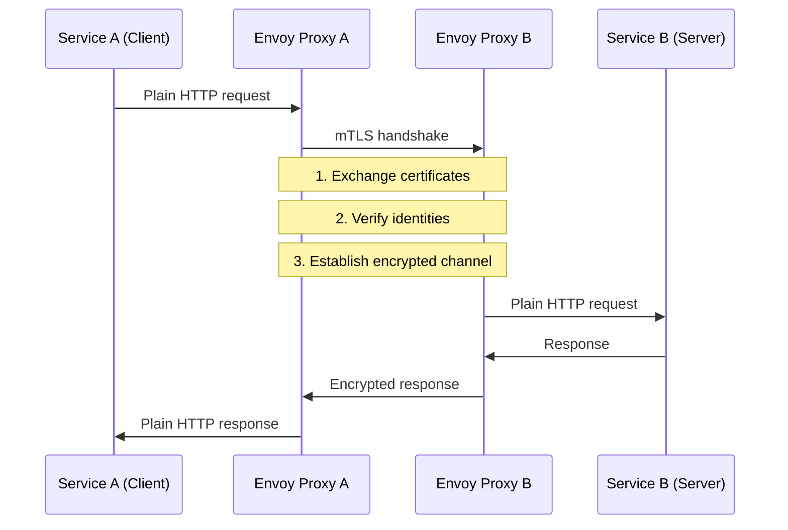
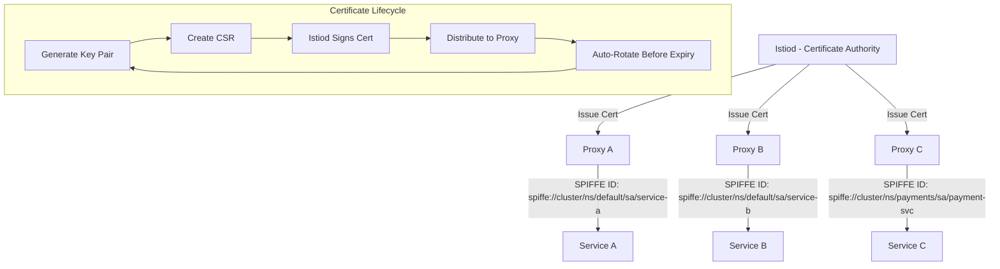
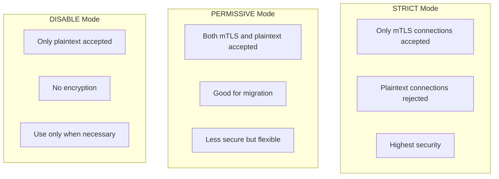
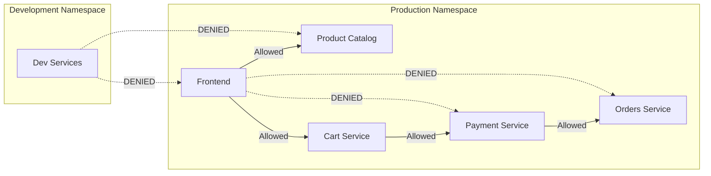
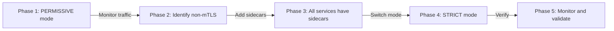

# How to Configure Istio mTLS for Zero-Trust Service Communication

Author: [nawazdhandala](https://www.github.com/nawazdhandala)

Tags: Istio, mTLS, Security, Zero Trust, Service Mesh

Description: Learn how to configure Istio mutual TLS for zero-trust service-to-service communication in Kubernetes.

---

## Introduction

In a zero-trust security model, no service is trusted by default, even within the cluster network. Istio enables mutual TLS (mTLS) between services, ensuring that every connection is authenticated, encrypted, and authorized. This guide shows you how to configure Istio's mTLS capabilities for production Kubernetes environments.

## What is Mutual TLS?

In regular TLS, only the client verifies the server's identity. In mutual TLS, both the client and server verify each other's identity using certificates. This prevents unauthorized services from communicating within your cluster.



## How Istio Manages Certificates

Istio's Istiod component acts as a Certificate Authority (CA). It automatically provisions, distributes, and rotates certificates for all workloads in the mesh.



## Enabling Strict mTLS

### Mesh-Wide Strict mTLS

```yaml
# PeerAuthentication - enforce mTLS for the entire mesh
apiVersion: security.istio.io/v1beta1
kind: PeerAuthentication
metadata:
  name: default
  namespace: istio-system  # Apply to all namespaces
spec:
  mtls:
    mode: STRICT  # Only accept mTLS connections
```

### Namespace-Level mTLS

```yaml
# Enable strict mTLS for a specific namespace
apiVersion: security.istio.io/v1beta1
kind: PeerAuthentication
metadata:
  name: default
  namespace: production
spec:
  mtls:
    mode: STRICT

---

# Permissive mode for a namespace still migrating to mTLS
# Accepts both plaintext and mTLS connections
apiVersion: security.istio.io/v1beta1
kind: PeerAuthentication
metadata:
  name: default
  namespace: legacy
spec:
  mtls:
    mode: PERMISSIVE
```

### Workload-Level mTLS

```yaml
# Override mTLS mode for a specific workload
apiVersion: security.istio.io/v1beta1
kind: PeerAuthentication
metadata:
  name: payment-service-mtls
  namespace: production
spec:
  selector:
    matchLabels:
      app: payment-service  # Apply only to payment-service pods
  mtls:
    mode: STRICT
  portLevelMtls:
    # Allow plaintext on metrics port for Prometheus scraping
    9090:
      mode: PERMISSIVE
```

## mTLS Modes Comparison



## Authorization Policies

mTLS provides authentication (identity verification), but you also need authorization (access control) to implement zero-trust properly.

### Deny-All Default Policy

```yaml
# Default deny-all policy for a namespace
# No service can communicate unless explicitly allowed
apiVersion: security.istio.io/v1beta1
kind: AuthorizationPolicy
metadata:
  name: deny-all
  namespace: production
spec:
  {}  # Empty spec means deny all traffic
```

### Allow Specific Service Communication

```yaml
# Allow only frontend to call the product-catalog service
apiVersion: security.istio.io/v1beta1
kind: AuthorizationPolicy
metadata:
  name: allow-frontend-to-catalog
  namespace: production
spec:
  selector:
    matchLabels:
      app: product-catalog
  action: ALLOW
  rules:
    - from:
        # Only allow requests from the frontend service account
        - source:
            principals:
              - "cluster.local/ns/production/sa/frontend"
      to:
        # Only allow GET requests to specific paths
        - operation:
            methods: ["GET"]
            paths: ["/api/v1/products", "/api/v1/products/*"]

---

# Allow payment-service to call the orders service
apiVersion: security.istio.io/v1beta1
kind: AuthorizationPolicy
metadata:
  name: allow-payment-to-orders
  namespace: production
spec:
  selector:
    matchLabels:
      app: orders
  action: ALLOW
  rules:
    - from:
        - source:
            principals:
              - "cluster.local/ns/production/sa/payment-service"
      to:
        - operation:
            methods: ["GET", "POST", "PUT"]
            paths: ["/api/v1/orders/*"]
```

### Deny Specific Traffic

```yaml
# Explicitly deny traffic from a specific namespace
apiVersion: security.istio.io/v1beta1
kind: AuthorizationPolicy
metadata:
  name: deny-from-untrusted
  namespace: production
spec:
  action: DENY
  rules:
    - from:
        - source:
            namespaces: ["development", "testing"]
```

## Zero-Trust Communication Flow



## Verifying mTLS Configuration

```bash
# Check if mTLS is enabled between services
istioctl x describe pod productpage-v1-xxxxx

# Verify the mTLS status of all services
istioctl proxy-config listeners productpage-v1-xxxxx --port 15006

# Check the certificate details of a workload
istioctl proxy-config secret productpage-v1-xxxxx -o json | \
  python3 -c "
import json, sys, base64
from datetime import datetime

# Parse the proxy secret configuration
data = json.load(sys.stdin)
for secret in data.get('dynamicActiveSecrets', []):
    name = secret.get('name', 'unknown')
    cert_chain = secret.get('secret', {}).get('tlsCertificate', {})
    print(f'Secret: {name}')
    # Display certificate validity info
"

# Check for mTLS connection issues
istioctl analyze --namespace production
```

## Migrating to Strict mTLS



### Migration Steps

```bash
# Step 1: Start with PERMISSIVE mode (already the default)
# This accepts both plaintext and mTLS

# Step 2: Check which connections are NOT using mTLS
# Query Prometheus for plaintext connections
kubectl exec -it deploy/prometheus -n istio-system -- \
  promtool query instant http://localhost:9090 \
  'sum(istio_tcp_connections_opened_total{connection_security_policy="none"}) by (source_workload, destination_workload)'

# Step 3: Ensure all services have Istio sidecars
kubectl get pods -n production -o jsonpath='{range .items[*]}{.metadata.name}{"\t"}{range .spec.containers[*]}{.name}{" "}{end}{"\n"}{end}'

# Step 4: Switch to STRICT mode
kubectl apply -f - <<EOF
apiVersion: security.istio.io/v1beta1
kind: PeerAuthentication
metadata:
  name: default
  namespace: production
spec:
  mtls:
    mode: STRICT
EOF

# Step 5: Monitor for connection failures
kubectl logs -n istio-system -l app=istiod --tail=100 | grep -i "tls"
```

## External Service Communication

```yaml
# Configure mTLS for communication with external services
apiVersion: networking.istio.io/v1beta1
kind: DestinationRule
metadata:
  name: external-api-mtls
  namespace: production
spec:
  host: api.external-service.com
  trafficPolicy:
    tls:
      mode: MUTUAL                    # Use mTLS with external service
      clientCertificate: /etc/certs/cert.pem
      privateKey: /etc/certs/key.pem
      caCertificates: /etc/certs/ca.pem

---

# ServiceEntry to register the external service in the mesh
apiVersion: networking.istio.io/v1beta1
kind: ServiceEntry
metadata:
  name: external-api
  namespace: production
spec:
  hosts:
    - api.external-service.com
  ports:
    - number: 443
      name: https
      protocol: HTTPS
  resolution: DNS
  location: MESH_EXTERNAL
```

## Conclusion

Istio's mTLS and authorization policies form the foundation of zero-trust networking in Kubernetes. Start with PERMISSIVE mode, gradually migrate all services, then enforce STRICT mTLS. Combine PeerAuthentication with AuthorizationPolicy for complete identity-based access control.

For monitoring the security posture of your service mesh and getting alerted on authorization failures, check out [OneUptime](https://oneuptime.com) for comprehensive observability, incident management, and uptime monitoring.
