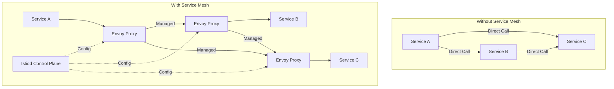
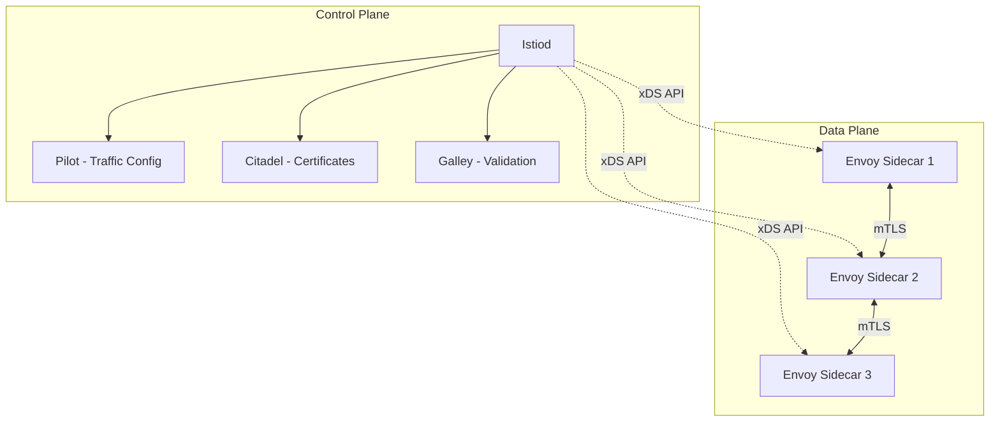
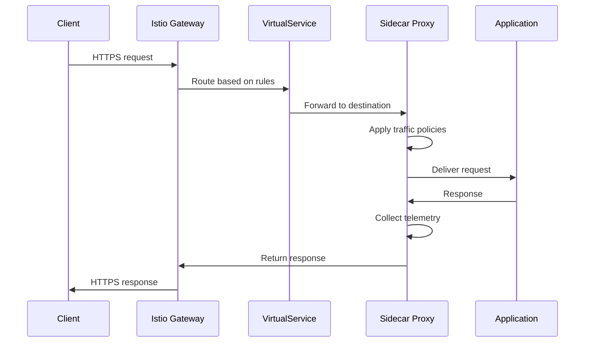

# How to Get Started with Istio Service Mesh on Kubernetes

Author: [nawazdhandala](https://www.github.com/nawazdhandala)

Tags: Istio, Service Mesh, Kubernetes, Traffic Management, Observability

Description: A beginner's guide to deploying and configuring Istio service mesh on Kubernetes for traffic management and observability.

---

## Introduction

As microservice architectures grow in complexity, managing service-to-service communication becomes a significant challenge. Istio is a service mesh that adds a transparent layer of infrastructure to handle traffic management, security, and observability without changing your application code. This guide will walk you through installing and configuring Istio on Kubernetes.

## What is a Service Mesh?

A service mesh is a dedicated infrastructure layer that handles communication between services. It uses sidecar proxies deployed alongside each service to intercept and manage all network traffic.



## Istio Architecture



## Installing Istio

### Using istioctl

```bash
# Download and install istioctl
curl -L https://istio.io/downloadIstio | sh -

# Move to the Istio directory
cd istio-1.22.0
export PATH=$PWD/bin:$PATH

# Install Istio with the demo profile (good for learning)
# Production: use "default" or "minimal" profile
istioctl install --set profile=demo -y

# Verify the installation
istioctl verify-install

# Check that Istio pods are running
kubectl get pods -n istio-system
```

### Enable Sidecar Injection

```bash
# Enable automatic sidecar injection for a namespace
kubectl label namespace default istio-injection=enabled

# Verify the label
kubectl get namespace default --show-labels
```

## Deploying a Sample Application

```yaml
# Deploy a simple bookinfo application with Istio sidecars
apiVersion: apps/v1
kind: Deployment
metadata:
  name: productpage
  labels:
    app: productpage
    version: v1
spec:
  replicas: 2
  selector:
    matchLabels:
      app: productpage
      version: v1
  template:
    metadata:
      labels:
        app: productpage
        version: v1
      # Istio sidecar will be automatically injected
      # because the namespace has istio-injection=enabled
    spec:
      containers:
        - name: productpage
          image: docker.io/istio/examples-bookinfo-productpage-v1:1.18.0
          ports:
            - containerPort: 9080
          resources:
            requests:
              cpu: 100m
              memory: 128Mi
            limits:
              cpu: 200m
              memory: 256Mi
---
apiVersion: v1
kind: Service
metadata:
  name: productpage
  labels:
    app: productpage
spec:
  ports:
    - port: 9080
      name: http
  selector:
    app: productpage
```

## Configuring the Istio Gateway

```yaml
# Istio Gateway - entry point for external traffic
apiVersion: networking.istio.io/v1beta1
kind: Gateway
metadata:
  name: bookinfo-gateway
spec:
  selector:
    istio: ingressgateway  # Use Istio's default ingress gateway
  servers:
    - port:
        number: 80
        name: http
        protocol: HTTP
      hosts:
        - "bookinfo.example.com"
    - port:
        number: 443
        name: https
        protocol: HTTPS
      tls:
        mode: SIMPLE
        credentialName: bookinfo-tls-cert  # Kubernetes TLS secret
      hosts:
        - "bookinfo.example.com"

---

# VirtualService - route traffic from the gateway to services
apiVersion: networking.istio.io/v1beta1
kind: VirtualService
metadata:
  name: bookinfo
spec:
  hosts:
    - "bookinfo.example.com"
  gateways:
    - bookinfo-gateway
  http:
    - match:
        - uri:
            prefix: /productpage
        - uri:
            prefix: /api/v1
      route:
        - destination:
            host: productpage
            port:
              number: 9080
```

## Traffic Flow with Istio



## Observability with Istio

### Install Observability Add-ons

```bash
# Install Kiali (service mesh dashboard)
kubectl apply -f https://raw.githubusercontent.com/istio/istio/release-1.22/samples/addons/kiali.yaml

# Install Prometheus (metrics collection)
kubectl apply -f https://raw.githubusercontent.com/istio/istio/release-1.22/samples/addons/prometheus.yaml

# Install Grafana (metrics dashboards)
kubectl apply -f https://raw.githubusercontent.com/istio/istio/release-1.22/samples/addons/grafana.yaml

# Install Jaeger (distributed tracing)
kubectl apply -f https://raw.githubusercontent.com/istio/istio/release-1.22/samples/addons/jaeger.yaml

# Access Kiali dashboard
istioctl dashboard kiali
```

### Check Proxy Status

```bash
# Check that all sidecar proxies are in sync with Istiod
istioctl proxy-status

# Inspect the Envoy configuration of a specific pod
istioctl proxy-config routes productpage-v1-xxxxx

# Analyze the mesh configuration for issues
istioctl analyze
```

## Resource Configuration for Production

```yaml
# Production Istio operator configuration
apiVersion: install.istio.io/v1alpha1
kind: IstioOperator
metadata:
  name: istio-production
spec:
  profile: default  # Use default profile for production
  meshConfig:
    # Enable access logging
    accessLogFile: /dev/stdout
    accessLogFormat: |
      [%START_TIME%] "%REQ(:METHOD)% %REQ(X-ENVOY-ORIGINAL-PATH?:PATH)% %PROTOCOL%"
      %RESPONSE_CODE% %RESPONSE_FLAGS% %BYTES_RECEIVED% %BYTES_SENT%
      %DURATION% "%REQ(X-FORWARDED-FOR)%" "%REQ(USER-AGENT)%"

    # Default traffic policy
    defaultConfig:
      holdApplicationUntilProxyStarts: true  # Wait for sidecar before app starts
      proxyMetadata:
        ISTIO_META_DNS_CAPTURE: "true"       # Capture DNS for metrics

    # Enable mTLS by default
    enableAutoMtls: true

  components:
    # Configure the ingress gateway
    ingressGateways:
      - name: istio-ingressgateway
        enabled: true
        k8s:
          # Set resource limits for the gateway
          resources:
            requests:
              cpu: 200m
              memory: 256Mi
            limits:
              cpu: 1000m
              memory: 1Gi
          # Horizontal pod autoscaler
          hpaSpec:
            minReplicas: 2
            maxReplicas: 10
```

## Verifying the Installation

```bash
# Check that all Istio components are healthy
kubectl get pods -n istio-system

# Verify mesh connectivity
istioctl proxy-status

# Run a diagnostic check
istioctl analyze --all-namespaces

# Check sidecar injection status
kubectl get pods -o jsonpath='{range .items[*]}{.metadata.name}{"\t"}{range .spec.containers[*]}{.name}{"\t"}{end}{"\n"}{end}'
```

## Conclusion

Istio provides powerful service mesh capabilities for Kubernetes, including traffic management, security, and observability. Start with the demo profile for learning, then move to the default profile for production. Enable automatic sidecar injection and configure gateways to control traffic into your mesh.

For end-to-end monitoring of your Istio service mesh and Kubernetes clusters, check out [OneUptime](https://oneuptime.com) for unified observability, alerting, and incident management.
