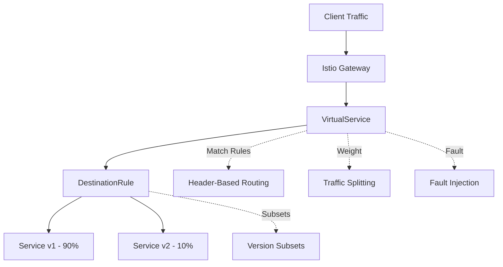
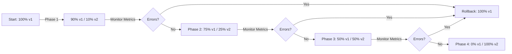
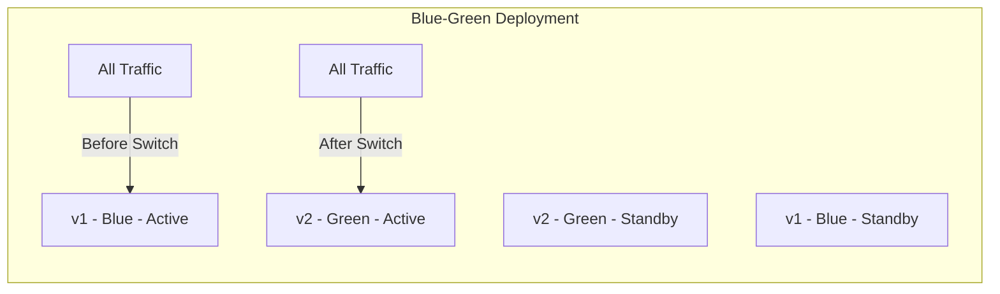

# How to Use Istio for Traffic Management and Canary Deployments

Author: [nawazdhandala](https://www.github.com/nawazdhandala)

Tags: Istio, Traffic Management, Canary, Blue-Green, Deployment

Description: Learn how to use Istio VirtualService and DestinationRule for traffic splitting, canary deployments, and blue-green releases.

---

## Introduction

Deploying new versions of services in production is risky. Istio's traffic management features let you control exactly how traffic flows between service versions. You can gradually shift traffic to a new version (canary), switch all traffic at once (blue-green), or route based on headers. This guide covers practical patterns using VirtualService and DestinationRule.

## Traffic Management Architecture



## DestinationRule: Defining Service Versions

```yaml
# DestinationRule defines subsets (versions) of a service
apiVersion: networking.istio.io/v1beta1
kind: DestinationRule
metadata:
  name: reviews-destination
spec:
  host: reviews  # Kubernetes service name
  trafficPolicy:
    connectionPool:
      tcp:
        maxConnections: 100     # Max TCP connections per pod
      http:
        h2UpgradePolicy: DEFAULT
        http1MaxPendingRequests: 100  # Max queued requests
        http2MaxRequests: 1000       # Max concurrent HTTP/2 requests
    outlierDetection:
      consecutive5xxErrors: 5   # Eject pod after 5 consecutive 5xx errors
      interval: 10s             # Check every 10 seconds
      baseEjectionTime: 30s     # Eject for at least 30 seconds
      maxEjectionPercent: 50    # Never eject more than 50% of pods
  subsets:
    - name: v1
      labels:
        version: v1             # Pods with label version=v1
    - name: v2
      labels:
        version: v2             # Pods with label version=v2
    - name: v3
      labels:
        version: v3
```

## Canary Deployment

### Step 1: Deploy Both Versions

```yaml
# Version 1 deployment (stable)
apiVersion: apps/v1
kind: Deployment
metadata:
  name: reviews-v1
spec:
  replicas: 3
  selector:
    matchLabels:
      app: reviews
      version: v1
  template:
    metadata:
      labels:
        app: reviews
        version: v1
    spec:
      containers:
        - name: reviews
          image: myregistry.io/reviews:v1.0.0
          ports:
            - containerPort: 8080

---

# Version 2 deployment (canary)
apiVersion: apps/v1
kind: Deployment
metadata:
  name: reviews-v2
spec:
  replicas: 1  # Start with fewer replicas for the canary
  selector:
    matchLabels:
      app: reviews
      version: v2
  template:
    metadata:
      labels:
        app: reviews
        version: v2
    spec:
      containers:
        - name: reviews
          image: myregistry.io/reviews:v2.0.0
          ports:
            - containerPort: 8080
```

### Step 2: Configure Traffic Splitting

```yaml
# VirtualService for canary deployment - start with 10% traffic to v2
apiVersion: networking.istio.io/v1beta1
kind: VirtualService
metadata:
  name: reviews-canary
spec:
  hosts:
    - reviews
  http:
    - route:
        - destination:
            host: reviews
            subset: v1    # Stable version
          weight: 90       # 90% of traffic goes to v1
        - destination:
            host: reviews
            subset: v2    # Canary version
          weight: 10       # 10% of traffic goes to v2
```

### Canary Progression



### Step 3: Gradually Increase Traffic

```yaml
# Phase 2: Increase canary to 25%
apiVersion: networking.istio.io/v1beta1
kind: VirtualService
metadata:
  name: reviews-canary
spec:
  hosts:
    - reviews
  http:
    - route:
        - destination:
            host: reviews
            subset: v1
          weight: 75
        - destination:
            host: reviews
            subset: v2
          weight: 25
```

## Blue-Green Deployment

```yaml
# Blue-Green: instant switch from v1 (blue) to v2 (green)
# Step 1: All traffic to blue (v1)
apiVersion: networking.istio.io/v1beta1
kind: VirtualService
metadata:
  name: reviews-blue-green
spec:
  hosts:
    - reviews
  http:
    - route:
        - destination:
            host: reviews
            subset: v1    # Blue: current production
          weight: 100

---

# Step 2: Switch all traffic to green (v2)
# Apply this when v2 is validated and ready
apiVersion: networking.istio.io/v1beta1
kind: VirtualService
metadata:
  name: reviews-blue-green
spec:
  hosts:
    - reviews
  http:
    - route:
        - destination:
            host: reviews
            subset: v2    # Green: new production
          weight: 100
```



## Header-Based Routing

```yaml
# Route specific users to the canary version using headers
apiVersion: networking.istio.io/v1beta1
kind: VirtualService
metadata:
  name: reviews-header-routing
spec:
  hosts:
    - reviews
  http:
    # Route internal testers to v2 based on a custom header
    - match:
        - headers:
            x-canary:
              exact: "true"
      route:
        - destination:
            host: reviews
            subset: v2

    # Route specific users by user-agent or cookie
    - match:
        - headers:
            cookie:
              regex: ".*beta_user=true.*"
      route:
        - destination:
            host: reviews
            subset: v2

    # Default: all other traffic goes to v1
    - route:
        - destination:
            host: reviews
            subset: v1
```

## Fault Injection for Testing

```yaml
# Inject faults to test resilience of upstream services
apiVersion: networking.istio.io/v1beta1
kind: VirtualService
metadata:
  name: reviews-fault-injection
spec:
  hosts:
    - reviews
  http:
    - fault:
        # Inject a 500ms delay on 10% of requests
        delay:
          percentage:
            value: 10.0
          fixedDelay: 500ms
        # Return HTTP 500 on 5% of requests
        abort:
          percentage:
            value: 5.0
          httpStatus: 500
      route:
        - destination:
            host: reviews
            subset: v1
```

## Request Timeouts and Retries

```yaml
# Configure timeouts and automatic retries
apiVersion: networking.istio.io/v1beta1
kind: VirtualService
metadata:
  name: reviews-resilience
spec:
  hosts:
    - reviews
  http:
    - route:
        - destination:
            host: reviews
            subset: v1
      timeout: 3s  # Total request timeout
      retries:
        attempts: 3             # Retry up to 3 times
        perTryTimeout: 1s       # Timeout per retry attempt
        retryOn: "5xx,reset,connect-failure,retriable-4xx"
```

## Monitoring Canary Deployments

```bash
# Monitor traffic distribution between versions
# Check the success rate per version using Istio metrics
kubectl exec -it deploy/prometheus -n istio-system -- \
  promtool query instant http://localhost:9090 \
  'sum(rate(istio_requests_total{destination_service="reviews.default.svc.cluster.local"}[5m])) by (destination_version, response_code)'

# Check error rates for the canary version
kubectl exec -it deploy/prometheus -n istio-system -- \
  promtool query instant http://localhost:9090 \
  'sum(rate(istio_requests_total{destination_service="reviews.default.svc.cluster.local",destination_version="v2",response_code=~"5.."}[5m]))'
```

## Automated Canary with Flagger

```yaml
# Flagger Canary resource for automated progressive delivery
apiVersion: flagger.app/v1beta1
kind: Canary
metadata:
  name: reviews
spec:
  targetRef:
    apiVersion: apps/v1
    kind: Deployment
    name: reviews
  service:
    port: 8080
  analysis:
    # Run canary analysis every 60 seconds
    interval: 1m
    # Maximum number of analysis iterations
    iterations: 10
    # Percentage of traffic to increase on each step
    stepWeight: 10
    # Maximum traffic percentage for canary
    maxWeight: 50
    # Metrics thresholds for promotion
    metrics:
      - name: request-success-rate
        thresholdRange:
          min: 99  # Minimum 99% success rate required
        interval: 1m
      - name: request-duration
        thresholdRange:
          max: 500  # Maximum 500ms p99 latency
        interval: 1m
```

## Conclusion

Istio's traffic management features give you fine-grained control over how traffic flows between service versions. Use canary deployments for gradual rollouts, blue-green for instant switches, and header-based routing for targeted testing. Always monitor error rates and latency during deployments and have a rollback plan ready.

For monitoring your canary deployments and getting alerted when error rates spike, check out [OneUptime](https://oneuptime.com) for real-time monitoring, alerting, and incident management.
