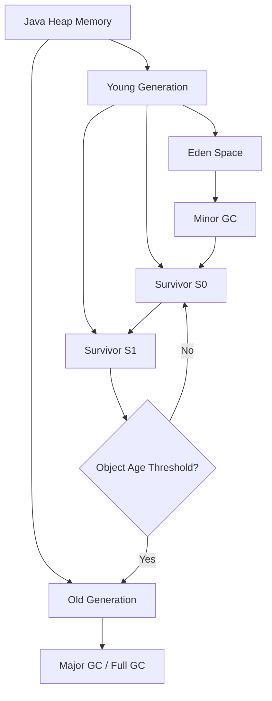
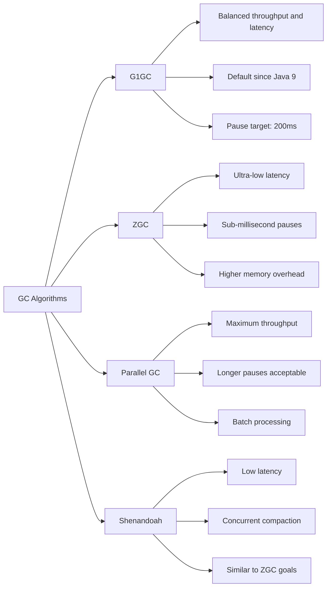
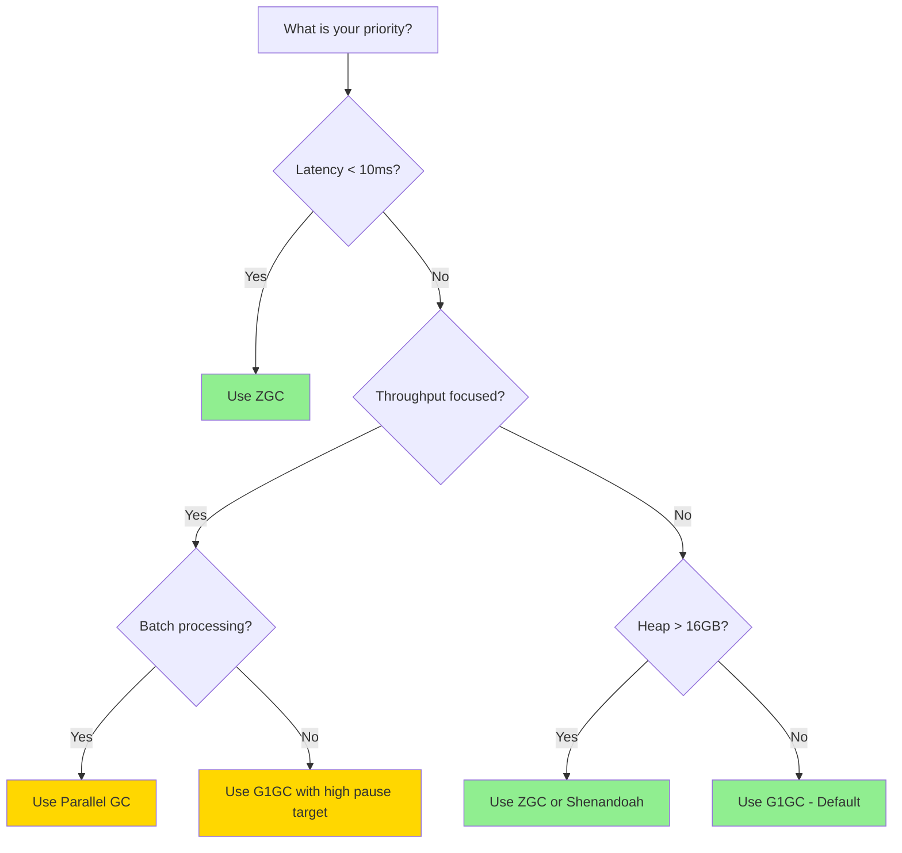
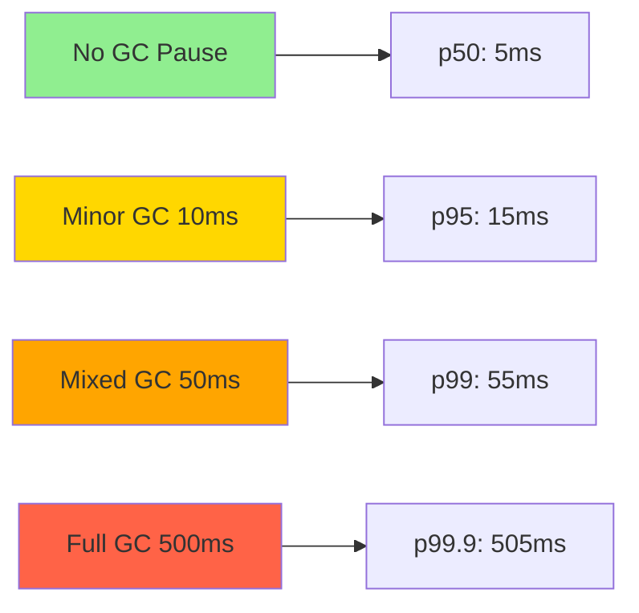

# How to Tune Java Garbage Collection for Performance

Author: [nawazdhandala](https://www.github.com/nawazdhandala)

Tags: Java, Garbage Collection, JVM, Performance, Tuning

Description: A practical guide to tuning Java garbage collection including G1GC, ZGC, and common GC performance patterns.

---

Garbage collection is one of the most impactful factors in Java application performance. Poorly tuned GC can cause long pauses, high latency spikes, and excessive CPU usage. This guide covers practical GC tuning strategies for G1GC, ZGC, and common production workloads.

## How GC Works

Java's garbage collector automatically reclaims memory occupied by objects that are no longer referenced.



## GC Algorithm Comparison

Each GC algorithm has different trade-offs between throughput, latency, and resource usage.



## Enabling GC Logging

GC logs are essential for understanding collection behavior before tuning.

```bash
#!/bin/bash
# Enable detailed GC logging for analysis
# These flags work with Java 17+

JAVA_OPTS=""

# Enable GC logging in unified logging format
JAVA_OPTS="${JAVA_OPTS} -Xlog:gc*:file=/var/log/app/gc.log"

# Add timestamps to each GC event
JAVA_OPTS="${JAVA_OPTS}:time,uptime,level,tags"

# Rotate log files to prevent disk space issues
JAVA_OPTS="${JAVA_OPTS}:filecount=10,filesize=50M"

# Print heap information after each GC
JAVA_OPTS="${JAVA_OPTS} -Xlog:gc+heap=debug"

# Print reference processing times
JAVA_OPTS="${JAVA_OPTS} -Xlog:gc+ref=debug"

java ${JAVA_OPTS} -jar app.jar
```

## G1GC Tuning

G1GC is the default collector and works well for most applications.

```bash
#!/bin/bash
# G1GC tuning for a web application with 4GB heap

JAVA_OPTS=""

# Select G1GC as the garbage collector
JAVA_OPTS="${JAVA_OPTS} -XX:+UseG1GC"

# Set heap size (min and max should be equal in production)
JAVA_OPTS="${JAVA_OPTS} -Xms4g -Xmx4g"

# Target maximum GC pause time of 100 milliseconds
# G1GC will adjust region sizes and collection sets to meet this target
JAVA_OPTS="${JAVA_OPTS} -XX:MaxGCPauseMillis=100"

# Set the region size (must be a power of 2, between 1MB and 32MB)
# Larger regions work better with larger heaps
JAVA_OPTS="${JAVA_OPTS} -XX:G1HeapRegionSize=4m"

# Percentage of heap to keep as reserve to reduce evacuation failures
JAVA_OPTS="${JAVA_OPTS} -XX:G1ReservePercent=15"

# Number of parallel GC threads (match CPU cores)
JAVA_OPTS="${JAVA_OPTS} -XX:ParallelGCThreads=4"

# Number of concurrent marking threads (typically 1/4 of parallel threads)
JAVA_OPTS="${JAVA_OPTS} -XX:ConcGCThreads=2"

# Start concurrent marking when heap is 45% full
JAVA_OPTS="${JAVA_OPTS} -XX:InitiatingHeapOccupancyPercent=45"

# Enable string deduplication to save memory
JAVA_OPTS="${JAVA_OPTS} -XX:+UseStringDeduplication"

java ${JAVA_OPTS} -jar app.jar
```

## ZGC Configuration

ZGC delivers sub-millisecond pause times for latency-sensitive applications.

```bash
#!/bin/bash
# ZGC tuning for a latency-sensitive application

JAVA_OPTS=""

# Select ZGC as the garbage collector
JAVA_OPTS="${JAVA_OPTS} -XX:+UseZGC"

# Enable generational mode for better throughput (Java 21+)
JAVA_OPTS="${JAVA_OPTS} -XX:+ZGenerational"

# Set heap size (ZGC can handle very large heaps efficiently)
JAVA_OPTS="${JAVA_OPTS} -Xms8g -Xmx8g"

# ZGC allocates additional memory for colored pointers
# Soft max heap size limits the heap before reaching Xmx
JAVA_OPTS="${JAVA_OPTS} -XX:SoftMaxHeapSize=6g"

# Number of concurrent GC threads
JAVA_OPTS="${JAVA_OPTS} -XX:ConcGCThreads=4"

# Enable large pages for better TLB performance (requires OS config)
# JAVA_OPTS="${JAVA_OPTS} -XX:+UseLargePages"

java ${JAVA_OPTS} -jar app.jar
```

## GC Tuning Decision Tree



## Monitoring GC in Production

Use JMX and Micrometer to expose GC metrics to your monitoring system.

```java
// GcMetricsConfig.java - Expose GC metrics to monitoring
@Configuration
public class GcMetricsConfig {

    @Bean
    public MeterBinder gcMetrics() {
        // Micrometer automatically registers JVM GC metrics
        return new JvmGcMetrics();
    }

    @Bean
    public MeterBinder memoryMetrics() {
        // Track heap and non-heap memory usage
        return new JvmMemoryMetrics();
    }

    @Bean
    public MeterBinder threadMetrics() {
        // Track thread counts and states
        return new JvmThreadMetrics();
    }
}
```

```java
// GcMonitorService.java - Custom GC monitoring with notifications
@Service
public class GcMonitorService {

    private static final Logger log =
        LoggerFactory.getLogger(GcMonitorService.class);

    // Register GC notification listeners at startup
    @PostConstruct
    public void registerGcListeners() {
        for (GarbageCollectorMXBean gcBean :
                ManagementFactory.getGarbageCollectorMXBeans()) {

            // Check if this GC bean supports notifications
            if (gcBean instanceof NotificationEmitter) {
                NotificationEmitter emitter =
                    (NotificationEmitter) gcBean;

                // Add a listener that fires after each GC event
                emitter.addNotificationListener((notification, handback) -> {
                    GarbageCollectionNotificationInfo info =
                        GarbageCollectionNotificationInfo.from(
                            (CompositeData) notification.getUserData());

                    GcInfo gcInfo = info.getGcInfo();
                    long duration = gcInfo.getDuration();

                    // Log a warning if GC pause exceeds 200ms
                    if (duration > 200) {
                        log.warn(
                            "Long GC pause detected: {} took {}ms, "
                            + "cause: {}",
                            info.getGcName(),
                            duration,
                            info.getGcCause()
                        );
                    }
                }, null, null);
            }
        }
    }
}
```

## Common GC Issues and Fixes

```bash
# Issue: Frequent Full GCs
# Symptom: Application freezes periodically
# Fix: Increase heap size or tune IHOP
java -Xms4g -Xmx4g -XX:InitiatingHeapOccupancyPercent=35 -jar app.jar

# Issue: High GC overhead (>10% of CPU time)
# Symptom: Throughput drops, GC threads consume CPU
# Fix: Reduce allocation rate by pooling objects
java -XX:+UseG1GC -XX:MaxGCPauseMillis=200 -jar app.jar

# Issue: Memory leak causing OOM
# Symptom: Heap usage grows continuously
# Fix: Enable heap dump on OOM for analysis
java -XX:+HeapDumpOnOutOfMemoryError \
     -XX:HeapDumpPath=/tmp/heapdump.hprof \
     -XX:+ExitOnOutOfMemoryError \
     -jar app.jar
```

## GC Pause Impact on Latency



## Conclusion

Garbage collection tuning starts with understanding your application's allocation patterns through GC logs. G1GC works well for most workloads with its configurable pause time targets. ZGC is the right choice when sub-millisecond pause times are required. Always monitor GC behavior in production to catch regressions early.

[OneUptime](https://oneuptime.com) helps you monitor GC performance alongside application metrics, providing visibility into how garbage collection impacts your users and alerting your team when GC pauses exceed acceptable thresholds.
