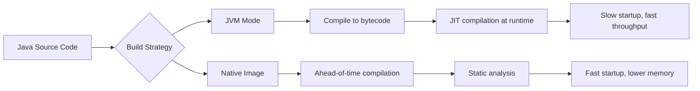
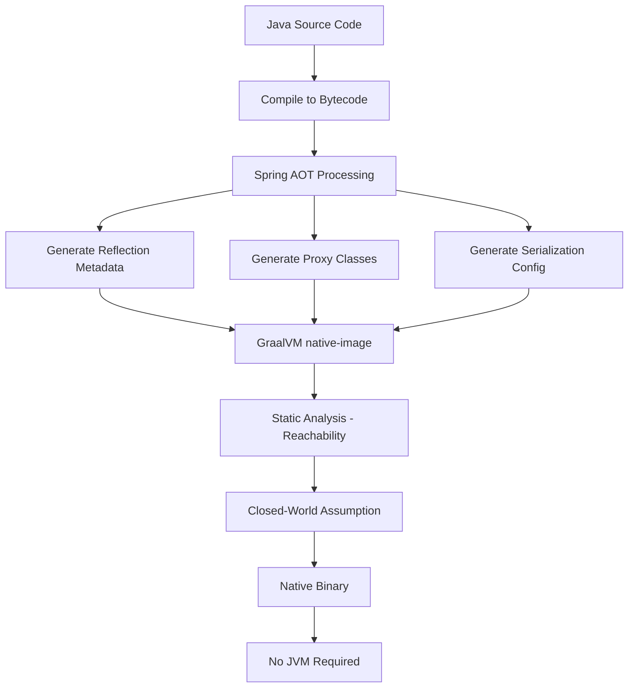
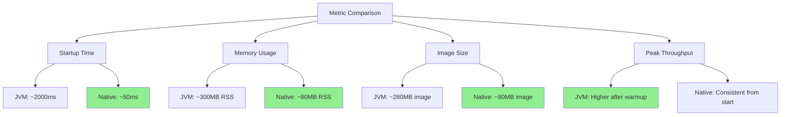
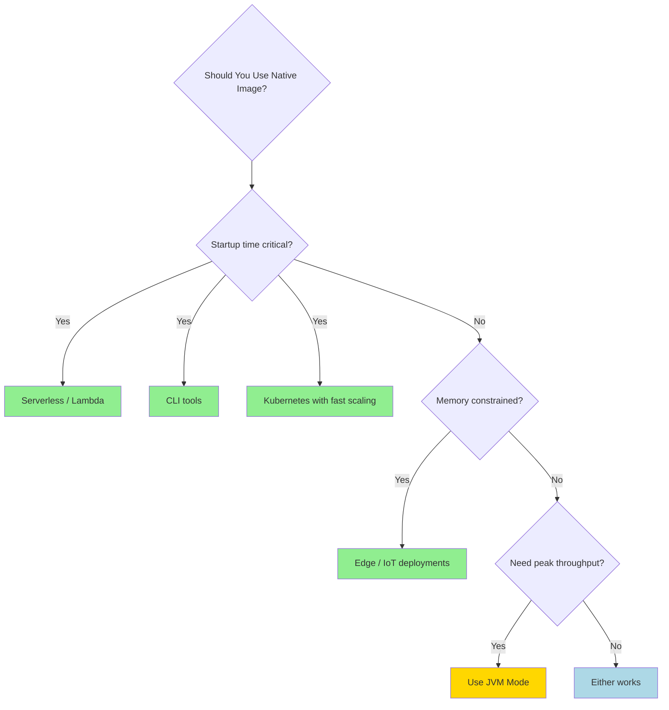

# How to Build Native Images with GraalVM for Java Applications

Author: [nawazdhandala](https://www.github.com/nawazdhandala)

Tags: Java, GraalVM, Native Image, Performance, Startup

Description: Learn how to build native images with GraalVM for Java applications to achieve faster startup and lower memory usage.

---

GraalVM Native Image compiles Java applications ahead of time into standalone executables. The result is a binary that starts in milliseconds instead of seconds, uses a fraction of the memory, and requires no JVM at runtime. This guide covers building native images for Spring Boot applications with GraalVM.

## JVM vs Native Image

Native images trade JVM features like runtime optimization for instant startup and reduced memory.



## Setting Up GraalVM

Configure your project to support native image compilation.

```xml
<!-- pom.xml - GraalVM Native Image support for Spring Boot -->
<parent>
    <groupId>org.springframework.boot</groupId>
    <artifactId>spring-boot-starter-parent</artifactId>
    <version>3.4.2</version>
</parent>

<dependencies>
    <dependency>
        <groupId>org.springframework.boot</groupId>
        <artifactId>spring-boot-starter-web</artifactId>
    </dependency>
    <dependency>
        <groupId>org.springframework.boot</groupId>
        <artifactId>spring-boot-starter-actuator</artifactId>
    </dependency>
</dependencies>

<build>
    <plugins>
        <!-- GraalVM Native Maven Plugin -->
        <plugin>
            <groupId>org.graalvm.buildtools</groupId>
            <artifactId>native-maven-plugin</artifactId>
            <configuration>
                <!-- Configure native image build options -->
                <buildArgs>
                    <!-- Enable URL protocols for HTTP clients -->
                    <arg>--enable-url-protocols=http,https</arg>
                    <!-- Reduce image size by removing debug info -->
                    <arg>-H:+RemoveUnusedSymbols</arg>
                    <!-- Install signal handlers for graceful shutdown -->
                    <arg>--install-exit-handlers</arg>
                </buildArgs>
            </configuration>
        </plugin>

        <!-- Spring Boot Maven Plugin with AOT support -->
        <plugin>
            <groupId>org.springframework.boot</groupId>
            <artifactId>spring-boot-maven-plugin</artifactId>
        </plugin>
    </plugins>
</build>

<!-- Profile for native image builds -->
<profiles>
    <profile>
        <id>native</id>
        <build>
            <plugins>
                <plugin>
                    <groupId>org.graalvm.buildtools</groupId>
                    <artifactId>native-maven-plugin</artifactId>
                    <executions>
                        <execution>
                            <id>build-native</id>
                            <goals>
                                <goal>compile-no-fork</goal>
                            </goals>
                            <phase>package</phase>
                        </execution>
                    </executions>
                </plugin>
            </plugins>
        </build>
    </profile>
</profiles>
```

## Building the Native Image

```bash
#!/bin/bash
# Build the native image with Maven

# Step 1: Install GraalVM (using SDKMAN)
sdk install java 21.0.5-graal
sdk use java 21.0.5-graal

# Step 2: Verify GraalVM installation
java -version
# Expected: GraalVM CE 21.0.5

# Step 3: Build the native image
# The -Pnative profile activates ahead-of-time compilation
./mvnw -Pnative native:compile

# Step 4: Run the native binary
./target/my-application

# The application starts in ~50ms instead of ~2000ms
```

## Handling Reflection and Dynamic Features

GraalVM performs static analysis at build time, so dynamic features need configuration.

```java
// ReflectionConfig.java - Register classes for reflection at build time
@Configuration
@ImportRuntimeHints(ReflectionConfig.AppRuntimeHints.class)
public class ReflectionConfig {

    // Register runtime hints for classes used with reflection
    static class AppRuntimeHints implements RuntimeHintsRegistrar {

        @Override
        public void registerHints(
                RuntimeHints hints,
                ClassLoader classLoader) {

            // Register classes that are accessed via reflection
            hints.reflection()
                .registerType(Product.class,
                    MemberCategory.INVOKE_PUBLIC_CONSTRUCTORS,
                    MemberCategory.INVOKE_PUBLIC_METHODS,
                    MemberCategory.DECLARED_FIELDS)
                .registerType(OrderResponse.class,
                    MemberCategory.INVOKE_PUBLIC_CONSTRUCTORS,
                    MemberCategory.INVOKE_PUBLIC_METHODS,
                    MemberCategory.DECLARED_FIELDS);

            // Register resource files that need to be available at runtime
            hints.resources()
                .registerPattern("templates/*")
                .registerPattern("static/*");
        }
    }
}
```

## Native Image AOT Processing



## Docker Multi-Stage Native Build

Build a minimal container image with the native binary.

```dockerfile
# Stage 1: Build the native image
# Use GraalVM image that includes native-image tool
FROM ghcr.io/graalvm/native-image-community:21 AS builder

WORKDIR /app

# Copy Maven wrapper and configuration
COPY mvnw .
COPY .mvn .mvn
COPY pom.xml .

# Download dependencies (cached layer)
RUN ./mvnw dependency:go-offline -B

# Copy source code
COPY src src

# Build the native image (this takes several minutes)
RUN ./mvnw -Pnative native:compile -DskipTests

# Stage 2: Create a minimal runtime image
# Use a distroless base image - no shell, no package manager
FROM gcr.io/distroless/base-debian12

WORKDIR /app

# Copy only the native binary from the builder
COPY --from=builder /app/target/my-application ./application

# Expose the application port
EXPOSE 8080

# Run the native binary directly (no JVM needed)
ENTRYPOINT ["./application"]
```

## Comparison: JVM vs Native



## Testing Native Images

Run tests in native mode to catch AOT-related issues.

```xml
<!-- pom.xml - Native test configuration -->
<plugin>
    <groupId>org.graalvm.buildtools</groupId>
    <artifactId>native-maven-plugin</artifactId>
    <executions>
        <execution>
            <id>test-native</id>
            <goals>
                <!-- Compile tests as native image and run them -->
                <goal>test</goal>
            </goals>
            <phase>test</phase>
        </execution>
    </executions>
</plugin>
```

```java
// NativeImageTest.java - Test that the app starts correctly as native
@SpringBootTest(webEnvironment = SpringBootTest.WebEnvironment.RANDOM_PORT)
class NativeImageTest {

    @Autowired
    private TestRestTemplate restTemplate;

    @Test
    @DisplayName("Application context loads in native mode")
    void contextLoads() {
        // If this test passes, the native image starts correctly
    }

    @Test
    @DisplayName("Health endpoint responds in native mode")
    void healthEndpointWorks() {
        ResponseEntity<String> response = restTemplate.getForEntity(
            "/actuator/health",
            String.class
        );

        assertEquals(HttpStatus.OK, response.getStatusCode());
        assertTrue(response.getBody().contains("UP"));
    }

    @Test
    @DisplayName("API endpoints work in native mode")
    void apiEndpointsWork() {
        ResponseEntity<String> response = restTemplate.getForEntity(
            "/api/v1/products",
            String.class
        );

        assertEquals(HttpStatus.OK, response.getStatusCode());
    }
}
```

## Common Build Issues and Solutions

```java
// NativeImageConfig.java - Solve common native image build issues
@Configuration
public class NativeImageConfig {

    // Issue: Jackson serialization fails at runtime
    // Solution: Register types used with Jackson
    @Bean
    public Jackson2ObjectMapperBuilderCustomizer jacksonCustomizer() {
        return builder -> {
            // Ensure date/time types are properly registered
            builder.modulesToInstall(new JavaTimeModule());
            // Disable features that require reflection
            builder.featuresToDisable(
                SerializationFeature.WRITE_DATES_AS_TIMESTAMPS
            );
        };
    }
}
```

## When to Use Native Images

Native images are ideal for specific deployment scenarios.



## Conclusion

GraalVM native images transform Java applications into fast-starting, memory-efficient binaries. They are particularly valuable for serverless functions, CLI tools, and Kubernetes deployments where startup time and resource efficiency matter. Spring Boot 3.x provides excellent native image support through its AOT processing engine.

[OneUptime](https://oneuptime.com) can monitor both JVM and native image deployments, tracking startup times, memory usage, and application performance to help you decide the best deployment strategy for each service in your architecture.
