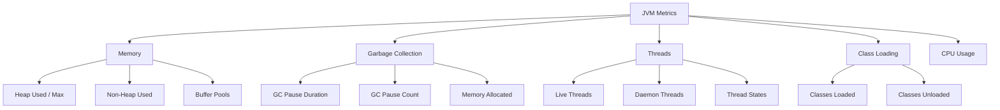
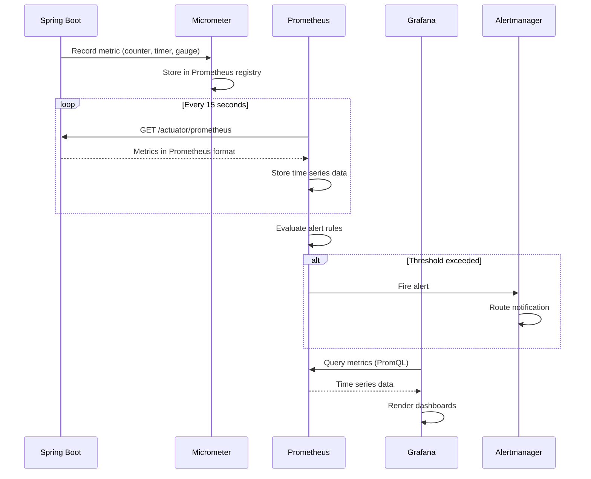

# How to Monitor JVM Performance with Prometheus and Grafana

Author: [nawazdhandala](https://www.github.com/nawazdhandala)

Tags: Java, JVM, Prometheus, Grafana, Monitoring

Description: Learn how to monitor JVM performance metrics including heap memory, garbage collection, and thread pools with Prometheus.

---

Java applications running in production need continuous monitoring of JVM internals. Heap memory, garbage collection, thread pools, and class loading all affect application performance. This guide shows how to expose JVM metrics to Prometheus and visualize them with Grafana.

## Monitoring Architecture

The metrics pipeline flows from the JVM through Micrometer to Prometheus and Grafana.

```mermaid
graph LR
    A[JVM / Spring Boot] --> B[Micrometer]
    B --> C[Prometheus Registry]
    C --> D[/actuator/prometheus]
    D --> E[Prometheus Server]
    E --> F[Grafana Dashboards]
    E --> G[Alertmanager]
    G --> H[Slack / PagerDuty]
```

## Adding Micrometer Dependencies

Micrometer is the metrics facade for Spring Boot applications.

```xml
<!-- pom.xml - Metrics dependencies -->
<dependencies>
    <!-- Spring Boot Actuator for metrics endpoints -->
    <dependency>
        <groupId>org.springframework.boot</groupId>
        <artifactId>spring-boot-starter-actuator</artifactId>
    </dependency>

    <!-- Micrometer Prometheus registry for metric export -->
    <dependency>
        <groupId>io.micrometer</groupId>
        <artifactId>micrometer-registry-prometheus</artifactId>
    </dependency>
</dependencies>
```

## Configuring Metric Export

Configure the Actuator to expose the Prometheus endpoint.

```yaml
# application.yml - Metrics configuration
management:
  endpoints:
    web:
      exposure:
        # Expose the Prometheus scrape endpoint
        include: health, info, prometheus, metrics
  metrics:
    # Add common tags to all metrics
    tags:
      application: order-service
      environment: production
    export:
      prometheus:
        enabled: true
    distribution:
      # Record histogram buckets for latency metrics
      percentiles-histogram:
        http.server.requests: true
      # Define custom SLO buckets in milliseconds
      slo:
        http.server.requests: 50ms, 100ms, 200ms, 500ms, 1s, 5s
```

## Key JVM Metrics

Micrometer automatically exposes critical JVM metrics to Prometheus.



## Custom Application Metrics

Add business-level metrics alongside JVM metrics.

```java
// MetricsConfig.java - Custom business metrics
@Configuration
public class MetricsConfig {

    // Track the number of orders processed
    @Bean
    public Counter orderCounter(MeterRegistry registry) {
        return Counter.builder("business.orders.total")
            .description("Total number of orders processed")
            .tag("type", "all")
            .register(registry);
    }

    // Track order processing latency
    @Bean
    public Timer orderTimer(MeterRegistry registry) {
        return Timer.builder("business.orders.processing_time")
            .description("Time taken to process an order")
            .publishPercentiles(0.5, 0.95, 0.99)
            .register(registry);
    }

    // Track the current number of items in the cache
    @Bean
    public Gauge cacheSize(MeterRegistry registry, CacheManager cacheManager) {
        return Gauge.builder("business.cache.size", cacheManager, cm -> {
                // Get the number of entries in the primary cache
                Cache cache = cm.getCache("products");
                if (cache != null) {
                    return ((ConcurrentMapCache) cache).getNativeCache().size();
                }
                return 0;
            })
            .description("Number of items in the product cache")
            .register(registry);
    }
}
```

```java
// OrderService.java - Using custom metrics in business logic
@Service
public class OrderService {

    private final Counter orderCounter;
    private final Timer orderTimer;
    private final MeterRegistry meterRegistry;

    public OrderService(
            Counter orderCounter,
            Timer orderTimer,
            MeterRegistry meterRegistry) {
        this.orderCounter = orderCounter;
        this.orderTimer = orderTimer;
        this.meterRegistry = meterRegistry;
    }

    public Order processOrder(OrderRequest request) {
        // Time the entire order processing flow
        return orderTimer.record(() -> {
            try {
                Order order = createOrder(request);

                // Increment the counter with status tag
                orderCounter.increment();

                // Record order value as a distribution summary
                DistributionSummary.builder("business.orders.value")
                    .description("Distribution of order values")
                    .baseUnit("USD")
                    .tag("region", request.getRegion())
                    .register(meterRegistry)
                    .record(order.getTotal().doubleValue());

                return order;

            } catch (Exception e) {
                // Count failed orders separately
                meterRegistry.counter("business.orders.failed",
                    "reason", e.getClass().getSimpleName()
                ).increment();
                throw e;
            }
        });
    }

    private Order createOrder(OrderRequest request) {
        // Business logic here
        return new Order();
    }
}
```

## Prometheus Configuration

Configure Prometheus to scrape the Spring Boot application.

```yaml
# prometheus.yml - Prometheus scrape configuration
global:
  # Scrape metrics every 15 seconds
  scrape_interval: 15s
  evaluation_interval: 15s

scrape_configs:
  - job_name: 'spring-boot-apps'
    # Override the default metrics path
    metrics_path: '/actuator/prometheus'
    # Discover targets from Kubernetes pods
    kubernetes_sd_configs:
      - role: pod
    relabel_configs:
      # Only scrape pods with the annotation prometheus.io/scrape=true
      - source_labels: [__meta_kubernetes_pod_annotation_prometheus_io_scrape]
        action: keep
        regex: true
      # Use the port from the annotation
      - source_labels: [__meta_kubernetes_pod_annotation_prometheus_io_port]
        action: replace
        target_label: __address__
        regex: (.+)
```

## Essential Prometheus Queries

Use these PromQL queries to monitor JVM health.

```promql
# Heap memory usage percentage
jvm_memory_used_bytes{area="heap"} / jvm_memory_max_bytes{area="heap"} * 100

# GC pause time rate (seconds per second)
rate(jvm_gc_pause_seconds_sum[5m])

# Number of GC pauses per minute
rate(jvm_gc_pause_seconds_count[5m]) * 60

# Live thread count
jvm_threads_live_threads

# HTTP request rate (requests per second)
rate(http_server_requests_seconds_count[5m])

# HTTP request latency (95th percentile)
histogram_quantile(0.95, rate(http_server_requests_seconds_bucket[5m]))

# Error rate percentage
rate(http_server_requests_seconds_count{status=~"5.."}[5m])
  / rate(http_server_requests_seconds_count[5m]) * 100
```

## Alerting Rules

Define Prometheus alerting rules for JVM health issues.

```yaml
# alerts.yml - Prometheus alerting rules
groups:
  - name: jvm-alerts
    rules:
      # Alert when heap usage exceeds 85%
      - alert: HighHeapUsage
        expr: >
          jvm_memory_used_bytes{area="heap"}
          / jvm_memory_max_bytes{area="heap"} > 0.85
        for: 5m
        labels:
          severity: warning
        annotations:
          summary: "High JVM heap usage on {{ $labels.instance }}"
          description: "Heap usage is above 85% for 5 minutes."

      # Alert on excessive GC pauses
      - alert: HighGCPauseTime
        expr: rate(jvm_gc_pause_seconds_sum[5m]) > 0.1
        for: 5m
        labels:
          severity: warning
        annotations:
          summary: "Excessive GC pause time on {{ $labels.instance }}"
          description: "GC pauses consuming more than 10% of time."

      # Alert when thread count is unusually high
      - alert: HighThreadCount
        expr: jvm_threads_live_threads > 500
        for: 10m
        labels:
          severity: warning
        annotations:
          summary: "High thread count on {{ $labels.instance }}"
```

## Metrics Flow



## Conclusion

Monitoring JVM performance with Prometheus and Grafana gives you real-time visibility into memory usage, garbage collection behavior, thread pool utilization, and application-level metrics. Setting up proper alerting rules ensures you catch performance issues before they affect users.

[OneUptime](https://oneuptime.com) integrates with Prometheus to provide unified monitoring across your JVM applications, infrastructure, and endpoints, with built-in alerting, incident management, and status pages for communicating with stakeholders during outages.
