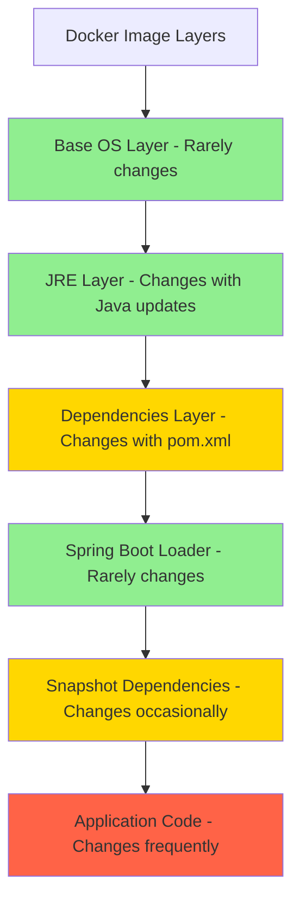
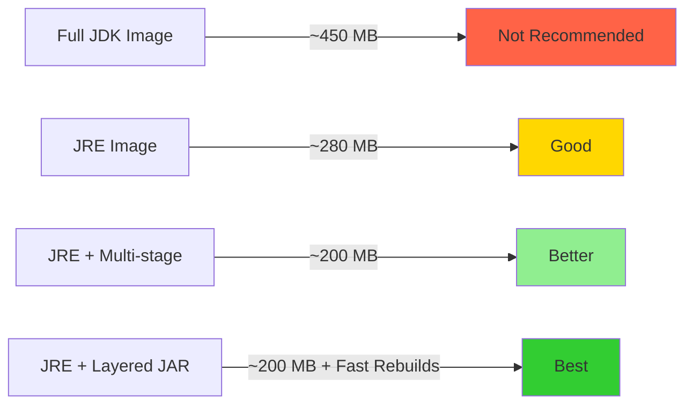

# How to Containerize Spring Boot Applications with Docker

Author: [nawazdhandala](https://www.github.com/nawazdhandala)

Tags: Java, Spring Boot, Docker, Container, Deployment

Description: Learn how to containerize Spring Boot applications with Docker using multi-stage builds and JVM optimization.

---

Containerizing Java applications requires careful attention to image size, startup time, and memory management. This guide covers building optimized Docker images for Spring Boot applications using multi-stage builds, JVM tuning, and production best practices.

## Container Build Pipeline

A multi-stage Docker build separates the build environment from the runtime environment.


## Basic Dockerfile

Start with a straightforward multi-stage Dockerfile.

```dockerfile
# Stage 1: Build the application
# Use a full JDK image for compilation
FROM eclipse-temurin:21-jdk AS builder

# Set the working directory inside the container
WORKDIR /app

# Copy the Maven wrapper and POM first for dependency caching
COPY mvnw .
COPY .mvn .mvn
COPY pom.xml .

# Download dependencies separately to leverage Docker layer caching
# This layer only rebuilds when pom.xml changes
RUN ./mvnw dependency:go-offline -B

# Copy the source code
COPY src src

# Build the application, skipping tests for faster builds
RUN ./mvnw package -DskipTests -B

# Stage 2: Create the runtime image
# Use a JRE-only image to reduce attack surface and image size
FROM eclipse-temurin:21-jre

# Run as a non-root user for security
RUN groupadd -r appuser && useradd -r -g appuser appuser

WORKDIR /app

# Copy only the built JAR from the builder stage
COPY --from=builder /app/target/*.jar app.jar

# Switch to the non-root user
USER appuser

# Expose the application port
EXPOSE 8080

# Set JVM flags for container-aware memory management
ENTRYPOINT ["java", \
    "-XX:+UseContainerSupport", \
    "-XX:MaxRAMPercentage=75.0", \
    "-jar", "app.jar"]
```

## Layered JAR Approach

Spring Boot supports layered JARs for better Docker layer caching.

```dockerfile
# Stage 1: Build
FROM eclipse-temurin:21-jdk AS builder
WORKDIR /app
COPY mvnw .
COPY .mvn .mvn
COPY pom.xml .
RUN ./mvnw dependency:go-offline -B
COPY src src
RUN ./mvnw package -DskipTests -B

# Stage 2: Extract layers from the JAR
# Layered extraction separates dependencies from application code
FROM eclipse-temurin:21-jdk AS extractor
WORKDIR /app
COPY --from=builder /app/target/*.jar app.jar

# Extract the JAR into separate layers
RUN java -Djarmode=layertools -jar app.jar extract

# Stage 3: Runtime with layered caching
FROM eclipse-temurin:21-jre

RUN groupadd -r appuser && useradd -r -g appuser appuser
WORKDIR /app

# Copy layers in order of change frequency (least to most)
# Dependencies change rarely, so they cache well
COPY --from=extractor /app/dependencies/ ./
COPY --from=extractor /app/spring-boot-loader/ ./
# Snapshot dependencies change occasionally
COPY --from=extractor /app/snapshot-dependencies/ ./
# Application code changes most frequently
COPY --from=extractor /app/application/ ./

USER appuser
EXPOSE 8080

ENTRYPOINT ["java", \
    "-XX:+UseContainerSupport", \
    "-XX:MaxRAMPercentage=75.0", \
    "org.springframework.boot.loader.launch.JarLauncher"]
```

## Layer Caching Strategy



## JVM Memory Configuration

Configure JVM memory settings correctly for containerized environments.

```yaml
# application.yml - Container-aware configuration
spring:
  application:
    name: my-service

# Server configuration
server:
  port: 8080
  # Enable graceful shutdown for container orchestrators
  shutdown: graceful

# Lifecycle settings
spring.lifecycle:
  # Allow 30 seconds for in-flight requests during shutdown
  timeout-per-shutdown-phase: 30s
```

```bash
#!/bin/bash
# run.sh - Startup script with JVM tuning for containers

# Enable container support so JVM respects cgroup memory limits
JAVA_OPTS="${JAVA_OPTS} -XX:+UseContainerSupport"

# Use 75% of container memory for heap (leave room for metaspace and threads)
JAVA_OPTS="${JAVA_OPTS} -XX:MaxRAMPercentage=75.0"
JAVA_OPTS="${JAVA_OPTS} -XX:InitialRAMPercentage=50.0"

# Use G1GC for balanced throughput and latency
JAVA_OPTS="${JAVA_OPTS} -XX:+UseG1GC"

# Enable string deduplication to save memory
JAVA_OPTS="${JAVA_OPTS} -XX:+UseStringDeduplication"

# Exit on OutOfMemoryError so the container restarts
JAVA_OPTS="${JAVA_OPTS} -XX:+ExitOnOutOfMemoryError"

# Start the application with all configured options
exec java ${JAVA_OPTS} -jar /app/app.jar
```

## Docker Compose for Development

Set up a local development environment with dependencies.

```yaml
# docker-compose.yml - Local development stack
version: '3.8'

services:
  # Spring Boot application
  app:
    build:
      context: .
      dockerfile: Dockerfile
    ports:
      - "8080:8080"
    environment:
      # Database connection settings
      SPRING_DATASOURCE_URL: jdbc:postgresql://db:5432/myapp
      SPRING_DATASOURCE_USERNAME: postgres
      SPRING_DATASOURCE_PASSWORD: postgres
      # JVM settings for development
      JAVA_OPTS: "-XX:+UseContainerSupport -XX:MaxRAMPercentage=75.0"
    depends_on:
      db:
        condition: service_healthy
    # Limit container resources
    deploy:
      resources:
        limits:
          memory: 512M
          cpus: '1.0'

  # PostgreSQL database
  db:
    image: postgres:16-alpine
    environment:
      POSTGRES_DB: myapp
      POSTGRES_USER: postgres
      POSTGRES_PASSWORD: postgres
    volumes:
      - pgdata:/var/lib/postgresql/data
    healthcheck:
      test: ["CMD-SHELL", "pg_isready -U postgres"]
      interval: 5s
      timeout: 5s
      retries: 5

volumes:
  pgdata:
```

## Health Check in Dockerfile

Add a health check so Docker can detect unhealthy containers.

```dockerfile
# Add to the runtime stage of your Dockerfile
# The health check uses Spring Boot Actuator's health endpoint
HEALTHCHECK --interval=30s --timeout=10s --start-period=60s --retries=3 \
    CMD curl -f http://localhost:8080/actuator/health || exit 1
```

## Image Size Comparison



## .dockerignore File

Exclude unnecessary files from the Docker build context.

```text
# .dockerignore - Files to exclude from the build context
.git
.gitignore
.idea
*.iml
target
!target/*.jar
node_modules
*.md
docker-compose*.yml
.env
```

## Conclusion

Containerizing Spring Boot applications with Docker requires attention to image layering, JVM memory configuration, and security practices like running as a non-root user. The layered JAR approach significantly improves rebuild times by caching dependency layers separately from application code.

Once your containerized Spring Boot application is deployed, [OneUptime](https://oneuptime.com) can monitor container health, track resource utilization, and alert your team when containers become unhealthy or unresponsive.
