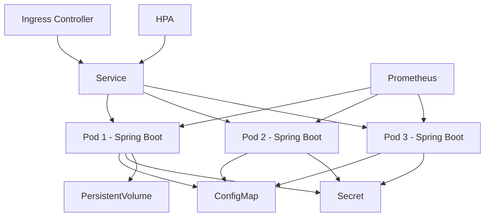
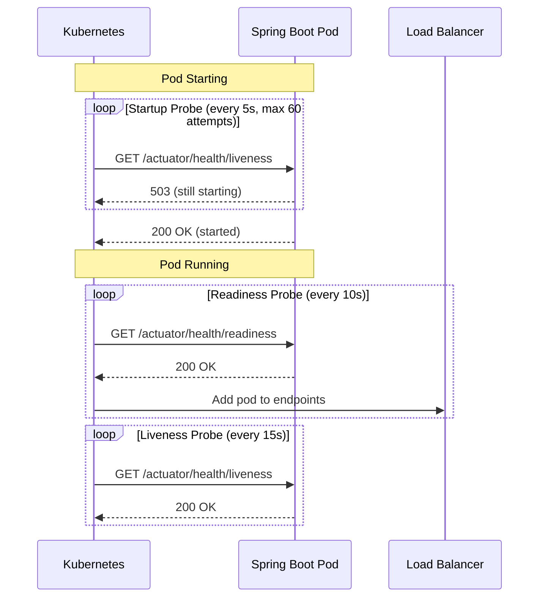

# How to Deploy Spring Boot Applications on Kubernetes

Author: [nawazdhandala](https://www.github.com/nawazdhandala)

Tags: Java, Spring Boot, Kubernetes, Deployment, Cloud Native

Description: Step-by-step guide to deploying Spring Boot applications on Kubernetes with health checks, config, and scaling.

---

Deploying Spring Boot applications on Kubernetes requires proper health probes, resource management, configuration externalization, and scaling strategies. This guide covers everything needed to run Spring Boot in a production Kubernetes cluster.

## Deployment Architecture

A typical Spring Boot deployment on Kubernetes includes multiple components working together.



## Spring Boot Actuator Setup

Kubernetes health probes rely on Spring Boot Actuator endpoints.

```xml
<!-- pom.xml - Add Actuator dependency -->
<dependency>
    <groupId>org.springframework.boot</groupId>
    <artifactId>spring-boot-starter-actuator</artifactId>
</dependency>
```

```yaml
# application.yml - Configure Actuator for Kubernetes
management:
  endpoints:
    web:
      exposure:
        # Expose health, info, and Prometheus endpoints
        include: health, info, prometheus, metrics
  endpoint:
    health:
      # Show detailed health information
      show-details: always
      probes:
        # Enable Kubernetes health probe endpoints
        enabled: true
  health:
    # Liveness checks if the app is running
    livenessState:
      enabled: true
    # Readiness checks if the app can accept traffic
    readinessState:
      enabled: true

# Graceful shutdown for zero-downtime deployments
server:
  shutdown: graceful

spring:
  lifecycle:
    # Wait up to 30 seconds for active requests to complete
    timeout-per-shutdown-phase: 30s
```

## Kubernetes Deployment Manifest

Define the deployment with proper health probes and resource limits.

```yaml
# deployment.yaml - Spring Boot Kubernetes Deployment
apiVersion: apps/v1
kind: Deployment
metadata:
  name: order-service
  labels:
    app: order-service
    version: "1.0.0"
spec:
  # Start with 3 replicas for high availability
  replicas: 3
  selector:
    matchLabels:
      app: order-service
  # Rolling update strategy for zero-downtime deployments
  strategy:
    type: RollingUpdate
    rollingUpdate:
      maxSurge: 1
      maxUnavailable: 0
  template:
    metadata:
      labels:
        app: order-service
        version: "1.0.0"
      annotations:
        # Prometheus scraping configuration
        prometheus.io/scrape: "true"
        prometheus.io/port: "8080"
        prometheus.io/path: "/actuator/prometheus"
    spec:
      # Spread pods across nodes for availability
      topologySpreadConstraints:
        - maxSkew: 1
          topologyKey: kubernetes.io/hostname
          whenUnsatisfiable: DoNotSchedule
          labelSelector:
            matchLabels:
              app: order-service
      containers:
        - name: order-service
          image: registry.example.com/order-service:1.0.0
          ports:
            - containerPort: 8080
              name: http
          # Environment variables from ConfigMap and Secret
          envFrom:
            - configMapRef:
                name: order-service-config
            - secretRef:
                name: order-service-secrets
          # Resource requests and limits
          resources:
            requests:
              # Minimum resources guaranteed to the pod
              cpu: "250m"
              memory: "512Mi"
            limits:
              # Maximum resources the pod can use
              cpu: "1000m"
              memory: "1Gi"
          # Startup probe: allows slow JVM startup
          startupProbe:
            httpGet:
              path: /actuator/health/liveness
              port: 8080
            # Check every 5 seconds, allow up to 60 attempts (5 min)
            periodSeconds: 5
            failureThreshold: 60
          # Liveness probe: restarts pod if unhealthy
          livenessProbe:
            httpGet:
              path: /actuator/health/liveness
              port: 8080
            periodSeconds: 15
            failureThreshold: 3
          # Readiness probe: removes pod from service if not ready
          readinessProbe:
            httpGet:
              path: /actuator/health/readiness
              port: 8080
            periodSeconds: 10
            failureThreshold: 3
          # Allow graceful shutdown
          lifecycle:
            preStop:
              exec:
                # Sleep before SIGTERM to allow load balancer to update
                command: ["sh", "-c", "sleep 10"]
      # Grace period must exceed preStop sleep + shutdown timeout
      terminationGracePeriodSeconds: 60
```

## Health Probe Flow



## ConfigMap and Secret

Externalize configuration from the application image.

```yaml
# configmap.yaml - Non-sensitive configuration
apiVersion: v1
kind: ConfigMap
metadata:
  name: order-service-config
data:
  # Spring Boot environment variables
  SPRING_DATASOURCE_URL: "jdbc:postgresql://postgres-service:5432/orders"
  SPRING_JPA_HIBERNATE_DDL_AUTO: "validate"
  SERVER_PORT: "8080"
  # Custom application settings
  APP_FEATURE_NEW_CHECKOUT: "true"
  APP_CACHE_TTL: "300"
```

```yaml
# secret.yaml - Sensitive configuration
apiVersion: v1
kind: Secret
metadata:
  name: order-service-secrets
type: Opaque
stringData:
  # Database credentials
  SPRING_DATASOURCE_USERNAME: "order_user"
  SPRING_DATASOURCE_PASSWORD: "secure-password-here"
  # API keys
  APP_PAYMENT_API_KEY: "sk_live_abc123"
```

## Service and Ingress

Expose the application to internal and external traffic.

```yaml
# service.yaml - ClusterIP service for internal access
apiVersion: v1
kind: Service
metadata:
  name: order-service
spec:
  selector:
    app: order-service
  ports:
    - port: 80
      targetPort: 8080
      protocol: TCP
  type: ClusterIP
---
# ingress.yaml - Expose to external traffic
apiVersion: networking.k8s.io/v1
kind: Ingress
metadata:
  name: order-service-ingress
  annotations:
    nginx.ingress.kubernetes.io/ssl-redirect: "true"
spec:
  ingressClassName: nginx
  tls:
    - hosts:
        - api.example.com
      secretName: api-tls-cert
  rules:
    - host: api.example.com
      http:
        paths:
          - path: /api/orders
            pathType: Prefix
            backend:
              service:
                name: order-service
                port:
                  number: 80
```

## Horizontal Pod Autoscaler

Automatically scale based on CPU and memory usage.

```yaml
# hpa.yaml - Autoscaling configuration
apiVersion: autoscaling/v2
kind: HorizontalPodAutoscaler
metadata:
  name: order-service-hpa
spec:
  scaleTargetRef:
    apiVersion: apps/v1
    kind: Deployment
    name: order-service
  # Scale between 3 and 10 replicas
  minReplicas: 3
  maxReplicas: 10
  metrics:
    # Scale when average CPU exceeds 70%
    - type: Resource
      resource:
        name: cpu
        target:
          type: Utilization
          averageUtilization: 70
    # Scale when average memory exceeds 80%
    - type: Resource
      resource:
        name: memory
        target:
          type: Utilization
          averageUtilization: 80
  behavior:
    # Scale up quickly but scale down slowly
    scaleUp:
      stabilizationWindowSeconds: 30
      policies:
        - type: Pods
          value: 2
          periodSeconds: 60
    scaleDown:
      stabilizationWindowSeconds: 300
      policies:
        - type: Pods
          value: 1
          periodSeconds: 120
```

## Conclusion

Running Spring Boot on Kubernetes requires proper health probes, externalized configuration, resource management, and scaling strategies. The startup probe is particularly important for Java applications because JVM startup can take longer than the default probe timeout.

[OneUptime](https://oneuptime.com) provides Kubernetes-aware monitoring that can track pod health, deployment rollouts, and service availability, alerting your team when pods are crash-looping, resource limits are being hit, or endpoints become unreachable.
