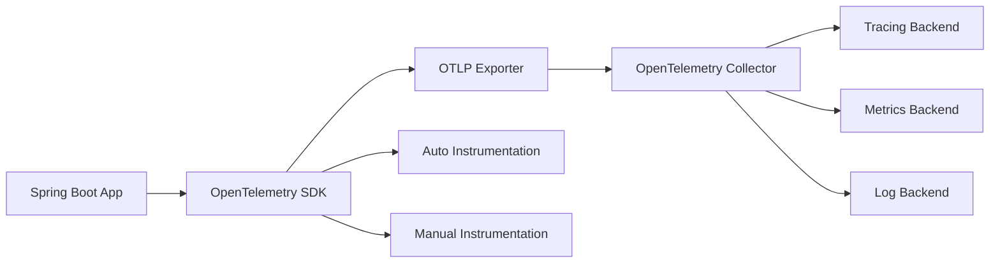
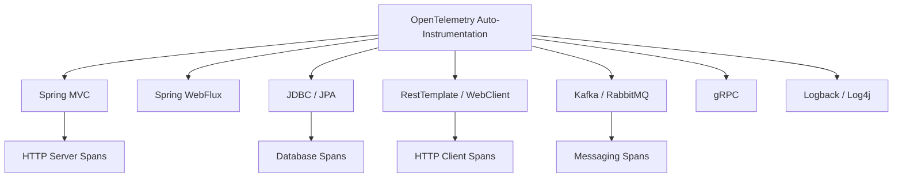
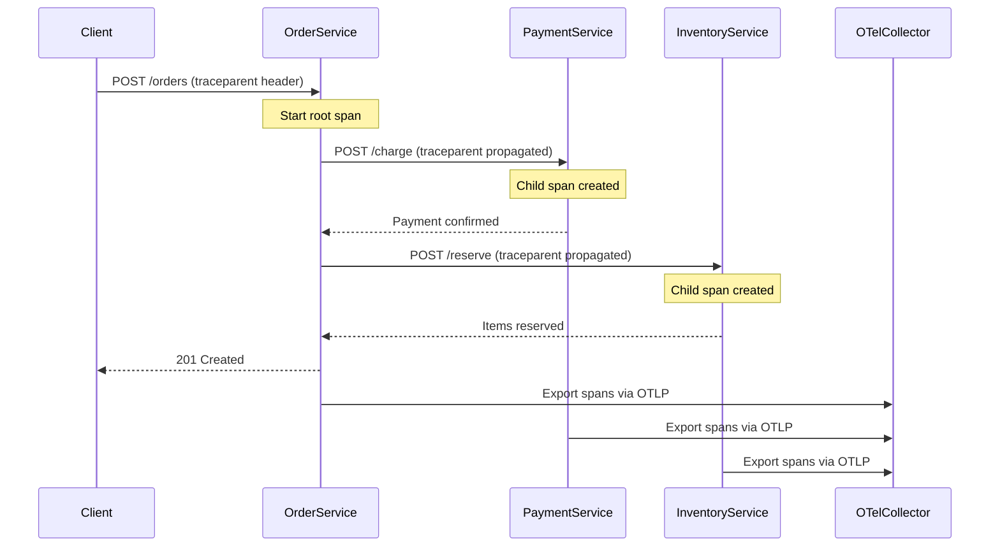

# How to Instrument Spring Boot Applications with OpenTelemetry

Author: [nawazdhandala](https://www.github.com/nawazdhandala)

Tags: Java, Spring Boot, OpenTelemetry, Tracing, Observability

Description: Learn how to instrument Spring Boot applications with OpenTelemetry for distributed tracing and metrics collection.

---

When running microservices in production, understanding how requests flow across services is essential. OpenTelemetry provides a vendor-neutral standard for collecting traces, metrics, and logs. This guide shows how to instrument a Spring Boot application with OpenTelemetry.

## How OpenTelemetry Works

OpenTelemetry collects telemetry data and exports it to an observability backend.



## Adding Dependencies

Add the OpenTelemetry Spring Boot starter to your project.

```xml
<!-- pom.xml - OpenTelemetry dependencies -->
<dependencyManagement>
    <dependencies>
        <!-- OpenTelemetry BOM manages all OTel versions -->
        <dependency>
            <groupId>io.opentelemetry.instrumentation</groupId>
            <artifactId>opentelemetry-instrumentation-bom</artifactId>
            <version>2.12.0</version>
            <type>pom</type>
            <scope>import</scope>
        </dependency>
    </dependencies>
</dependencyManagement>

<dependencies>
    <!-- Spring Boot starter for auto-instrumentation -->
    <dependency>
        <groupId>io.opentelemetry.instrumentation</groupId>
        <artifactId>opentelemetry-spring-boot-starter</artifactId>
    </dependency>

    <!-- OTLP exporter sends data to an OpenTelemetry Collector -->
    <dependency>
        <groupId>io.opentelemetry</groupId>
        <artifactId>opentelemetry-exporter-otlp</artifactId>
    </dependency>
</dependencies>
```

## Application Configuration

Configure the OpenTelemetry SDK through application properties.

```yaml
# application.yml - OpenTelemetry configuration
otel:
  # Service name appears in traces and metrics
  service:
    name: order-service
  # Resource attributes add metadata to all telemetry
  resource:
    attributes:
      deployment.environment: production
      service.version: 1.0.0
  # OTLP exporter configuration
  exporter:
    otlp:
      # Collector endpoint for trace and metric export
      endpoint: http://otel-collector:4317
      # Use gRPC protocol for efficient data transfer
      protocol: grpc
  # Trace configuration
  traces:
    # Sample 100% of traces in development
    sampler:
      type: always_on
```

## Auto-Instrumentation Coverage

The Spring Boot starter automatically instruments common libraries.



## Adding Custom Spans

Create manual spans to trace business logic that is not automatically instrumented.

```java
// OrderService.java - Adding custom spans for business logic
@Service
public class OrderService {

    // Inject the OpenTelemetry tracer for manual instrumentation
    private final Tracer tracer;
    private final OrderRepository orderRepository;
    private final PaymentClient paymentClient;

    public OrderService(
            OpenTelemetry openTelemetry,
            OrderRepository orderRepository,
            PaymentClient paymentClient) {
        // Create a tracer named after this service class
        this.tracer = openTelemetry.getTracer("order-service");
        this.orderRepository = orderRepository;
        this.paymentClient = paymentClient;
    }

    public Order processOrder(OrderRequest request) {
        // Create a span to trace the entire order processing flow
        Span span = tracer.spanBuilder("process-order")
            .setSpanKind(SpanKind.INTERNAL)
            .setAttribute("order.item_count", request.getItems().size())
            .setAttribute("order.customer_id", request.getCustomerId())
            .startSpan();

        // Make this span the active span so child spans inherit it
        try (Scope scope = span.makeCurrent()) {
            // Step 1: Validate the order
            validateOrder(request);

            // Step 2: Calculate pricing
            BigDecimal total = calculateTotal(request);
            span.setAttribute("order.total", total.doubleValue());

            // Step 3: Process payment
            PaymentResult payment = paymentClient.charge(request.getCustomerId(), total);

            // Step 4: Save the order
            Order order = orderRepository.save(
                new Order(request, total, payment.getTransactionId())
            );

            // Record success status on the span
            span.setStatus(StatusCode.OK);
            return order;

        } catch (Exception e) {
            // Record the error on the span for debugging
            span.setStatus(StatusCode.ERROR, e.getMessage());
            span.recordException(e);
            throw e;
        } finally {
            // Always end the span to flush it to the exporter
            span.end();
        }
    }

    private void validateOrder(OrderRequest request) {
        // Create a child span for the validation step
        Span validationSpan = tracer.spanBuilder("validate-order")
            .startSpan();

        try (Scope scope = validationSpan.makeCurrent()) {
            if (request.getItems().isEmpty()) {
                throw new IllegalArgumentException("Order must have at least one item");
            }
            validationSpan.setStatus(StatusCode.OK);
        } finally {
            validationSpan.end();
        }
    }

    private BigDecimal calculateTotal(OrderRequest request) {
        // Create a child span for price calculation
        Span calcSpan = tracer.spanBuilder("calculate-total")
            .startSpan();

        try (Scope scope = calcSpan.makeCurrent()) {
            BigDecimal total = request.getItems().stream()
                .map(item -> item.getPrice().multiply(BigDecimal.valueOf(item.getQuantity())))
                .reduce(BigDecimal.ZERO, BigDecimal::add);

            calcSpan.setAttribute("calculated.total", total.doubleValue());
            calcSpan.setStatus(StatusCode.OK);
            return total;
        } finally {
            calcSpan.end();
        }
    }
}
```

## Custom Metrics

Record application-level metrics alongside traces.

```java
// OrderMetrics.java - Custom metrics for order processing
@Component
public class OrderMetrics {

    private final LongCounter ordersCreated;
    private final DoubleHistogram orderValue;
    private final LongUpDownCounter activeOrders;

    public OrderMetrics(OpenTelemetry openTelemetry) {
        // Create a meter for recording metrics
        Meter meter = openTelemetry.getMeter("order-service");

        // Counter tracks the total number of orders created
        ordersCreated = meter.counterBuilder("orders.created")
            .setDescription("Total number of orders created")
            .setUnit("orders")
            .build();

        // Histogram tracks the distribution of order values
        orderValue = meter.histogramBuilder("orders.value")
            .setDescription("Distribution of order values")
            .setUnit("USD")
            .build();

        // UpDownCounter tracks currently active (processing) orders
        activeOrders = meter.upDownCounterBuilder("orders.active")
            .setDescription("Number of orders currently being processed")
            .build();
    }

    // Call when a new order is created
    public void recordOrderCreated(String region, BigDecimal total) {
        // Add attributes to segment metrics by region
        Attributes attrs = Attributes.of(AttributeKey.stringKey("region"), region);
        ordersCreated.add(1, attrs);
        orderValue.record(total.doubleValue(), attrs);
    }

    // Call when order processing starts
    public void incrementActiveOrders() {
        activeOrders.add(1);
    }

    // Call when order processing finishes
    public void decrementActiveOrders() {
        activeOrders.add(-1);
    }
}
```

## Context Propagation

Ensure trace context propagates across service boundaries.

```java
// RestClientConfig.java - Configure RestTemplate with trace propagation
@Configuration
public class RestClientConfig {

    @Bean
    public RestTemplate restTemplate() {
        // The OpenTelemetry auto-instrumentation automatically
        // adds trace context headers (traceparent, tracestate)
        // to outgoing HTTP requests made with RestTemplate
        return new RestTemplate();
    }
}
```

## Trace Flow Across Services



## Logging Correlation

Connect logs to traces by including trace and span IDs.

```yaml
# logback-spring.xml - Log format with trace correlation
logging:
  pattern:
    # Include trace_id and span_id in every log line
    console: "%d{yyyy-MM-dd HH:mm:ss} [%thread] %-5level %logger{36} - trace_id=%X{trace_id} span_id=%X{span_id} - %msg%n"
```

## Conclusion

OpenTelemetry gives Spring Boot applications deep observability through auto-instrumented traces, custom spans for business logic, and application-level metrics. The vendor-neutral approach means you can switch backends without changing instrumentation code.

[OneUptime](https://oneuptime.com) integrates with OpenTelemetry to provide end-to-end visibility into your Spring Boot applications, including distributed tracing, performance monitoring, and alerting when latency or error rates exceed your thresholds.
