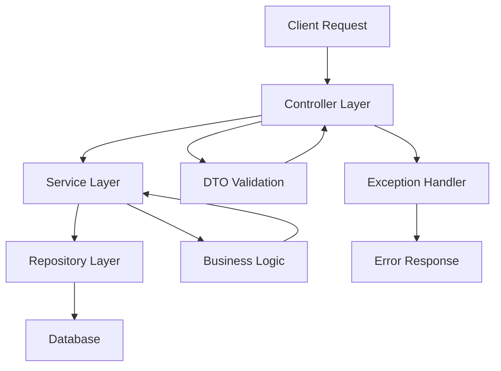
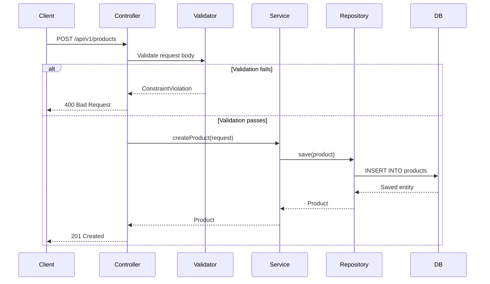

# How to Build REST APIs with Spring Boot

Author: [nawazdhandala](https://www.github.com/nawazdhandala)

Tags: Java, Spring Boot, REST API, Web Services, Backend

Description: Step-by-step guide to building REST APIs with Spring Boot including controllers, services, validation, and error handling.

---

Building REST APIs is one of the most common tasks in backend development. Spring Boot makes this process straightforward with its opinionated defaults and powerful abstractions. This guide walks through creating a production-ready REST API from scratch.

## Architecture Overview

A well-structured Spring Boot REST API follows a layered architecture pattern.



## Project Setup

Start by creating a new Spring Boot project with the required dependencies.

```xml
<!-- pom.xml - Core dependencies for REST API -->
<dependencies>
    <!-- Spring Boot Web for REST endpoints -->
    <dependency>
        <groupId>org.springframework.boot</groupId>
        <artifactId>spring-boot-starter-web</artifactId>
    </dependency>

    <!-- Spring Data JPA for database access -->
    <dependency>
        <groupId>org.springframework.boot</groupId>
        <artifactId>spring-boot-starter-data-jpa</artifactId>
    </dependency>

    <!-- Bean Validation for request validation -->
    <dependency>
        <groupId>org.springframework.boot</groupId>
        <artifactId>spring-boot-starter-validation</artifactId>
    </dependency>

    <!-- PostgreSQL driver -->
    <dependency>
        <groupId>org.postgresql</groupId>
        <artifactId>postgresql</artifactId>
        <scope>runtime</scope>
    </dependency>
</dependencies>
```

## Define the Entity

Create a JPA entity that maps to a database table.

```java
// Product.java - JPA entity representing a product
@Entity
@Table(name = "products")
public class Product {

    @Id
    @GeneratedValue(strategy = GenerationType.IDENTITY)
    private Long id;

    // Product name cannot be null and has a max length
    @Column(nullable = false, length = 255)
    private String name;

    // Description allows longer text
    @Column(length = 1000)
    private String description;

    // Price must be positive
    @Column(nullable = false)
    private BigDecimal price;

    // Track creation timestamp automatically
    @Column(name = "created_at", updatable = false)
    @CreationTimestamp
    private LocalDateTime createdAt;

    // Track update timestamp automatically
    @Column(name = "updated_at")
    @UpdateTimestamp
    private LocalDateTime updatedAt;

    // Constructors, getters, and setters omitted for brevity
}
```

## Create DTOs for Validation

Use Data Transfer Objects to separate API contracts from internal models.

```java
// CreateProductRequest.java - Validated DTO for product creation
public class CreateProductRequest {

    // Name is required and must be between 2 and 255 characters
    @NotBlank(message = "Product name is required")
    @Size(min = 2, max = 255, message = "Name must be between 2 and 255 characters")
    private String name;

    // Description is optional but has a max length
    @Size(max = 1000, message = "Description cannot exceed 1000 characters")
    private String description;

    // Price must be a positive number
    @NotNull(message = "Price is required")
    @Positive(message = "Price must be positive")
    private BigDecimal price;

    // Getters and setters
    public String getName() { return name; }
    public void setName(String name) { this.name = name; }
    public String getDescription() { return description; }
    public void setDescription(String description) { this.description = description; }
    public BigDecimal getPrice() { return price; }
    public void setPrice(BigDecimal price) { this.price = price; }
}
```

## Build the Repository

Spring Data JPA generates the implementation automatically.

```java
// ProductRepository.java - Data access layer
@Repository
public interface ProductRepository extends JpaRepository<Product, Long> {

    // Spring Data derives the query from the method name
    List<Product> findByNameContainingIgnoreCase(String name);

    // Custom query for price range filtering
    @Query("SELECT p FROM Product p WHERE p.price BETWEEN :min AND :max")
    List<Product> findByPriceRange(
        @Param("min") BigDecimal min,
        @Param("max") BigDecimal max
    );
}
```

## Implement the Service Layer

The service layer contains business logic and transaction management.

```java
// ProductService.java - Business logic layer
@Service
@Transactional
public class ProductService {

    private final ProductRepository productRepository;

    // Constructor injection for dependency management
    public ProductService(ProductRepository productRepository) {
        this.productRepository = productRepository;
    }

    // Retrieve all products from the database
    @Transactional(readOnly = true)
    public List<Product> getAllProducts() {
        return productRepository.findAll();
    }

    // Find a product by ID or throw an exception
    @Transactional(readOnly = true)
    public Product getProductById(Long id) {
        return productRepository.findById(id)
            .orElseThrow(() -> new ResourceNotFoundException("Product not found with id: " + id));
    }

    // Create a new product from the request DTO
    public Product createProduct(CreateProductRequest request) {
        Product product = new Product();
        product.setName(request.getName());
        product.setDescription(request.getDescription());
        product.setPrice(request.getPrice());
        return productRepository.save(product);
    }

    // Update an existing product
    public Product updateProduct(Long id, CreateProductRequest request) {
        Product product = getProductById(id);
        product.setName(request.getName());
        product.setDescription(request.getDescription());
        product.setPrice(request.getPrice());
        return productRepository.save(product);
    }

    // Delete a product by ID
    public void deleteProduct(Long id) {
        Product product = getProductById(id);
        productRepository.delete(product);
    }
}
```

## Create the REST Controller

The controller maps HTTP requests to service methods.

```java
// ProductController.java - REST API endpoints
@RestController
@RequestMapping("/api/v1/products")
public class ProductController {

    private final ProductService productService;

    public ProductController(ProductService productService) {
        this.productService = productService;
    }

    // GET /api/v1/products - List all products
    @GetMapping
    public ResponseEntity<List<Product>> getAllProducts() {
        List<Product> products = productService.getAllProducts();
        return ResponseEntity.ok(products);
    }

    // GET /api/v1/products/{id} - Get a single product
    @GetMapping("/{id}")
    public ResponseEntity<Product> getProductById(@PathVariable Long id) {
        Product product = productService.getProductById(id);
        return ResponseEntity.ok(product);
    }

    // POST /api/v1/products - Create a new product
    @PostMapping
    public ResponseEntity<Product> createProduct(
            @Valid @RequestBody CreateProductRequest request) {
        Product product = productService.createProduct(request);
        return ResponseEntity.status(HttpStatus.CREATED).body(product);
    }

    // PUT /api/v1/products/{id} - Update an existing product
    @PutMapping("/{id}")
    public ResponseEntity<Product> updateProduct(
            @PathVariable Long id,
            @Valid @RequestBody CreateProductRequest request) {
        Product product = productService.updateProduct(id, request);
        return ResponseEntity.ok(product);
    }

    // DELETE /api/v1/products/{id} - Delete a product
    @DeleteMapping("/{id}")
    public ResponseEntity<Void> deleteProduct(@PathVariable Long id) {
        productService.deleteProduct(id);
        return ResponseEntity.noContent().build();
    }
}
```

## Global Exception Handling

Handle errors consistently across the entire API.

```java
// GlobalExceptionHandler.java - Centralized error handling
@RestControllerAdvice
public class GlobalExceptionHandler {

    // Handle resource not found errors
    @ExceptionHandler(ResourceNotFoundException.class)
    public ResponseEntity<ErrorResponse> handleNotFound(ResourceNotFoundException ex) {
        ErrorResponse error = new ErrorResponse(
            HttpStatus.NOT_FOUND.value(),
            ex.getMessage(),
            LocalDateTime.now()
        );
        return ResponseEntity.status(HttpStatus.NOT_FOUND).body(error);
    }

    // Handle validation errors from @Valid annotations
    @ExceptionHandler(MethodArgumentNotValidException.class)
    public ResponseEntity<ErrorResponse> handleValidation(
            MethodArgumentNotValidException ex) {
        // Collect all field validation errors into a single message
        String message = ex.getBindingResult().getFieldErrors().stream()
            .map(error -> error.getField() + ": " + error.getDefaultMessage())
            .collect(Collectors.joining(", "));

        ErrorResponse error = new ErrorResponse(
            HttpStatus.BAD_REQUEST.value(),
            message,
            LocalDateTime.now()
        );
        return ResponseEntity.badRequest().body(error);
    }

    // Catch-all for unexpected errors
    @ExceptionHandler(Exception.class)
    public ResponseEntity<ErrorResponse> handleGeneral(Exception ex) {
        ErrorResponse error = new ErrorResponse(
            HttpStatus.INTERNAL_SERVER_ERROR.value(),
            "An unexpected error occurred",
            LocalDateTime.now()
        );
        return ResponseEntity.status(HttpStatus.INTERNAL_SERVER_ERROR).body(error);
    }
}
```

## Request Flow

Here is how a typical request flows through the application layers.



## Application Configuration

Configure the database connection and JPA settings.

```yaml
# application.yml - Application configuration
spring:
  datasource:
    # Database connection settings
    url: jdbc:postgresql://localhost:5432/myapp
    username: ${DB_USERNAME:postgres}
    password: ${DB_PASSWORD:postgres}
  jpa:
    # Automatically update database schema
    hibernate:
      ddl-auto: update
    # Show SQL queries in development
    show-sql: false
    properties:
      hibernate:
        format_sql: true
```

## Conclusion

This guide covered the essential components of a Spring Boot REST API: entities, DTOs with validation, repositories, services, controllers, and global exception handling. The layered architecture keeps the codebase maintainable and testable as it grows.

Once your API is running in production, monitoring its health and performance becomes critical. [OneUptime](https://oneuptime.com) provides comprehensive API monitoring that can track endpoint response times, detect failures, and alert your team when issues arise.
