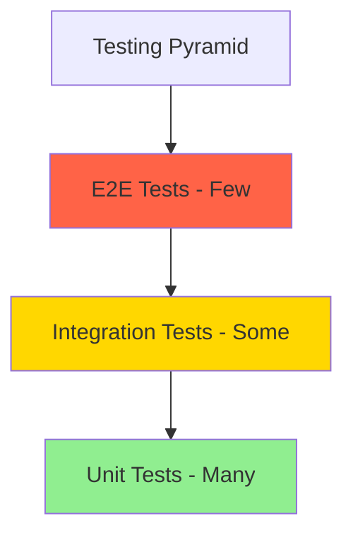
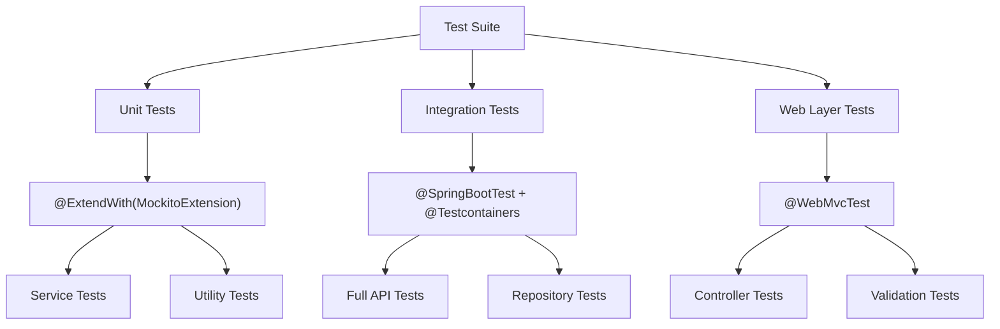

# How to Write Unit and Integration Tests for Spring Boot

Author: [nawazdhandala](https://www.github.com/nawazdhandala)

Tags: Java, Spring Boot, Testing, JUnit, Mockito

Description: Learn how to write unit tests and integration tests for Spring Boot applications using JUnit 5, Mockito, and TestContainers.

---

A solid testing strategy is essential for maintaining Spring Boot applications. Unit tests verify individual components in isolation, while integration tests validate that components work together correctly. This guide covers both approaches using JUnit 5, Mockito, and TestContainers.

## Testing Pyramid

A balanced test suite follows the testing pyramid pattern.



## Test Dependencies

Add the required testing libraries to your project.

```xml
<!-- pom.xml - Testing dependencies -->
<dependencies>
    <!-- Spring Boot test starter includes JUnit 5 and Mockito -->
    <dependency>
        <groupId>org.springframework.boot</groupId>
        <artifactId>spring-boot-starter-test</artifactId>
        <scope>test</scope>
    </dependency>

    <!-- TestContainers for integration tests with real databases -->
    <dependency>
        <groupId>org.testcontainers</groupId>
        <artifactId>junit-jupiter</artifactId>
        <version>1.20.4</version>
        <scope>test</scope>
    </dependency>

    <!-- PostgreSQL TestContainer -->
    <dependency>
        <groupId>org.testcontainers</groupId>
        <artifactId>postgresql</artifactId>
        <version>1.20.4</version>
        <scope>test</scope>
    </dependency>

    <!-- Spring Security test utilities -->
    <dependency>
        <groupId>org.springframework.security</groupId>
        <artifactId>spring-security-test</artifactId>
        <scope>test</scope>
    </dependency>
</dependencies>
```

## Unit Testing Services

Test service classes in isolation using Mockito to mock dependencies.

```java
// ProductServiceTest.java - Unit tests for business logic
@ExtendWith(MockitoExtension.class)
class ProductServiceTest {

    // Create a mock of the repository
    @Mock
    private ProductRepository productRepository;

    // Inject the mock into the service under test
    @InjectMocks
    private ProductService productService;

    @Test
    @DisplayName("Should return product when found by ID")
    void getProductById_WhenExists_ReturnsProduct() {
        // Arrange: set up the mock to return a product
        Product product = new Product();
        product.setId(1L);
        product.setName("Laptop");
        product.setPrice(new BigDecimal("999.99"));

        when(productRepository.findById(1L))
            .thenReturn(Optional.of(product));

        // Act: call the method under test
        Product result = productService.getProductById(1L);

        // Assert: verify the returned product
        assertNotNull(result);
        assertEquals("Laptop", result.getName());
        assertEquals(new BigDecimal("999.99"), result.getPrice());

        // Verify the repository was called exactly once
        verify(productRepository, times(1)).findById(1L);
    }

    @Test
    @DisplayName("Should throw exception when product not found")
    void getProductById_WhenNotExists_ThrowsException() {
        // Arrange: mock returns empty Optional
        when(productRepository.findById(99L))
            .thenReturn(Optional.empty());

        // Act and Assert: verify exception is thrown
        ResourceNotFoundException exception = assertThrows(
            ResourceNotFoundException.class,
            () -> productService.getProductById(99L)
        );

        assertTrue(exception.getMessage().contains("99"));
    }

    @Test
    @DisplayName("Should create product from valid request")
    void createProduct_WithValidRequest_ReturnsCreatedProduct() {
        // Arrange: create request and mock save behavior
        CreateProductRequest request = new CreateProductRequest();
        request.setName("Keyboard");
        request.setPrice(new BigDecimal("79.99"));

        // Use ArgumentCaptor to verify what was saved
        ArgumentCaptor<Product> captor =
            ArgumentCaptor.forClass(Product.class);

        when(productRepository.save(any(Product.class)))
            .thenAnswer(invocation -> {
                Product saved = invocation.getArgument(0);
                saved.setId(1L);
                return saved;
            });

        // Act
        Product result = productService.createProduct(request);

        // Assert
        verify(productRepository).save(captor.capture());
        Product savedProduct = captor.getValue();
        assertEquals("Keyboard", savedProduct.getName());
        assertNotNull(result.getId());
    }
}
```

## Integration Testing with TestContainers

Use TestContainers to run integration tests against a real database.

```java
// ProductIntegrationTest.java - Tests with a real PostgreSQL database
@SpringBootTest(webEnvironment = SpringBootTest.WebEnvironment.RANDOM_PORT)
@Testcontainers
class ProductIntegrationTest {

    // Start a PostgreSQL container for the test
    @Container
    static PostgreSQLContainer<?> postgres =
        new PostgreSQLContainer<>("postgres:16-alpine")
            .withDatabaseName("testdb")
            .withUsername("test")
            .withPassword("test");

    // Configure Spring to use the test database
    @DynamicPropertySource
    static void configureProperties(DynamicPropertyRegistry registry) {
        registry.add("spring.datasource.url", postgres::getJdbcUrl);
        registry.add("spring.datasource.username", postgres::getUsername);
        registry.add("spring.datasource.password", postgres::getPassword);
    }

    @Autowired
    private TestRestTemplate restTemplate;

    @Autowired
    private ProductRepository productRepository;

    @BeforeEach
    void setUp() {
        // Clean the database before each test
        productRepository.deleteAll();
    }

    @Test
    @DisplayName("Should create and retrieve a product via REST API")
    void createAndGetProduct() {
        // Create a product through the API
        CreateProductRequest request = new CreateProductRequest();
        request.setName("Monitor");
        request.setPrice(new BigDecimal("349.99"));

        ResponseEntity<Product> createResponse = restTemplate.postForEntity(
            "/api/v1/products",
            request,
            Product.class
        );

        // Verify creation was successful
        assertEquals(HttpStatus.CREATED, createResponse.getStatusCode());
        assertNotNull(createResponse.getBody());
        Long productId = createResponse.getBody().getId();

        // Retrieve the product by ID
        ResponseEntity<Product> getResponse = restTemplate.getForEntity(
            "/api/v1/products/" + productId,
            Product.class
        );

        // Verify retrieval returns the correct data
        assertEquals(HttpStatus.OK, getResponse.getStatusCode());
        assertEquals("Monitor", getResponse.getBody().getName());
    }

    @Test
    @DisplayName("Should return 404 for non-existent product")
    void getProduct_WhenNotExists_Returns404() {
        ResponseEntity<String> response = restTemplate.getForEntity(
            "/api/v1/products/99999",
            String.class
        );

        assertEquals(HttpStatus.NOT_FOUND, response.getStatusCode());
    }
}
```

## Testing REST Controllers

Test controllers with MockMvc for fast, focused web layer tests.

```java
// ProductControllerTest.java - Web layer tests with MockMvc
@WebMvcTest(ProductController.class)
class ProductControllerTest {

    @Autowired
    private MockMvc mockMvc;

    // Mock the service layer
    @MockBean
    private ProductService productService;

    @Autowired
    private ObjectMapper objectMapper;

    @Test
    @DisplayName("Should return 200 and product list")
    void getAllProducts_ReturnsProductList() throws Exception {
        // Arrange
        List<Product> products = List.of(
            createProduct(1L, "Laptop", "999.99"),
            createProduct(2L, "Mouse", "29.99")
        );
        when(productService.getAllProducts()).thenReturn(products);

        // Act and Assert
        mockMvc.perform(get("/api/v1/products")
                .contentType(MediaType.APPLICATION_JSON))
            .andExpect(status().isOk())
            .andExpect(jsonPath("$", hasSize(2)))
            .andExpect(jsonPath("$[0].name").value("Laptop"))
            .andExpect(jsonPath("$[1].name").value("Mouse"));
    }

    @Test
    @DisplayName("Should return 400 for invalid product request")
    void createProduct_WithInvalidData_Returns400() throws Exception {
        // Create a request with missing required fields
        CreateProductRequest request = new CreateProductRequest();
        request.setName(""); // Invalid: blank name
        request.setPrice(new BigDecimal("-1")); // Invalid: negative price

        mockMvc.perform(post("/api/v1/products")
                .contentType(MediaType.APPLICATION_JSON)
                .content(objectMapper.writeValueAsString(request)))
            .andExpect(status().isBadRequest());
    }

    // Helper method to create test products
    private Product createProduct(Long id, String name, String price) {
        Product product = new Product();
        product.setId(id);
        product.setName(name);
        product.setPrice(new BigDecimal(price));
        return product;
    }
}
```

## Test Organization



## Testing with Custom Annotations

Create reusable test annotations to reduce boilerplate.

```java
// IntegrationTest.java - Custom annotation for integration tests
@Target(ElementType.TYPE)
@Retention(RetentionPolicy.RUNTIME)
@SpringBootTest(webEnvironment = SpringBootTest.WebEnvironment.RANDOM_PORT)
@Testcontainers
@ActiveProfiles("test")
public @interface IntegrationTest {
}

// Usage in test classes becomes much simpler
@IntegrationTest
class OrderIntegrationTest {
    // Test methods here
}
```

## Conclusion

A comprehensive testing strategy combines fast unit tests for business logic, MockMvc tests for the web layer, and TestContainers-based integration tests for end-to-end validation. This approach catches bugs at every level while keeping the test suite fast enough to run frequently.

When your tested code reaches production, [OneUptime](https://oneuptime.com) continues the quality assurance process by monitoring endpoint availability, tracking error rates, and alerting your team when issues arise that tests could not predict.
