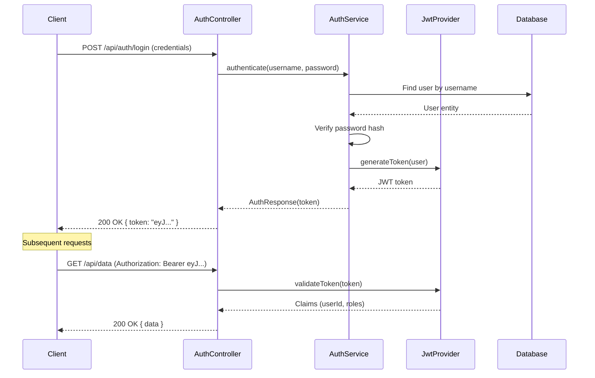
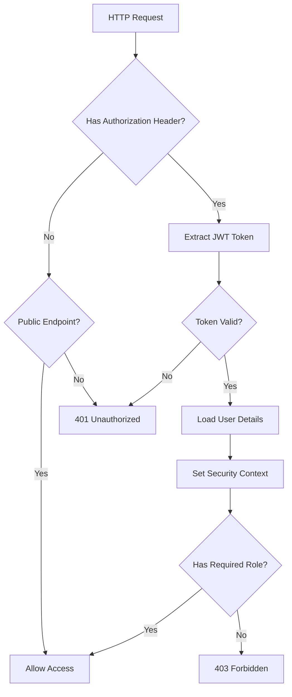

# How to Implement JWT Authentication in Spring Boot

Author: [nawazdhandala](https://www.github.com/nawazdhandala)

Tags: Java, Spring Boot, JWT, Security, Authentication

Description: Learn how to implement JWT-based authentication and authorization in Spring Boot applications with Spring Security.

---

JWT (JSON Web Token) authentication is the standard approach for securing REST APIs. Unlike session-based authentication, JWTs are stateless and work well in distributed systems. This guide walks through implementing JWT authentication with Spring Security.

## Authentication Flow

The JWT authentication flow involves token generation and validation on each request.



## Dependencies

Add Spring Security and JWT libraries to the project.

```xml
<!-- pom.xml - Security and JWT dependencies -->
<dependencies>
    <!-- Spring Security for authentication framework -->
    <dependency>
        <groupId>org.springframework.boot</groupId>
        <artifactId>spring-boot-starter-security</artifactId>
    </dependency>

    <!-- JJWT library for JWT creation and parsing -->
    <dependency>
        <groupId>io.jsonwebtoken</groupId>
        <artifactId>jjwt-api</artifactId>
        <version>0.12.6</version>
    </dependency>
    <dependency>
        <groupId>io.jsonwebtoken</groupId>
        <artifactId>jjwt-impl</artifactId>
        <version>0.12.6</version>
        <scope>runtime</scope>
    </dependency>
    <dependency>
        <groupId>io.jsonwebtoken</groupId>
        <artifactId>jjwt-jackson</artifactId>
        <version>0.12.6</version>
        <scope>runtime</scope>
    </dependency>
</dependencies>
```

## JWT Token Provider

Create a service that generates and validates JWT tokens.

```java
// JwtTokenProvider.java - Handles JWT creation and validation
@Component
public class JwtTokenProvider {

    // Secret key loaded from application properties
    @Value("${app.jwt.secret}")
    private String jwtSecret;

    // Token expiration time in milliseconds
    @Value("${app.jwt.expiration-ms}")
    private long jwtExpirationMs;

    // Generate a JWT token for an authenticated user
    public String generateToken(UserDetails userDetails) {
        Date now = new Date();
        Date expiryDate = new Date(now.getTime() + jwtExpirationMs);

        // Build the signing key from the secret
        SecretKey key = Keys.hmacShaKeyFor(
            Decoders.BASE64.decode(jwtSecret)
        );

        return Jwts.builder()
            // Subject is the username
            .subject(userDetails.getUsername())
            // Include roles as a custom claim
            .claim("roles", userDetails.getAuthorities().stream()
                .map(GrantedAuthority::getAuthority)
                .collect(Collectors.toList()))
            .issuedAt(now)
            .expiration(expiryDate)
            // Sign with HMAC-SHA256
            .signWith(key)
            .compact();
    }

    // Extract the username from a valid token
    public String getUsernameFromToken(String token) {
        Claims claims = parseToken(token);
        return claims.getSubject();
    }

    // Validate the token signature and expiration
    public boolean validateToken(String token) {
        try {
            parseToken(token);
            return true;
        } catch (JwtException | IllegalArgumentException e) {
            // Token is invalid or expired
            return false;
        }
    }

    // Parse and verify the token
    private Claims parseToken(String token) {
        SecretKey key = Keys.hmacShaKeyFor(
            Decoders.BASE64.decode(jwtSecret)
        );

        return Jwts.parser()
            .verifyWith(key)
            .build()
            .parseSignedClaims(token)
            .getPayload();
    }
}
```

## JWT Authentication Filter

Create a filter that intercepts requests and validates JWT tokens.

```java
// JwtAuthenticationFilter.java - Validates JWT on each request
@Component
public class JwtAuthenticationFilter extends OncePerRequestFilter {

    private final JwtTokenProvider tokenProvider;
    private final UserDetailsService userDetailsService;

    public JwtAuthenticationFilter(
            JwtTokenProvider tokenProvider,
            UserDetailsService userDetailsService) {
        this.tokenProvider = tokenProvider;
        this.userDetailsService = userDetailsService;
    }

    @Override
    protected void doFilterInternal(
            HttpServletRequest request,
            HttpServletResponse response,
            FilterChain filterChain) throws ServletException, IOException {

        // Extract the token from the Authorization header
        String token = extractTokenFromHeader(request);

        // Validate and set the authentication context
        if (token != null && tokenProvider.validateToken(token)) {
            String username = tokenProvider.getUsernameFromToken(token);

            // Load user details from the database
            UserDetails userDetails = userDetailsService
                .loadUserByUsername(username);

            // Create an authentication token with the user's authorities
            UsernamePasswordAuthenticationToken authentication =
                new UsernamePasswordAuthenticationToken(
                    userDetails,
                    null,
                    userDetails.getAuthorities()
                );

            // Set authentication in the security context
            SecurityContextHolder.getContext()
                .setAuthentication(authentication);
        }

        // Continue the filter chain
        filterChain.doFilter(request, response);
    }

    // Extract Bearer token from the Authorization header
    private String extractTokenFromHeader(HttpServletRequest request) {
        String header = request.getHeader("Authorization");
        if (header != null && header.startsWith("Bearer ")) {
            return header.substring(7);
        }
        return null;
    }
}
```

## Security Configuration

Configure Spring Security to use JWT authentication.

```java
// SecurityConfig.java - Spring Security configuration
@Configuration
@EnableWebSecurity
@EnableMethodSecurity
public class SecurityConfig {

    private final JwtAuthenticationFilter jwtFilter;

    public SecurityConfig(JwtAuthenticationFilter jwtFilter) {
        this.jwtFilter = jwtFilter;
    }

    @Bean
    public SecurityFilterChain securityFilterChain(
            HttpSecurity http) throws Exception {
        http
            // Disable CSRF since we use stateless JWT tokens
            .csrf(csrf -> csrf.disable())
            // Set session management to stateless
            .sessionManagement(session ->
                session.sessionCreationPolicy(
                    SessionCreationPolicy.STATELESS))
            // Configure endpoint authorization
            .authorizeHttpRequests(auth -> auth
                // Allow unauthenticated access to auth endpoints
                .requestMatchers("/api/auth/**").permitAll()
                // Allow health check endpoints
                .requestMatchers("/actuator/health/**").permitAll()
                // Admin endpoints require ADMIN role
                .requestMatchers("/api/admin/**").hasRole("ADMIN")
                // All other endpoints require authentication
                .anyRequest().authenticated()
            )
            // Add JWT filter before the standard auth filter
            .addFilterBefore(jwtFilter,
                UsernamePasswordAuthenticationFilter.class);

        return http.build();
    }

    // Password encoder for hashing passwords
    @Bean
    public PasswordEncoder passwordEncoder() {
        return new BCryptPasswordEncoder();
    }

    // Authentication manager for login endpoint
    @Bean
    public AuthenticationManager authenticationManager(
            AuthenticationConfiguration config) throws Exception {
        return config.getAuthenticationManager();
    }
}
```

## Authentication Controller

Create the login and registration endpoints.

```java
// AuthController.java - Authentication endpoints
@RestController
@RequestMapping("/api/auth")
public class AuthController {

    private final AuthenticationManager authenticationManager;
    private final JwtTokenProvider tokenProvider;
    private final UserService userService;

    public AuthController(
            AuthenticationManager authenticationManager,
            JwtTokenProvider tokenProvider,
            UserService userService) {
        this.authenticationManager = authenticationManager;
        this.tokenProvider = tokenProvider;
        this.userService = userService;
    }

    // POST /api/auth/login - Authenticate and return JWT
    @PostMapping("/login")
    public ResponseEntity<AuthResponse> login(
            @Valid @RequestBody LoginRequest request) {
        // Authenticate with Spring Security
        Authentication authentication = authenticationManager.authenticate(
            new UsernamePasswordAuthenticationToken(
                request.getUsername(),
                request.getPassword()
            )
        );

        // Set the authentication in context
        SecurityContextHolder.getContext()
            .setAuthentication(authentication);

        // Generate JWT token
        UserDetails userDetails = (UserDetails) authentication.getPrincipal();
        String token = tokenProvider.generateToken(userDetails);

        return ResponseEntity.ok(new AuthResponse(token));
    }
}
```

## Security Filter Chain



## Application Properties

```yaml
# application.yml - JWT configuration
app:
  jwt:
    # Base64-encoded secret key (use a strong random key in production)
    secret: ${JWT_SECRET:dGhpcyBpcyBhIHNlY3JldCBrZXkgZm9yIGp3dCB0b2tlbiBzaWduaW5n}
    # Token expires after 24 hours
    expiration-ms: 86400000
```

## Conclusion

JWT authentication with Spring Security provides a stateless, scalable approach to securing REST APIs. The filter-based architecture cleanly separates authentication logic from business logic, and role-based authorization controls access at both the endpoint and method levels.

For production deployments, [OneUptime](https://oneuptime.com) can monitor your authentication endpoints for latency spikes, track failed login attempts, and alert your team if authentication services become unavailable, helping you maintain both security and uptime.
