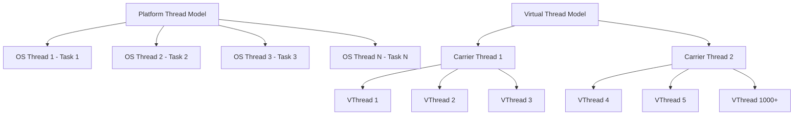
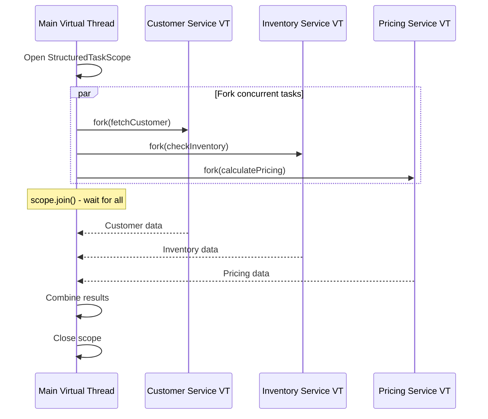
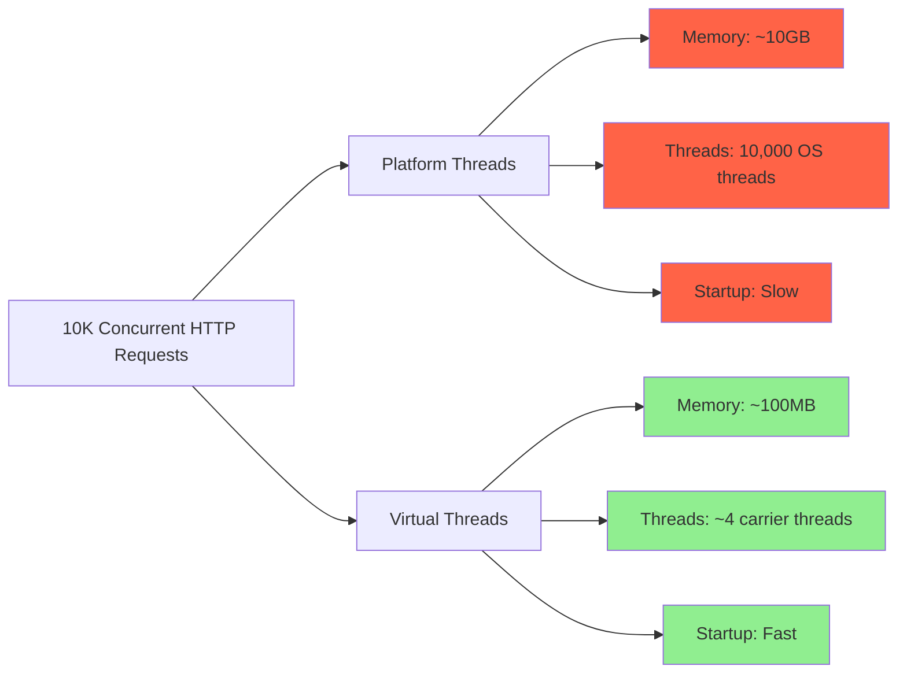

# How to Use Java Virtual Threads for High-Concurrency Applications

Author: [nawazdhandala](https://www.github.com/nawazdhandala)

Tags: Java, Virtual Threads, Project Loom, Concurrency, Performance

Description: Learn how to use Java virtual threads for building high-concurrency applications with simplified concurrent programming.

---

Java virtual threads, introduced as part of Project Loom, fundamentally change how Java handles concurrency. Unlike platform threads that map one-to-one with OS threads, virtual threads are lightweight and managed by the JVM. This allows applications to run millions of concurrent tasks without the overhead of traditional thread pools.

## Virtual Threads vs Platform Threads

Virtual threads are scheduled by the JVM on a small pool of carrier (platform) threads.



## Creating Virtual Threads

Java 21 provides multiple ways to create and run virtual threads.

```java
// VirtualThreadBasics.java - Different ways to create virtual threads
public class VirtualThreadBasics {

    public static void main(String[] args) throws Exception {

        // Method 1: Start a virtual thread directly
        // This creates and starts a virtual thread immediately
        Thread vThread = Thread.startVirtualThread(() -> {
            System.out.println("Running on: " + Thread.currentThread());
        });
        vThread.join();

        // Method 2: Use the builder for more control
        // The builder lets you set a name and other properties
        Thread namedVThread = Thread.ofVirtual()
            .name("worker-", 1) // Names: worker-1, worker-2, etc.
            .start(() -> {
                System.out.println("Named virtual thread running");
            });
        namedVThread.join();

        // Method 3: Virtual thread executor (recommended for tasks)
        // This executor creates a new virtual thread for each task
        try (var executor = Executors.newVirtualThreadPerTaskExecutor()) {
            // Submit 10,000 tasks - each gets its own virtual thread
            List<Future<String>> futures = new ArrayList<>();
            for (int i = 0; i < 10_000; i++) {
                final int taskId = i;
                futures.add(executor.submit(() -> {
                    // Simulate I/O work
                    Thread.sleep(Duration.ofSeconds(1));
                    return "Result from task " + taskId;
                }));
            }

            // Collect all results
            for (Future<String> future : futures) {
                future.get(); // Each completes in ~1 second total
            }
        }
    }
}
```

## Structured Concurrency

Structured concurrency groups related tasks and handles their lifecycle together.

```java
// OrderProcessor.java - Structured concurrency with virtual threads
public class OrderProcessor {

    // Process an order by fetching data concurrently
    public OrderResult processOrder(String orderId) throws Exception {
        // StructuredTaskScope ensures all subtasks complete or are cancelled
        try (var scope = new StructuredTaskScope.ShutdownOnFailure()) {

            // Fork three concurrent tasks on virtual threads
            // Each runs on its own virtual thread
            Subtask<Customer> customerTask = scope.fork(
                () -> fetchCustomer(orderId)
            );
            Subtask<Inventory> inventoryTask = scope.fork(
                () -> checkInventory(orderId)
            );
            Subtask<Pricing> pricingTask = scope.fork(
                () -> calculatePricing(orderId)
            );

            // Wait for all tasks to complete
            scope.join();

            // Propagate any exceptions from subtasks
            scope.throwIfFailed();

            // All tasks succeeded - combine results
            return new OrderResult(
                customerTask.get(),
                inventoryTask.get(),
                pricingTask.get()
            );
        }
        // If any task fails, all others are automatically cancelled
    }

    private Customer fetchCustomer(String orderId) {
        // Simulates a network call to customer service
        return new Customer("John Doe", "john@example.com");
    }

    private Inventory checkInventory(String orderId) {
        // Simulates a database query for inventory
        return new Inventory(true, 42);
    }

    private Pricing calculatePricing(String orderId) {
        // Simulates calling a pricing engine
        return new Pricing(new BigDecimal("99.99"));
    }
}
```

## Structured Concurrency Flow



## Spring Boot with Virtual Threads

Enable virtual threads in Spring Boot 3.2+ with a single property.

```yaml
# application.yml - Enable virtual threads in Spring Boot
spring:
  threads:
    # Use virtual threads for handling HTTP requests
    virtual:
      enabled: true
```

```java
// WebConfig.java - Configure virtual threads for async processing
@Configuration
public class WebConfig {

    // Create an executor that uses virtual threads for @Async methods
    @Bean
    public AsyncTaskExecutor applicationTaskExecutor() {
        return new TaskExecutorAdapter(
            Executors.newVirtualThreadPerTaskExecutor()
        );
    }

    // Configure virtual threads for scheduled tasks
    @Bean
    public TaskScheduler taskScheduler() {
        SimpleAsyncTaskScheduler scheduler = new SimpleAsyncTaskScheduler();
        scheduler.setVirtualThreads(true);
        return scheduler;
    }
}
```

## HTTP Client with Virtual Threads

Virtual threads excel at I/O-bound operations like HTTP calls.

```java
// ExternalApiClient.java - Making concurrent HTTP calls
@Service
public class ExternalApiClient {

    private final HttpClient httpClient;

    public ExternalApiClient() {
        // Create an HTTP client that uses virtual threads
        this.httpClient = HttpClient.newBuilder()
            .executor(Executors.newVirtualThreadPerTaskExecutor())
            .connectTimeout(Duration.ofSeconds(5))
            .build();
    }

    // Fetch data from multiple URLs concurrently
    public List<String> fetchAll(List<String> urls) throws Exception {
        try (var executor = Executors.newVirtualThreadPerTaskExecutor()) {
            // Submit all fetch tasks concurrently
            List<Future<String>> futures = urls.stream()
                .map(url -> executor.submit(() -> fetchUrl(url)))
                .toList();

            // Collect results as they complete
            List<String> results = new ArrayList<>();
            for (Future<String> future : futures) {
                results.add(future.get(10, TimeUnit.SECONDS));
            }
            return results;
        }
    }

    private String fetchUrl(String url) throws Exception {
        HttpRequest request = HttpRequest.newBuilder()
            .uri(URI.create(url))
            .timeout(Duration.ofSeconds(5))
            .GET()
            .build();

        HttpResponse<String> response = httpClient.send(
            request,
            HttpResponse.BodyHandlers.ofString()
        );

        return response.body();
    }
}
```

## Things to Avoid with Virtual Threads

Virtual threads have specific patterns that reduce their effectiveness.

```java
// VirtualThreadAntiPatterns.java - What to avoid
public class VirtualThreadAntiPatterns {

    // BAD: synchronized blocks pin the virtual thread to its carrier
    // This prevents the carrier thread from running other virtual threads
    private final Object lock = new Object();

    public void pinnedExample() {
        synchronized (lock) {
            // Virtual thread is pinned while holding this lock
            // Use ReentrantLock instead
            doBlockingWork();
        }
    }

    // GOOD: Use ReentrantLock instead of synchronized
    private final ReentrantLock reentrantLock = new ReentrantLock();

    public void unpinnedExample() {
        reentrantLock.lock();
        try {
            // Virtual thread can unmount during blocking operations
            doBlockingWork();
        } finally {
            reentrantLock.unlock();
        }
    }

    // BAD: CPU-intensive work does not benefit from virtual threads
    // Virtual threads are designed for I/O-bound tasks
    public void cpuBoundWork() {
        // This will occupy the carrier thread continuously
        // Use platform thread pools for CPU-bound work
        for (long i = 0; i < 1_000_000_000L; i++) {
            Math.sqrt(i);
        }
    }

    private void doBlockingWork() {
        try {
            Thread.sleep(Duration.ofMillis(100));
        } catch (InterruptedException e) {
            Thread.currentThread().interrupt();
        }
    }
}
```

## Performance Comparison



## Monitoring Virtual Threads

Track virtual thread behavior with JFR (Java Flight Recorder) events.

```bash
#!/bin/bash
# Enable JFR to monitor virtual thread behavior
java \
    -XX:StartFlightRecording=filename=recording.jfr,duration=60s \
    -Djdk.tracePinnedThreads=short \
    -jar app.jar

# The -Djdk.tracePinnedThreads flag prints a warning when
# a virtual thread gets pinned to its carrier thread
```

## Conclusion

Java virtual threads simplify concurrent programming by eliminating the need for complex thread pool management. They are ideal for I/O-bound workloads like web servers, API clients, and database access. Combined with structured concurrency, virtual threads make it possible to write concurrent code that is both simple and safe.

[OneUptime](https://oneuptime.com) can monitor your virtual-thread-based applications to ensure that increased concurrency translates into better performance for your users, with alerting on latency, throughput, and error rates across all your services.
