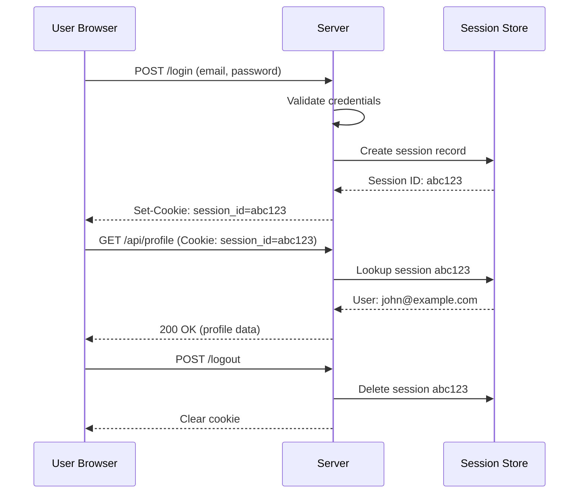
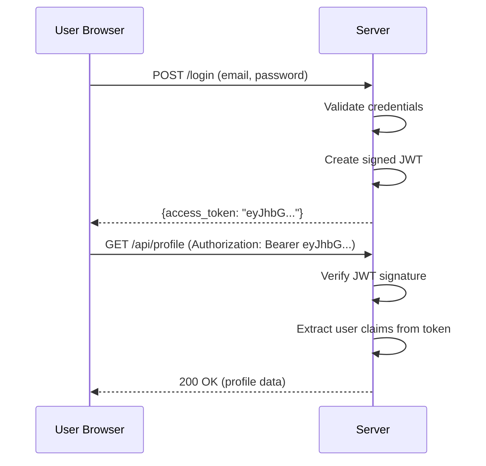
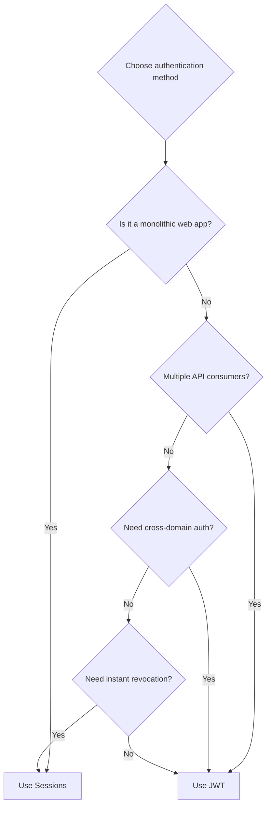

# JWT vs Session-Based Authentication: When to Use Each

Author: [nawazdhandala](https://www.github.com/nawazdhandala)

Tags: Authentication, JWT, Sessions, Security, Web Development

Description: A practical comparison of JWT and session-based authentication patterns including security tradeoffs and use cases.

---

Choosing between JWT and session-based authentication is one of the most debated topics in web development. Both approaches have legitimate use cases, and the right choice depends on your application architecture. This guide breaks down the tradeoffs so you can make an informed decision.

## How Session-Based Authentication Works

With sessions, the server creates a session record when the user logs in and stores a session ID in a cookie. On every subsequent request, the browser sends the cookie, and the server looks up the session to identify the user.



```python
# session_auth.py
# Session-based authentication implementation

from fastapi import FastAPI, Request, Response, HTTPException
from fastapi.responses import JSONResponse
import redis
import uuid
import json
import hashlib
import time

app = FastAPI()

# Use Redis as the session store for shared access across servers
session_store = redis.Redis(host="redis.internal", port=6379, db=0)

# Session duration: 24 hours
SESSION_TTL = 86400

def hash_password(password, salt):
    """Hash a password with a salt using SHA-256."""
    return hashlib.sha256(f"{salt}{password}".encode()).hexdigest()


@app.post("/login")
async def login(request: Request, response: Response):
    """Authenticate user and create a session."""
    body = await request.json()
    email = body.get("email")
    password = body.get("password")

    # Validate credentials (simplified for example)
    user = lookup_user(email)
    if not user or hash_password(password, user["salt"]) != user["password_hash"]:
        raise HTTPException(status_code=401, detail="Invalid credentials")

    # Create a new session
    session_id = str(uuid.uuid4())
    session_data = {
        "user_id": user["id"],
        "email": user["email"],
        "created_at": time.time()
    }

    # Store session in Redis with expiration
    session_store.setex(
        f"session:{session_id}",
        SESSION_TTL,
        json.dumps(session_data)
    )

    # Set the session cookie
    response = JSONResponse({"message": "Logged in"})
    response.set_cookie(
        key="session_id",
        value=session_id,
        httponly=True,      # Not accessible via JavaScript
        secure=True,        # Only sent over HTTPS
        samesite="lax",     # CSRF protection
        max_age=SESSION_TTL
    )
    return response


def get_current_user(request: Request):
    """Extract the current user from the session cookie."""
    session_id = request.cookies.get("session_id")
    if not session_id:
        raise HTTPException(status_code=401, detail="No session")

    # Look up the session in Redis
    session_data = session_store.get(f"session:{session_id}")
    if not session_data:
        raise HTTPException(status_code=401, detail="Session expired")

    return json.loads(session_data)


@app.post("/logout")
async def logout(request: Request):
    """Destroy the session."""
    session_id = request.cookies.get("session_id")
    if session_id:
        session_store.delete(f"session:{session_id}")

    response = JSONResponse({"message": "Logged out"})
    response.delete_cookie("session_id")
    return response
```

## How JWT Authentication Works

With JWTs, the server creates a signed token containing user claims when the user logs in. The client stores this token and sends it with each request. The server validates the token signature without needing a database lookup.



```python
# jwt_auth.py
# JWT-based authentication implementation

import jwt
import time
from fastapi import FastAPI, Request, HTTPException
from datetime import datetime, timedelta

app = FastAPI()

# Secret key for signing tokens (use a strong random value in production)
JWT_SECRET = "your-256-bit-secret-key-here"
JWT_ALGORITHM = "HS256"

# Token durations
ACCESS_TOKEN_TTL = 900      # 15 minutes
REFRESH_TOKEN_TTL = 604800   # 7 days


def create_access_token(user_id, email, roles):
    """Create a short-lived access token."""
    now = time.time()
    payload = {
        # Subject: the user identifier
        "sub": str(user_id),
        # User email
        "email": email,
        # User roles for authorization
        "roles": roles,
        # Issued at timestamp
        "iat": now,
        # Expiration timestamp
        "exp": now + ACCESS_TOKEN_TTL,
        # Token type
        "type": "access"
    }
    return jwt.encode(payload, JWT_SECRET, algorithm=JWT_ALGORITHM)


def create_refresh_token(user_id):
    """Create a long-lived refresh token."""
    now = time.time()
    payload = {
        "sub": str(user_id),
        "iat": now,
        "exp": now + REFRESH_TOKEN_TTL,
        "type": "refresh"
    }
    return jwt.encode(payload, JWT_SECRET, algorithm=JWT_ALGORITHM)


def verify_token(token, expected_type="access"):
    """Verify a JWT and return its claims."""
    try:
        payload = jwt.decode(token, JWT_SECRET, algorithms=[JWT_ALGORITHM])

        # Verify token type
        if payload.get("type") != expected_type:
            raise HTTPException(status_code=401, detail="Invalid token type")

        return payload

    except jwt.ExpiredSignatureError:
        raise HTTPException(status_code=401, detail="Token expired")
    except jwt.InvalidTokenError:
        raise HTTPException(status_code=401, detail="Invalid token")


@app.post("/login")
async def login(request: Request):
    """Authenticate and return JWT tokens."""
    body = await request.json()
    user = authenticate_user(body["email"], body["password"])

    if not user:
        raise HTTPException(status_code=401, detail="Invalid credentials")

    # Create both access and refresh tokens
    access_token = create_access_token(user["id"], user["email"], user["roles"])
    refresh_token = create_refresh_token(user["id"])

    return {
        "access_token": access_token,
        "refresh_token": refresh_token,
        "token_type": "bearer",
        "expires_in": ACCESS_TOKEN_TTL
    }


@app.post("/refresh")
async def refresh(request: Request):
    """Exchange a refresh token for a new access token."""
    body = await request.json()
    claims = verify_token(body["refresh_token"], expected_type="refresh")

    # Look up user to get current roles (they may have changed)
    user = get_user_by_id(claims["sub"])
    access_token = create_access_token(user["id"], user["email"], user["roles"])

    return {
        "access_token": access_token,
        "token_type": "bearer",
        "expires_in": ACCESS_TOKEN_TTL
    }
```

## Comparison

| Aspect | Session-Based | JWT |
|--------|--------------|-----|
| State storage | Server-side (Redis, DB) | Client-side (token) |
| Scalability | Needs shared session store | Stateless, scales easily |
| Revocation | Immediate (delete session) | Difficult without a blocklist |
| Token size | Small cookie (~32 bytes) | Larger (~800+ bytes) |
| Server lookup | Required on every request | Not required (verify signature) |
| CSRF risk | Vulnerable (needs protection) | Not vulnerable (not in cookies) |
| XSS risk | Cookie is httpOnly | Token in localStorage is exposed |
| Cross-domain | Difficult with cookies | Easy with Authorization header |

## When to Use Sessions

Sessions work best for traditional web applications where the server renders pages and the client is a browser.



## When to Use JWT

JWTs work best for APIs consumed by multiple clients, microservices that need to pass identity between services, and cross-domain authentication.

## Security Best Practices for Both

```python
# security_common.py
# Security measures that apply to both approaches

import secrets
import hashlib
import hmac

def generate_csrf_token():
    """Generate a CSRF token for session-based auth."""
    return secrets.token_urlsafe(32)

def verify_csrf_token(token, stored_token):
    """Verify a CSRF token using constant-time comparison."""
    # Constant-time comparison prevents timing attacks
    return hmac.compare_digest(token, stored_token)

def rate_limit_login(ip_address, max_attempts=5, window_seconds=300):
    """Rate limit login attempts to prevent brute force."""
    key = f"login_attempts:{ip_address}"
    # In production, use Redis to track attempts
    # Increment counter, set expiry, check limit
    pass

# For JWTs: Use short-lived access tokens (15 min)
# and longer-lived refresh tokens (7 days)
# Store refresh tokens securely and rotate them

# For Sessions: Use httpOnly, secure, sameSite cookies
# Implement CSRF protection
# Set reasonable session TTLs
```

## Hybrid Approach

Many production systems use a hybrid approach: sessions for the web application and JWTs for the API. The web app creates a session on login and issues JWTs for API access.

With **OneUptime**, you can monitor your authentication infrastructure regardless of the approach you choose. Track login success and failure rates, token refresh patterns, and session store health. Set up alerts for unusual authentication patterns that might indicate a security issue, and monitor the performance of your auth endpoints in real time.
