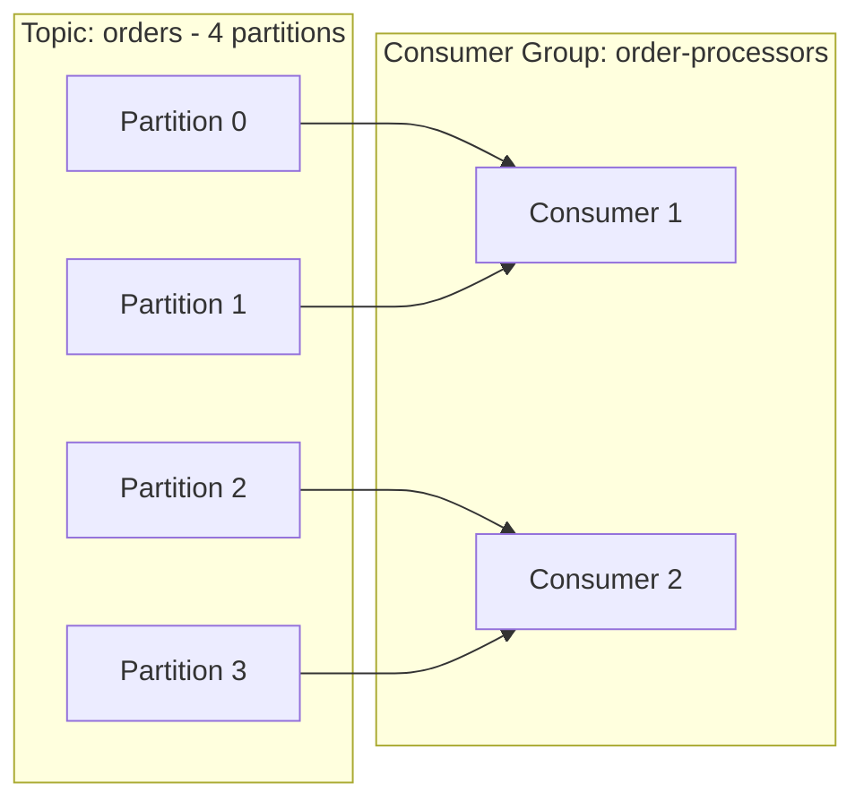
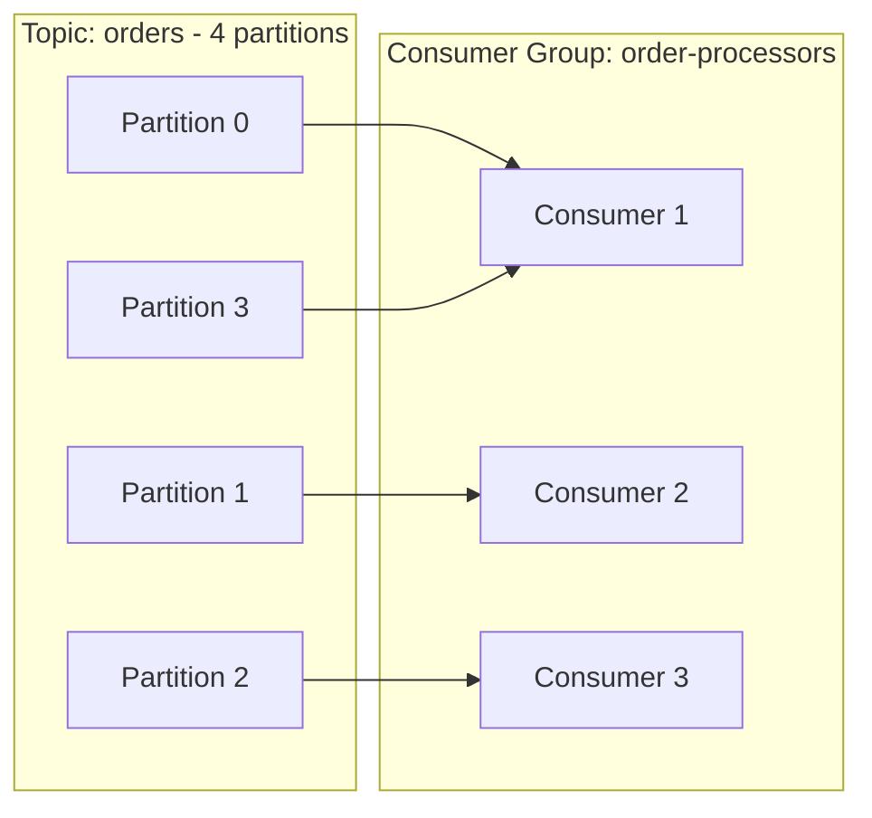
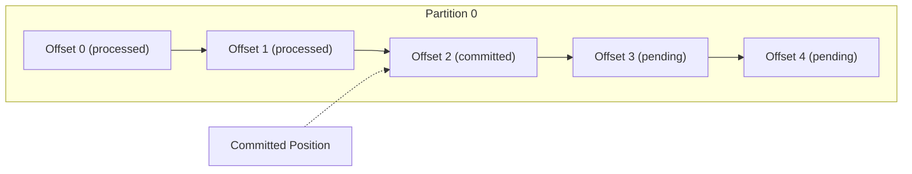
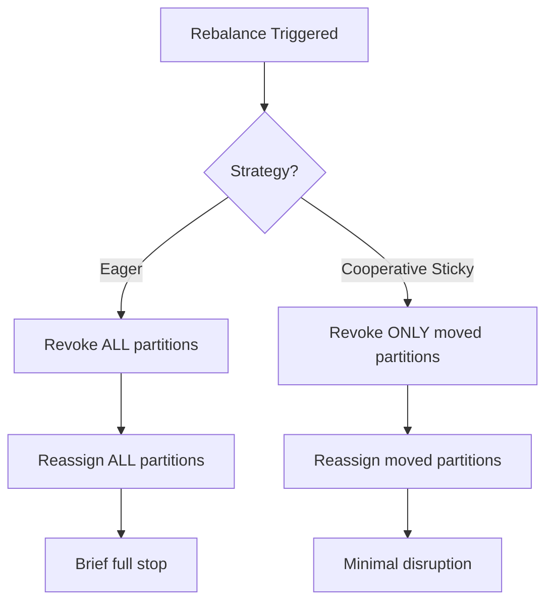

# How to Manage Kafka Consumer Groups and Offsets

Author: [nawazdhandala](https://www.github.com/nawazdhandala)

Tags: Kafka, Consumer Groups, Offsets, Message Processing, Reliability

Description: Learn how to manage Kafka consumer groups, offsets, and rebalancing for reliable message processing.

---

Consumer groups are the backbone of Kafka's scalability model. They let you distribute message processing across multiple instances while guaranteeing that each message is processed by exactly one consumer in the group. Getting consumer group management right is critical for building reliable streaming applications.

## How Consumer Groups Work

When multiple consumers share the same `group.id`, Kafka assigns each partition to exactly one consumer in that group. This means you can scale horizontally by adding more consumers, up to the number of partitions.



If you add a third consumer, Kafka rebalances:



## Understanding Offsets

Every message in a partition has a unique offset. The consumer group tracks which offset each consumer has processed. This is how Kafka knows where to resume if a consumer restarts.



## Auto-Commit vs Manual Commit

### Auto-Commit (Simple but Risky)

```python
# auto_commit_consumer.py
# Uses automatic offset commits - simple but may lose or duplicate messages
from confluent_kafka import Consumer

conf = {
    "bootstrap.servers": "localhost:9092",
    "group.id": "auto-commit-group",
    "auto.offset.reset": "earliest",
    # Auto-commit is enabled by default
    "enable.auto.commit": True,
    # Commit every 5 seconds
    "auto.commit.interval.ms": 5000,
}

consumer = Consumer(conf)
consumer.subscribe(["orders"])

try:
    while True:
        msg = consumer.poll(timeout=1.0)
        if msg is None:
            continue
        if msg.error():
            print(f"Error: {msg.error()}")
            continue
        # If the consumer crashes here, before the next auto-commit,
        # the message will be redelivered on restart
        process_order(msg.value())
except KeyboardInterrupt:
    pass
finally:
    consumer.close()
```

### Manual Commit (Recommended for Reliability)

```python
# manual_commit_consumer.py
# Uses manual offset commits for at-least-once delivery guarantee
from confluent_kafka import Consumer
import json

conf = {
    "bootstrap.servers": "localhost:9092",
    "group.id": "manual-commit-group",
    "auto.offset.reset": "earliest",
    # Disable auto-commit for manual control
    "enable.auto.commit": False,
}

consumer = Consumer(conf)
consumer.subscribe(["orders"])

# Track how many messages we have processed since last commit
message_count = 0
COMMIT_INTERVAL = 100  # Commit after every 100 messages

try:
    while True:
        msg = consumer.poll(timeout=1.0)
        if msg is None:
            continue
        if msg.error():
            print(f"Error: {msg.error()}")
            continue

        # Process the message first
        order = json.loads(msg.value().decode("utf-8"))
        save_to_database(order)

        message_count += 1

        # Commit offsets after processing a batch
        if message_count >= COMMIT_INTERVAL:
            # Synchronous commit blocks until the broker confirms
            consumer.commit(asynchronous=False)
            print(f"Committed offsets after {message_count} messages")
            message_count = 0

except KeyboardInterrupt:
    # Final commit before shutting down
    consumer.commit(asynchronous=False)
finally:
    consumer.close()
```

## Handling Rebalances

When consumers join or leave a group, Kafka triggers a rebalance. During a rebalance, no messages are delivered. You can hook into this process with a callback.

```python
# rebalance_handler.py
# Demonstrates handling partition assignment and revocation
from confluent_kafka import Consumer, TopicPartition

def on_assign(consumer, partitions):
    """Called when new partitions are assigned to this consumer."""
    partition_list = [f"{p.topic}[{p.partition}]" for p in partitions]
    print(f"Assigned partitions: {partition_list}")

def on_revoke(consumer, partitions):
    """Called when partitions are about to be revoked from this consumer."""
    partition_list = [f"{p.topic}[{p.partition}]" for p in partitions]
    print(f"Revoking partitions: {partition_list}")
    # Commit offsets for the partitions being revoked
    # This prevents duplicate processing after the rebalance
    consumer.commit(asynchronous=False)

conf = {
    "bootstrap.servers": "localhost:9092",
    "group.id": "rebalance-aware-group",
    "auto.offset.reset": "earliest",
    "enable.auto.commit": False,
    # Use cooperative rebalancing for smoother transitions
    "partition.assignment.strategy": "cooperative-sticky",
}

consumer = Consumer(conf)

# Pass the rebalance callbacks when subscribing
consumer.subscribe(
    ["orders"],
    on_assign=on_assign,
    on_revoke=on_revoke,
)
```

## Rebalance Strategies



The cooperative-sticky strategy is recommended for production because it minimizes the disruption window during rebalances.

## Inspecting Consumer Groups with CLI

```bash
# List all consumer groups
kafka-consumer-groups.sh --bootstrap-server localhost:9092 --list

# Describe a specific group to see lag per partition
kafka-consumer-groups.sh --bootstrap-server localhost:9092 \
  --group manual-commit-group --describe

# Output shows:
# GROUP              TOPIC    PARTITION  CURRENT-OFFSET  LOG-END-OFFSET  LAG
# manual-commit-group orders  0          1500            1750            250
# manual-commit-group orders  1          2000            2000            0
# manual-commit-group orders  2          1800            1900            100
```

## Resetting Offsets

Sometimes you need to reprocess messages. Kafka lets you reset offsets for a consumer group.

```bash
# Reset to the earliest offset (reprocess everything)
kafka-consumer-groups.sh --bootstrap-server localhost:9092 \
  --group manual-commit-group \
  --topic orders \
  --reset-offsets --to-earliest \
  --execute

# Reset to a specific timestamp
kafka-consumer-groups.sh --bootstrap-server localhost:9092 \
  --group manual-commit-group \
  --topic orders \
  --reset-offsets --to-datetime "2026-02-01T00:00:00.000" \
  --execute

# Shift offsets backward by 1000 messages
kafka-consumer-groups.sh --bootstrap-server localhost:9092 \
  --group manual-commit-group \
  --topic orders \
  --reset-offsets --shift-by -1000 \
  --execute
```

## Consumer Lag: The Metric That Matters

Consumer lag is the difference between the latest offset in a partition and the consumer's committed offset. Rising lag means your consumers cannot keep up with the producers.

| Lag Level | Meaning | Action |
|-----------|---------|--------|
| 0 | Fully caught up | No action needed |
| 1-100 | Normal processing delay | Monitor trends |
| 100-10000 | Falling behind | Consider scaling consumers |
| 10000+ | Significant backlog | Investigate bottlenecks |

## Best Practices

1. **Match consumers to partitions** - Size your partition count based on your expected consumer concurrency.
2. **Use cooperative-sticky rebalancing** - It reduces the pause window when group membership changes.
3. **Commit after processing** - Never commit before you have successfully handled the message.
4. **Monitor consumer lag** - Set alerts for lag thresholds so you can react before data gets stale.
5. **Set session timeouts wisely** - Too short causes unnecessary rebalances; too long delays failure detection.

## Monitoring Consumer Groups at Scale

Tracking consumer lag across dozens of topics and groups is hard without proper tooling. [OneUptime](https://oneuptime.com) lets you ingest Kafka consumer group metrics, set threshold-based alerts for rising lag, and visualize group health alongside your application performance. When a consumer falls behind, you will know immediately.
