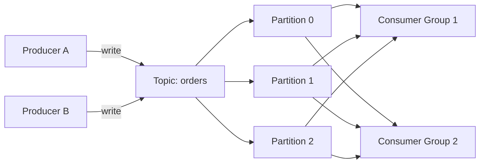
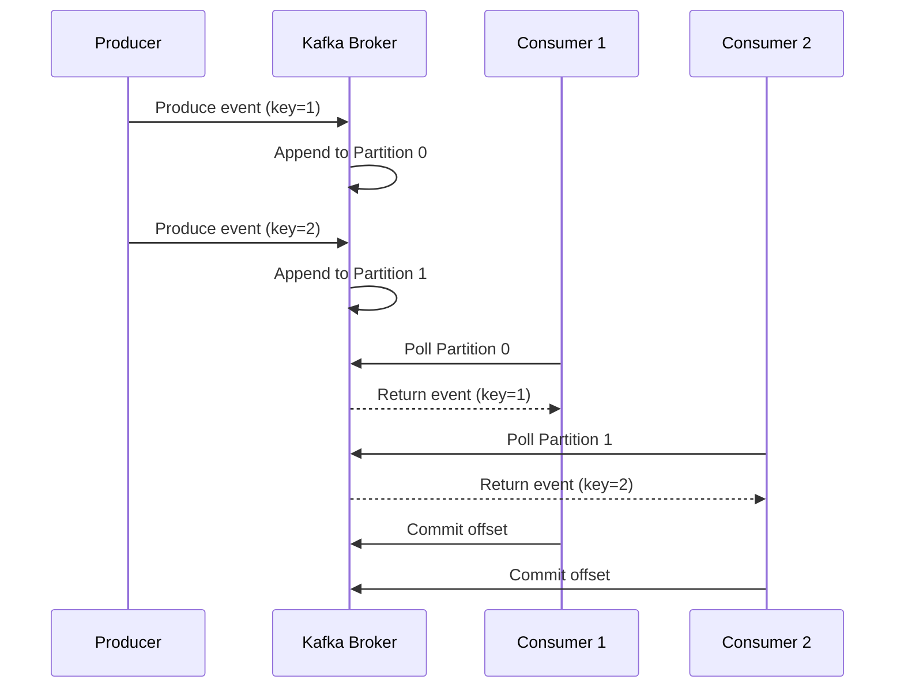

# How to Get Started with Apache Kafka for Event Streaming

Author: [nawazdhandala](https://www.github.com/nawazdhandala)

Tags: Kafka, Event Streaming, Message Queue, Distributed Systems, Apache

Description: A beginner's guide to Apache Kafka covering topics, partitions, consumer groups, and producers for event streaming.

---

Apache Kafka is an open-source distributed event streaming platform used by thousands of companies for high-performance data pipelines, streaming analytics, and mission-critical applications. This guide walks you through the core concepts and gets you producing and consuming your first messages.

## What Is Apache Kafka?

Kafka is a distributed commit log that stores events (messages) in an ordered, fault-tolerant way. Unlike traditional message queues, Kafka retains messages for a configurable period, allowing multiple consumers to read the same data independently.

## Core Concepts

Before writing any code, you need to understand five building blocks.



### Topics

A topic is a named stream of records. Think of it as a category or feed name. Producers write to topics and consumers read from them.

### Partitions

Each topic is split into one or more partitions. Partitions enable parallelism because different consumers can read from different partitions at the same time.

### Offsets

Every record within a partition gets a sequential ID called an offset. Consumers track their position using offsets so they know which messages they have already processed.

### Producers

Producers publish records to topics. They decide which partition a record goes to, either by specifying a key or letting Kafka round-robin.

### Consumer Groups

A consumer group is a set of consumers that cooperate to consume records from one or more topics. Each partition is assigned to exactly one consumer in the group.

## Installing Kafka Locally

The fastest way to start is with Docker Compose.

```yaml
# docker-compose.yml
# Spins up a single-node Kafka cluster with KRaft (no ZooKeeper)
version: "3.9"
services:
  kafka:
    image: apache/kafka:3.7.0
    ports:
      - "9092:9092"
    environment:
      # Use KRaft mode instead of ZooKeeper
      KAFKA_NODE_ID: 1
      KAFKA_PROCESS_ROLES: broker,controller
      KAFKA_LISTENERS: PLAINTEXT://0.0.0.0:9092,CONTROLLER://0.0.0.0:9093
      KAFKA_ADVERTISED_LISTENERS: PLAINTEXT://localhost:9092
      KAFKA_CONTROLLER_QUORUM_VOTERS: 1@localhost:9093
      KAFKA_CONTROLLER_LISTENER_NAMES: CONTROLLER
      KAFKA_LOG_DIRS: /tmp/kraft-combined-logs
      # Auto-create topics for development convenience
      KAFKA_AUTO_CREATE_TOPICS_ENABLE: "true"
```

Start the cluster:

```bash
# Launch Kafka in the background
docker compose up -d
```

## Creating Your First Topic

```bash
# Create a topic named "events" with 3 partitions and replication factor 1
docker exec -it kafka \
  kafka-topics.sh --create \
    --topic events \
    --partitions 3 \
    --replication-factor 1 \
    --bootstrap-server localhost:9092
```

## Producing Messages with Python

Install the client library:

```bash
pip install confluent-kafka
```

Write a simple producer:

```python
# producer.py
# Sends 10 sample events to the "events" topic
from confluent_kafka import Producer
import json
import socket

# Configure the producer with the broker address
conf = {
    "bootstrap.servers": "localhost:9092",
    "client.id": socket.gethostname(),
}

producer = Producer(conf)

def delivery_callback(err, msg):
    """Called once for each produced message to indicate delivery result."""
    if err is not None:
        print(f"Message delivery failed: {err}")
    else:
        print(f"Message delivered to {msg.topic()} [{msg.partition()}] at offset {msg.offset()}")

# Produce 10 events
for i in range(10):
    event = {"event_id": i, "type": "page_view", "url": f"/page/{i}"}
    # Serialize the event to JSON and send it
    producer.produce(
        topic="events",
        key=str(i),
        value=json.dumps(event),
        callback=delivery_callback,
    )

# Wait for all messages to be delivered
producer.flush()
print("All messages produced successfully.")
```

## Consuming Messages with Python

```python
# consumer.py
# Reads events from the "events" topic using a consumer group
from confluent_kafka import Consumer
import json

# Configure the consumer
conf = {
    "bootstrap.servers": "localhost:9092",
    "group.id": "my-first-group",
    # Start reading from the earliest available message
    "auto.offset.reset": "earliest",
}

consumer = Consumer(conf)

# Subscribe to the topic
consumer.subscribe(["events"])

try:
    while True:
        # Poll for new messages with a 1-second timeout
        msg = consumer.poll(timeout=1.0)

        if msg is None:
            # No message available within the timeout
            continue
        if msg.error():
            print(f"Consumer error: {msg.error()}")
            continue

        # Deserialize and process the message
        event = json.loads(msg.value().decode("utf-8"))
        print(f"Received event: {event} from partition {msg.partition()}")

except KeyboardInterrupt:
    pass
finally:
    # Close the consumer to commit final offsets and leave the group
    consumer.close()
```

## Message Flow Architecture



## Key Configuration Options

| Parameter | Description | Recommended |
|-----------|-------------|-------------|
| `acks` | Number of broker acknowledgments | `all` for durability |
| `retries` | Number of send retries | `3` or higher |
| `linger.ms` | Batching delay in milliseconds | `5` for throughput |
| `batch.size` | Maximum batch size in bytes | `16384` default |
| `enable.auto.commit` | Auto-commit offsets | `false` for control |

## Common Pitfalls to Avoid

1. **Too few partitions** - You cannot have more consumers than partitions in a group. Plan for growth.
2. **Large messages** - Kafka works best with messages under 1 MB. Use a reference pattern for large payloads.
3. **No key strategy** - Without a consistent key, ordering is not guaranteed. Use meaningful keys when order matters.
4. **Ignoring consumer lag** - Monitor the gap between the latest offset and the consumer's committed offset.

## Next Steps

Once you are comfortable with basic producing and consuming, explore:

- Schema Registry for enforcing message formats
- Kafka Streams for real-time stream processing
- Kafka Connect for integrating with databases and other systems

## Monitoring Your Kafka Infrastructure

Running Kafka in production requires robust monitoring. [OneUptime](https://oneuptime.com) provides comprehensive infrastructure monitoring that can track your Kafka brokers, alert on consumer lag spikes, and give you full visibility into your event streaming pipeline. With OpenTelemetry integration, you can correlate Kafka performance with your application traces and metrics in a single dashboard.
