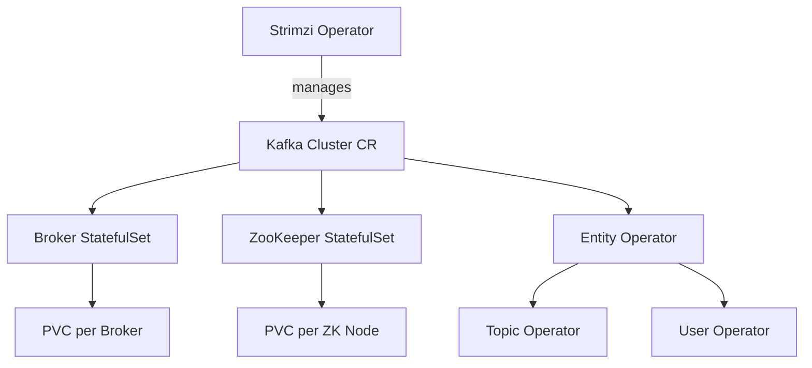
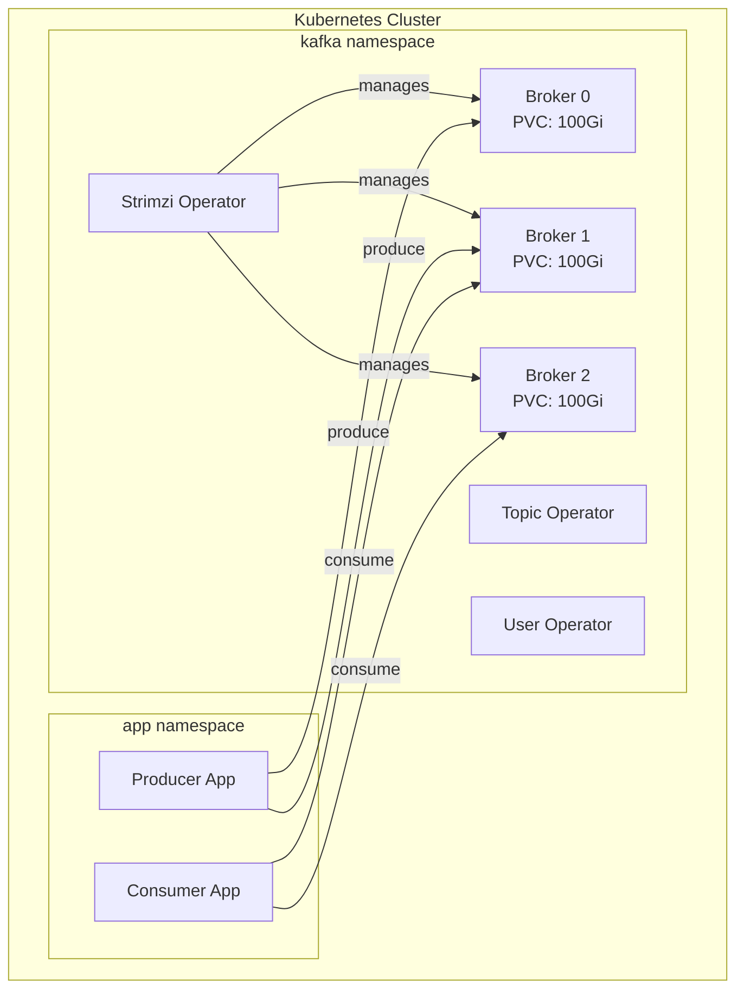

# How to Deploy Apache Kafka on Kubernetes

Author: [nawazdhandala](https://www.github.com/nawazdhandala)

Tags: Kafka, Kubernetes, Strimzi, StatefulSet, Deployment

Description: Learn how to deploy Apache Kafka on Kubernetes using Strimzi operator for production-ready message streaming.

---

Running Apache Kafka on Kubernetes gives you the elasticity and automation that modern infrastructure demands. The Strimzi operator makes this straightforward by managing Kafka clusters as native Kubernetes resources. This guide walks you through a production-grade deployment.

## Why Use an Operator for Kafka?

Kafka is a stateful, distributed system. Deploying it with plain Kubernetes manifests means you have to handle broker identity, persistent storage, rolling upgrades, and TLS configuration manually. The Strimzi operator automates all of this.



## Prerequisites

Before you begin, make sure you have:

- A Kubernetes cluster (v1.25 or later)
- `kubectl` configured to talk to your cluster
- `helm` v3 installed
- A StorageClass that supports dynamic provisioning

## Step 1: Install the Strimzi Operator

```bash
# Add the Strimzi Helm repository
helm repo add strimzi https://strimzi.io/charts/
helm repo update

# Install the operator into the "kafka" namespace
kubectl create namespace kafka

helm install strimzi-kafka-operator strimzi/strimzi-kafka-operator \
  --namespace kafka \
  --set watchNamespaces="{kafka}" \
  --version 0.44.0
```

Verify the operator is running:

```bash
# Check that the operator pod is ready
kubectl get pods -n kafka -l name=strimzi-cluster-operator
```

## Step 2: Create a Kafka Cluster

Define the cluster using a Custom Resource:

```yaml
# kafka-cluster.yaml
# Deploys a 3-broker Kafka cluster with KRaft mode (no ZooKeeper)
apiVersion: kafka.strimzi.io/v1beta2
kind: Kafka
metadata:
  name: production-cluster
  namespace: kafka
spec:
  kafka:
    version: 3.7.0
    replicas: 3
    listeners:
      # Internal listener for in-cluster communication
      - name: plain
        port: 9092
        type: internal
        tls: false
      # TLS listener for secure communication
      - name: tls
        port: 9093
        type: internal
        tls: true
    config:
      # Use 3 partitions by default for new topics
      num.partitions: 3
      # Replication factor for internal topics
      default.replication.factor: 3
      min.insync.replicas: 2
      # Log retention set to 7 days
      log.retention.hours: 168
      # Segment size of 1 GB
      log.segment.bytes: 1073741824
    storage:
      type: persistent-claim
      size: 100Gi
      class: standard
      deleteClaim: false
    resources:
      requests:
        memory: 2Gi
        cpu: "500m"
      limits:
        memory: 4Gi
        cpu: "2"
    # JVM options for the brokers
    jvmOptions:
      -Xms: 1024m
      -Xmx: 2048m
    metricsConfig:
      type: jmxPrometheusExporter
      valueFrom:
        configMapKeyRef:
          name: kafka-metrics
          key: kafka-metrics-config.yml
  # Entity operator manages topics and users
  entityOperator:
    topicOperator: {}
    userOperator: {}
```

Apply it:

```bash
# Create the Kafka cluster
kubectl apply -f kafka-cluster.yaml

# Watch the cluster come up (takes a few minutes)
kubectl get kafka -n kafka -w
```

## Step 3: Create Topics with CRDs

```yaml
# kafka-topic.yaml
# Defines a topic as a Kubernetes resource
apiVersion: kafka.strimzi.io/v1beta2
kind: KafkaTopic
metadata:
  name: user-events
  namespace: kafka
  labels:
    # Link this topic to our cluster
    strimzi.io/cluster: production-cluster
spec:
  partitions: 6
  replicas: 3
  config:
    retention.ms: 604800000        # 7 days
    cleanup.policy: delete
    max.message.bytes: 1048576     # 1 MB
    min.insync.replicas: 2
```

```bash
# Apply the topic definition
kubectl apply -f kafka-topic.yaml

# Verify the topic was created
kubectl get kafkatopics -n kafka
```

## Step 4: Configure Authentication

```yaml
# kafka-user.yaml
# Creates a user with SCRAM-SHA-512 authentication
apiVersion: kafka.strimzi.io/v1beta2
kind: KafkaUser
metadata:
  name: app-producer
  namespace: kafka
  labels:
    strimzi.io/cluster: production-cluster
spec:
  authentication:
    type: scram-sha-512
  authorization:
    type: simple
    acls:
      # Allow producing to user-events topic
      - resource:
          type: topic
          name: user-events
          patternType: literal
        operations:
          - Write
          - Describe
        host: "*"
```

## Deployment Architecture



## Step 5: Connect an Application

```python
# app.py
# Producer that connects to Kafka inside Kubernetes
from confluent_kafka import Producer
import json

# Use the internal Kubernetes service DNS name
conf = {
    "bootstrap.servers": "production-cluster-kafka-bootstrap.kafka.svc.cluster.local:9092",
    "client.id": "k8s-producer",
    # Enable idempotent producer for exactly-once semantics
    "enable.idempotence": True,
    "acks": "all",
}

producer = Producer(conf)

# Send a sample event
event = {"user_id": "u-123", "action": "login"}
producer.produce(
    topic="user-events",
    key="u-123",
    value=json.dumps(event),
)
producer.flush()
print("Event sent successfully")
```

## Step 6: Set Up Monitoring

Create the metrics ConfigMap referenced in the Kafka CR:

```yaml
# kafka-metrics-configmap.yaml
# JMX exporter configuration for Prometheus scraping
apiVersion: v1
kind: ConfigMap
metadata:
  name: kafka-metrics
  namespace: kafka
data:
  kafka-metrics-config.yml: |
    lowercaseOutputName: true
    rules:
      # Broker-level metrics
      - pattern: "kafka.server<type=BrokerTopicMetrics, name=(MessagesInPerSec|BytesInPerSec|BytesOutPerSec)><>(Count)"
        name: "kafka_server_broker_topic_metrics_$1_total"
        type: COUNTER
      # Partition-level metrics
      - pattern: "kafka.log<type=Log, name=Size, topic=(.+), partition=(.+)><>Value"
        name: "kafka_log_size"
        labels:
          topic: "$1"
          partition: "$2"
```

## Production Checklist

| Item | Recommendation |
|------|---------------|
| Broker count | Minimum 3 for fault tolerance |
| Replication factor | 3 with min.insync.replicas=2 |
| Storage | Persistent volumes with SSD-backed StorageClass |
| Resources | At least 2Gi memory per broker |
| Network policies | Restrict access to the kafka namespace |
| TLS | Enable for all external listeners |
| Monitoring | JMX exporter plus Prometheus and Grafana |

## Scaling the Cluster

```bash
# Scale from 3 to 5 brokers by editing the CR
kubectl patch kafka production-cluster -n kafka --type merge \
  -p '{"spec":{"kafka":{"replicas":5}}}'

# The operator handles partition reassignment automatically
kubectl get pods -n kafka -l strimzi.io/name=production-cluster-kafka -w
```

## Monitoring Your Kafka on Kubernetes

Operating Kafka on Kubernetes introduces layers of complexity. [OneUptime](https://oneuptime.com) helps you monitor both the Kubernetes infrastructure and the Kafka brokers running on it. Set up alerts for pod restarts, persistent volume usage, and consumer lag so you catch problems before they affect your users.
