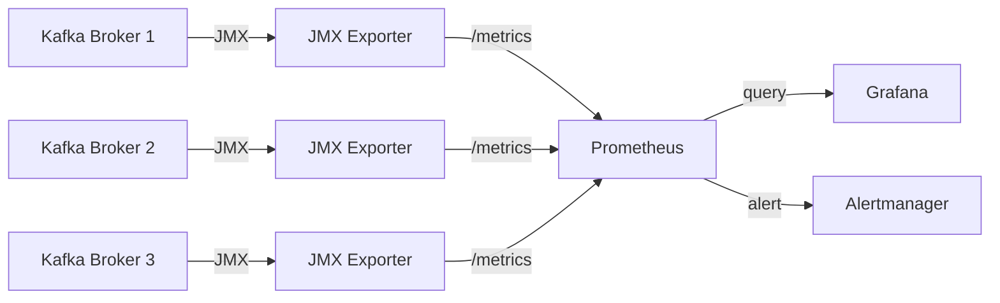
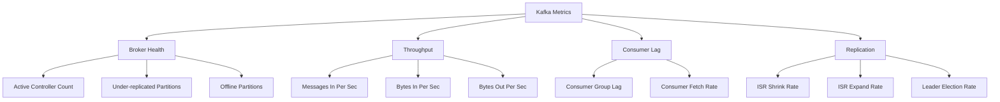

# How to Monitor Apache Kafka with Prometheus and Grafana

Author: [nawazdhandala](https://www.github.com/nawazdhandala)

Tags: Kafka, Monitoring, Prometheus, Grafana, Metrics

Description: Learn how to monitor Apache Kafka performance with Prometheus JMX exporter and Grafana dashboards.

---

Kafka exposes hundreds of metrics through JMX (Java Management Extensions). To make those metrics useful, you need to export them to a monitoring system like Prometheus and visualize them in Grafana. This guide shows you how to set up the full monitoring pipeline.

## Monitoring Architecture



The JMX Exporter runs as a Java agent inside each Kafka broker. It translates JMX MBeans into Prometheus-compatible metrics that Prometheus scrapes on a regular interval.

## Step 1: Configure the JMX Exporter

Create a configuration file that tells the exporter which metrics to expose:

```yaml
# jmx-exporter-config.yml
# Configuration for Prometheus JMX Exporter
lowercaseOutputName: true
lowercaseOutputLabelNames: true

rules:
  # Broker throughput metrics
  - pattern: "kafka.server<type=BrokerTopicMetrics, name=(MessagesInPerSec|BytesInPerSec|BytesOutPerSec), topic=(.+)><>(Count|OneMinuteRate)"
    name: "kafka_server_broker_topic_metrics_$1"
    type: GAUGE
    labels:
      topic: "$2"
      aggregate: "$3"

  # Under-replicated partitions (critical health indicator)
  - pattern: "kafka.server<type=ReplicaManager, name=UnderReplicatedPartitions><>Value"
    name: "kafka_server_under_replicated_partitions"
    type: GAUGE

  # Active controller count (should be exactly 1 across the cluster)
  - pattern: "kafka.controller<type=KafkaController, name=ActiveControllerCount><>Value"
    name: "kafka_controller_active_count"
    type: GAUGE

  # Request latency
  - pattern: "kafka.network<type=RequestMetrics, name=TotalTimeMs, request=(Produce|FetchConsumer|FetchFollower)><>(Mean|99thPercentile)"
    name: "kafka_network_request_total_time_ms"
    type: GAUGE
    labels:
      request: "$1"
      quantile: "$2"

  # Consumer group lag
  - pattern: "kafka.server<type=FetcherLagMetrics, name=ConsumerLag, clientId=(.+), topic=(.+), partition=(.+)><>Value"
    name: "kafka_consumer_lag"
    type: GAUGE
    labels:
      client_id: "$1"
      topic: "$2"
      partition: "$3"

  # Log size per partition
  - pattern: "kafka.log<type=Log, name=Size, topic=(.+), partition=(.+)><>Value"
    name: "kafka_log_size_bytes"
    type: GAUGE
    labels:
      topic: "$1"
      partition: "$2"

  # ISR (In-Sync Replicas) shrink/expand rate
  - pattern: "kafka.server<type=ReplicaManager, name=(IsrShrinksPerSec|IsrExpandsPerSec)><>Count"
    name: "kafka_server_isr_$1_total"
    type: COUNTER
```

## Step 2: Add the Exporter to Kafka

If you are using Docker, add the agent as a JVM option:

```yaml
# docker-compose.yml excerpt
services:
  kafka:
    image: apache/kafka:3.7.0
    ports:
      - "9092:9092"
      - "7071:7071"   # JMX exporter metrics port
    volumes:
      # Mount the JMX exporter jar and config
      - ./jmx_prometheus_javaagent.jar:/opt/jmx-exporter/jmx_prometheus_javaagent.jar
      - ./jmx-exporter-config.yml:/opt/jmx-exporter/config.yml
    environment:
      # Attach the JMX exporter as a Java agent
      KAFKA_OPTS: "-javaagent:/opt/jmx-exporter/jmx_prometheus_javaagent.jar=7071:/opt/jmx-exporter/config.yml"
```

## Step 3: Configure Prometheus

```yaml
# prometheus.yml
# Prometheus configuration to scrape Kafka metrics
global:
  scrape_interval: 15s
  evaluation_interval: 15s

scrape_configs:
  # Scrape Kafka broker metrics
  - job_name: "kafka"
    static_configs:
      - targets:
          - "kafka-1:7071"
          - "kafka-2:7071"
          - "kafka-3:7071"
    # Add broker label for identification
    relabel_configs:
      - source_labels: [__address__]
        regex: "(.+):7071"
        target_label: broker
        replacement: "$1"

  # Scrape Kafka Exporter for consumer group lag
  - job_name: "kafka-exporter"
    static_configs:
      - targets: ["kafka-exporter:9308"]
```

## Step 4: Add Kafka Exporter for Consumer Lag

The JMX exporter gives you broker metrics, but for consumer group lag you need the Kafka Exporter:

```yaml
# docker-compose addition for kafka-exporter
  kafka-exporter:
    image: danielqsj/kafka-exporter:v1.7.0
    command:
      # Point to Kafka brokers
      - "--kafka.server=kafka-1:9092"
      - "--kafka.server=kafka-2:9092"
      - "--kafka.server=kafka-3:9092"
    ports:
      - "9308:9308"
```

## Key Metrics to Monitor



## Step 5: Create Grafana Dashboards

### Essential Panels

```json
{
  "panels": [
    {
      "title": "Messages In Per Second",
      "targets": [
        {
          "expr": "sum(rate(kafka_server_broker_topic_metrics_messagesinpersec_count[5m])) by (topic)",
          "legendFormat": "{{topic}}"
        }
      ]
    },
    {
      "title": "Consumer Group Lag",
      "targets": [
        {
          "expr": "sum(kafka_consumergroup_lag) by (consumergroup, topic)",
          "legendFormat": "{{consumergroup}} - {{topic}}"
        }
      ]
    },
    {
      "title": "Under-Replicated Partitions",
      "targets": [
        {
          "expr": "kafka_server_under_replicated_partitions",
          "legendFormat": "{{instance}}"
        }
      ]
    },
    {
      "title": "Request Latency P99",
      "targets": [
        {
          "expr": "kafka_network_request_total_time_ms{quantile=\"99thPercentile\"}",
          "legendFormat": "{{request}} - {{instance}}"
        }
      ]
    }
  ]
}
```

## Step 6: Set Up Alerting Rules

```yaml
# kafka-alerts.yml
# Prometheus alerting rules for Kafka
groups:
  - name: kafka_alerts
    rules:
      # Alert when there are under-replicated partitions
      - alert: KafkaUnderReplicatedPartitions
        expr: kafka_server_under_replicated_partitions > 0
        for: 5m
        labels:
          severity: critical
        annotations:
          summary: "Kafka has under-replicated partitions"
          description: "Broker {{ $labels.instance }} has {{ $value }} under-replicated partitions."

      # Alert when consumer lag exceeds threshold
      - alert: KafkaConsumerLagHigh
        expr: sum(kafka_consumergroup_lag) by (consumergroup, topic) > 10000
        for: 10m
        labels:
          severity: warning
        annotations:
          summary: "Consumer group {{ $labels.consumergroup }} has high lag"
          description: "Lag on topic {{ $labels.topic }} is {{ $value }}."

      # Alert when no active controller exists
      - alert: KafkaNoActiveController
        expr: sum(kafka_controller_active_count) == 0
        for: 1m
        labels:
          severity: critical
        annotations:
          summary: "No active Kafka controller"
          description: "The Kafka cluster has no active controller. This is a critical issue."

      # Alert when broker disk usage is high
      - alert: KafkaDiskUsageHigh
        expr: sum(kafka_log_size_bytes) by (instance) > 80e9
        for: 15m
        labels:
          severity: warning
        annotations:
          summary: "Kafka broker disk usage exceeds 80 GB"
```

## Metrics Quick Reference

| Metric | What It Tells You | Alert Threshold |
|--------|-------------------|----------------|
| Under-replicated partitions | Data is at risk | > 0 for 5 min |
| Active controller count | Cluster leadership | != 1 |
| Messages in per second | Throughput trend | Depends on baseline |
| Consumer group lag | Processing backlog | > 10000 |
| ISR shrink rate | Replica falling behind | Any sustained increase |
| Request latency P99 | Broker responsiveness | > 500ms |

## End-to-End Observability with OneUptime

Prometheus and Grafana give you Kafka-specific visibility, but production systems need more. [OneUptime](https://oneuptime.com) brings together infrastructure monitoring, application traces, and incident management in one platform. You can forward your Kafka metrics through OpenTelemetry, set up on-call schedules, and create status pages so your entire team stays informed when something goes wrong with your streaming infrastructure.
