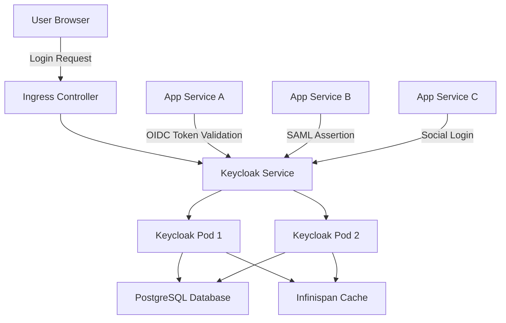
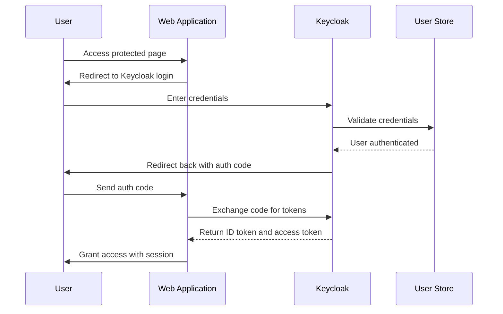

# How to Deploy Keycloak on Kubernetes for SSO

Author: [nawazdhandala](https://www.github.com/nawazdhandala)

Tags: Keycloak, Kubernetes, SSO, Authentication, Identity

Description: Learn how to deploy Keycloak on Kubernetes for single sign-on with OIDC, SAML, and social login integration.

---

Single sign-on (SSO) is a must-have for any organization running multiple internal or customer-facing applications. Keycloak is an open-source identity and access management solution that supports OIDC, SAML 2.0, and social login out of the box. Deploying it on Kubernetes gives you scalability, high availability, and seamless integration with your existing workloads.

This guide walks you through deploying Keycloak on Kubernetes, configuring realms and clients, and integrating SSO with your applications.

## Architecture Overview



## Prerequisites

Before you start, make sure you have a running Kubernetes cluster (version 1.25 or later), kubectl configured, Helm 3 installed, and a PostgreSQL database available (or you can deploy one alongside Keycloak).

## Step 1: Create a Namespace and Secrets

```bash
# Create a dedicated namespace for Keycloak
kubectl create namespace keycloak

# Create a secret for the Keycloak admin credentials
kubectl create secret generic keycloak-admin \
  --namespace keycloak \
  --from-literal=username=admin \
  --from-literal=password='YourStrongPassword123!'

# Create a secret for the PostgreSQL connection
kubectl create secret generic keycloak-db \
  --namespace keycloak \
  --from-literal=db-url='jdbc:postgresql://postgres-service:5432/keycloak' \
  --from-literal=db-username=keycloak \
  --from-literal=db-password='DbPassword456!'
```

## Step 2: Deploy PostgreSQL

```yaml
# postgres-deployment.yaml
# Deploys a PostgreSQL instance for Keycloak's persistent storage
apiVersion: apps/v1
kind: StatefulSet
metadata:
  name: postgres
  namespace: keycloak
spec:
  serviceName: postgres-service
  replicas: 1
  selector:
    matchLabels:
      app: postgres
  template:
    metadata:
      labels:
        app: postgres
    spec:
      containers:
        - name: postgres
          image: postgres:16-alpine
          ports:
            - containerPort: 5432
          env:
            # Database name that Keycloak will use
            - name: POSTGRES_DB
              value: keycloak
            # Database user for Keycloak connections
            - name: POSTGRES_USER
              valueFrom:
                secretKeyRef:
                  name: keycloak-db
                  key: db-username
            # Database password pulled from the secret
            - name: POSTGRES_PASSWORD
              valueFrom:
                secretKeyRef:
                  name: keycloak-db
                  key: db-password
          volumeMounts:
            - name: postgres-data
              mountPath: /var/lib/postgresql/data
  volumeClaimTemplates:
    - metadata:
        name: postgres-data
      spec:
        accessModes: ["ReadWriteOnce"]
        resources:
          requests:
            storage: 10Gi
---
# Service to expose PostgreSQL within the cluster
apiVersion: v1
kind: Service
metadata:
  name: postgres-service
  namespace: keycloak
spec:
  selector:
    app: postgres
  ports:
    - port: 5432
      targetPort: 5432
  clusterIP: None
```

## Step 3: Deploy Keycloak

```yaml
# keycloak-deployment.yaml
# Deploys Keycloak with two replicas for high availability
apiVersion: apps/v1
kind: Deployment
metadata:
  name: keycloak
  namespace: keycloak
spec:
  replicas: 2
  selector:
    matchLabels:
      app: keycloak
  template:
    metadata:
      labels:
        app: keycloak
    spec:
      containers:
        - name: keycloak
          image: quay.io/keycloak/keycloak:24.0
          args: ["start"]
          ports:
            - containerPort: 8080
          env:
            # Admin username from secret
            - name: KEYCLOAK_ADMIN
              valueFrom:
                secretKeyRef:
                  name: keycloak-admin
                  key: username
            # Admin password from secret
            - name: KEYCLOAK_ADMIN_PASSWORD
              valueFrom:
                secretKeyRef:
                  name: keycloak-admin
                  key: password
            # PostgreSQL connection settings
            - name: KC_DB
              value: postgres
            - name: KC_DB_URL
              valueFrom:
                secretKeyRef:
                  name: keycloak-db
                  key: db-url
            - name: KC_DB_USERNAME
              valueFrom:
                secretKeyRef:
                  name: keycloak-db
                  key: db-username
            - name: KC_DB_PASSWORD
              valueFrom:
                secretKeyRef:
                  name: keycloak-db
                  key: db-password
            # Enable health and metrics endpoints
            - name: KC_HEALTH_ENABLED
              value: "true"
            - name: KC_METRICS_ENABLED
              value: "true"
            # Set the hostname for Keycloak
            - name: KC_HOSTNAME
              value: "keycloak.example.com"
            # Enable proxy edge mode for TLS termination at ingress
            - name: KC_PROXY
              value: "edge"
          # Readiness probe to check Keycloak health
          readinessProbe:
            httpGet:
              path: /health/ready
              port: 8080
            initialDelaySeconds: 30
            periodSeconds: 10
          # Liveness probe for automatic restart on failure
          livenessProbe:
            httpGet:
              path: /health/live
              port: 8080
            initialDelaySeconds: 60
            periodSeconds: 30
          resources:
            requests:
              cpu: 500m
              memory: 512Mi
            limits:
              cpu: "2"
              memory: 2Gi
```

## Step 4: Create Service and Ingress

```yaml
# keycloak-service.yaml
# Exposes Keycloak pods via a ClusterIP service
apiVersion: v1
kind: Service
metadata:
  name: keycloak-service
  namespace: keycloak
spec:
  selector:
    app: keycloak
  ports:
    - port: 80
      targetPort: 8080
      protocol: TCP
---
# Ingress resource for external access with TLS
apiVersion: networking.k8s.io/v1
kind: Ingress
metadata:
  name: keycloak-ingress
  namespace: keycloak
  annotations:
    # Use cert-manager for automatic TLS certificates
    cert-manager.io/cluster-issuer: letsencrypt-prod
spec:
  ingressClassName: nginx
  tls:
    - hosts:
        - keycloak.example.com
      secretName: keycloak-tls
  rules:
    - host: keycloak.example.com
      http:
        paths:
          - path: /
            pathType: Prefix
            backend:
              service:
                name: keycloak-service
                port:
                  number: 80
```

## Step 5: Configure a Realm and OIDC Client

Once Keycloak is running, create a realm and an OIDC client. You can do this through the admin console at `https://keycloak.example.com` or by using the Keycloak REST API.

```bash
# Obtain an admin token from Keycloak
TOKEN=$(curl -s -X POST \
  "https://keycloak.example.com/realms/master/protocol/openid-connect/token" \
  -d "client_id=admin-cli" \
  -d "username=admin" \
  -d "password=YourStrongPassword123!" \
  -d "grant_type=password" | jq -r '.access_token')

# Create a new realm called "myorg"
curl -s -X POST \
  "https://keycloak.example.com/admin/realms" \
  -H "Authorization: Bearer $TOKEN" \
  -H "Content-Type: application/json" \
  -d '{
    "realm": "myorg",
    "enabled": true,
    "sslRequired": "external",
    "registrationAllowed": true
  }'

# Create an OIDC client for your application
curl -s -X POST \
  "https://keycloak.example.com/admin/realms/myorg/clients" \
  -H "Authorization: Bearer $TOKEN" \
  -H "Content-Type: application/json" \
  -d '{
    "clientId": "my-web-app",
    "enabled": true,
    "protocol": "openid-connect",
    "publicClient": false,
    "redirectUris": ["https://myapp.example.com/callback"],
    "webOrigins": ["https://myapp.example.com"]
  }'
```

## SSO Authentication Flow



## Step 6: Integrate with Your Application

```python
# app.py
# A minimal Flask application integrated with Keycloak via OIDC
from flask import Flask, redirect, session, url_for
from authlib.integrations.flask_client import OAuth

app = Flask(__name__)
app.secret_key = "your-secret-key"

# Configure the OIDC client to talk to Keycloak
oauth = OAuth(app)
keycloak = oauth.register(
    name="keycloak",
    client_id="my-web-app",
    client_secret="your-client-secret",
    # Discovery endpoint for automatic OIDC configuration
    server_metadata_url="https://keycloak.example.com/realms/myorg/.well-known/openid-configuration",
    client_kwargs={"scope": "openid email profile"},
)

@app.route("/")
def home():
    """Home page that shows login status."""
    user = session.get("user")
    if user:
        return f"Hello, {user['preferred_username']}!"
    return '<a href="/login">Login with Keycloak</a>'

@app.route("/login")
def login():
    """Redirect the user to Keycloak for authentication."""
    redirect_uri = url_for("callback", _external=True)
    return keycloak.authorize_redirect(redirect_uri)

@app.route("/callback")
def callback():
    """Handle the callback from Keycloak after authentication."""
    # Exchange the authorization code for tokens
    token = keycloak.authorize_access_token()
    # Store user info in the session
    session["user"] = token["userinfo"]
    return redirect("/")

if __name__ == "__main__":
    app.run(host="0.0.0.0", port=5000)
```

## High Availability Considerations

When running Keycloak in production with multiple replicas, you need distributed caching. Keycloak uses Infinispan internally for session caching. In Kubernetes, enable JGroups DNS_PING for cluster discovery:

```yaml
# Add these environment variables to the Keycloak deployment
# for automatic cluster member discovery via DNS
- name: KC_CACHE
  value: "ispn"
- name: KC_CACHE_STACK
  value: "kubernetes"
- name: JAVA_OPTS_APPEND
  value: "-Djgroups.dns.query=keycloak-service.keycloak.svc.cluster.local"
```

This ensures that all Keycloak pods discover each other and share session data, so users remain logged in regardless of which pod handles their request.

## Monitoring and Observability

Keycloak exposes Prometheus-compatible metrics at `/metrics` when `KC_METRICS_ENABLED` is set to `true`. You can scrape these metrics to track login success rates, token issuance counts, and session durations.

For comprehensive monitoring of your Keycloak deployment and the applications that depend on it, consider using [OneUptime](https://oneuptime.com). OneUptime provides uptime monitoring, alerting, and incident management so you can detect authentication outages before they impact your users. You can set up HTTP monitors to check Keycloak's health endpoints and receive alerts through Slack, email, or PagerDuty when something goes wrong.
