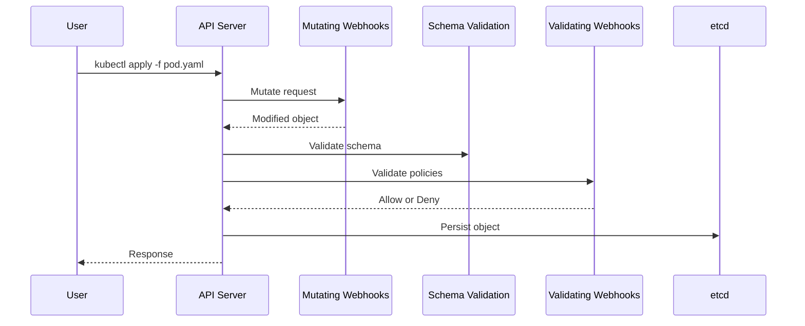
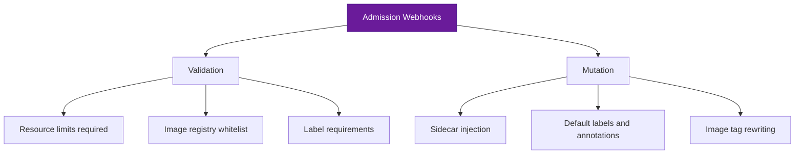

# How to Build Kubernetes Admission Webhooks

Author: [nawazdhandala](https://www.github.com/nawazdhandala)

Tags: Kubernetes, Admission Webhooks, Validation, Mutation, Security

Description: Learn how to build Kubernetes validating and mutating admission webhooks for custom policy enforcement.

---

Kubernetes admission webhooks let you intercept and modify or reject API requests before objects are persisted. They are the standard mechanism for enforcing custom policies, injecting sidecars, setting defaults, and validating resource configurations. This guide walks through building both validating and mutating admission webhooks from scratch.

## How Admission Control Works

When you create, update, or delete a Kubernetes resource, the API server processes the request through an admission control chain. Webhooks fit into this chain at two points:



**Mutating webhooks** run first and can modify the request. **Validating webhooks** run second and can only accept or reject the request.

## Building a Validating Webhook

Let us build a webhook that enforces a policy: all Pods must have resource limits set.

### The Webhook Server

```python
from flask import Flask, request, jsonify
import json
import base64

app = Flask(__name__)

@app.route("/validate", methods=["POST"])
def validate():
    """
    Validating webhook endpoint.
    Receives an AdmissionReview request and returns allow/deny.
    """
    # Parse the AdmissionReview request from the API server
    admission_review = request.get_json()
    admission_request = admission_review["request"]

    # Extract the Pod spec from the request
    pod_spec = admission_request["object"]["spec"]
    pod_name = admission_request["object"]["metadata"].get("name", "unknown")

    # Check every container in the pod for resource limits
    errors = []
    for container in pod_spec.get("containers", []):
        container_name = container.get("name", "unnamed")
        resources = container.get("resources", {})
        limits = resources.get("limits", {})

        # Validate that CPU limits are set
        if "cpu" not in limits:
            errors.append(
                f"Container '{container_name}' is missing CPU limits"
            )

        # Validate that memory limits are set
        if "memory" not in limits:
            errors.append(
                f"Container '{container_name}' is missing memory limits"
            )

    # Build the AdmissionReview response
    allowed = len(errors) == 0
    response = {
        "apiVersion": "admission.k8s.io/v1",
        "kind": "AdmissionReview",
        "response": {
            "uid": admission_request["uid"],
            "allowed": allowed,
        }
    }

    # Include the rejection reason if validation failed
    if not allowed:
        response["response"]["status"] = {
            "code": 403,
            "message": "; ".join(errors)
        }

    return jsonify(response)


if __name__ == "__main__":
    # Webhooks must serve over HTTPS
    app.run(
        host="0.0.0.0",
        port=8443,
        ssl_context=("/certs/tls.crt", "/certs/tls.key")
    )
```

## Building a Mutating Webhook

Mutating webhooks modify the request object. A common use case is injecting sidecar containers, adding labels, or setting defaults.

```python
import copy
import json
import base64
from flask import Flask, request, jsonify

app = Flask(__name__)

@app.route("/mutate", methods=["POST"])
def mutate():
    """
    Mutating webhook endpoint.
    Adds default resource requests and labels to pods.
    """
    admission_review = request.get_json()
    admission_request = admission_review["request"]

    pod = admission_request["object"]
    patches = []

    # Patch 1: Add a team label if not present
    labels = pod["metadata"].get("labels", {})
    if "team" not in labels:
        if "labels" not in pod["metadata"]:
            # Create the labels field if it does not exist
            patches.append({
                "op": "add",
                "path": "/metadata/labels",
                "value": {}
            })
        patches.append({
            "op": "add",
            "path": "/metadata/labels/team",
            "value": "default"
        })

    # Patch 2: Add default resource requests to containers
    containers = pod["spec"].get("containers", [])
    for i, container in enumerate(containers):
        resources = container.get("resources", {})

        if "requests" not in resources:
            # Set default resource requests for containers that lack them
            if "resources" not in container:
                patches.append({
                    "op": "add",
                    "path": f"/spec/containers/{i}/resources",
                    "value": {}
                })
            patches.append({
                "op": "add",
                "path": f"/spec/containers/{i}/resources/requests",
                "value": {
                    "cpu": "100m",
                    "memory": "128Mi"
                }
            })

    # Build the response with a JSON Patch
    response = {
        "apiVersion": "admission.k8s.io/v1",
        "kind": "AdmissionReview",
        "response": {
            "uid": admission_request["uid"],
            "allowed": True,
        }
    }

    # Attach the patch if there are modifications
    if patches:
        response["response"]["patchType"] = "JSONPatch"
        response["response"]["patch"] = base64.b64encode(
            json.dumps(patches).encode()
        ).decode()

    return jsonify(response)
```

## Deploying the Webhook

### Dockerfile

```dockerfile
FROM python:3.12-slim

WORKDIR /app

# Install dependencies
COPY requirements.txt .
RUN pip install --no-cache-dir flask

COPY webhook.py .

# The certs will be mounted as a volume
CMD ["python", "webhook.py"]
```

### Kubernetes Manifests

```yaml
# deployment.yaml
apiVersion: apps/v1
kind: Deployment
metadata:
  name: admission-webhook
  namespace: webhook-system
spec:
  replicas: 2
  selector:
    matchLabels:
      app: admission-webhook
  template:
    metadata:
      labels:
        app: admission-webhook
    spec:
      containers:
        - name: webhook
          image: admission-webhook:latest
          ports:
            - containerPort: 8443
          volumeMounts:
            # Mount TLS certificates for HTTPS
            - name: tls-certs
              mountPath: /certs
              readOnly: true
          resources:
            requests:
              cpu: 50m
              memory: 64Mi
            limits:
              cpu: 200m
              memory: 128Mi
      volumes:
        - name: tls-certs
          secret:
            secretName: webhook-tls
---
# service.yaml
apiVersion: v1
kind: Service
metadata:
  name: admission-webhook
  namespace: webhook-system
spec:
  selector:
    app: admission-webhook
  ports:
    - port: 443
      targetPort: 8443
```

### Webhook Configuration

```yaml
# validating-webhook-config.yaml
apiVersion: admissionregistration.k8s.io/v1
kind: ValidatingWebhookConfiguration
metadata:
  name: resource-limits-validator
webhooks:
  - name: validate.resource-limits.example.com
    admissionReviewVersions: ["v1"]
    sideEffects: None
    # Only intercept Pod creation and updates
    rules:
      - apiGroups: [""]
        apiVersions: ["v1"]
        operations: ["CREATE", "UPDATE"]
        resources: ["pods"]
    clientConfig:
      service:
        name: admission-webhook
        namespace: webhook-system
        path: /validate
      # CA bundle for verifying the webhook's TLS certificate
      caBundle: <BASE64_ENCODED_CA_CERT>
    # Do not block the API server if the webhook is unavailable
    failurePolicy: Ignore
    # Only apply to namespaces with this label
    namespaceSelector:
      matchLabels:
        webhook-enabled: "true"
```

## Generating TLS Certificates

```bash
#!/bin/bash
# generate-certs.sh
# Creates a self-signed CA and webhook server certificate

set -euo pipefail

SERVICE="admission-webhook"
NAMESPACE="webhook-system"

# Generate CA private key and certificate
openssl genrsa -out ca.key 2048
openssl req -new -x509 -days 365 -key ca.key -out ca.crt \
    -subj "/CN=Admission Webhook CA"

# Generate server private key
openssl genrsa -out server.key 2048

# Create a CSR with the correct service DNS name
openssl req -new -key server.key -out server.csr \
    -subj "/CN=${SERVICE}.${NAMESPACE}.svc" \
    -addext "subjectAltName=DNS:${SERVICE}.${NAMESPACE}.svc"

# Sign the server certificate with the CA
openssl x509 -req -in server.csr -CA ca.crt -CAkey ca.key \
    -CAcreateserial -out server.crt -days 365 \
    -extfile <(echo "subjectAltName=DNS:${SERVICE}.${NAMESPACE}.svc")

# Create the Kubernetes secret with the TLS certificate
kubectl create secret tls webhook-tls \
    --cert=server.crt \
    --key=server.key \
    -n "${NAMESPACE}"

# Output the CA bundle for the webhook configuration
echo "CA Bundle (base64):"
cat ca.crt | base64 | tr -d '\n'
```

## Testing the Webhook

```bash
# Test the validating webhook - this pod should be rejected
# because it lacks resource limits
kubectl run test-no-limits --image=nginx --restart=Never

# Expected output:
# Error from server: admission webhook "validate.resource-limits.example.com"
# denied the request: Container 'test-no-limits' is missing CPU limits;
# Container 'test-no-limits' is missing memory limits

# This pod should pass validation
kubectl run test-with-limits --image=nginx --restart=Never \
    --limits="cpu=500m,memory=256Mi"
```

## Common Webhook Patterns



## Best Practices

- Set `failurePolicy: Ignore` for non-critical webhooks to avoid blocking the API server
- Use `namespaceSelector` to exclude system namespaces like `kube-system`
- Keep webhook logic fast - the API server waits for a response
- Deploy webhooks with multiple replicas for high availability
- Monitor webhook latency and error rates carefully

OneUptime helps you monitor the health of your admission webhooks. Track response latency, error rates, and denial rates to ensure your webhooks are performing correctly. Set up alerts when webhook latency exceeds acceptable thresholds or when unexpected denial spikes occur. Visit [https://oneuptime.com](https://oneuptime.com) to monitor your Kubernetes admission control infrastructure.
