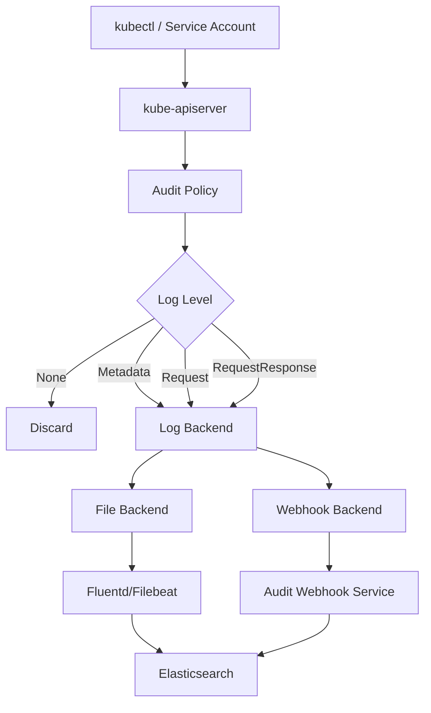
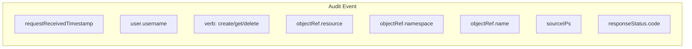
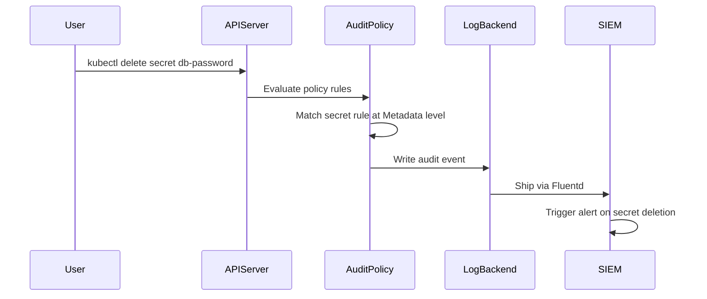

# How to Configure Kubernetes Audit Logging

Author: [nawazdhandala](https://www.github.com/nawazdhandala)

Tags: Kubernetes, Audit Logging, Security, Compliance, Monitoring

Description: Learn how to configure Kubernetes audit logging for security monitoring, compliance, and troubleshooting API activity.

---

Every request to the Kubernetes API server can be logged. Who created that secret? Who deleted that deployment? Which service account is making thousands of list calls per minute? Audit logging answers these questions. It is essential for security investigations, compliance requirements, and debugging unexpected cluster behavior.

This guide covers configuring the audit policy, setting up log backends, and building useful queries.

## Audit Logging Architecture



## Audit Policy Levels

Kubernetes defines four audit levels:

- **None** - do not log the event.
- **Metadata** - log the request metadata (user, timestamp, resource, verb) but not the request or response body.
- **Request** - log metadata and the request body, but not the response body.
- **RequestResponse** - log everything including the full response body. Use sparingly due to volume.

## Audit Policy File

```yaml
# audit-policy.yaml
# Defines what API events to log and at what detail level
apiVersion: audit.k8s.io/v1
kind: Policy
rules:
  # Do not log read-only requests to health endpoints
  # These generate enormous volume with no security value
  - level: None
    nonResourceURLs:
      - /healthz*
      - /readyz*
      - /livez*
      - /metrics

  # Do not log requests from system components
  # These are internal cluster operations
  - level: None
    users:
      - system:kube-proxy
      - system:kube-scheduler
      - system:kube-controller-manager

  # Log secret access at the Metadata level
  # Captures who accessed which secret but not the secret data
  - level: Metadata
    resources:
      - group: ""
        resources: ["secrets"]

  # Log changes to RBAC at RequestResponse level
  # Full audit trail for permission changes
  - level: RequestResponse
    resources:
      - group: "rbac.authorization.k8s.io"
        resources:
          - clusterroles
          - clusterrolebindings
          - roles
          - rolebindings

  # Log pod exec and attach at Request level
  # Captures who opened a shell into which pod
  - level: Request
    resources:
      - group: ""
        resources: ["pods/exec", "pods/attach", "pods/portforward"]

  # Log all write operations at Request level
  - level: Request
    verbs: ["create", "update", "patch", "delete"]
    resources:
      - group: ""
      - group: "apps"
      - group: "batch"

  # Log everything else at Metadata level
  - level: Metadata
    omitStages:
      - RequestReceived
```

## Configuring the API Server

Add audit flags to the kube-apiserver manifest.

```yaml
# kube-apiserver-audit-config.yaml
# Add these flags to the kube-apiserver static pod manifest
# Located at /etc/kubernetes/manifests/kube-apiserver.yaml
apiVersion: v1
kind: Pod
metadata:
  name: kube-apiserver
  namespace: kube-system
spec:
  containers:
    - name: kube-apiserver
      command:
        - kube-apiserver
        # Existing flags...
        # Point to the audit policy file
        - --audit-policy-file=/etc/kubernetes/audit/audit-policy.yaml
        # Write audit events to a log file
        - --audit-log-path=/var/log/kubernetes/audit/audit.log
        # Rotate after 100 MB
        - --audit-log-maxsize=100
        # Keep 10 rotated files
        - --audit-log-maxbackup=10
        # Rotate daily
        - --audit-log-maxage=30
      volumeMounts:
        # Mount the audit policy
        - name: audit-policy
          mountPath: /etc/kubernetes/audit
          readOnly: true
        # Mount the log output directory
        - name: audit-logs
          mountPath: /var/log/kubernetes/audit
  volumes:
    - name: audit-policy
      hostPath:
        path: /etc/kubernetes/audit
        type: DirectoryOrCreate
    - name: audit-logs
      hostPath:
        path: /var/log/kubernetes/audit
        type: DirectoryOrCreate
```

## Webhook Backend for Real-Time Processing

```yaml
# audit-webhook-config.yaml
# Sends audit events to an external service in real time
apiVersion: v1
kind: Config
clusters:
  - name: audit-webhook
    cluster:
      # URL of the audit event receiver
      server: https://audit-collector.monitoring.svc.cluster.local:8443/audit
      certificate-authority: /etc/kubernetes/pki/audit-webhook-ca.crt
contexts:
  - name: audit-webhook
    context:
      cluster: audit-webhook
current-context: audit-webhook
```

Enable it by adding to the API server flags:

```
--audit-webhook-config-file=/etc/kubernetes/audit/webhook-config.yaml
--audit-webhook-batch-max-size=100
--audit-webhook-batch-max-wait=5s
```

## Audit Event Structure



## Processing Audit Logs with Python

```python
# audit_analyzer.py
# Parses Kubernetes audit logs and extracts security-relevant events
# Outputs a summary of suspicious activity

import json
import sys
from collections import defaultdict
from datetime import datetime


def parse_audit_log(filepath):
    """Read and parse a JSON-lines audit log file."""
    events = []
    with open(filepath, "r") as f:
        for line in f:
            line = line.strip()
            if not line:
                continue
            try:
                event = json.loads(line)
                events.append(event)
            except json.JSONDecodeError:
                continue
    return events


def find_secret_access(events):
    """Find all secret access events."""
    secret_events = []
    for event in events:
        obj_ref = event.get("objectRef", {})
        if obj_ref.get("resource") == "secrets":
            secret_events.append(
                {
                    "time": event.get("requestReceivedTimestamp"),
                    "user": event.get("user", {}).get("username"),
                    "verb": event.get("verb"),
                    "namespace": obj_ref.get("namespace"),
                    "name": obj_ref.get("name"),
                }
            )
    return secret_events


def find_rbac_changes(events):
    """Find all RBAC modification events."""
    rbac_resources = {
        "clusterroles",
        "clusterrolebindings",
        "roles",
        "rolebindings",
    }
    changes = []
    for event in events:
        obj_ref = event.get("objectRef", {})
        if (
            obj_ref.get("resource") in rbac_resources
            and event.get("verb") in ("create", "update", "patch", "delete")
        ):
            changes.append(
                {
                    "time": event.get("requestReceivedTimestamp"),
                    "user": event.get("user", {}).get("username"),
                    "verb": event.get("verb"),
                    "resource": obj_ref.get("resource"),
                    "name": obj_ref.get("name"),
                }
            )
    return changes


def find_exec_sessions(events):
    """Find all pod exec/attach sessions."""
    exec_events = []
    for event in events:
        obj_ref = event.get("objectRef", {})
        if obj_ref.get("subresource") in ("exec", "attach"):
            exec_events.append(
                {
                    "time": event.get("requestReceivedTimestamp"),
                    "user": event.get("user", {}).get("username"),
                    "namespace": obj_ref.get("namespace"),
                    "pod": obj_ref.get("name"),
                    "source_ip": event.get("sourceIPs", ["unknown"])[0],
                }
            )
    return exec_events


def main():
    if len(sys.argv) < 2:
        print("Usage: python audit_analyzer.py <audit-log-file>")
        sys.exit(1)

    events = parse_audit_log(sys.argv[1])
    print(f"Total audit events: {len(events)}")

    secrets = find_secret_access(events)
    print(f"\nSecret access events: {len(secrets)}")
    for s in secrets[:10]:
        print(f"  {s['time']} - {s['user']} {s['verb']} {s['namespace']}/{s['name']}")

    rbac = find_rbac_changes(events)
    print(f"\nRBAC changes: {len(rbac)}")
    for r in rbac:
        print(f"  {r['time']} - {r['user']} {r['verb']} {r['resource']}/{r['name']}")

    execs = find_exec_sessions(events)
    print(f"\nPod exec sessions: {len(execs)}")
    for e in execs:
        print(f"  {e['time']} - {e['user']} exec into {e['namespace']}/{e['pod']} from {e['source_ip']}")


if __name__ == "__main__":
    main()
```

## Audit Event Flow



## Key Takeaways

- Start with a targeted audit policy. Logging everything at RequestResponse level will overwhelm your storage and slow down the API server.
- Always log secret access, RBAC changes, and pod exec sessions. These are the most security-sensitive operations.
- Exclude high-volume, low-value requests like health checks and system component activity.
- Ship audit logs to a centralized system outside the cluster. Logs stored only on the control plane node are lost if the node fails.
- Review audit logs regularly, not just during incidents.

Audit logs are your forensic record of everything that happens in the cluster. Use [OneUptime](https://oneuptime.com) to monitor audit log pipelines, alert on suspicious patterns like unexpected RBAC changes or secret access from unknown IPs, and ensure your compliance posture stays intact.
