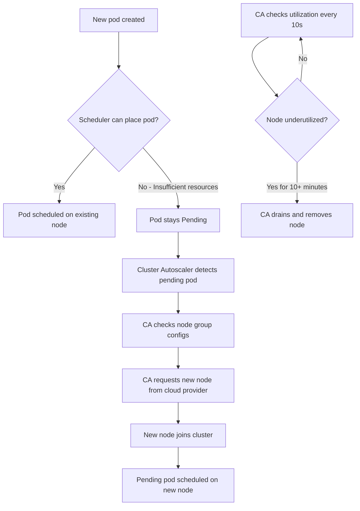
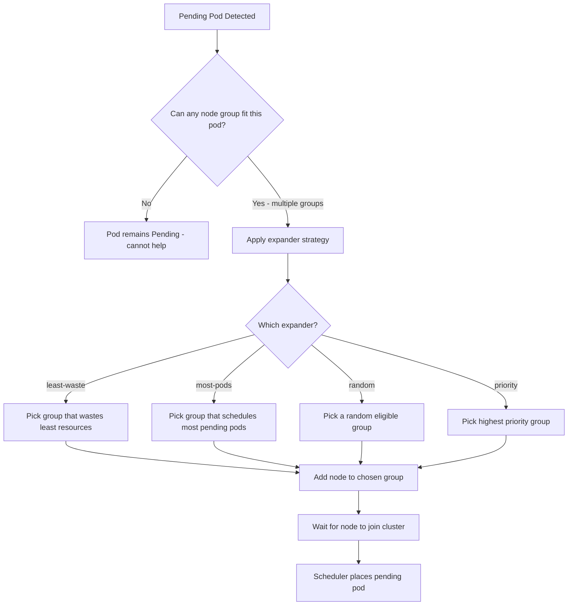

# How to Configure Kubernetes Cluster Autoscaler for Node Scaling

Author: [nawazdhandala](https://www.github.com/nawazdhandala)

Tags: Kubernetes, Cluster Autoscaler, Node Scaling, Cloud, Automation

Description: Learn how to configure the Kubernetes Cluster Autoscaler to automatically add and remove nodes based on pending pod demand.

---

HPA and VPA handle pod-level scaling, but what happens when your cluster runs out of node capacity? The Cluster Autoscaler watches for pods that cannot be scheduled due to insufficient resources and automatically provisions new nodes. It also removes underutilized nodes to save costs. This post covers how to configure Cluster Autoscaler on major cloud providers.

## How Cluster Autoscaler Works



The Cluster Autoscaler makes two key decisions:

1. **Scale up** - When pods are pending because no node has enough capacity
2. **Scale down** - When a node's utilization is below a threshold (default 50%) for an extended period

## Prerequisites

Cluster Autoscaler works with managed node groups or auto scaling groups on cloud providers. You need:

- A Kubernetes cluster on a supported cloud provider
- Node groups configured with min and max sizes
- Proper IAM permissions for the autoscaler to manage nodes

## Step 1: Configure on AWS (EKS)

### Create an IAM Policy

```json
{
  "Version": "2012-10-17",
  "Statement": [
    {
      "Effect": "Allow",
      "Action": [
        "autoscaling:DescribeAutoScalingGroups",
        "autoscaling:DescribeAutoScalingInstances",
        "autoscaling:DescribeLaunchConfigurations",
        "autoscaling:DescribeScalingActivities",
        "autoscaling:DescribeTags",
        "autoscaling:SetDesiredCapacity",
        "autoscaling:TerminateInstanceInAutoScalingGroup",
        "ec2:DescribeLaunchTemplateVersions",
        "ec2:DescribeInstanceTypes",
        "eks:DescribeNodegroup"
      ],
      "Resource": "*"
    }
  ]
}
```

### Deploy Cluster Autoscaler on EKS

```yaml
# cluster-autoscaler-aws.yaml
# Cluster Autoscaler deployment for AWS EKS
apiVersion: apps/v1
kind: Deployment
metadata:
  name: cluster-autoscaler
  namespace: kube-system
  labels:
    app: cluster-autoscaler
spec:
  replicas: 1
  selector:
    matchLabels:
      app: cluster-autoscaler
  template:
    metadata:
      labels:
        app: cluster-autoscaler
    spec:
      serviceAccountName: cluster-autoscaler  # SA with IAM role attached
      containers:
        - name: cluster-autoscaler
          image: registry.k8s.io/autoscaling/cluster-autoscaler:v1.31.0
          command:
            - ./cluster-autoscaler
            - --v=4
            - --stderrthreshold=info
            - --cloud-provider=aws
            - --skip-nodes-with-local-storage=false
            - --expander=least-waste          # Choose node group that wastes least resources
            - --node-group-auto-discovery=asg:tag=k8s.io/cluster-autoscaler/enabled,k8s.io/cluster-autoscaler/my-cluster
            - --balance-similar-node-groups    # Keep similar node groups balanced
            - --scale-down-delay-after-add=5m  # Wait 5 min after adding before removing
            - --scale-down-unneeded-time=10m   # Node must be underutilized for 10 min
            - --scale-down-utilization-threshold=0.5  # Remove nodes below 50% utilization
          resources:
            requests:
              cpu: "100m"
              memory: "300Mi"
            limits:
              cpu: "500m"
              memory: "600Mi"
```

## Step 2: Configure on GCP (GKE)

GKE has Cluster Autoscaler built in. You enable it per node pool.

```bash
# Enable cluster autoscaler on an existing GKE node pool
gcloud container clusters update my-cluster \
  --enable-autoscaling \
  --node-pool default-pool \
  --min-nodes 2 \
  --max-nodes 20 \
  --zone us-central1-a

# Enable autoscaling profile for faster scaling
gcloud container clusters update my-cluster \
  --autoscaling-profile optimize-utilization \
  --zone us-central1-a
```

## Step 3: Configure Using Helm (Any Provider)

```bash
# Install Cluster Autoscaler using Helm (generic approach)
helm repo add autoscaler https://kubernetes.github.io/autoscaler
helm repo update

# Example for AWS
helm install cluster-autoscaler autoscaler/cluster-autoscaler \
  --namespace kube-system \
  --set autoDiscovery.clusterName=my-cluster \
  --set awsRegion=us-east-1 \
  --set extraArgs.balance-similar-node-groups=true \
  --set extraArgs.skip-nodes-with-local-storage=false \
  --set extraArgs.expander=least-waste \
  --set extraArgs.scale-down-delay-after-add=5m \
  --set extraArgs.scale-down-unneeded-time=10m
```

## Scale-Up Decision Flow



## Step 4: Configure Multiple Node Groups

For heterogeneous workloads, use multiple node groups with different instance types.

```yaml
# node-groups-config.yaml
# Example: Two node groups for different workload types
# Node Group 1: General purpose (managed via cloud provider)
# - Instance type: m5.xlarge (4 CPU, 16GB)
# - Min: 2, Max: 10
# - Labels: workload-type=general

# Node Group 2: Memory optimized (managed via cloud provider)
# - Instance type: r5.xlarge (4 CPU, 32GB)
# - Min: 1, Max: 5
# - Labels: workload-type=memory-intensive
---
# Pod that targets the memory-optimized node group
apiVersion: v1
kind: Pod
metadata:
  name: memory-heavy-app
spec:
  nodeSelector:
    workload-type: memory-intensive  # Schedule on memory-optimized nodes
  containers:
    - name: app
      image: your-registry/memory-app:latest
      resources:
        requests:
          cpu: "1000m"
          memory: "16Gi"  # Needs a lot of memory
```

## Step 5: Prevent Scale-Down for Critical Pods

You can annotate pods to prevent Cluster Autoscaler from evicting them during scale-down.

```yaml
# critical-pod.yaml
# Pod annotated to prevent Cluster Autoscaler from evicting it
apiVersion: v1
kind: Pod
metadata:
  name: critical-database
  annotations:
    # This annotation prevents CA from evicting this pod during scale-down
    cluster-autoscaler.kubernetes.io/safe-to-evict: "false"
spec:
  containers:
    - name: database
      image: postgres:16
      resources:
        requests:
          cpu: "2000m"
          memory: "4Gi"
```

## Step 6: Configure Pod Disruption Budgets

PDBs work with Cluster Autoscaler to ensure availability during scale-down.

```yaml
# pdb.yaml
# PodDisruptionBudget ensures at least 2 replicas are always available
apiVersion: policy/v1
kind: PodDisruptionBudget
metadata:
  name: web-app-pdb
spec:
  minAvailable: 2  # At least 2 pods must remain available during disruption
  selector:
    matchLabels:
      app: web-app
```

## Monitoring Cluster Autoscaler

```bash
# Check Cluster Autoscaler status
kubectl get configmap cluster-autoscaler-status -n kube-system -o yaml

# View Cluster Autoscaler logs
kubectl logs -l app=cluster-autoscaler -n kube-system --tail=100

# Check for pending pods that might trigger scale-up
kubectl get pods --field-selector=status.phase=Pending --all-namespaces

# Watch node count changes
kubectl get nodes --watch
```

## Summary

Cluster Autoscaler is the final piece of the Kubernetes autoscaling puzzle. It ensures your cluster has enough node capacity for your workloads while removing idle nodes to control costs. Combined with HPA and VPA, you get a complete autoscaling stack that handles scaling at every level.

To monitor your node scaling events, cluster capacity, and costs, check out [OneUptime](https://oneuptime.com). OneUptime provides infrastructure monitoring, alerting, and dashboards that help you track node additions and removals, spot capacity bottlenecks, and ensure your autoscaling policies are working as expected.
