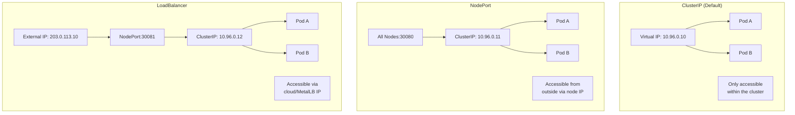
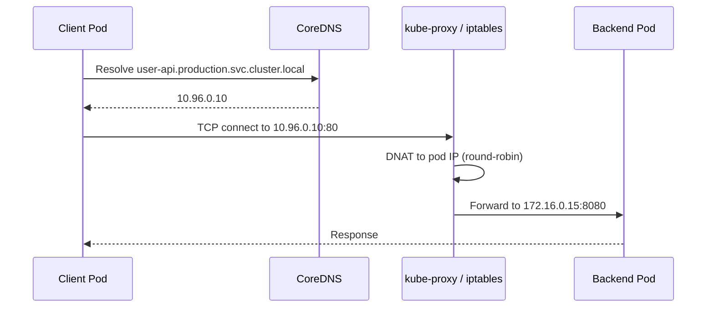
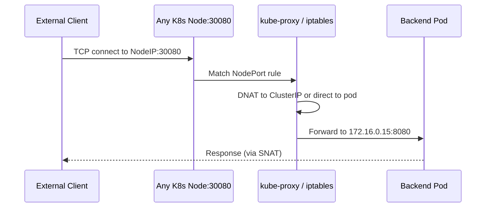
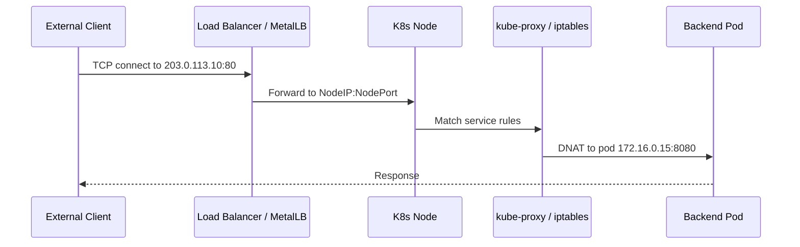
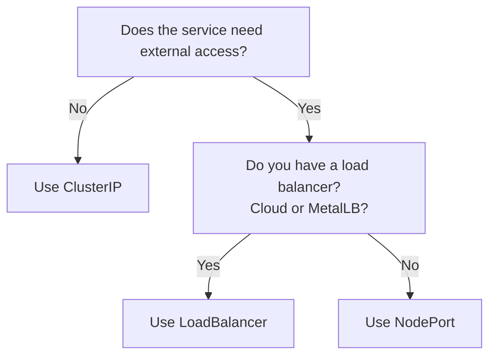

# Understanding Kubernetes Service Types: ClusterIP, NodePort, and LoadBalancer

Author: [nawazdhandala](https://www.github.com/nawazdhandala)

Tags: Kubernetes, Services, Networking, ClusterIP, NodePort

Description: A comprehensive guide to Kubernetes service types, when to use each, and how traffic flows through ClusterIP, NodePort, and LoadBalancer services.

---

## What Are Kubernetes Services?

Pods in Kubernetes are ephemeral. They get created, destroyed, and rescheduled constantly. Each pod gets a unique IP address, but that IP changes every time the pod restarts. Services provide a stable network identity for a group of pods, giving clients a single address that never changes.

Kubernetes offers several service types, each designed for different access patterns. Understanding when to use each type is fundamental to building reliable applications on Kubernetes.

## The Three Core Service Types



## ClusterIP: Internal Communication

ClusterIP is the default service type. It assigns a virtual IP from the cluster's service CIDR range. This IP is only reachable from within the cluster.

### When to Use ClusterIP

- Backend services that only other pods need to reach
- Databases, caches, message queues
- Internal microservice-to-microservice communication

### ClusterIP Example

```yaml
# clusterip-service.yaml
# A backend API only accessed by other services in the cluster
apiVersion: v1
kind: Service
metadata:
  name: user-api
  namespace: production
spec:
  # ClusterIP is the default, but explicit is clearer
  type: ClusterIP
  selector:
    app: user-api
  ports:
    - name: http
      port: 80
      # Traffic arrives on port 80, forwarded to container port 8080
      targetPort: 8080
      protocol: TCP
```

### How Traffic Flows with ClusterIP



When a client pod connects to the ClusterIP, kube-proxy's iptables (or IPVS) rules intercept the packet and perform DNAT (Destination Network Address Translation) to a randomly selected backend pod IP.

### Accessing ClusterIP Services

```bash
# From within the cluster, services are reachable by DNS name
# Format: <service-name>.<namespace>.svc.cluster.local
kubectl exec -it debug-pod -- curl http://user-api.production.svc.cluster.local

# Short form works within the same namespace
kubectl exec -it debug-pod -n production -- curl http://user-api

# Check the ClusterIP assigned
kubectl get svc user-api -n production
# NAME       TYPE        CLUSTER-IP    EXTERNAL-IP   PORT(S)
# user-api   ClusterIP   10.96.0.10    <none>        80/TCP
```

## NodePort: External Access Without a Load Balancer

NodePort extends ClusterIP by opening a static port (30000-32767) on every node in the cluster. External clients can reach the service by connecting to any node's IP on that port.

### When to Use NodePort

- Development and testing environments
- When you have your own external load balancer
- Quick external access without cloud integration

### NodePort Example

```yaml
# nodeport-service.yaml
# Exposes the web app on a static port across all nodes
apiVersion: v1
kind: Service
metadata:
  name: web-app
  namespace: production
spec:
  type: NodePort
  selector:
    app: web-app
  ports:
    - name: http
      port: 80
      targetPort: 8080
      # Optional: specify the port, or let Kubernetes choose
      nodePort: 30080
      protocol: TCP
```

### How Traffic Flows with NodePort



### NodePort Caveats

```bash
# List all NodePort services and their assigned ports
kubectl get svc -A --field-selector spec.type=NodePort

# Important: NodePort range is limited (default 30000-32767)
# Check your cluster's configured range:
kubectl get pods -n kube-system -l component=kube-apiserver \
  -o jsonpath='{.items[0].spec.containers[0].command}' \
  | tr ',' '\n' | grep service-node-port-range
```

Key limitations:

1. Port range is limited to 30000-32767 by default
2. Only one service per port across the entire cluster
3. Clients must know a node's IP address
4. If a node goes down, clients targeting that node lose access

## LoadBalancer: Production External Access

LoadBalancer extends NodePort by provisioning an external load balancer. On cloud providers, this creates a cloud load balancer (AWS ELB, GCP LB, etc.). On bare metal, MetalLB assigns a real IP and announces it via ARP or BGP.

### When to Use LoadBalancer

- Production services that need external access
- When you need a stable external IP address
- Services behind DNS records

### LoadBalancer Example

```yaml
# loadbalancer-service.yaml
# Production web service with a dedicated external IP
apiVersion: v1
kind: Service
metadata:
  name: public-web
  namespace: production
  annotations:
    # MetalLB-specific: choose which pool to allocate from
    metallb.universe.tf/address-pool: web-pool
spec:
  type: LoadBalancer
  selector:
    app: public-web
  ports:
    - name: http
      port: 80
      targetPort: 8080
    - name: https
      port: 443
      targetPort: 8443
  # Optional: preserve the client's source IP
  externalTrafficPolicy: Local
```

### How Traffic Flows with LoadBalancer



### External Traffic Policy

The `externalTrafficPolicy` field controls whether traffic can hop between nodes:

```yaml
# Cluster policy (default): traffic can be forwarded to pods on any node
# Pros: even load distribution
# Cons: extra network hop, source IP is masqueraded
externalTrafficPolicy: Cluster

# Local policy: traffic stays on the receiving node
# Pros: preserves client source IP, no extra hop
# Cons: uneven distribution if pods are not on every node
externalTrafficPolicy: Local
```

## Side-by-Side Comparison

| Feature | ClusterIP | NodePort | LoadBalancer |
|---------|-----------|----------|-------------|
| Accessibility | Cluster internal | External via node IP | External via dedicated IP |
| Stable IP | Yes (virtual) | No (depends on node) | Yes (external) |
| Port range | Any | 30000-32767 | Any |
| Cost | Free | Free | Cloud LB cost or MetalLB |
| Use case | Internal services | Dev/test | Production |
| DNS setup | Internal DNS only | Manual per node | Single DNS record |

## Choosing the Right Type



## Inspecting Services

```bash
# List all services across namespaces with their types
kubectl get svc -A -o custom-columns=\
NAMESPACE:.metadata.namespace,\
NAME:.metadata.name,\
TYPE:.spec.type,\
CLUSTER-IP:.spec.clusterIP,\
EXTERNAL-IP:.status.loadBalancer.ingress[0].ip,\
PORTS:.spec.ports[*].port

# Describe a specific service for full details
kubectl describe svc public-web -n production

# Check endpoints backing a service
kubectl get endpoints public-web -n production
```

## Summary

ClusterIP is for internal communication between pods. NodePort exposes services on a static port across all nodes for basic external access. LoadBalancer provisions a dedicated external IP for production-grade external access. Each type builds on the previous one: LoadBalancer creates a NodePort, which creates a ClusterIP.

For monitoring the availability and performance of all your Kubernetes services regardless of type, [OneUptime](https://oneuptime.com) provides HTTP, TCP, and ping monitors that can track both internal and external service endpoints with alerting and status pages.
