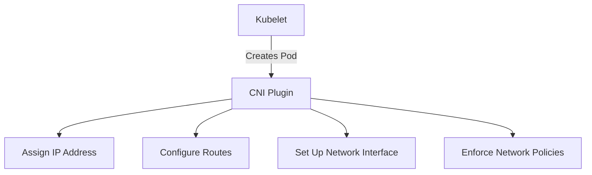
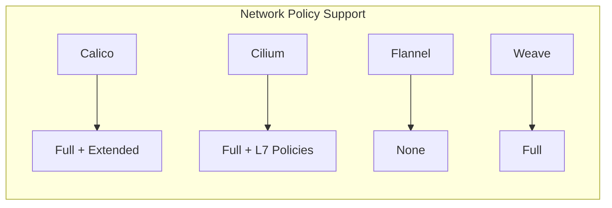
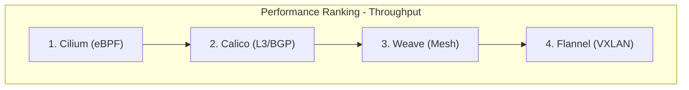

# Comparing Kubernetes CNI Plugins: Calico, Cilium, Flannel, and Weave

Author: [nawazdhandala](https://www.github.com/nawazdhandala)

Tags: Kubernetes, CNI, Calico, Cilium, Flannel

Description: A practical comparison of popular Kubernetes CNI plugins covering performance, features, network policy support, and use cases.

---

## What Is a CNI Plugin?

The Container Network Interface (CNI) is a specification that defines how networking is configured for containers. When you create a pod in Kubernetes, the CNI plugin is responsible for assigning it an IP address, setting up routes, and connecting it to the cluster network.

Choosing the right CNI plugin affects your cluster's performance, security posture, and operational complexity.



## The Contenders

We will compare four popular CNI plugins:

- **Calico** - BGP-based networking with strong policy support
- **Cilium** - eBPF-based networking with advanced observability
- **Flannel** - Simple overlay networking
- **Weave** - Mesh networking with encryption support

## Calico

Calico uses BGP (Border Gateway Protocol) to distribute routes across nodes. It operates at Layer 3 and avoids overlay encapsulation when possible, which reduces latency.

```bash
# Install Calico using the operator
kubectl create -f https://raw.githubusercontent.com/projectcalico/calico/v3.27.0/manifests/tigera-operator.yaml

# Install Calico custom resources
kubectl create -f https://raw.githubusercontent.com/projectcalico/calico/v3.27.0/manifests/custom-resources.yaml

# Verify Calico pods are running
kubectl get pods -n calico-system
```

Key features:

- Full Kubernetes Network Policy support
- Calico-specific policies for advanced use cases (GlobalNetworkPolicy)
- BGP peering for integration with physical network infrastructure
- WireGuard encryption for pod-to-pod traffic
- Good performance with no overlay in pure L3 mode

## Cilium

Cilium uses eBPF (extended Berkeley Packet Filter) to implement networking directly in the Linux kernel. This bypasses iptables and provides better performance at scale.

```bash
# Install Cilium CLI
curl -L --remote-name-all \
  https://github.com/cilium/cilium-cli/releases/latest/download/cilium-linux-amd64.tar.gz
tar xzvf cilium-linux-amd64.tar.gz
sudo mv cilium /usr/local/bin/

# Install Cilium into the cluster
cilium install

# Verify the installation
cilium status
```

Key features:

- eBPF-based data plane - no iptables overhead
- Kubernetes Network Policy support plus CiliumNetworkPolicy CRDs
- Layer 7 (HTTP, gRPC, Kafka) policy enforcement
- Hubble for network observability and flow visualization
- Transparent encryption with IPsec or WireGuard
- Service mesh capabilities without sidecars

## Flannel

Flannel is the simplest CNI plugin. It creates an overlay network using VXLAN encapsulation. It does not support Network Policies on its own.

```bash
# Install Flannel
kubectl apply -f https://github.com/flannel-io/flannel/releases/latest/download/kube-flannel.yml

# Verify Flannel pods
kubectl get pods -n kube-flannel
```

Key features:

- Very simple to install and operate
- VXLAN overlay networking
- Low resource consumption
- No Network Policy support (requires Calico alongside for policies)
- Good for development and testing clusters

## Weave Net

Weave creates a mesh overlay network between nodes. It can automatically encrypt traffic and handles network partitions gracefully.

```bash
# Install Weave Net
kubectl apply -f https://github.com/weaveworks/weave/releases/download/v2.8.1/weave-daemonset-k8s.yaml

# Verify Weave pods
kubectl get pods -n kube-system -l name=weave-net
```

Key features:

- Mesh overlay networking
- Built-in encryption using NaCl
- Kubernetes Network Policy support
- Automatic mesh topology discovery
- Handles network partitions with CRDT-based data synchronization

## Feature Comparison



Here is a side-by-side comparison:

| Feature | Calico | Cilium | Flannel | Weave |
|---------|--------|--------|---------|-------|
| Network Policy | Yes + Extended | Yes + L7 | No | Yes |
| Data Plane | iptables/eBPF | eBPF | VXLAN | Mesh Overlay |
| Encryption | WireGuard | WireGuard/IPsec | No | NaCl |
| Observability | Basic | Hubble (Advanced) | None | Basic |
| Performance | High | Very High | Medium | Medium |
| Complexity | Medium | Medium-High | Low | Low-Medium |
| L7 Policies | No (OSS) | Yes | No | No |

## Performance Characteristics



Performance depends on your workload. Here are general guidelines:

- **Cilium** excels at high throughput because eBPF bypasses the iptables chain entirely. At thousands of services, the difference becomes significant.
- **Calico** in pure L3 mode (no overlay) performs very well. With VXLAN overlay, performance is slightly lower due to encapsulation.
- **Flannel** and **Weave** both use overlay networks, which add encapsulation overhead. They are adequate for most workloads but not ideal for latency-sensitive applications.

## When to Use Each Plugin

### Use Calico When

- You need strong Network Policy support
- You want to integrate with existing BGP infrastructure
- You need a battle-tested, widely-deployed solution
- Your cluster runs on bare metal with routable pod IPs

### Use Cilium When

- You need Layer 7 policy enforcement (HTTP, gRPC)
- You want deep network observability with Hubble
- Performance at scale is critical
- You want a service mesh without sidecars
- You are running eBPF-compatible kernels (5.10+)

### Use Flannel When

- You want the simplest possible setup
- You are running a development or testing cluster
- You do not need Network Policies
- You have limited operational capacity for networking

### Use Weave When

- You need built-in encryption without extra configuration
- You want automatic mesh topology
- You need to handle network partitions gracefully
- You are running smaller clusters with simple requirements

## Verifying Your CNI Plugin

Check which CNI plugin is running:

```bash
# Check CNI binaries on a node
ls /opt/cni/bin/

# Check CNI configuration
ls /etc/cni/net.d/

# Check running CNI pods
kubectl get pods --all-namespaces | grep -E "calico|cilium|flannel|weave"
```

## Migration Considerations

Switching CNI plugins requires draining all nodes and reinstalling. This is disruptive and should be planned carefully:

```bash
# General migration steps (high-level)
# 1. Cordon and drain all nodes
kubectl drain node-1 --ignore-daemonsets --delete-emptydir-data

# 2. Remove the old CNI plugin
kubectl delete -f old-cni-manifest.yaml

# 3. Clean up CNI configuration on each node
sudo rm -rf /etc/cni/net.d/*
sudo rm -rf /var/lib/cni/

# 4. Install the new CNI plugin
kubectl apply -f new-cni-manifest.yaml

# 5. Uncordon nodes
kubectl uncordon node-1
```

## Monitoring CNI Health

Regardless of which CNI plugin you choose, monitoring network health is essential. OneUptime (https://oneuptime.com) can monitor your Kubernetes cluster networking, track pod connectivity, and alert you when network issues arise from CNI misconfigurations or failures.
