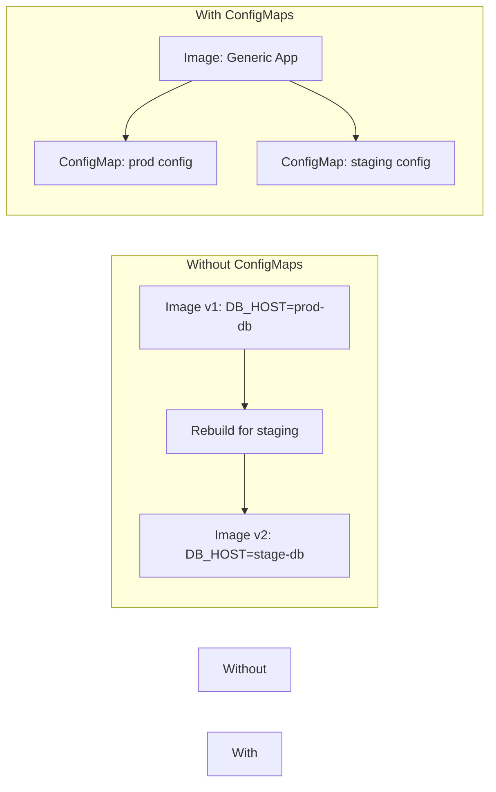
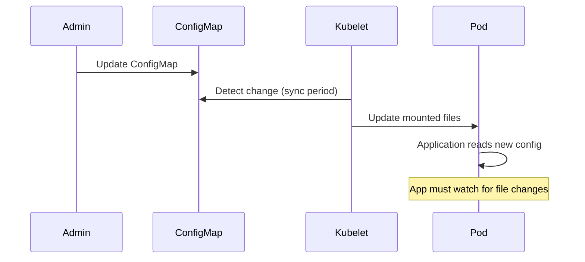

# How to Use Kubernetes ConfigMaps for Application Configuration

Author: [nawazdhandala](https://www.github.com/nawazdhandala)

Tags: Kubernetes, ConfigMaps, Configuration, Environment Variables, Volumes

Description: Learn how to use Kubernetes ConfigMaps to externalize application configuration including environment variables, files, and live reloading.

---

Hardcoding configuration values in container images makes deployments rigid. Kubernetes ConfigMaps let you separate configuration from code so you can change settings without rebuilding images. This post covers how to create ConfigMaps, inject them into pods as environment variables or files, and handle live configuration updates.

## What ConfigMaps Solve



ConfigMaps store non-sensitive key-value pairs. For sensitive data like passwords and API keys, use Secrets instead.

## Creating ConfigMaps

### From a YAML Manifest

```yaml
# app-config.yaml
# A ConfigMap with literal key-value pairs
# for application settings.
apiVersion: v1
kind: ConfigMap
metadata:
  name: app-config
  namespace: default
data:
  # Simple key-value pairs
  DB_HOST: "postgres.default.svc.cluster.local"
  DB_PORT: "5432"
  LOG_LEVEL: "info"
  CACHE_TTL: "300"
  # Multi-line value for a configuration file
  app.properties: |
    server.port=8080
    server.timeout=30
    feature.new-dashboard=true
    feature.dark-mode=false
```

### From the Command Line

```bash
# Create a ConfigMap from literal values
kubectl create configmap app-config \
  --from-literal=DB_HOST=postgres.default.svc.cluster.local \
  --from-literal=DB_PORT=5432

# Create a ConfigMap from a file
kubectl create configmap nginx-config \
  --from-file=nginx.conf

# Create a ConfigMap from a directory of files
kubectl create configmap app-configs \
  --from-file=config/
```

## Using ConfigMaps as Environment Variables

### Individual Keys

```yaml
# pod-env-vars.yaml
# Inject specific ConfigMap keys as environment variables.
apiVersion: v1
kind: Pod
metadata:
  name: web-app
spec:
  containers:
    - name: web-app
      image: myregistry/web-app:latest
      env:
        # Map individual keys from the ConfigMap
        - name: DATABASE_HOST
          valueFrom:
            configMapKeyRef:
              name: app-config
              key: DB_HOST
        - name: DATABASE_PORT
          valueFrom:
            configMapKeyRef:
              name: app-config
              key: DB_PORT
        # Mark as optional so the pod starts even
        # if this key does not exist yet
        - name: LOG_LEVEL
          valueFrom:
            configMapKeyRef:
              name: app-config
              key: LOG_LEVEL
              optional: true
```

### All Keys at Once

```yaml
# pod-env-from.yaml
# Inject all keys from the ConfigMap as environment variables.
# Each key becomes a variable name, each value becomes the variable value.
apiVersion: v1
kind: Pod
metadata:
  name: web-app
spec:
  containers:
    - name: web-app
      image: myregistry/web-app:latest
      envFrom:
        - configMapRef:
            name: app-config
          # Optional prefix to avoid naming collisions
          prefix: APP_
```

## Using ConfigMaps as Volume Mounts

Mounting a ConfigMap as a volume creates files inside the container. Each key becomes a filename, and the value becomes the file content.

```yaml
# pod-volume-mount.yaml
# Mount ConfigMap data as files in the container's filesystem.
apiVersion: v1
kind: Pod
metadata:
  name: nginx
spec:
  containers:
    - name: nginx
      image: nginx:1.25
      volumeMounts:
        # Mount the ConfigMap at the nginx config directory
        - name: config-volume
          mountPath: /etc/nginx/conf.d
          readOnly: true
  volumes:
    - name: config-volume
      configMap:
        name: nginx-config
        # Optionally select specific keys and set file permissions
        items:
          - key: default.conf
            path: default.conf
            mode: 0644
```

```mermaid
graph TD
    CM[ConfigMap: nginx-config] --> |key: default.conf| F[/etc/nginx/conf.d/default.conf]
    CM --> |key: upstream.conf| G[/etc/nginx/conf.d/upstream.conf]
```

## Mounting a Single File with SubPath

When you mount a ConfigMap to a directory, it replaces the entire directory contents. Use `subPath` to mount a single file without affecting other files in the directory.

```yaml
# subpath-mount.yaml
# Mount a single config file without overwriting
# other files in the target directory.
spec:
  containers:
    - name: app
      image: myregistry/app:latest
      volumeMounts:
        - name: config
          mountPath: /app/config/settings.yaml
          subPath: settings.yaml
  volumes:
    - name: config
      configMap:
        name: app-config
```

## Live Configuration Updates

When a ConfigMap is mounted as a volume (without `subPath`), Kubernetes automatically updates the files when the ConfigMap changes. The update delay is typically under a minute.



Your application needs to watch for file changes to pick up the update. Environment variables are **not** updated automatically.

```python
# config_watcher.py
# A simple file watcher that reloads configuration
# when the mounted ConfigMap file changes.
import os
import time
import json

CONFIG_PATH = "/app/config/settings.json"

def load_config(path):
    """Load configuration from a JSON file."""
    with open(path, "r") as f:
        return json.load(f)

def watch_config(path, interval=10):
    """Watch a config file for changes and reload when modified."""
    last_mtime = 0
    config = {}

    while True:
        try:
            current_mtime = os.path.getmtime(path)
            # Reload only when the file has been modified
            if current_mtime != last_mtime:
                config = load_config(path)
                last_mtime = current_mtime
                print(f"Config reloaded: {config}")
        except FileNotFoundError:
            print(f"Config file not found: {path}")
        time.sleep(interval)

    return config

if __name__ == "__main__":
    watch_config(CONFIG_PATH)
```

## Immutable ConfigMaps

For ConfigMaps that should never change, mark them as immutable. This protects against accidental updates and improves cluster performance by reducing watch load on the API server.

```yaml
# immutable-config.yaml
# An immutable ConfigMap. Once created, its data cannot be changed.
# You must delete and recreate it to update.
apiVersion: v1
kind: ConfigMap
metadata:
  name: feature-flags-v3
data:
  flags.json: |
    {
      "new_dashboard": true,
      "dark_mode": false,
      "beta_api": true
    }
# Prevent accidental changes
immutable: true
```

## Best Practices

1. Use ConfigMaps for non-sensitive data only. Use Secrets for passwords, tokens, and keys.
2. Keep ConfigMaps small. Kubernetes limits them to 1 MiB.
3. Use immutable ConfigMaps for data that should not change after deployment.
4. Version your ConfigMaps (e.g., `app-config-v2`) so you can roll back by updating the Deployment reference.
5. Avoid using `subPath` if you need automatic config reloading, since `subPath` mounts do not receive updates.
6. Set resource requests on pods that watch config files to avoid unnecessary CPU usage.

## Monitoring Configuration Changes with OneUptime

Configuration changes are a common source of production incidents. [OneUptime](https://oneuptime.com) helps you track how your applications respond to configuration updates. With uptime monitoring, error tracking, and alerting, OneUptime catches issues caused by bad config values before they affect your users. Pair ConfigMap versioning with OneUptime alerts for a reliable change management workflow.
