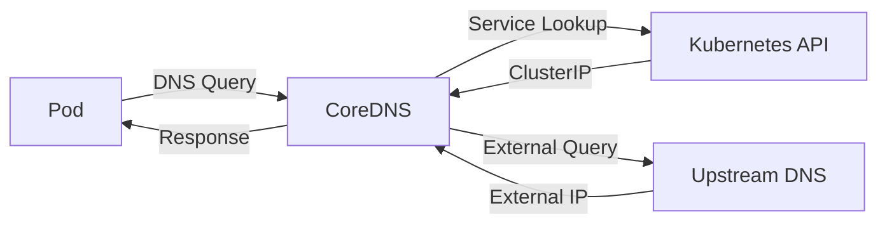
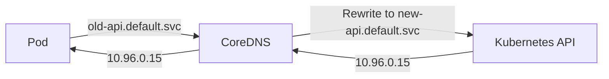
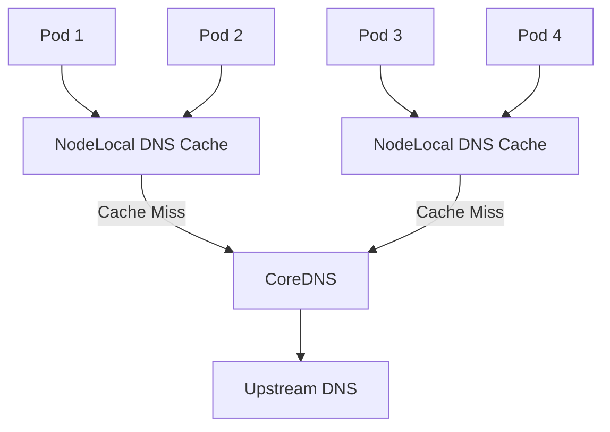

# How to Customize CoreDNS in Kubernetes for Advanced DNS Routing

Author: [nawazdhandala](https://www.github.com/nawazdhandala)

Tags: Kubernetes, CoreDNS, DNS, Configuration, Networking

Description: Learn how to customize CoreDNS in Kubernetes with forward zones, rewrites, caching, and custom plugins for advanced DNS routing.

---

## What Is CoreDNS in Kubernetes?

CoreDNS is the default DNS server in Kubernetes. It resolves service names to ClusterIPs, enabling pods to find each other by name instead of hardcoded IPs. When a pod calls `http://my-service.my-namespace.svc.cluster.local`, CoreDNS resolves that to the correct ClusterIP.



## Default CoreDNS Configuration

CoreDNS is configured through a ConfigMap in the `kube-system` namespace.

```bash
# View the current CoreDNS configuration
kubectl get configmap coredns -n kube-system -o yaml
```

The default Corefile looks like this:

```text
# Default CoreDNS Corefile
.:53 {
    errors          # Log errors
    health {        # Health check endpoint on :8080
        lameduck 5s
    }
    ready           # Readiness endpoint on :8181
    kubernetes cluster.local in-addr.arpa ip6.arpa {
        pods insecure
        fallthrough in-addr.arpa ip6.arpa
        ttl 30
    }
    prometheus :9153  # Expose metrics on :9153
    forward . /etc/resolv.conf  # Forward external queries upstream
    cache 30          # Cache responses for 30 seconds
    loop              # Detect forwarding loops
    reload            # Auto-reload Corefile on changes
    loadbalance       # Round-robin DNS responses
}
```

## Editing the CoreDNS ConfigMap

To customize CoreDNS, edit the ConfigMap directly:

```bash
# Edit the CoreDNS ConfigMap
kubectl edit configmap coredns -n kube-system
```

After editing, CoreDNS automatically reloads the configuration (thanks to the `reload` plugin). You can verify:

```bash
# Check CoreDNS logs for reload confirmation
kubectl logs -n kube-system -l k8s-app=kube-dns --tail=20
```

## Forwarding to Custom DNS Servers

You can forward queries for specific domains to custom DNS servers. This is common when you need to resolve internal corporate domains.

```text
# Forward queries for corp.example.com to an internal DNS server
.:53 {
    errors
    health {
        lameduck 5s
    }
    ready
    kubernetes cluster.local in-addr.arpa ip6.arpa {
        pods insecure
        fallthrough in-addr.arpa ip6.arpa
        ttl 30
    }
    # Forward corp.example.com to internal DNS
    forward corp.example.com 10.0.0.53 10.0.0.54 {
        policy sequential
    }
    # Forward everything else to public DNS
    forward . 8.8.8.8 8.8.4.4 {
        policy round_robin
    }
    cache 30
    loop
    reload
    loadbalance
}
```

You can also define separate server blocks for different domains:

```text
# Separate server block for a specific zone
corp.example.com:53 {
    errors
    cache 30
    forward . 10.0.0.53 10.0.0.54
}

# Main server block for cluster DNS
.:53 {
    errors
    health {
        lameduck 5s
    }
    ready
    kubernetes cluster.local in-addr.arpa ip6.arpa {
        pods insecure
        fallthrough in-addr.arpa ip6.arpa
        ttl 30
    }
    forward . /etc/resolv.conf
    cache 30
    loop
    reload
    loadbalance
}
```

## DNS Rewrite Rules

The `rewrite` plugin lets you modify DNS queries before they are processed. This is useful for aliasing services or migrating between domain names.

```text
# Rewrite old service names to new ones
.:53 {
    errors
    health {
        lameduck 5s
    }
    ready

    # Rewrite queries for old-api to new-api in the same namespace
    rewrite name old-api.default.svc.cluster.local new-api.default.svc.cluster.local

    # Rewrite a short name to a fully qualified domain
    rewrite name legacy-db.default.svc.cluster.local postgres.database.svc.cluster.local

    kubernetes cluster.local in-addr.arpa ip6.arpa {
        pods insecure
        fallthrough in-addr.arpa ip6.arpa
        ttl 30
    }
    forward . /etc/resolv.conf
    cache 30
    loop
    reload
    loadbalance
}
```



## Customizing Cache Behavior

The `cache` plugin controls how long DNS responses are cached. You can tune it for different needs:

```text
# Advanced cache configuration
.:53 {
    errors
    health {
        lameduck 5s
    }
    ready
    kubernetes cluster.local in-addr.arpa ip6.arpa {
        pods insecure
        fallthrough in-addr.arpa ip6.arpa
        ttl 30
    }
    # Cache with different TTLs for success and denial
    cache {
        success 9984 30    # Cache successful responses for 30s, max 9984 entries
        denial 9984 10     # Cache NXDOMAIN responses for 10s
        prefetch 10 60s    # Prefetch popular entries before expiry
    }
    forward . /etc/resolv.conf
    loop
    reload
    loadbalance
}
```

## Adding Static Hosts

The `hosts` plugin lets you define static DNS records, similar to /etc/hosts:

```text
# Add static DNS entries
.:53 {
    errors
    health {
        lameduck 5s
    }
    ready

    # Static host entries
    hosts {
        10.0.0.100 internal-registry.example.com
        10.0.0.200 internal-git.example.com
        10.0.0.201 internal-ci.example.com
        fallthrough
    }

    kubernetes cluster.local in-addr.arpa ip6.arpa {
        pods insecure
        fallthrough in-addr.arpa ip6.arpa
        ttl 30
    }
    forward . /etc/resolv.conf
    cache 30
    loop
    reload
    loadbalance
}
```

The `fallthrough` directive is important. Without it, queries that do not match the hosts file will not be passed to subsequent plugins.

## Logging DNS Queries

Enable query logging for debugging:

```text
# Enable DNS query logging
.:53 {
    errors
    # Log all DNS queries (useful for debugging, disable in production)
    log

    health {
        lameduck 5s
    }
    ready
    kubernetes cluster.local in-addr.arpa ip6.arpa {
        pods insecure
        fallthrough in-addr.arpa ip6.arpa
        ttl 30
    }
    forward . /etc/resolv.conf
    cache 30
    loop
    reload
    loadbalance
}
```

View the logs:

```bash
# Watch CoreDNS query logs
kubectl logs -n kube-system -l k8s-app=kube-dns -f
```

## Scaling CoreDNS

For large clusters, you may need to scale CoreDNS:

```bash
# Scale CoreDNS to more replicas
kubectl scale deployment coredns -n kube-system --replicas=5

# Or use the DNS autoscaler
kubectl get deployment dns-autoscaler -n kube-system
```

You can also use NodeLocal DNSCache to reduce latency and load on CoreDNS:

```bash
# Deploy NodeLocal DNSCache
# This runs a DNS cache on each node, reducing cross-node DNS queries
kubectl apply -f https://raw.githubusercontent.com/kubernetes/kubernetes/master/cluster/addons/dns/nodelocaldns/nodelocaldns.yaml
```



## Testing DNS Configuration

Verify your changes work correctly:

```bash
# Deploy a DNS test pod
kubectl run dnstest --image=busybox:1.36 --restart=Never -- sleep 3600

# Test cluster DNS resolution
kubectl exec dnstest -- nslookup kubernetes.default.svc.cluster.local

# Test external DNS resolution
kubectl exec dnstest -- nslookup example.com

# Test custom forwarding
kubectl exec dnstest -- nslookup internal-service.corp.example.com

# Test rewrite rules
kubectl exec dnstest -- nslookup old-api.default.svc.cluster.local

# Clean up
kubectl delete pod dnstest
```

## Monitoring CoreDNS

CoreDNS exposes Prometheus metrics on port 9153. Monitor these key metrics:

- `coredns_dns_requests_total` - total query count
- `coredns_dns_responses_total` - response count by rcode
- `coredns_dns_request_duration_seconds` - query latency

OneUptime (https://oneuptime.com) can ingest these metrics and alert you on DNS resolution failures, high latency, or error rate spikes in your CoreDNS deployment, ensuring your cluster's DNS remains healthy and performant.
