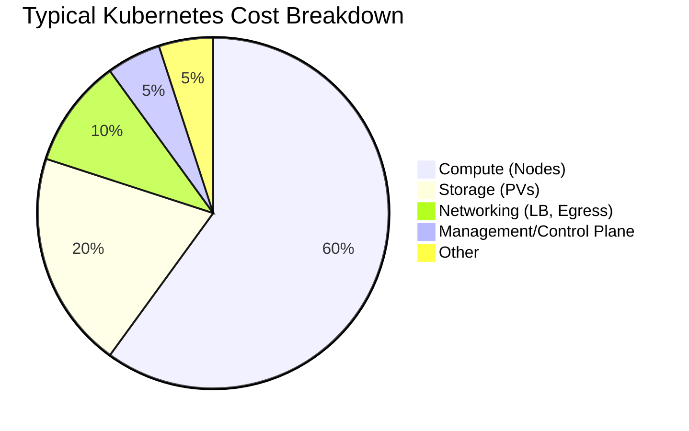
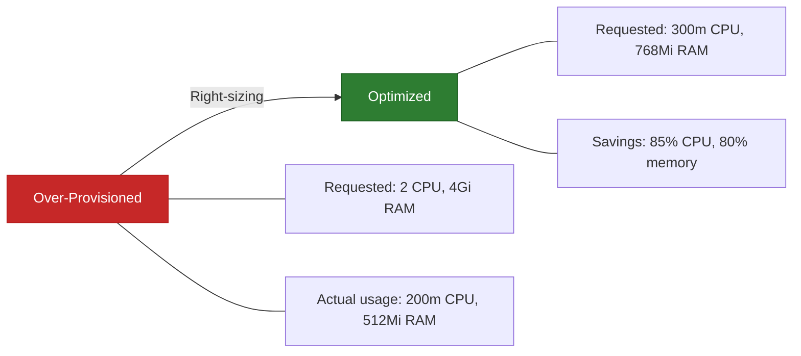
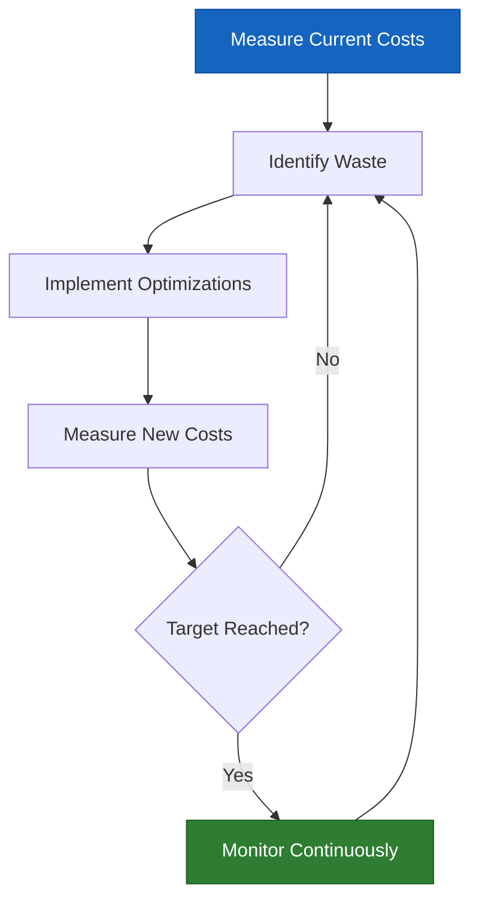

# How to Reduce Kubernetes Costs Without Sacrificing Reliability

Author: [nawazdhandala](https://www.github.com/nawazdhandala)

Tags: Kubernetes, Cost Optimization, Right-Sizing, Spot Instances, FinOps

Description: Practical strategies for reducing Kubernetes costs including right-sizing, spot instances, bin packing, and resource quotas.

---

Kubernetes makes it easy to run workloads at scale, but it also makes it easy to waste money. Over-provisioned nodes, idle resources, and poorly configured autoscaling can inflate your cloud bill dramatically. This guide covers practical strategies for reducing Kubernetes costs while keeping your applications reliable.

## Where Does the Money Go?

Most Kubernetes spending falls into a few categories. Understanding where your money goes is the first step to reducing costs.



The biggest opportunity is compute - the virtual machines that form your cluster nodes. Most clusters run at 30-50% utilization, meaning half the compute spend is wasted.

## Right-Sizing Resource Requests

The most impactful optimization is setting accurate resource requests and limits. Developers often request more CPU and memory than their workloads actually need.



### Analyzing Actual Resource Usage

```python
import subprocess
import json

class ResourceAnalyzer:
    """
    Analyzes actual resource usage vs requests
    to identify right-sizing opportunities.
    """

    def __init__(self, namespace: str = "default"):
        self.namespace = namespace

    def get_recommendations(self) -> list:
        """
        Compare actual CPU/memory usage against requests.
        Returns a list of right-sizing recommendations.
        """
        recommendations = []

        # Get all pods with their resource requests
        pods = self._get_pods()

        for pod in pods:
            pod_name = pod["metadata"]["name"]
            for container in pod["spec"]["containers"]:
                container_name = container["name"]
                requests = container.get("resources", {}).get("requests", {})

                # Get actual usage from metrics API
                usage = self._get_usage(pod_name, container_name)
                if not usage:
                    continue

                requested_cpu = self._parse_cpu(requests.get("cpu", "0"))
                requested_mem = self._parse_memory(requests.get("memory", "0"))
                actual_cpu = usage["cpu"]
                actual_mem = usage["memory"]

                # Flag if actual usage is less than 50% of requested
                cpu_ratio = actual_cpu / requested_cpu if requested_cpu > 0 else 0
                mem_ratio = actual_mem / requested_mem if requested_mem > 0 else 0

                if cpu_ratio < 0.5 or mem_ratio < 0.5:
                    recommendations.append({
                        "pod": pod_name,
                        "container": container_name,
                        "cpu_requested": requested_cpu,
                        "cpu_actual": actual_cpu,
                        "cpu_savings": f"{(1 - cpu_ratio) * 100:.0f}%",
                        "mem_requested": requested_mem,
                        "mem_actual": actual_mem,
                        "mem_savings": f"{(1 - mem_ratio) * 100:.0f}%",
                    })

        return recommendations

    def _get_pods(self) -> list:
        """Fetch pod specs from the cluster."""
        result = subprocess.run(
            ["kubectl", "get", "pods", "-n", self.namespace, "-o", "json"],
            capture_output=True, text=True
        )
        return json.loads(result.stdout).get("items", [])

    def _get_usage(self, pod_name: str, container_name: str) -> dict:
        """Fetch actual resource usage from the metrics API."""
        try:
            result = subprocess.run(
                [
                    "kubectl", "top", "pod", pod_name,
                    "-n", self.namespace,
                    "--containers", "--no-headers"
                ],
                capture_output=True, text=True, check=True
            )
            for line in result.stdout.strip().split("\n"):
                parts = line.split()
                if len(parts) >= 4 and parts[1] == container_name:
                    return {
                        "cpu": self._parse_cpu(parts[2]),
                        "memory": self._parse_memory(parts[3])
                    }
        except subprocess.CalledProcessError:
            pass
        return None

    def _parse_cpu(self, value: str) -> float:
        """Convert CPU string to millicores."""
        if value.endswith("m"):
            return float(value[:-1])
        return float(value) * 1000

    def _parse_memory(self, value: str) -> float:
        """Convert memory string to Mi."""
        if value.endswith("Gi"):
            return float(value[:-2]) * 1024
        if value.endswith("Mi"):
            return float(value[:-2])
        if value.endswith("Ki"):
            return float(value[:-2]) / 1024
        return float(value) / (1024 * 1024)
```

## Cluster Autoscaler Configuration

The Cluster Autoscaler adds and removes nodes based on pending pods and node utilization. Tuning it properly prevents over-provisioning.

```yaml
# cluster-autoscaler-config.yaml
apiVersion: apps/v1
kind: Deployment
metadata:
  name: cluster-autoscaler
  namespace: kube-system
spec:
  template:
    spec:
      containers:
        - name: cluster-autoscaler
          image: registry.k8s.io/autoscaling/cluster-autoscaler:v1.29.0
          command:
            - ./cluster-autoscaler
            # Scale down nodes that are underutilized
            - --scale-down-enabled=true
            # Wait 10 minutes before scaling down a node
            - --scale-down-delay-after-add=10m
            # Scale down if utilization is below 50%
            - --scale-down-utilization-threshold=0.5
            # Do not scale below 2 nodes for reliability
            - --min-nodes=2
            # Cap at 20 nodes to control costs
            - --max-nodes=20
            # Check for scale-down every 30 seconds
            - --scan-interval=30s
            # Expander determines which node group to scale up
            - --expander=least-waste
```

## Using Spot Instances

Spot instances (or preemptible VMs) cost 60-90% less than on-demand instances. The trade-off is they can be reclaimed with short notice. Use them for fault-tolerant workloads.

```yaml
# spot-node-pool.yaml
# A node pool using spot instances for cost savings
apiVersion: v1
kind: ConfigMap
metadata:
  name: spot-nodepool-config
data:
  config: |
    Node pool configuration for spot instances:
    - Use multiple instance types for availability
    - Set pod disruption budgets to handle interruptions
    - Use node affinity to schedule tolerant workloads on spot
---
# Pod configuration for spot-tolerant workloads
apiVersion: apps/v1
kind: Deployment
metadata:
  name: batch-processor
spec:
  replicas: 10
  selector:
    matchLabels:
      app: batch-processor
  template:
    metadata:
      labels:
        app: batch-processor
    spec:
      # Tolerate the spot instance taint
      tolerations:
        - key: "cloud.google.com/gke-spot"
          operator: "Equal"
          value: "true"
          effect: "NoSchedule"
      # Prefer spot nodes but do not require them
      affinity:
        nodeAffinity:
          preferredDuringSchedulingIgnoredDuringExecution:
            - weight: 100
              preference:
                matchExpressions:
                  - key: cloud.google.com/gke-spot
                    operator: In
                    values: ["true"]
      # Graceful shutdown on spot termination
      terminationGracePeriodSeconds: 30
      containers:
        - name: processor
          image: batch-processor:latest
          resources:
            requests:
              cpu: 500m
              memory: 512Mi
            limits:
              cpu: "1"
              memory: 1Gi
```

## Resource Quotas and Limit Ranges

Prevent teams from over-requesting resources by setting namespace-level quotas.

```yaml
# resource-quota.yaml
# Caps total resource consumption per namespace
apiVersion: v1
kind: ResourceQuota
metadata:
  name: team-quota
  namespace: team-alpha
spec:
  hard:
    # Total CPU and memory limits for the namespace
    requests.cpu: "10"
    requests.memory: 20Gi
    limits.cpu: "20"
    limits.memory: 40Gi
    # Limit the number of certain resource types
    pods: "50"
    services.loadbalancers: "2"
    persistentvolumeclaims: "10"
---
# limit-range.yaml
# Sets default and maximum resource values per container
apiVersion: v1
kind: LimitRange
metadata:
  name: container-limits
  namespace: team-alpha
spec:
  limits:
    - type: Container
      # Default requests applied when none are specified
      defaultRequest:
        cpu: 100m
        memory: 128Mi
      # Default limits applied when none are specified
      default:
        cpu: 500m
        memory: 512Mi
      # Maximum allowed per container
      max:
        cpu: "4"
        memory: 8Gi
      # Minimum required per container
      min:
        cpu: 50m
        memory: 64Mi
```

## Pod Disruption Budgets

When scaling down nodes, PDBs ensure enough replicas stay running to maintain service availability.

```yaml
# pdb.yaml
# Ensures at least 2 replicas are always available during disruptions
apiVersion: policy/v1
kind: PodDisruptionBudget
metadata:
  name: api-pdb
spec:
  minAvailable: 2
  selector:
    matchLabels:
      app: api-server
```

## Cost Optimization Checklist

| Strategy | Effort | Impact | Risk |
|----------|--------|--------|------|
| Right-size resource requests | Low | High | Low |
| Enable Cluster Autoscaler | Low | High | Low |
| Use spot instances for batch work | Medium | High | Medium |
| Set resource quotas | Low | Medium | Low |
| Schedule non-critical workloads off-peak | Medium | Medium | Low |
| Delete unused PVCs and load balancers | Low | Medium | Low |
| Use arm64 nodes where possible | Medium | Medium | Medium |
| Consolidate small clusters | High | High | Medium |

## Tracking Cost Savings



## Horizontal Pod Autoscaler

Scale pods based on actual demand instead of provisioning for peak capacity all the time.

```yaml
# hpa.yaml
# Automatically scales pods between 2 and 20 replicas based on CPU usage
apiVersion: autoscaling/v2
kind: HorizontalPodAutoscaler
metadata:
  name: api-hpa
spec:
  scaleTargetRef:
    apiVersion: apps/v1
    kind: Deployment
    name: api-server
  minReplicas: 2
  maxReplicas: 20
  metrics:
    - type: Resource
      resource:
        name: cpu
        target:
          type: Utilization
          # Scale up when average CPU exceeds 70%
          averageUtilization: 70
    - type: Resource
      resource:
        name: memory
        target:
          type: Utilization
          averageUtilization: 80
  behavior:
    # Scale up quickly to handle traffic spikes
    scaleUp:
      stabilizationWindowSeconds: 60
      policies:
        - type: Percent
          value: 50
          periodSeconds: 60
    # Scale down slowly to avoid flapping
    scaleDown:
      stabilizationWindowSeconds: 300
      policies:
        - type: Percent
          value: 10
          periodSeconds: 60
```

## Monitoring Costs

You cannot optimize what you do not measure. Track these cost-related metrics:

- Node utilization (CPU and memory) per node pool
- Number of pending pods (indicates under-provisioning)
- Idle node count (indicates over-provisioning)
- Cost per namespace or team
- Spot instance interruption rate

OneUptime gives you the observability foundation for Kubernetes cost optimization. Monitor node utilization, pod resource consumption, and autoscaler behavior in real time. Set up alerts when utilization drops below thresholds, indicating wasted resources. Correlate cost changes with deployment events to understand what drives your cloud bill. Start optimizing at [https://oneuptime.com](https://oneuptime.com).
