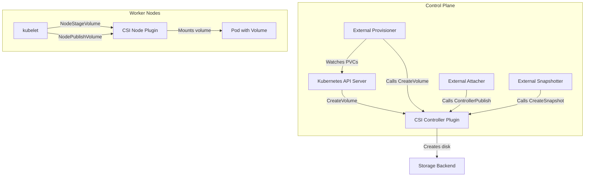
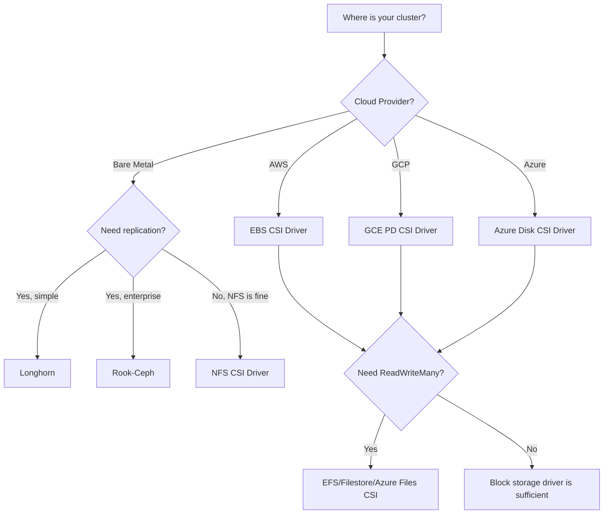

# Understanding Kubernetes CSI Drivers and How to Choose One

Author: [nawazdhandala](https://www.github.com/nawazdhandala)

Tags: Kubernetes, CSI, Storage, Drivers, Cloud Native

Description: A guide to Kubernetes Container Storage Interface (CSI) drivers covering architecture, popular drivers, and selection criteria.

---

The Container Storage Interface (CSI) is a standard that allows Kubernetes to work with any storage system. Before CSI, storage drivers were compiled into Kubernetes itself, making it difficult to add new storage backends or fix bugs without upgrading the entire cluster. CSI decouples storage plugins from the Kubernetes core, letting storage vendors ship and update their drivers independently.

## CSI Architecture

A CSI driver runs as a set of pods in your cluster. It consists of two main components: a controller plugin that handles volume lifecycle operations and a node plugin that handles mounting volumes on nodes.



## CSI Components Explained

| Component | Role | Runs As |
|-----------|------|---------|
| CSI Controller | Creates, deletes, attaches, and snapshots volumes | Deployment (1-3 replicas) |
| CSI Node | Mounts and unmounts volumes on worker nodes | DaemonSet (every node) |
| External Provisioner | Watches PVCs and triggers CreateVolume | Sidecar in controller pod |
| External Attacher | Watches VolumeAttachments and triggers ControllerPublish | Sidecar in controller pod |
| External Snapshotter | Handles VolumeSnapshot requests | Sidecar in controller pod |
| External Resizer | Handles volume expansion requests | Sidecar in controller pod |
| Node Driver Registrar | Registers the CSI driver with kubelet | Sidecar in node pod |

## Popular CSI Drivers

### AWS EBS CSI Driver

```yaml
# Install AWS EBS CSI driver using Helm
# This driver provisions EBS volumes in AWS.
# Requires IAM permissions for EC2 volume operations.
---
# storageclass-ebs.yaml
apiVersion: storage.k8s.io/v1
kind: StorageClass
metadata:
  name: ebs-gp3
provisioner: ebs.csi.aws.com
volumeBindingMode: WaitForFirstConsumer
allowVolumeExpansion: true
parameters:
  type: gp3
  encrypted: "true"
  # Optional: specify a KMS key for encryption
  # kmsKeyId: arn:aws:kms:us-east-1:123456789:key/abc-123
```

### GCE Persistent Disk CSI Driver

```yaml
# storageclass-gce.yaml
# This driver provisions Persistent Disks in GCP.
apiVersion: storage.k8s.io/v1
kind: StorageClass
metadata:
  name: gce-pd-ssd
provisioner: pd.csi.storage.gke.io
volumeBindingMode: WaitForFirstConsumer
allowVolumeExpansion: true
parameters:
  type: pd-ssd
```

### Longhorn CSI Driver

```yaml
# storageclass-longhorn.yaml
# Longhorn is an open-source distributed storage system for Kubernetes.
# It replicates data across nodes for high availability.
apiVersion: storage.k8s.io/v1
kind: StorageClass
metadata:
  name: longhorn-replicated
provisioner: driver.longhorn.io
reclaimPolicy: Delete
allowVolumeExpansion: true
parameters:
  # Number of replicas for each volume
  numberOfReplicas: "3"
  # Data locality preference
  dataLocality: best-effort
  # Use striped storage for better performance
  staleReplicaTimeout: "2880"
```

### Rook-Ceph CSI Driver

```yaml
# storageclass-ceph.yaml
# Rook-Ceph provides distributed block, file, and object storage.
apiVersion: storage.k8s.io/v1
kind: StorageClass
metadata:
  name: ceph-block
provisioner: rook-ceph.rbd.csi.ceph.com
reclaimPolicy: Delete
allowVolumeExpansion: true
parameters:
  clusterID: rook-ceph
  pool: replicapool
  imageFormat: "2"
  imageFeatures: layering
  # Ceph user credentials
  csi.storage.k8s.io/provisioner-secret-name: rook-csi-rbd-provisioner
  csi.storage.k8s.io/provisioner-secret-namespace: rook-ceph
  csi.storage.k8s.io/node-stage-secret-name: rook-csi-rbd-node
  csi.storage.k8s.io/node-stage-secret-namespace: rook-ceph
```

## CSI Driver Installation

Most CSI drivers are installed via Helm charts. Here is an example installing the AWS EBS CSI driver:

```bash
# Add the EBS CSI driver Helm repository
helm repo add aws-ebs-csi-driver https://kubernetes-sigs.github.io/aws-ebs-csi-driver
helm repo update

# Install the driver
# The controller runs as a Deployment with 2 replicas.
# The node plugin runs as a DaemonSet on every node.
helm install aws-ebs-csi-driver aws-ebs-csi-driver/aws-ebs-csi-driver \
  --namespace kube-system \
  --set controller.replicaCount=2 \
  --set controller.serviceAccount.annotations."eks\.amazonaws\.com/role-arn"="arn:aws:iam::123456789:role/ebs-csi-role"

# Verify the installation
kubectl get pods -n kube-system -l app.kubernetes.io/name=aws-ebs-csi-driver
kubectl get csidriver
```

## Choosing a CSI Driver

Use this decision matrix to pick the right driver for your environment.



Key selection criteria:

| Criteria | Block Storage (EBS/PD) | Distributed (Longhorn/Ceph) | File Storage (NFS/EFS) |
|----------|----------------------|---------------------------|----------------------|
| Access Modes | RWO only | RWO, some RWX | RWO, ROX, RWX |
| Performance | High IOPS | Moderate | Moderate |
| Replication | Cloud-managed | Application-managed | Backend-managed |
| Snapshots | Yes | Yes | Limited |
| Complexity | Low | Medium-High | Low |
| Cost | Per-GB + IOPS | Node disk cost | Per-GB |

## Verifying a CSI Driver

```bash
# List all registered CSI drivers
kubectl get csidriver

# Check CSI driver capabilities
kubectl describe csidriver ebs.csi.aws.com

# Verify CSI node info is populated for all nodes
kubectl get csinodes

# Describe a specific node's CSI info
kubectl describe csinode worker-node-01
```

## Troubleshooting CSI Issues

```bash
# Check if the CSI controller pod is running
kubectl get pods -n kube-system -l app=ebs-csi-controller

# View controller logs for provisioning errors
kubectl logs -n kube-system -l app=ebs-csi-controller \
  -c csi-provisioner --tail=50

# View node plugin logs for mount errors
kubectl logs -n kube-system -l app=ebs-csi-node \
  -c ebs-plugin --tail=50

# Check VolumeAttachment objects for attach/detach issues
kubectl get volumeattachment

# Check events for storage-related errors
kubectl get events --field-selector reason=ProvisioningFailed
```

Common problems:

- **ProvisioningFailed** - Check IAM permissions and cloud quotas.
- **AttachVolume failed** - The volume may be in a different AZ than the node.
- **MountVolume failed** - The filesystem may be corrupted or the device is busy.
- **CSI driver not found** - The CSIDriver object is not registered. Reinstall the driver.

## Monitoring CSI Drivers with OneUptime

CSI driver failures directly impact your stateful workloads. A crashed controller pod means no new volumes can be provisioned. A failing node plugin means pods cannot mount their volumes. [OneUptime](https://oneuptime.com) monitors your CSI driver pods, tracks provisioning latency, and alerts you when storage operations fail. Combine this with Kubernetes event monitoring to catch issues before they cascade into application outages.
