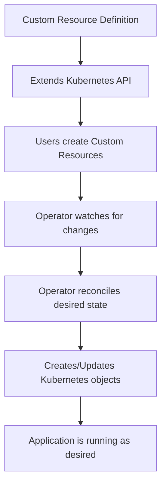
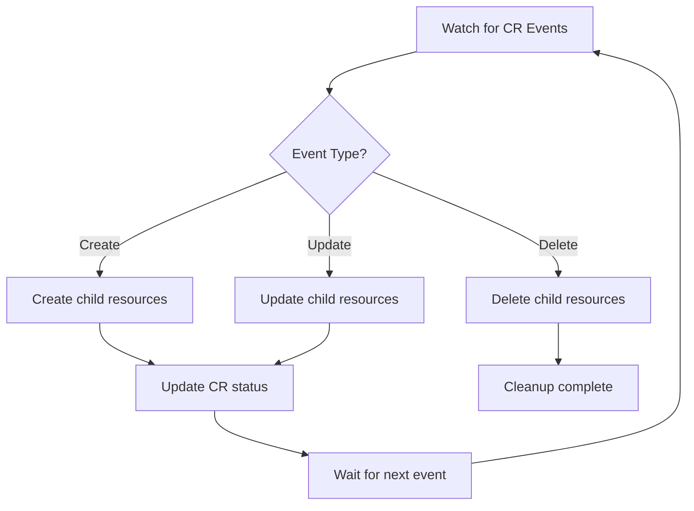

# How to Build Kubernetes Custom Resources and Operators

Author: [nawazdhandala](https://www.github.com/nawazdhandala)

Tags: Kubernetes, CRD, Operators, Custom Resources, Extensibility

Description: A guide to building Kubernetes custom resources and operators using the Operator SDK for extending Kubernetes functionality.

---

Kubernetes is extensible by design. Custom Resource Definitions (CRDs) let you add new resource types to the API, and operators automate the management of those resources. This post walks through creating a CRD, building a controller to manage it, and packaging everything as an operator.

## CRDs and Operators Overview



- **CRD**: Defines a new resource type (like a schema for your custom object).
- **Custom Resource (CR)**: An instance of the CRD (like a row matching that schema).
- **Operator**: A controller that watches custom resources and takes action to match the desired state.

## Creating a Custom Resource Definition

Let us build a CRD for a simple web application that manages its own Deployment and Service.

```yaml
# webapp-crd.yaml
# Define a new resource type called WebApp.
# Users can create WebApp objects and the operator
# will create the underlying Deployment and Service.
apiVersion: apiextensions.k8s.io/v1
kind: CustomResourceDefinition
metadata:
  name: webapps.apps.example.com
spec:
  # The API group for this CRD
  group: apps.example.com
  names:
    kind: WebApp
    listKind: WebAppList
    plural: webapps
    singular: webapp
    # Short name for kubectl (e.g., kubectl get wa)
    shortNames:
      - wa
  scope: Namespaced
  versions:
    - name: v1alpha1
      served: true
      storage: true
      schema:
        openAPIV3Schema:
          type: object
          properties:
            spec:
              type: object
              required:
                - image
                - replicas
              properties:
                # Container image for the web application
                image:
                  type: string
                  description: "Container image to deploy"
                # Number of replicas
                replicas:
                  type: integer
                  minimum: 1
                  maximum: 20
                  description: "Number of pod replicas"
                # Port the application listens on
                port:
                  type: integer
                  default: 8080
                  description: "Container port"
                # Resource requests
                resources:
                  type: object
                  properties:
                    cpu:
                      type: string
                      default: "100m"
                    memory:
                      type: string
                      default: "128Mi"
            status:
              type: object
              properties:
                availableReplicas:
                  type: integer
                conditions:
                  type: array
                  items:
                    type: object
                    properties:
                      type:
                        type: string
                      status:
                        type: string
                      lastTransitionTime:
                        type: string
                      message:
                        type: string
      # Show these columns in kubectl get output
      additionalPrinterColumns:
        - name: Image
          type: string
          jsonPath: .spec.image
        - name: Replicas
          type: integer
          jsonPath: .spec.replicas
        - name: Available
          type: integer
          jsonPath: .status.availableReplicas
        - name: Age
          type: date
          jsonPath: .metadata.creationTimestamp
      subresources:
        status: {}
```

Apply it and create a custom resource:

```bash
# Register the CRD with the cluster
kubectl apply -f webapp-crd.yaml

# Verify the CRD is registered
kubectl get crd webapps.apps.example.com
```

## Creating a Custom Resource

```yaml
# my-webapp.yaml
# An instance of the WebApp custom resource.
# The operator will read this and create a Deployment and Service.
apiVersion: apps.example.com/v1alpha1
kind: WebApp
metadata:
  name: my-frontend
  namespace: default
spec:
  image: nginx:1.25
  replicas: 3
  port: 80
  resources:
    cpu: "200m"
    memory: "256Mi"
```

```bash
# Create the custom resource
kubectl apply -f my-webapp.yaml

# List all WebApp resources
kubectl get webapps
# or using the short name
kubectl get wa
```

## Building the Operator Controller

The operator watches for WebApp resources and creates the corresponding Deployment and Service. Here is the controller logic in Python using the `kopf` framework.

```python
# operator.py
# A Kubernetes operator that manages WebApp custom resources.
# It creates a Deployment and Service for each WebApp CR.
import kopf
import kubernetes
from kubernetes import client

# Handler for when a new WebApp is created
@kopf.on.create("apps.example.com", "v1alpha1", "webapps")
def create_webapp(spec, name, namespace, logger, **kwargs):
    """Create a Deployment and Service for the WebApp."""
    image = spec["image"]
    replicas = spec["replicas"]
    port = spec.get("port", 8080)
    resources = spec.get("resources", {})

    # Build the Deployment object
    deployment = build_deployment(name, namespace, image, replicas, port, resources)

    # Build the Service object
    service = build_service(name, namespace, port)

    # Create the Deployment
    apps_api = client.AppsV1Api()
    apps_api.create_namespaced_deployment(
        namespace=namespace,
        body=deployment,
    )
    logger.info(f"Deployment {name} created with {replicas} replicas")

    # Create the Service
    core_api = client.CoreV1Api()
    core_api.create_namespaced_service(
        namespace=namespace,
        body=service,
    )
    logger.info(f"Service {name} created on port {port}")


# Handler for when a WebApp is updated
@kopf.on.update("apps.example.com", "v1alpha1", "webapps")
def update_webapp(spec, name, namespace, logger, **kwargs):
    """Update the Deployment when the WebApp spec changes."""
    image = spec["image"]
    replicas = spec["replicas"]
    port = spec.get("port", 8080)
    resources = spec.get("resources", {})

    deployment = build_deployment(name, namespace, image, replicas, port, resources)

    apps_api = client.AppsV1Api()
    apps_api.patch_namespaced_deployment(
        name=name,
        namespace=namespace,
        body=deployment,
    )
    logger.info(f"Deployment {name} updated")


# Handler for when a WebApp is deleted
@kopf.on.delete("apps.example.com", "v1alpha1", "webapps")
def delete_webapp(name, namespace, logger, **kwargs):
    """Clean up the Deployment and Service."""
    apps_api = client.AppsV1Api()
    core_api = client.CoreV1Api()

    try:
        apps_api.delete_namespaced_deployment(name=name, namespace=namespace)
        logger.info(f"Deployment {name} deleted")
    except client.exceptions.ApiException as e:
        if e.status != 404:
            raise

    try:
        core_api.delete_namespaced_service(name=name, namespace=namespace)
        logger.info(f"Service {name} deleted")
    except client.exceptions.ApiException as e:
        if e.status != 404:
            raise


def build_deployment(name, namespace, image, replicas, port, resources):
    """Build a Deployment object for the WebApp."""
    return client.V1Deployment(
        metadata=client.V1ObjectMeta(name=name, namespace=namespace),
        spec=client.V1DeploymentSpec(
            replicas=replicas,
            selector=client.V1LabelSelector(
                match_labels={"app": name, "managed-by": "webapp-operator"},
            ),
            template=client.V1PodTemplateSpec(
                metadata=client.V1ObjectMeta(
                    labels={"app": name, "managed-by": "webapp-operator"},
                ),
                spec=client.V1PodSpec(
                    containers=[
                        client.V1Container(
                            name="app",
                            image=image,
                            ports=[client.V1ContainerPort(container_port=port)],
                            resources=client.V1ResourceRequirements(
                                requests={
                                    "cpu": resources.get("cpu", "100m"),
                                    "memory": resources.get("memory", "128Mi"),
                                },
                            ),
                        )
                    ],
                ),
            ),
        ),
    )


def build_service(name, namespace, port):
    """Build a Service object for the WebApp."""
    return client.V1Service(
        metadata=client.V1ObjectMeta(name=name, namespace=namespace),
        spec=client.V1ServiceSpec(
            selector={"app": name, "managed-by": "webapp-operator"},
            ports=[
                client.V1ServicePort(
                    port=port,
                    target_port=port,
                    protocol="TCP",
                )
            ],
            type="ClusterIP",
        ),
    )
```

## Operator Reconciliation Loop

The heart of an operator is the reconciliation loop. It continuously compares the desired state (from the CR) with the actual state (in the cluster) and makes adjustments.



## Deploying the Operator

Package the operator as a container and deploy it to the cluster:

```yaml
# operator-deployment.yaml
# Deploy the WebApp operator in the cluster.
# It needs RBAC permissions to manage Deployments, Services, and WebApps.
apiVersion: apps/v1
kind: Deployment
metadata:
  name: webapp-operator
  namespace: operators
spec:
  replicas: 1
  selector:
    matchLabels:
      app: webapp-operator
  template:
    metadata:
      labels:
        app: webapp-operator
    spec:
      serviceAccountName: webapp-operator
      containers:
        - name: operator
          image: myregistry/webapp-operator:v1.0.0
          command: ["kopf", "run", "operator.py", "--verbose"]
          resources:
            requests:
              cpu: 100m
              memory: 128Mi
            limits:
              cpu: 500m
              memory: 256Mi
---
# RBAC: ServiceAccount for the operator
apiVersion: v1
kind: ServiceAccount
metadata:
  name: webapp-operator
  namespace: operators
---
# RBAC: ClusterRole with permissions to manage resources
apiVersion: rbac.authorization.k8s.io/v1
kind: ClusterRole
metadata:
  name: webapp-operator
rules:
  # Permission to watch and manage WebApp CRs
  - apiGroups: ["apps.example.com"]
    resources: ["webapps", "webapps/status"]
    verbs: ["get", "list", "watch", "patch", "update"]
  # Permission to manage Deployments
  - apiGroups: ["apps"]
    resources: ["deployments"]
    verbs: ["get", "list", "create", "update", "patch", "delete"]
  # Permission to manage Services
  - apiGroups: [""]
    resources: ["services"]
    verbs: ["get", "list", "create", "update", "patch", "delete"]
  # Permission to create events
  - apiGroups: [""]
    resources: ["events"]
    verbs: ["create"]
---
# RBAC: Bind the role to the service account
apiVersion: rbac.authorization.k8s.io/v1
kind: ClusterRoleBinding
metadata:
  name: webapp-operator
roleRef:
  apiGroup: rbac.authorization.k8s.io
  kind: ClusterRole
  name: webapp-operator
subjects:
  - kind: ServiceAccount
    name: webapp-operator
    namespace: operators
```

## Testing the Operator

```bash
# Apply the CRD
kubectl apply -f webapp-crd.yaml

# Deploy the operator
kubectl apply -f operator-deployment.yaml

# Create a WebApp custom resource
kubectl apply -f my-webapp.yaml

# Verify the operator created the Deployment and Service
kubectl get deployments -l managed-by=webapp-operator
kubectl get services -l managed-by=webapp-operator

# Scale by updating the CR
kubectl patch webapp my-frontend --type merge -p '{"spec":{"replicas":5}}'

# Check the operator logs
kubectl logs -n operators deployment/webapp-operator
```

## Best Practices

1. Use owner references so child resources (Deployments, Services) are automatically cleaned up when the CR is deleted.
2. Make your reconciliation logic idempotent - it should produce the same result whether it runs once or a hundred times.
3. Add status subresources to your CRD so users can check the state of their resources with `kubectl get`.
4. Use finalizers for cleanup tasks that must complete before the CR is removed.
5. Add validation to your CRD schema to reject invalid inputs at the API level.
6. Log clearly in your operator so issues are easy to debug.

## Monitoring Operators with OneUptime

Operators run critical automation in your cluster. A broken operator means custom resources stop being reconciled, which can lead to stale deployments and missed updates. [OneUptime](https://oneuptime.com) monitors operator health, tracks reconciliation errors, and alerts you when your operator stops functioning. With OneUptime, you have full visibility into both your operators and the applications they manage.
