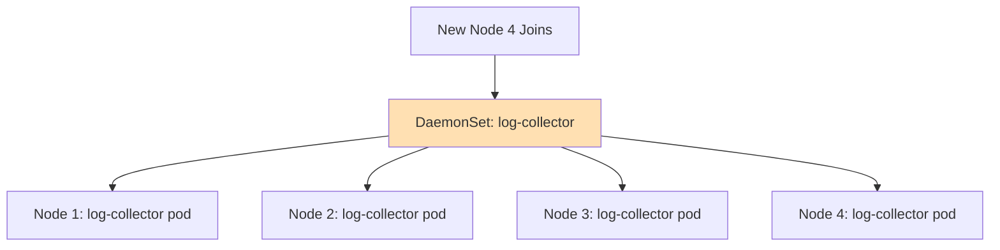
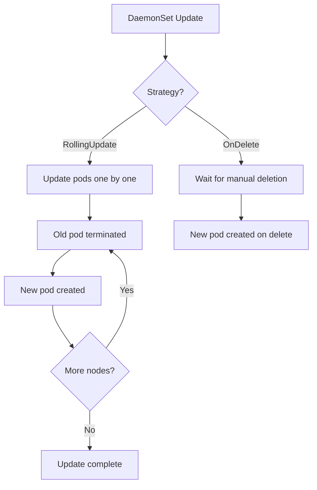

# How to Use Kubernetes DaemonSets for Node-Level Services

Author: [nawazdhandala](https://www.github.com/nawazdhandala)

Tags: Kubernetes, DaemonSets, Monitoring, Logging, Node

Description: Learn how to use Kubernetes DaemonSets for deploying node-level services like log collectors, monitoring agents, and network plugins.

---

Some workloads need to run on every node in your cluster. Log collectors, monitoring agents, storage daemons, and network plugins are all examples. Kubernetes DaemonSets ensure exactly one copy of a pod runs on each (or selected) node. This post covers how DaemonSets work, how to target specific nodes, and common patterns for node-level services.

## How DaemonSets Work

A DaemonSet controller watches for new nodes joining the cluster and automatically schedules a pod on each one. When a node is removed, the pod is garbage collected.



## Basic DaemonSet Example

Here is a DaemonSet that deploys a Fluentd log collector on every node:

```yaml
# fluentd-daemonset.yaml
# Deploy Fluentd on every node to collect container logs
# and forward them to a central logging backend.
apiVersion: apps/v1
kind: DaemonSet
metadata:
  name: fluentd
  namespace: kube-system
  labels:
    app: fluentd
spec:
  selector:
    matchLabels:
      app: fluentd
  template:
    metadata:
      labels:
        app: fluentd
    spec:
      containers:
        - name: fluentd
          image: fluent/fluentd:v1.16
          resources:
            # Set resource limits to prevent the log collector
            # from consuming too many node resources
            limits:
              memory: 200Mi
              cpu: 100m
            requests:
              memory: 100Mi
              cpu: 50m
          # Mount the host log directory into the container
          volumeMounts:
            - name: varlog
              mountPath: /var/log
            - name: containers
              mountPath: /var/lib/docker/containers
              readOnly: true
      volumes:
        # Host path volumes to access node-level log files
        - name: varlog
          hostPath:
            path: /var/log
        - name: containers
          hostPath:
            path: /var/lib/docker/containers
```

## Targeting Specific Nodes

You do not always want a DaemonSet pod on every node. Use `nodeSelector` or `nodeAffinity` to target specific nodes.

### Using nodeSelector

```yaml
# gpu-monitor-daemonset.yaml
# Deploy a GPU monitoring agent only on nodes
# that have GPU hardware attached.
apiVersion: apps/v1
kind: DaemonSet
metadata:
  name: gpu-monitor
spec:
  selector:
    matchLabels:
      app: gpu-monitor
  template:
    metadata:
      labels:
        app: gpu-monitor
    spec:
      # Only schedule on nodes labeled with gpu=true
      nodeSelector:
        gpu: "true"
      containers:
        - name: gpu-monitor
          image: myregistry/gpu-monitor:latest
```

### Using Node Affinity

```yaml
# node-affinity-daemonset.yaml
# Use node affinity for more expressive node selection.
spec:
  template:
    spec:
      affinity:
        nodeAffinity:
          requiredDuringSchedulingIgnoredDuringExecution:
            nodeSelectorTerms:
              - matchExpressions:
                  # Run only on Linux nodes in the us-east-1 zone
                  - key: kubernetes.io/os
                    operator: In
                    values:
                      - linux
                  - key: topology.kubernetes.io/zone
                    operator: In
                    values:
                      - us-east-1a
                      - us-east-1b
```

## Tolerations for Control Plane Nodes

By default, DaemonSet pods are not scheduled on control plane nodes because of taints. Add tolerations if you need your agent on every node, including the control plane.

```yaml
# tolerations.yaml
# Allow the DaemonSet pod to run on control plane nodes
# by tolerating the control-plane taint.
spec:
  template:
    spec:
      tolerations:
        - key: node-role.kubernetes.io/control-plane
          operator: Exists
          effect: NoSchedule
```

## DaemonSet Update Strategies

DaemonSets support two update strategies.



### RollingUpdate (Default)

```yaml
# rolling-update.yaml
# Update one pod at a time across all nodes.
spec:
  updateStrategy:
    type: RollingUpdate
    rollingUpdate:
      # Update one node at a time
      maxUnavailable: 1
```

### OnDelete

```yaml
# on-delete.yaml
# Pods are only updated when manually deleted.
# Useful when you want to control the update order.
spec:
  updateStrategy:
    type: OnDelete
```

## Common DaemonSet Use Cases

### Node Monitoring Agent

```yaml
# node-exporter-daemonset.yaml
# Deploy Prometheus node-exporter on every node
# to collect hardware and OS metrics.
apiVersion: apps/v1
kind: DaemonSet
metadata:
  name: node-exporter
  namespace: monitoring
spec:
  selector:
    matchLabels:
      app: node-exporter
  template:
    metadata:
      labels:
        app: node-exporter
    spec:
      # Run in the host network namespace to access node metrics
      hostNetwork: true
      hostPID: true
      containers:
        - name: node-exporter
          image: prom/node-exporter:v1.7.0
          ports:
            - containerPort: 9100
              hostPort: 9100
          # Security context for reading host-level metrics
          securityContext:
            readOnlyRootFilesystem: true
          resources:
            limits:
              memory: 128Mi
              cpu: 100m
            requests:
              memory: 64Mi
              cpu: 50m
```

### Network Plugin

```yaml
# network-daemonset.yaml
# A simplified network plugin DaemonSet.
# Real CNI plugins like Calico and Cilium follow this pattern.
apiVersion: apps/v1
kind: DaemonSet
metadata:
  name: network-agent
  namespace: kube-system
spec:
  selector:
    matchLabels:
      app: network-agent
  template:
    metadata:
      labels:
        app: network-agent
    spec:
      hostNetwork: true
      containers:
        - name: agent
          image: myregistry/network-agent:latest
          # Privileged mode needed for network configuration
          securityContext:
            privileged: true
          volumeMounts:
            - name: cni-conf
              mountPath: /etc/cni/net.d
      volumes:
        - name: cni-conf
          hostPath:
            path: /etc/cni/net.d
```

## Priority and Preemption

DaemonSet pods that provide critical node services should use a high priority class so they are not evicted when the node is under resource pressure.

```yaml
# priority-class.yaml
# A PriorityClass for critical DaemonSet pods.
apiVersion: scheduling.k8s.io/v1
kind: PriorityClass
metadata:
  name: node-critical
value: 1000000
globalDefault: false
description: "Priority class for critical node-level DaemonSet pods."
---
# Reference it in the DaemonSet
spec:
  template:
    spec:
      priorityClassName: node-critical
```

## Best Practices

1. Always set resource requests and limits on DaemonSet pods to prevent them from starving application workloads.
2. Use `nodeSelector` or `nodeAffinity` to avoid running unnecessary agents on nodes that do not need them.
3. Add tolerations only for the taints you specifically need to target.
4. Use `hostNetwork` and `hostPID` only when the agent genuinely needs host-level access.
5. Monitor DaemonSet pod health to ensure every node is covered.

## Monitoring DaemonSets with OneUptime

A DaemonSet pod failing on one node can create a blind spot in your logging or monitoring. [OneUptime](https://oneuptime.com) can monitor DaemonSet health across your cluster, alerting you when a node-level agent goes down, when log collection stops, or when a monitoring gap appears. With OneUptime, you get full visibility into your node-level infrastructure.
