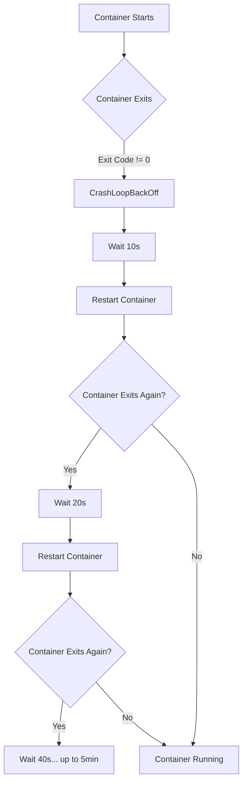
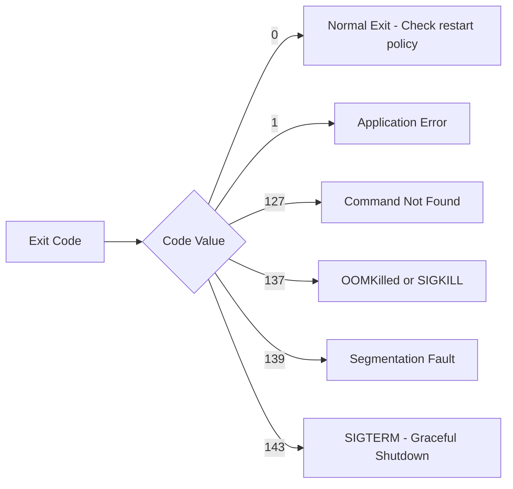
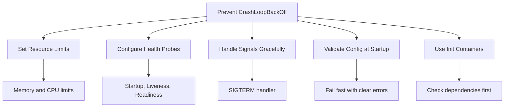

# How to Debug Kubernetes CrashLoopBackOff Errors

Author: [nawazdhandala](https://www.github.com/nawazdhandala)

Tags: Kubernetes, CrashLoopBackOff, Debugging, Troubleshooting, Pods

Description: A systematic guide to debugging CrashLoopBackOff errors in Kubernetes including common causes and step-by-step resolution.

---

CrashLoopBackOff is one of the most common and frustrating errors in Kubernetes. It means your container starts, crashes, and Kubernetes keeps restarting it with increasing delays. This guide walks you through a systematic approach to diagnosing and fixing it.

## What Is CrashLoopBackOff?

When a container in a pod crashes repeatedly, Kubernetes applies an exponential backoff delay before restarting it. The delay starts at 10 seconds and doubles each time up to a maximum of 5 minutes.



## Common Causes

There are several reasons why a container might crash:

1. Application errors or unhandled exceptions
2. Missing configuration or environment variables
3. Failed dependency connections (database, API)
4. Insufficient memory or CPU
5. Incorrect command or entrypoint
6. Missing files or volumes
7. Permission errors
8. Liveness probe failures

## Step 1: Check Pod Status

Start by describing the pod to get detailed status information.

```bash
# List pods and identify the failing one
kubectl get pods -n your-namespace

# Get detailed information about the pod
kubectl describe pod your-pod-name -n your-namespace
```

Look for these key sections in the output:

- **State**: Shows `Waiting` with reason `CrashLoopBackOff`
- **Last State**: Shows `Terminated` with the exit code
- **Restart Count**: How many times Kubernetes has restarted the container
- **Events**: Recent events that may indicate the cause

## Step 2: Check Container Logs

The logs from the crashed container are your best source of information.

```bash
# Get logs from the current container instance
kubectl logs your-pod-name -n your-namespace

# Get logs from the previous crashed instance
kubectl logs your-pod-name -n your-namespace --previous

# If the pod has multiple containers, specify which one
kubectl logs your-pod-name -c container-name -n your-namespace --previous

# Follow logs in real time
kubectl logs your-pod-name -n your-namespace -f
```

## Step 3: Interpret Exit Codes

The exit code tells you how the container terminated.



| Exit Code | Meaning | Likely Cause |
|-----------|---------|--------------|
| 0 | Success | Container exited normally but restartPolicy requires restart |
| 1 | General error | Application threw an unhandled exception |
| 126 | Permission denied | Binary not executable |
| 127 | Command not found | Wrong entrypoint or command |
| 137 | SIGKILL (128+9) | OOMKilled or manual kill |
| 139 | SIGSEGV (128+11) | Segmentation fault in application |
| 143 | SIGTERM (128+15) | Graceful termination requested |

## Step 4: Debug Common Causes

### Missing Environment Variables

```yaml
# deployment.yaml - Make sure all required env vars are set
apiVersion: apps/v1
kind: Deployment
metadata:
  name: my-app
spec:
  replicas: 1
  selector:
    matchLabels:
      app: my-app
  template:
    metadata:
      labels:
        app: my-app
    spec:
      containers:
      - name: my-app
        image: my-app:latest
        env:
        # Database connection string - required by the app
        - name: DATABASE_URL
          valueFrom:
            secretKeyRef:
              name: db-credentials
              key: url
        # API key loaded from a ConfigMap
        - name: API_KEY
          valueFrom:
            configMapKeyRef:
              name: app-config
              key: api-key
```

### Wrong Command or Entrypoint

```yaml
# Check that your command and args are correct
containers:
- name: my-app
  image: my-app:latest
  # Override the entrypoint for debugging
  command: ["/bin/sh"]
  args: ["-c", "echo 'Container started'; exec /app/start.sh"]
```

### Liveness Probe Killing the Container

```yaml
# A misconfigured liveness probe can cause CrashLoopBackOff
containers:
- name: my-app
  image: my-app:latest
  livenessProbe:
    httpGet:
      path: /healthz
      port: 8080
    # Give the app enough time to start
    initialDelaySeconds: 30
    # Check every 10 seconds
    periodSeconds: 10
    # Allow 3 failures before killing the container
    failureThreshold: 3
    # Wait up to 5 seconds for a response
    timeoutSeconds: 5
```

## Step 5: Interactive Debugging

If logs are not enough, you can override the entrypoint to keep the container alive for inspection.

```yaml
# Temporarily override the command to keep the container alive
containers:
- name: my-app
  image: my-app:latest
  # Override command to sleep so you can exec into the container
  command: ["/bin/sh", "-c", "sleep infinity"]
```

Then exec into the running container:

```bash
# Open a shell inside the container
kubectl exec -it your-pod-name -n your-namespace -- /bin/sh

# Check if the application binary exists and is executable
ls -la /app/start.sh

# Try running the application manually to see the error
/app/start.sh

# Check environment variables
env | sort

# Check network connectivity to dependencies
nc -zv database-host 5432

# Check available memory
cat /proc/meminfo
```

## Step 6: Use kubectl debug

For containers that crash too quickly, use ephemeral debug containers.

```bash
# Attach a debug container to a running pod
kubectl debug -it your-pod-name --image=busybox --target=my-app

# Create a copy of the pod with a different command
kubectl debug your-pod-name -it --copy-to=debug-pod --container=my-app -- /bin/sh
```

## Prevention Best Practices



1. **Set proper resource limits** to avoid OOM kills
2. **Configure startup probes** for slow-starting applications
3. **Validate configuration** at startup and fail with clear error messages
4. **Use init containers** to check dependencies before the main container starts
5. **Handle SIGTERM** for graceful shutdown
6. **Log to stdout/stderr** so Kubernetes captures the output

## Quick Debugging Checklist

```bash
# 1. Get pod status
kubectl get pod your-pod -o wide

# 2. Describe the pod
kubectl describe pod your-pod

# 3. Check current logs
kubectl logs your-pod

# 4. Check previous crash logs
kubectl logs your-pod --previous

# 5. Check events in the namespace
kubectl get events -n your-namespace --sort-by='.lastTimestamp'

# 6. Check resource usage
kubectl top pod your-pod
```

## Conclusion

CrashLoopBackOff is a symptom, not a root cause. The key to debugging it is following a systematic approach: check the pod status, read the logs, interpret exit codes, and use interactive debugging when needed. With the right tools and methodology, you can resolve these errors quickly.

For continuous monitoring of your Kubernetes pods and automatic alerting when CrashLoopBackOff events occur, check out [OneUptime](https://oneuptime.com). OneUptime provides real-time monitoring, alerting, and incident management to help you catch and resolve Kubernetes issues before they impact your users.
