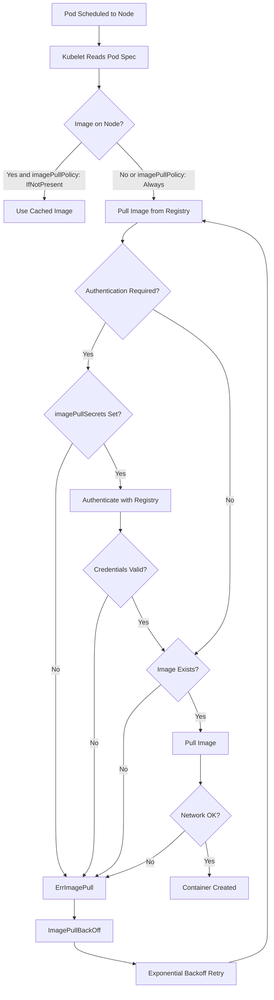
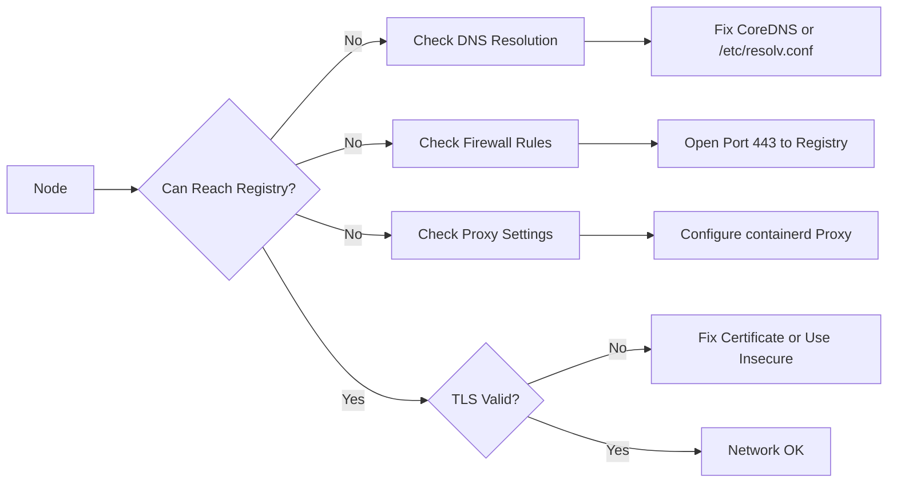

# How to Fix Kubernetes ImagePullBackOff and ErrImagePull Errors

Author: [nawazdhandala](https://www.github.com/nawazdhandala)

Tags: Kubernetes, ImagePullBackOff, Container Registry, Debugging, Pods

Description: Learn how to troubleshoot and fix ImagePullBackOff and ErrImagePull errors caused by registry authentication, image names, and network issues.

---

ImagePullBackOff and ErrImagePull are Kubernetes errors that occur when the kubelet cannot pull a container image. These errors block pod startup entirely. This guide covers every common cause and the exact steps to fix each one.

## Understanding Image Pull Errors

Kubernetes goes through a specific flow when pulling images. Understanding this flow helps you pinpoint where the failure occurs.



## Step 1: Identify the Error

```bash
# Check pod status
kubectl get pods -n your-namespace

# Look for these status values:
# ErrImagePull     - First failed attempt to pull the image
# ImagePullBackOff - Subsequent failures with backoff delay
```

Get detailed information about the failure:

```bash
# Describe the pod to see events
kubectl describe pod your-pod-name -n your-namespace
```

Look at the Events section for messages like:

- `Failed to pull image "registry.example.com/app:v1": rpc error`
- `unauthorized: authentication required`
- `manifest unknown: manifest unknown`
- `dial tcp: lookup registry.example.com: no such host`

## Step 2: Check the Image Name and Tag

The most common cause is a typo in the image name or tag.

```yaml
# deployment.yaml - Double check every part of the image reference
apiVersion: apps/v1
kind: Deployment
metadata:
  name: my-app
spec:
  replicas: 1
  selector:
    matchLabels:
      app: my-app
  template:
    metadata:
      labels:
        app: my-app
    spec:
      containers:
      - name: my-app
        # Full image reference has three parts:
        # registry/repository:tag
        image: registry.example.com/my-team/my-app:v1.2.3
        # Avoid using :latest in production
        imagePullPolicy: IfNotPresent
```

Verify the image exists by pulling it locally:

```bash
# Try pulling the image on your local machine
docker pull registry.example.com/my-team/my-app:v1.2.3

# List available tags for the image
# For Docker Hub
curl -s "https://hub.docker.com/v2/repositories/library/nginx/tags/?page_size=10" | jq '.results[].name'

# For a private registry
curl -s -u user:pass "https://registry.example.com/v2/my-team/my-app/tags/list" | jq
```

## Step 3: Fix Registry Authentication

Private registries require authentication. Kubernetes uses imagePullSecrets to store credentials.

```bash
# Create a Docker registry secret
kubectl create secret docker-registry my-registry-secret \
  --docker-server=registry.example.com \
  --docker-username=my-user \
  --docker-password=my-password \
  --docker-email=user@example.com \
  -n your-namespace
```

```yaml
# Reference the secret in your pod spec
apiVersion: apps/v1
kind: Deployment
metadata:
  name: my-app
spec:
  replicas: 1
  selector:
    matchLabels:
      app: my-app
  template:
    metadata:
      labels:
        app: my-app
    spec:
      # Add imagePullSecrets to authenticate with the registry
      imagePullSecrets:
      - name: my-registry-secret
      containers:
      - name: my-app
        image: registry.example.com/my-team/my-app:v1.2.3
```

You can also attach the secret to a service account so every pod in the namespace uses it automatically:

```bash
# Patch the default service account to include the pull secret
kubectl patch serviceaccount default \
  -n your-namespace \
  -p '{"imagePullSecrets": [{"name": "my-registry-secret"}]}'
```

### Verify the Secret

```bash
# Check the secret exists in the right namespace
kubectl get secret my-registry-secret -n your-namespace

# Decode and inspect the secret contents
kubectl get secret my-registry-secret -n your-namespace -o jsonpath='{.data.\.dockerconfigjson}' | base64 -d | jq
```

## Step 4: Fix Network Issues



Debug network connectivity from a node:

```bash
# SSH into the node where the pod is scheduled
# Or use a debug pod on that node
kubectl debug node/your-node -it --image=busybox

# Test DNS resolution
nslookup registry.example.com

# Test network connectivity
wget -q --spider https://registry.example.com/v2/
```

### Configure Proxy for containerd

If your cluster uses a proxy, containerd needs to know about it.

```bash
# Create the containerd proxy configuration directory
sudo mkdir -p /etc/systemd/system/containerd.service.d

# Create a proxy configuration file
sudo cat > /etc/systemd/system/containerd.service.d/proxy.conf << EOF
[Service]
Environment="HTTP_PROXY=http://proxy.example.com:3128"
Environment="HTTPS_PROXY=http://proxy.example.com:3128"
Environment="NO_PROXY=localhost,127.0.0.1,10.0.0.0/8,.cluster.local"
EOF

# Reload and restart containerd
sudo systemctl daemon-reload
sudo systemctl restart containerd
```

## Step 5: Fix TLS Certificate Issues

For registries with self-signed certificates:

```bash
# Copy the CA certificate to the node
sudo cp ca.crt /etc/containerd/certs.d/registry.example.com/ca.crt

# Or configure containerd to skip TLS verification (not recommended for production)
# Edit /etc/containerd/config.toml
```

```toml
# /etc/containerd/config.toml
# Add the registry mirror configuration
[plugins."io.containerd.grpc.v1.cri".registry.configs]
  [plugins."io.containerd.grpc.v1.cri".registry.configs."registry.example.com".tls]
    ca_file = "/etc/containerd/certs.d/registry.example.com/ca.crt"
```

## Step 6: Handle Rate Limiting

Docker Hub and other registries enforce rate limits.

```bash
# Check if you are being rate limited (Docker Hub)
curl -s -I "https://auth.docker.io/token?service=registry.docker.io&scope=repository:library/nginx:pull" \
  | grep -i ratelimit
```

Solutions for rate limiting:

1. Authenticate with Docker Hub to get higher limits
2. Use a registry mirror or cache
3. Set `imagePullPolicy: IfNotPresent` to reduce pulls

## Debugging Checklist

```bash
# 1. Check pod events for the exact error message
kubectl describe pod your-pod -n your-namespace | grep -A 20 Events

# 2. Verify the image name and tag
kubectl get pod your-pod -n your-namespace -o jsonpath='{.spec.containers[*].image}'

# 3. Check if the pull secret exists
kubectl get secrets -n your-namespace | grep registry

# 4. Verify the pull secret is referenced in the pod
kubectl get pod your-pod -n your-namespace -o jsonpath='{.spec.imagePullSecrets}'

# 5. Test pulling the image manually on the node
crictl pull registry.example.com/my-team/my-app:v1.2.3

# 6. Check node-level events
kubectl get events -n your-namespace --field-selector reason=Failed --sort-by='.lastTimestamp'
```

## Conclusion

ImagePullBackOff errors always come down to one of four issues: wrong image reference, missing authentication, network problems, or TLS certificate issues. By checking each of these systematically, you can resolve the error quickly.

To monitor your Kubernetes clusters for image pull failures and other pod issues in real time, try [OneUptime](https://oneuptime.com). OneUptime provides automated alerting and incident management so you can detect and respond to deployment failures before they affect your users.
