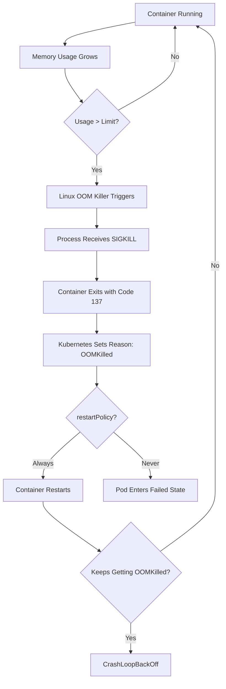
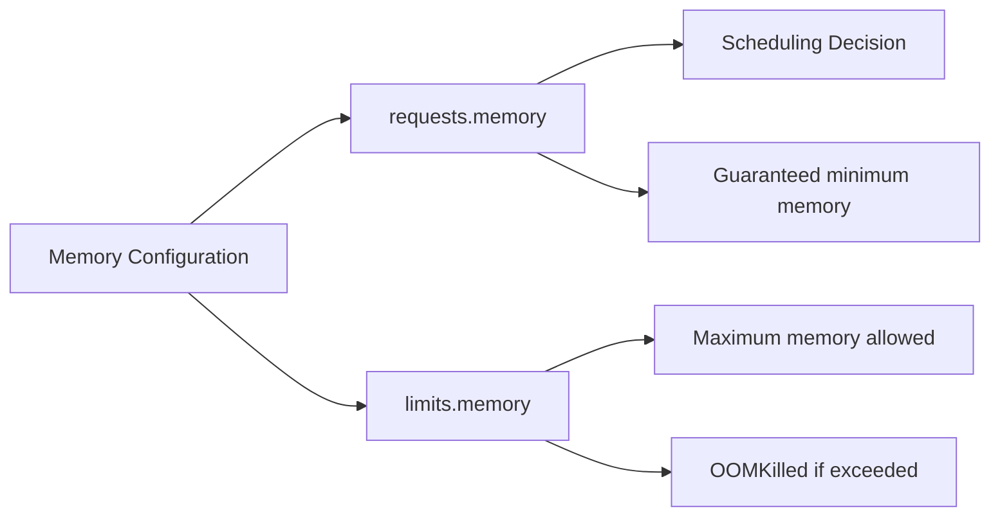
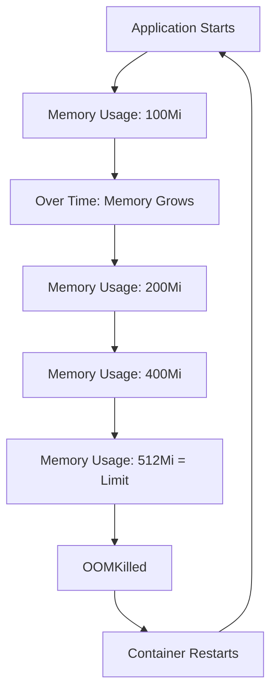

# How to Debug Kubernetes OOMKilled Errors and Memory Issues

Author: [nawazdhandala](https://www.github.com/nawazdhandala)

Tags: Kubernetes, OOMKilled, Memory, Debugging, Resource Limits

Description: Learn how to diagnose and fix OOMKilled errors in Kubernetes including memory profiling and proper limit configuration.

---

OOMKilled (Out of Memory Killed) happens when a container uses more memory than its configured limit. The Linux kernel OOM killer terminates the process, and Kubernetes restarts the container. This leads to CrashLoopBackOff if the problem persists. This guide shows you how to diagnose memory issues and configure limits correctly.

## How OOMKilled Works

Kubernetes uses Linux cgroups to enforce memory limits. When a container exceeds its memory limit, the kernel sends a SIGKILL (signal 9) to the process.



## Step 1: Confirm OOMKilled

```bash
# Check pod status for OOMKilled
kubectl get pods -n your-namespace

# Get detailed container status
kubectl describe pod your-pod-name -n your-namespace
```

Look for these indicators in the output:

```
Last State:     Terminated
  Reason:       OOMKilled
  Exit Code:    137
```

You can also check with JSON output:

```bash
# Get the last termination reason for each container
kubectl get pod your-pod-name -n your-namespace \
  -o jsonpath='{.status.containerStatuses[*].lastState.terminated.reason}'

# Check all pods in a namespace for OOMKilled
kubectl get pods -n your-namespace -o json | \
  jq '.items[] | select(.status.containerStatuses[]?.lastState.terminated.reason == "OOMKilled") | .metadata.name'
```

## Step 2: Check Current Memory Usage

```bash
# Check memory usage for pods (requires metrics-server)
kubectl top pods -n your-namespace

# Check memory usage for a specific pod
kubectl top pod your-pod-name -n your-namespace --containers

# Check node-level memory
kubectl top nodes
```

Compare the actual usage against the configured limits:

```bash
# Get the memory limit for a pod
kubectl get pod your-pod-name -n your-namespace \
  -o jsonpath='{.spec.containers[*].resources.limits.memory}'

# Get both requests and limits
kubectl get pod your-pod-name -n your-namespace \
  -o jsonpath='{range .spec.containers[*]}{.name}: requests={.resources.requests.memory}, limits={.resources.limits.memory}{"\n"}{end}'
```

## Step 3: Understand Memory Requests vs Limits



```yaml
# deployment.yaml - Properly configured memory resources
apiVersion: apps/v1
kind: Deployment
metadata:
  name: my-app
spec:
  replicas: 2
  selector:
    matchLabels:
      app: my-app
  template:
    metadata:
      labels:
        app: my-app
    spec:
      containers:
      - name: my-app
        image: my-app:latest
        resources:
          # Requests: The scheduler uses this to find a node
          # Set to the average memory usage of your application
          requests:
            memory: "256Mi"
          # Limits: The maximum memory the container can use
          # Set to the peak memory usage plus a safety margin
          limits:
            memory: "512Mi"
```

## Step 4: Profile Memory Usage

Before adjusting limits, understand how much memory your application actually needs.

### Using kubectl exec

```bash
# Check memory usage inside the container
kubectl exec -it your-pod-name -n your-namespace -- cat /proc/meminfo

# Check the cgroup memory limit and current usage
kubectl exec -it your-pod-name -n your-namespace -- cat /sys/fs/cgroup/memory.current
kubectl exec -it your-pod-name -n your-namespace -- cat /sys/fs/cgroup/memory.max

# Check process memory usage
kubectl exec -it your-pod-name -n your-namespace -- ps aux --sort=-%mem | head -10

# For Java applications, check heap usage
kubectl exec -it your-pod-name -n your-namespace -- jcmd 1 GC.heap_info
```

### Using Prometheus Metrics

```bash
# Query container memory usage over time with PromQL
# Current working set memory (excludes cache)
container_memory_working_set_bytes{pod="your-pod-name", container="my-app"}

# Memory usage including cache
container_memory_usage_bytes{pod="your-pod-name", container="my-app"}

# Memory limit
container_spec_memory_limit_bytes{pod="your-pod-name", container="my-app"}

# Percentage of limit being used
container_memory_working_set_bytes{pod="your-pod-name"} /
container_spec_memory_limit_bytes{pod="your-pod-name"} * 100
```

## Step 5: Common Causes and Fixes

### Memory Leak

If memory keeps growing over time until OOMKilled, you have a memory leak.



### Java Heap Configuration

Java applications need special attention because the JVM manages its own heap.

```yaml
# deployment.yaml - Java app with proper heap configuration
apiVersion: apps/v1
kind: Deployment
metadata:
  name: java-app
spec:
  replicas: 1
  selector:
    matchLabels:
      app: java-app
  template:
    metadata:
      labels:
        app: java-app
    spec:
      containers:
      - name: java-app
        image: java-app:latest
        env:
        # Set JVM heap to 75% of the container memory limit
        # Leave room for non-heap memory (thread stacks, native memory, etc.)
        - name: JAVA_OPTS
          value: "-XX:MaxRAMPercentage=75.0 -XX:+UseContainerSupport"
        resources:
          requests:
            memory: "512Mi"
          limits:
            # The JVM will use up to 75% of this for heap (384Mi)
            # The remaining 128Mi is for non-heap usage
            memory: "512Mi"
```

### Node.js Heap Configuration

```yaml
# deployment.yaml - Node.js app with proper heap configuration
containers:
- name: node-app
  image: node-app:latest
  env:
  # Set Node.js max old space size to 75% of the container memory limit
  - name: NODE_OPTIONS
    value: "--max-old-space-size=384"
  resources:
    requests:
      memory: "256Mi"
    limits:
      # 384Mi max heap + overhead = 512Mi total limit
      memory: "512Mi"
```

### Python Memory Configuration

```yaml
# deployment.yaml - Python app with memory monitoring
containers:
- name: python-app
  image: python-app:latest
  env:
  # Enable Python memory tracking for debugging
  - name: PYTHONTRACEMALLOC
    value: "1"
  resources:
    requests:
      memory: "256Mi"
    limits:
      memory: "512Mi"
```

## Step 6: Set Up Memory Monitoring

Create a Prometheus alert for pods approaching their memory limits:

```yaml
# prometheus-rules.yaml - Alert when memory usage is high
apiVersion: monitoring.coreos.com/v1
kind: PrometheusRule
metadata:
  name: memory-alerts
spec:
  groups:
  - name: memory
    rules:
    # Alert when container memory usage exceeds 85% of its limit
    - alert: ContainerMemoryHigh
      expr: |
        container_memory_working_set_bytes{container!=""}
        / container_spec_memory_limit_bytes{container!=""}
        > 0.85
      for: 5m
      labels:
        severity: warning
      annotations:
        summary: "Container {{ $labels.container }} in pod {{ $labels.pod }} is using more than 85% of its memory limit"
    # Alert when a container was OOMKilled
    - alert: ContainerOOMKilled
      expr: |
        kube_pod_container_status_last_terminated_reason{reason="OOMKilled"} == 1
      for: 0m
      labels:
        severity: critical
      annotations:
        summary: "Container {{ $labels.container }} in pod {{ $labels.pod }} was OOMKilled"
```

## Step 7: Use VPA for Automatic Right-Sizing

The Vertical Pod Autoscaler (VPA) can recommend or automatically adjust resource requests and limits based on actual usage.

```yaml
# vpa.yaml - Get memory recommendations from VPA
apiVersion: autoscaling.k8s.io/v1
kind: VerticalPodAutoscaler
metadata:
  name: my-app-vpa
spec:
  targetRef:
    apiVersion: apps/v1
    kind: Deployment
    name: my-app
  # Start with "Off" mode to get recommendations without auto-applying
  updatePolicy:
    updateMode: "Off"
```

```bash
# Check VPA recommendations
kubectl describe vpa my-app-vpa
```

## Quick Debugging Checklist

```bash
# 1. Confirm OOMKilled
kubectl describe pod your-pod | grep -A 3 "Last State"

# 2. Check current memory usage
kubectl top pod your-pod --containers

# 3. Check configured limits
kubectl get pod your-pod -o jsonpath='{.spec.containers[*].resources}'

# 4. Look at memory usage over time in Prometheus
# container_memory_working_set_bytes{pod="your-pod"}

# 5. Check for OOMKilled events across the namespace
kubectl get events -n your-namespace | grep OOMKill
```

## Conclusion

OOMKilled errors are caused by containers exceeding their memory limits. The fix is to either increase the memory limit or reduce the application memory usage. Always profile your application first before changing limits, and set up monitoring to catch memory issues before they cause OOMKills.

For continuous memory monitoring and automatic OOMKilled alerting across all your Kubernetes clusters, check out [OneUptime](https://oneuptime.com). OneUptime helps you track resource usage trends and get notified instantly when containers are at risk of being OOMKilled.
