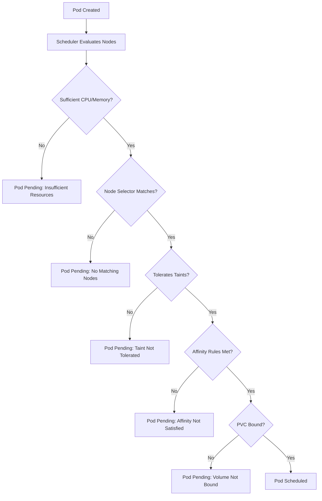
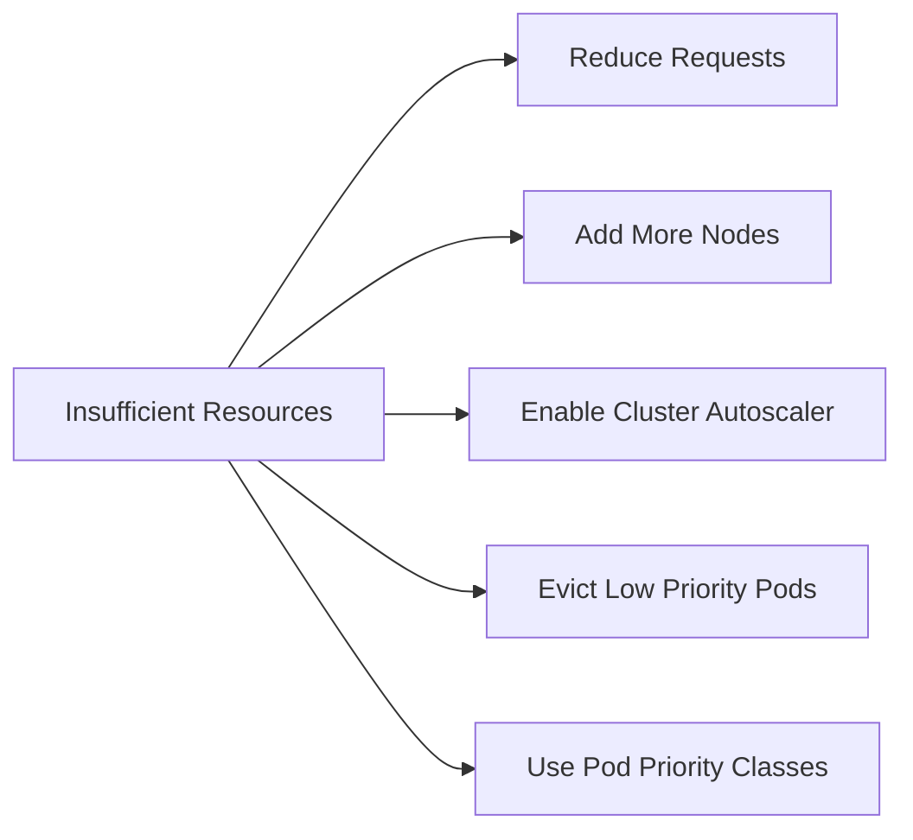

# How to Debug Kubernetes Pods Stuck in Pending State

Author: [nawazdhandala](https://www.github.com/nawazdhandala)

Tags: Kubernetes, Pending, Scheduling, Debugging, Resources

Description: Learn how to troubleshoot pods stuck in Pending state due to insufficient resources, node selectors, taints, and storage issues.

---

A pod stuck in Pending state means the Kubernetes scheduler cannot find a suitable node to run it on. Unlike CrashLoopBackOff where the container starts and fails, Pending pods never start at all. This guide covers every reason a pod might be stuck and how to fix each one.

## Why Pods Get Stuck in Pending

The scheduler evaluates every node against the pod requirements. If no node passes all the checks, the pod stays Pending.



## Step 1: Get the Pending Reason

```bash
# List pods and filter for Pending state
kubectl get pods -n your-namespace --field-selector=status.phase=Pending

# Describe the pod to see why it is pending
kubectl describe pod your-pod-name -n your-namespace
```

The Events section will contain a message from the scheduler explaining exactly why the pod cannot be scheduled.

## Step 2: Insufficient Resources

This is the most common cause. The scheduler cannot find a node with enough free CPU or memory.

```bash
# Check resource usage across all nodes
kubectl top nodes

# Check resource requests and limits for all pods on a node
kubectl describe node your-node-name | grep -A 20 "Allocated resources"
```

```yaml
# deployment.yaml - Review your resource requests
apiVersion: apps/v1
kind: Deployment
metadata:
  name: my-app
spec:
  replicas: 3
  selector:
    matchLabels:
      app: my-app
  template:
    metadata:
      labels:
        app: my-app
    spec:
      containers:
      - name: my-app
        image: my-app:latest
        resources:
          # Requests are what the scheduler uses for placement decisions
          requests:
            cpu: "250m"        # 0.25 CPU cores
            memory: "256Mi"    # 256 megabytes
          # Limits are the maximum the container can use
          limits:
            cpu: "500m"
            memory: "512Mi"
```

### Solutions for Insufficient Resources



```yaml
# priority-class.yaml - Define priority classes so important pods get scheduled first
apiVersion: scheduling.k8s.io/v1
kind: PriorityClass
metadata:
  name: high-priority
# Higher value means higher priority
value: 1000
globalDefault: false
description: "Priority class for critical application pods"
---
# Use the priority class in your pod spec
apiVersion: v1
kind: Pod
metadata:
  name: critical-app
spec:
  # Reference the priority class
  priorityClassName: high-priority
  containers:
  - name: app
    image: my-app:latest
    resources:
      requests:
        cpu: "500m"
        memory: "512Mi"
```

## Step 3: Node Selector and Node Affinity

Pods with nodeSelector or nodeAffinity rules can only run on nodes with matching labels.

```bash
# Check which labels are on your nodes
kubectl get nodes --show-labels

# Check if any nodes match a specific label
kubectl get nodes -l disktype=ssd

# Add a label to a node
kubectl label nodes your-node-name disktype=ssd
```

```yaml
# Pod with nodeSelector - only runs on nodes with the matching label
apiVersion: v1
kind: Pod
metadata:
  name: my-app
spec:
  # Simple node selection by label
  nodeSelector:
    disktype: ssd
  containers:
  - name: app
    image: my-app:latest
```

```yaml
# Pod with node affinity - more flexible than nodeSelector
apiVersion: v1
kind: Pod
metadata:
  name: my-app
spec:
  affinity:
    nodeAffinity:
      # requiredDuringSchedulingIgnoredDuringExecution means the pod
      # will NOT be scheduled if no node matches
      requiredDuringSchedulingIgnoredDuringExecution:
        nodeSelectorTerms:
        - matchExpressions:
          - key: topology.kubernetes.io/zone
            operator: In
            values:
            - us-east-1a
            - us-east-1b
      # preferredDuringSchedulingIgnoredDuringExecution is a soft preference
      preferredDuringSchedulingIgnoredDuringExecution:
      - weight: 1
        preference:
          matchExpressions:
          - key: disktype
            operator: In
            values:
            - ssd
  containers:
  - name: app
    image: my-app:latest
```

## Step 4: Taints and Tolerations

Nodes can have taints that repel pods unless the pod has a matching toleration.

```bash
# Check taints on all nodes
kubectl get nodes -o custom-columns=NAME:.metadata.name,TAINTS:.spec.taints

# Check taints on a specific node
kubectl describe node your-node-name | grep Taints

# Remove a taint from a node (the minus sign at the end removes it)
kubectl taint nodes your-node-name key=value:NoSchedule-
```

```yaml
# Pod with tolerations to run on tainted nodes
apiVersion: v1
kind: Pod
metadata:
  name: my-app
spec:
  # Tolerations allow the pod to be scheduled on nodes with matching taints
  tolerations:
  - key: "dedicated"
    operator: "Equal"
    value: "gpu"
    effect: "NoSchedule"
  containers:
  - name: app
    image: my-app:latest
```

## Step 5: PersistentVolumeClaim Issues

Pods that reference a PVC will stay Pending if the PVC is not bound to a PersistentVolume.

```bash
# Check PVC status
kubectl get pvc -n your-namespace

# Look for PVCs in Pending state
kubectl describe pvc your-pvc-name -n your-namespace

# Check available PersistentVolumes
kubectl get pv
```

Common PVC issues:

- No PersistentVolume available that matches the PVC requirements
- StorageClass does not exist or is not provisioning volumes
- Volume is already bound to another PVC

```yaml
# pvc.yaml - Ensure the storageClassName matches an available StorageClass
apiVersion: v1
kind: PersistentVolumeClaim
metadata:
  name: my-data
spec:
  accessModes:
  - ReadWriteOnce
  # Make sure this StorageClass exists in your cluster
  storageClassName: standard
  resources:
    requests:
      # Check that the cluster can provision this amount of storage
      storage: 10Gi
```

```bash
# Check available storage classes
kubectl get storageclass

# Check if the default storage class is set
kubectl get storageclass -o custom-columns=NAME:.metadata.name,DEFAULT:.metadata.annotations."storageclass\.kubernetes\.io/is-default-class"
```

## Step 6: ResourceQuota Limits

Namespace-level ResourceQuotas can prevent pods from being created.

```bash
# Check resource quotas in the namespace
kubectl get resourcequota -n your-namespace

# Get details on quota usage
kubectl describe resourcequota -n your-namespace
```

```yaml
# resource-quota.yaml - Example of a namespace quota
apiVersion: v1
kind: ResourceQuota
metadata:
  name: compute-quota
  namespace: your-namespace
spec:
  hard:
    # Maximum number of pods in this namespace
    pods: "20"
    # Total CPU requests across all pods
    requests.cpu: "4"
    # Total memory requests across all pods
    requests.memory: "8Gi"
    # Total CPU limits across all pods
    limits.cpu: "8"
    # Total memory limits across all pods
    limits.memory: "16Gi"
```

## Quick Debugging Checklist

```bash
# 1. Get the scheduler message
kubectl describe pod your-pod | grep -A 5 "Events"

# 2. Check node capacity and allocations
kubectl describe nodes | grep -A 5 "Allocated resources"

# 3. Check node labels and taints
kubectl get nodes --show-labels
kubectl describe nodes | grep Taints

# 4. Check PVC status
kubectl get pvc -n your-namespace

# 5. Check resource quotas
kubectl describe resourcequota -n your-namespace

# 6. Check if the cluster autoscaler is working
kubectl get events -n kube-system | grep cluster-autoscaler
```

## Conclusion

Pods stuck in Pending state always have a clear reason in the scheduler events. The most common causes are insufficient resources, node selector mismatches, taints without tolerations, and unbound PVCs. Always start with `kubectl describe pod` to read the scheduler message.

For automated monitoring of pod scheduling issues across your Kubernetes clusters, check out [OneUptime](https://oneuptime.com). OneUptime helps you detect Pending pods, resource bottlenecks, and scheduling failures in real time so you can keep your workloads running smoothly.
