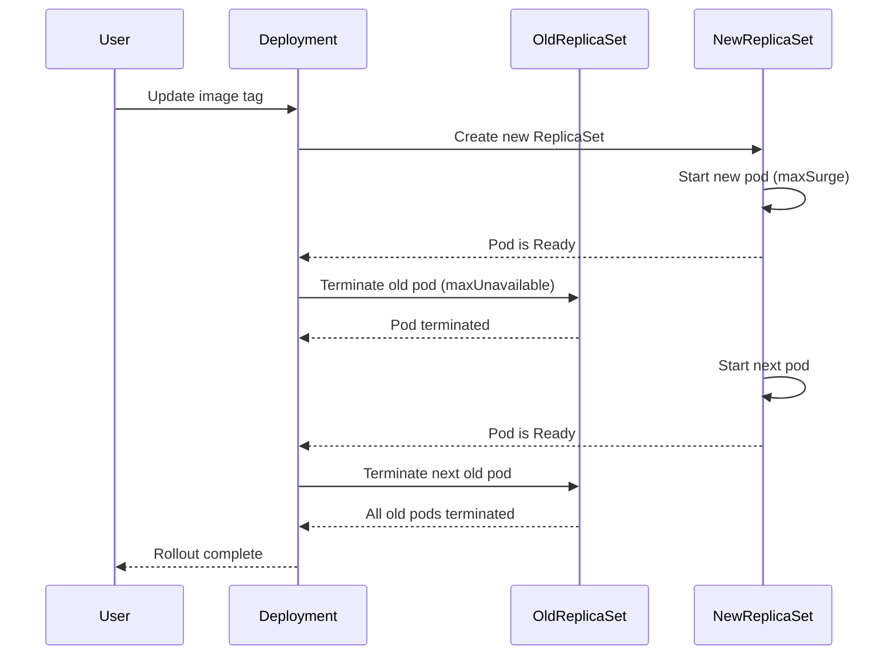
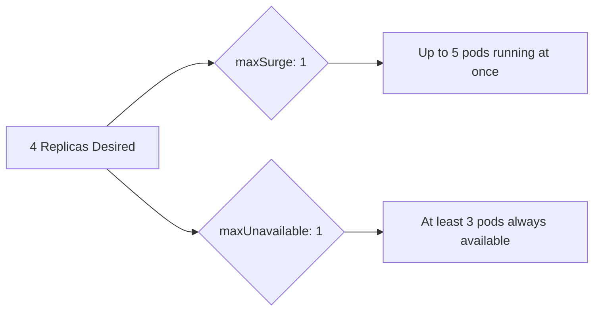
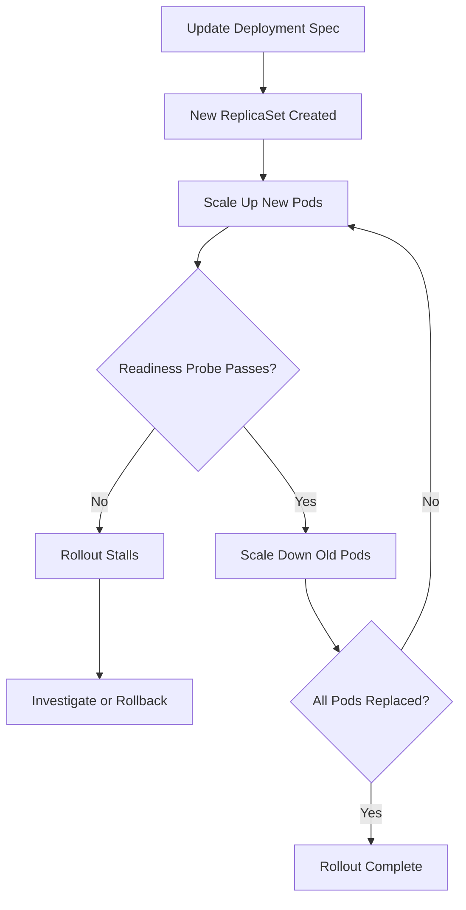

# How to Configure Kubernetes Deployments for Zero-Downtime Rolling Updates

Author: [nawazdhandala](https://www.github.com/nawazdhandala)

Tags: Kubernetes, Deployments, Rolling Updates, Zero Downtime, Strategy

Description: Learn how to configure Kubernetes deployments for zero-downtime rolling updates with proper health checks and rollback strategies.

---

Rolling updates let you push new versions of your application without any downtime. Kubernetes Deployments give you fine-grained control over how pods are replaced during an update. This post walks through the configuration options, health checks, and rollback strategies you need to get zero-downtime deployments right.

## How Rolling Updates Work

When you update a Deployment, Kubernetes creates a new ReplicaSet and gradually scales it up while scaling the old one down. The speed and safety of this process depend on two key parameters: `maxUnavailable` and `maxSurge`.



## Basic Deployment with Rolling Update Strategy

Here is a Deployment manifest configured for safe rolling updates:

```yaml
# deployment.yaml
# A Deployment with a rolling update strategy that ensures
# at least 75% of desired pods are always available.
apiVersion: apps/v1
kind: Deployment
metadata:
  name: web-app
  labels:
    app: web-app
spec:
  # Total number of desired pods
  replicas: 4
  # Rolling update strategy configuration
  strategy:
    type: RollingUpdate
    rollingUpdate:
      # At most 1 pod can be unavailable during the update
      maxUnavailable: 1
      # At most 1 extra pod can be created above the desired count
      maxSurge: 1
  selector:
    matchLabels:
      app: web-app
  template:
    metadata:
      labels:
        app: web-app
    spec:
      containers:
        - name: web-app
          image: myregistry/web-app:v2.0.0
          ports:
            - containerPort: 8080
```

## Understanding maxUnavailable and maxSurge

These two fields control the pace and safety of the rollout.

- **maxUnavailable**: The maximum number of pods that can be unavailable during the update. Setting this to 0 means all old pods must stay running until new ones are ready.
- **maxSurge**: The maximum number of pods that can be created above the desired replica count. Setting this higher speeds up the rollout.



For true zero-downtime, set `maxUnavailable: 0` and `maxSurge: 1`:

```yaml
# zero-downtime-strategy.yaml
# This configuration ensures no pod is removed until
# its replacement is fully ready.
spec:
  strategy:
    type: RollingUpdate
    rollingUpdate:
      # Never remove an old pod until the new one is ready
      maxUnavailable: 0
      # Allow one extra pod during the transition
      maxSurge: 1
```

## Adding Health Checks for Safe Rollouts

Rolling updates only work safely when Kubernetes knows whether a pod is actually ready to serve traffic. Without readiness probes, Kubernetes assumes a pod is ready as soon as its container starts, which can send traffic to an application that has not finished loading.

```yaml
# deployment-with-probes.yaml
# Deployment with readiness and liveness probes
# to ensure traffic only goes to healthy pods.
apiVersion: apps/v1
kind: Deployment
metadata:
  name: web-app
spec:
  replicas: 4
  strategy:
    type: RollingUpdate
    rollingUpdate:
      maxUnavailable: 0
      maxSurge: 1
  selector:
    matchLabels:
      app: web-app
  template:
    metadata:
      labels:
        app: web-app
    spec:
      containers:
        - name: web-app
          image: myregistry/web-app:v2.0.0
          ports:
            - containerPort: 8080
          # Readiness probe: pod receives traffic only when this passes
          readinessProbe:
            httpGet:
              path: /healthz
              port: 8080
            initialDelaySeconds: 5
            periodSeconds: 5
            failureThreshold: 3
          # Liveness probe: pod is restarted if this fails
          livenessProbe:
            httpGet:
              path: /healthz
              port: 8080
            initialDelaySeconds: 15
            periodSeconds: 10
            failureThreshold: 3
```

## Graceful Shutdown with Lifecycle Hooks

When Kubernetes terminates a pod, it sends a SIGTERM signal. Your application needs time to finish in-flight requests. Use `preStop` hooks and `terminationGracePeriodSeconds` to handle this.

```yaml
# graceful-shutdown.yaml
# Configure a preStop hook so the pod has time to
# drain connections before it is removed.
spec:
  template:
    spec:
      # Allow up to 60 seconds for graceful shutdown
      terminationGracePeriodSeconds: 60
      containers:
        - name: web-app
          image: myregistry/web-app:v2.0.0
          lifecycle:
            preStop:
              exec:
                # Sleep briefly to allow the endpoints controller
                # to remove this pod from the service before shutdown begins
                command: ["/bin/sh", "-c", "sleep 10"]
```

## Rolling Back a Deployment

If something goes wrong, Kubernetes keeps a history of previous ReplicaSets so you can roll back quickly.

```bash
# Check the rollout status
kubectl rollout status deployment/web-app

# View rollout history
kubectl rollout history deployment/web-app

# Roll back to the previous version
kubectl rollout undo deployment/web-app

# Roll back to a specific revision
kubectl rollout undo deployment/web-app --to-revision=3
```

You can also set `revisionHistoryLimit` to control how many old ReplicaSets are kept:

```yaml
# Keeps the last 5 revisions for rollback
spec:
  revisionHistoryLimit: 5
```

## Pausing and Resuming Rollouts

For extra safety, you can pause a rollout partway through to verify the new version before completing it.

```bash
# Pause the rollout after some pods have been updated
kubectl rollout pause deployment/web-app

# Check that the new pods are healthy
kubectl get pods -l app=web-app

# Resume the rollout once you are satisfied
kubectl rollout resume deployment/web-app
```

## Deployment Lifecycle Overview



## Best Practices

1. Always set `maxUnavailable: 0` for production workloads that require zero downtime.
2. Use readiness probes so Kubernetes knows when a pod can accept traffic.
3. Configure `terminationGracePeriodSeconds` to give your application time to finish in-flight requests.
4. Use `preStop` lifecycle hooks to add a brief sleep, allowing endpoints to update before shutdown.
5. Keep `revisionHistoryLimit` at a reasonable number (5-10) so you can roll back when needed.
6. Test rollouts in staging before pushing to production.

## Monitoring Rolling Updates with OneUptime

Zero-downtime deployments depend on good monitoring. [OneUptime](https://oneuptime.com) lets you track deployment health in real time with uptime monitors, alerting, and incident management. If a rolling update causes errors or latency spikes, OneUptime catches it immediately so you can roll back before users are affected.
