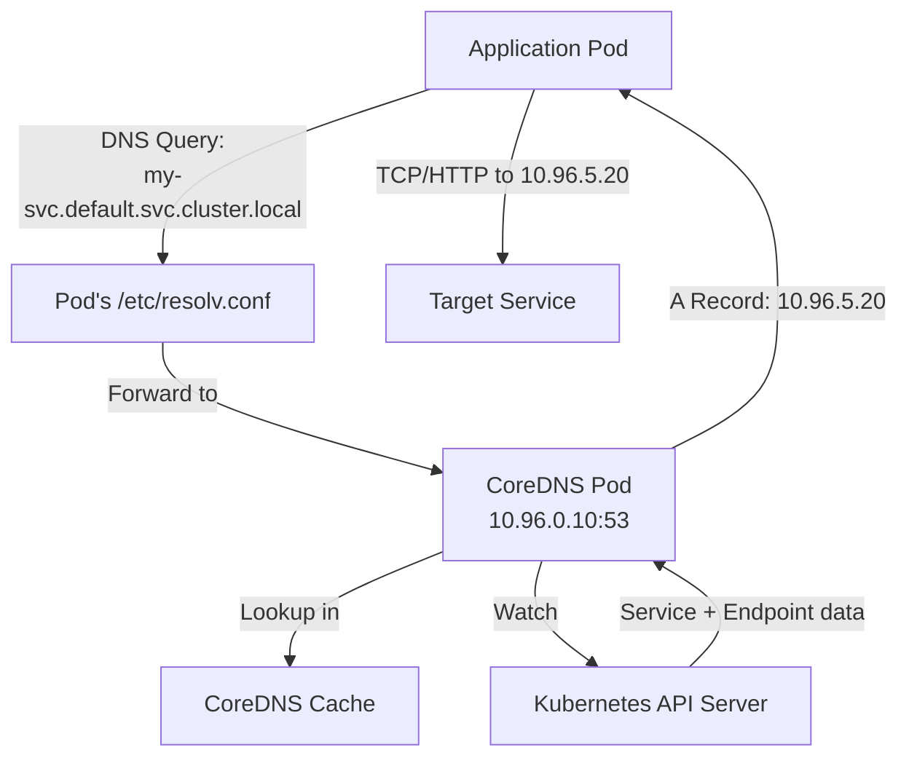
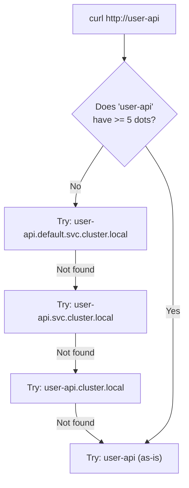

# How Kubernetes DNS-Based Service Discovery Works

Author: [nawazdhandala](https://www.github.com/nawazdhandala)

Tags: Kubernetes, DNS, Service Discovery, CoreDNS, Networking

Description: Deep dive into how Kubernetes uses DNS for service discovery, including CoreDNS configuration, record types, and troubleshooting.

---

## Why DNS for Service Discovery?

In Kubernetes, pods and services are constantly being created and destroyed. Hard-coding IP addresses is impractical because IPs change with every pod restart. DNS provides a dynamic name resolution layer that lets pods find services by name rather than by IP.

Every Kubernetes cluster runs a DNS server (typically CoreDNS) that automatically creates DNS records for every service. When a pod needs to talk to a service, it resolves the service name via DNS and gets back the current IP address.

## How Kubernetes DNS Works



When a pod is created, Kubernetes injects DNS configuration into the pod's `/etc/resolv.conf` file. This configuration points to CoreDNS as the nameserver and sets up search domains for short-name resolution.

## DNS Record Format

Kubernetes DNS follows a strict naming convention:

```text
# Service A record format:
<service-name>.<namespace>.svc.<cluster-domain>

# Examples:
user-api.production.svc.cluster.local     -> 10.96.5.20
redis.cache.svc.cluster.local             -> 10.96.8.15
postgres.database.svc.cluster.local       -> 10.96.3.44

# SRV records for named ports:
_http._tcp.user-api.production.svc.cluster.local -> 0 100 80 user-api.production.svc.cluster.local
```

## Pod DNS Configuration

Every pod gets a `/etc/resolv.conf` like this:

```bash
# Inside a pod, check DNS configuration
cat /etc/resolv.conf

# Typical output:
# nameserver 10.96.0.10
# search default.svc.cluster.local svc.cluster.local cluster.local
# options ndots:5
```

The search domains allow short-name resolution:

```bash
# All of these resolve to the same ClusterIP:

# Full qualified domain name (1 DNS query)
curl http://user-api.production.svc.cluster.local

# Namespace-scoped short name (2 DNS queries)
curl http://user-api.production

# Same-namespace short name (1 DNS query if pod is in production)
curl http://user-api
```

### The ndots Setting

The `ndots:5` option controls when a name is treated as fully qualified. If the name contains fewer than 5 dots, Kubernetes appends each search domain and tries them in order:



This can cause unnecessary DNS queries. For high-throughput services, use the FQDN with a trailing dot to skip the search:

```bash
# Efficient: trailing dot means FQDN, no search domain appended
curl http://user-api.production.svc.cluster.local.
```

## CoreDNS Configuration

CoreDNS is deployed as a Deployment in the `kube-system` namespace. Its configuration is stored in a ConfigMap:

```bash
# View the CoreDNS configuration
kubectl get configmap coredns -n kube-system -o yaml
```

Default CoreDNS Corefile:

```text
# CoreDNS Corefile - configures DNS zones and plugins
.:53 {
    errors
    health {
       lazystart
    }
    ready
    # kubernetes plugin handles service discovery DNS
    kubernetes cluster.local in-addr.arpa ip6.arpa {
       pods insecure
       fallthrough in-addr.arpa ip6.arpa
       ttl 30
    }
    # prometheus plugin exposes DNS metrics
    prometheus :9153
    # forward unresolved queries to upstream DNS
    forward . /etc/resolv.conf {
       max_concurrent 1000
    }
    # cache DNS responses for 30 seconds
    cache 30
    loop
    reload
    loadbalance
}
```

### Key CoreDNS Plugins

| Plugin | Purpose |
|--------|---------|
| kubernetes | Resolves service and pod DNS names |
| cache | Caches responses to reduce API server load |
| forward | Forwards external DNS queries upstream |
| prometheus | Exposes metrics at :9153 |
| health | Liveness probe endpoint |
| ready | Readiness probe endpoint |

## DNS Record Types

Kubernetes creates several types of DNS records:

### A Records (Service ClusterIP)

```bash
# Query the A record for a service
# Returns the ClusterIP
kubectl exec -it debug-pod -- nslookup user-api.production.svc.cluster.local

# Output:
# Server:    10.96.0.10
# Address:   10.96.0.10#53
#
# Name:      user-api.production.svc.cluster.local
# Address:   10.96.5.20
```

### SRV Records (Service Ports)

```bash
# Query SRV records to discover service ports
# Useful when port numbers are not known in advance
kubectl exec -it debug-pod -- nslookup -type=SRV \
  _http._tcp.user-api.production.svc.cluster.local

# Output:
# _http._tcp.user-api.production.svc.cluster.local
#   service = 0 100 80 user-api.production.svc.cluster.local
```

### Pod A Records

```bash
# Pods get DNS records based on their IP address
# Format: <pod-ip-dashed>.<namespace>.pod.cluster.local
kubectl exec -it debug-pod -- nslookup \
  172-16-0-15.production.pod.cluster.local

# Output:
# Name:    172-16-0-15.production.pod.cluster.local
# Address: 172.16.0.15
```

## Troubleshooting DNS Issues

### Deploy a Debug Pod

```yaml
# dns-debug-pod.yaml
# A lightweight pod with DNS troubleshooting tools
apiVersion: v1
kind: Pod
metadata:
  name: dns-debug
  namespace: default
spec:
  containers:
    - name: debug
      image: nicolaka/netshoot
      command: ["sleep", "3600"]
```

### Common DNS Checks

```bash
# Check if CoreDNS pods are running
kubectl get pods -n kube-system -l k8s-app=kube-dns

# Check CoreDNS logs for errors
kubectl logs -n kube-system -l k8s-app=kube-dns --tail=50

# Test DNS resolution from inside a pod
kubectl exec -it dns-debug -- dig user-api.production.svc.cluster.local

# Test external DNS resolution
kubectl exec -it dns-debug -- dig google.com

# Check DNS response time
kubectl exec -it dns-debug -- dig user-api.production.svc.cluster.local \
  | grep "Query time"

# Verify resolv.conf inside a pod
kubectl exec -it dns-debug -- cat /etc/resolv.conf
```

### DNS Performance Monitoring

```bash
# CoreDNS exposes Prometheus metrics on port 9153
# Key metrics to watch:

# Total DNS queries processed
# coredns_dns_requests_total

# DNS query latency
# coredns_dns_request_duration_seconds_bucket

# Cache hit rate
# coredns_cache_hits_total / coredns_dns_requests_total

# Check metrics directly
kubectl exec -it dns-debug -- curl -s \
  http://10.96.0.10:9153/metrics | grep coredns_dns_requests_total
```

## Scaling CoreDNS

For large clusters, CoreDNS may need scaling:

```bash
# Check current CoreDNS replica count
kubectl get deployment coredns -n kube-system

# Scale CoreDNS for higher throughput
kubectl scale deployment coredns -n kube-system --replicas=3

# Or use the DNS autoscaler addon
# It automatically scales CoreDNS based on cluster size
kubectl get configmap dns-autoscaler -n kube-system -o yaml
```

## Custom DNS Policies

Override the default DNS behavior for specific pods:

```yaml
# pod-with-custom-dns.yaml
# Use a custom DNS policy for reduced query overhead
apiVersion: v1
kind: Pod
metadata:
  name: optimized-app
spec:
  # None policy lets you fully control DNS settings
  dnsPolicy: "None"
  dnsConfig:
    nameservers:
      - 10.96.0.10
    searches:
      # Only search in the app's own namespace
      - production.svc.cluster.local
      - svc.cluster.local
    options:
      # Reduce ndots to minimize unnecessary DNS lookups
      - name: ndots
        value: "2"
      # Enable single-request to avoid parallel A/AAAA issues
      - name: single-request-reopen
  containers:
    - name: app
      image: my-app:latest
```

## Summary

Kubernetes DNS-based service discovery is the backbone of in-cluster communication. CoreDNS watches the Kubernetes API for service changes and automatically creates DNS records. Pods use these records to find services by name without knowing IP addresses. Understanding the DNS record format, search domains, ndots behavior, and CoreDNS configuration is essential for debugging connectivity issues and optimizing performance.

To monitor DNS resolution health and service reachability across your Kubernetes clusters, [OneUptime](https://oneuptime.com) provides synthetic monitors that continuously test DNS resolution and service endpoints, alerting you when service discovery breaks down.
