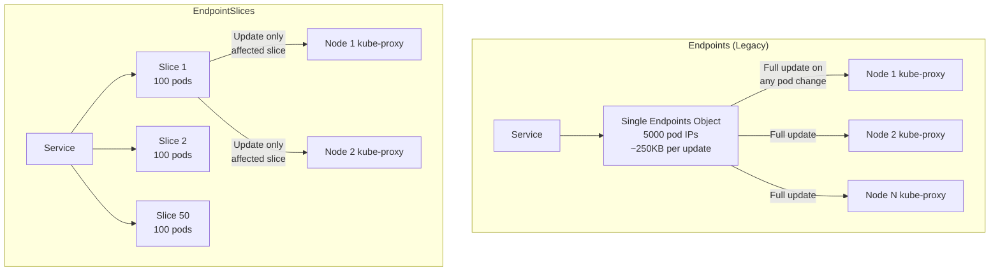
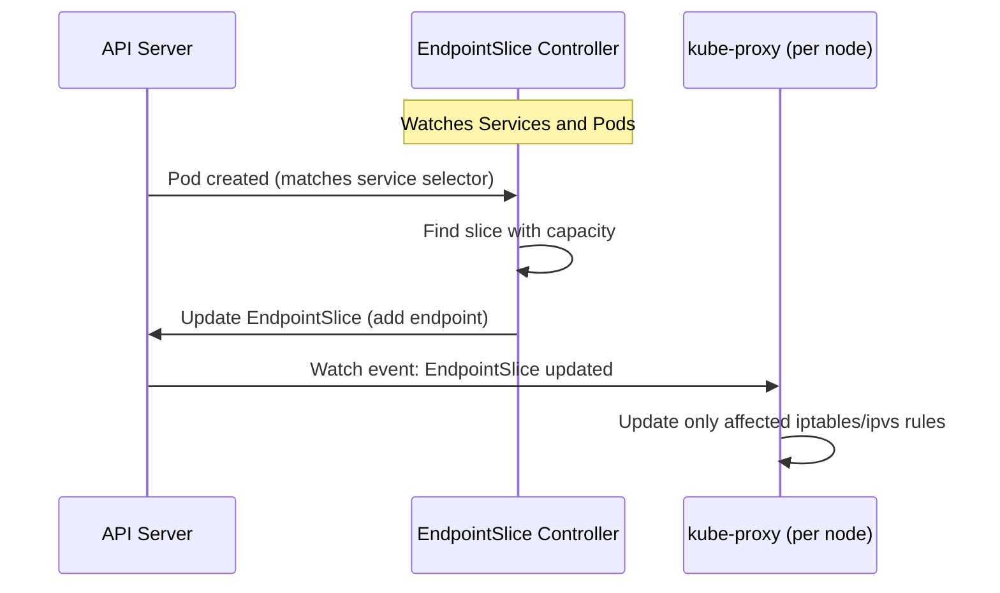
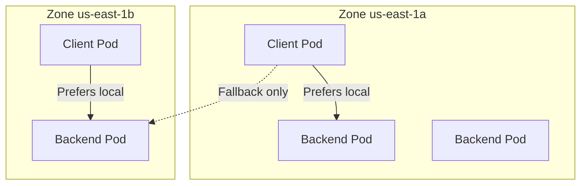

# How EndpointSlices Improve Kubernetes Service Scalability

Author: [nawazdhandala](https://www.github.com/nawazdhandala)

Tags: Kubernetes, EndpointSlices, Services, Scalability, Networking

Description: Learn how EndpointSlices replace Endpoints objects to improve service scalability and reduce control plane overhead in large clusters.

---

## The Problem with Endpoints

In Kubernetes, every service gets an associated Endpoints object. This object lists the IP addresses of all pods that match the service's selector. When a pod is added, removed, or changes readiness, the entire Endpoints object is updated and pushed to every node running kube-proxy.

For small services, this works fine. But consider a service with 5,000 pods. The Endpoints object becomes a single large blob containing 5,000 IP addresses. Every time one pod changes, the entire object (potentially hundreds of kilobytes) is serialized, transmitted, and processed by every node in the cluster.

## Endpoints vs EndpointSlices



EndpointSlices solve this by splitting the endpoints into smaller, manageable chunks. Each EndpointSlice holds up to 100 endpoints by default. When one pod changes, only the affected slice (a few kilobytes) needs to be updated and propagated.

## The Scale Impact

Here is a concrete example of the difference at scale:

| Metric | Endpoints | EndpointSlices |
|--------|-----------|----------------|
| Pods per service | 5,000 | 5,000 |
| Objects per service | 1 | 50 (100 per slice) |
| Update size per pod change | ~250 KB | ~5 KB |
| Updates across 100 nodes | 25 MB total | 500 KB total |
| API server write load | High | Low |
| kube-proxy processing | Full re-parse | Incremental |

## How EndpointSlices Work

The EndpointSlice controller watches for pod and service changes and maintains EndpointSlice objects automatically:



## Examining EndpointSlices

```bash
# List all EndpointSlices for a service
kubectl get endpointslices -n production -l kubernetes.io/service-name=web-app

# Example output for a service with 250 pods:
# NAME              ADDRESSTYPE   PORTS   ENDPOINTS           AGE
# web-app-abc12     IPv4          8080    100 + 0 endpoints   2d
# web-app-def34     IPv4          8080    100 + 0 endpoints   2d
# web-app-ghi56     IPv4          8080    50 + 0 endpoints    2d

# View the details of a specific EndpointSlice
kubectl get endpointslice web-app-abc12 -n production -o yaml
```

## EndpointSlice Structure

```yaml
# Example EndpointSlice object
# Automatically created by the EndpointSlice controller
apiVersion: discovery.k8s.io/v1
kind: EndpointSlice
metadata:
  name: web-app-abc12
  namespace: production
  labels:
    # This label links the slice to its parent service
    kubernetes.io/service-name: web-app
  ownerReferences:
    - apiVersion: v1
      kind: Service
      name: web-app
addressType: IPv4
ports:
  - name: http
    port: 8080
    protocol: TCP
endpoints:
  - addresses:
      - "172.16.0.10"
    conditions:
      ready: true
      serving: true
      terminating: false
    nodeName: node-1
    zone: us-east-1a
    targetRef:
      kind: Pod
      name: web-app-7f8b9-abc12
      namespace: production
  - addresses:
      - "172.16.0.11"
    conditions:
      ready: true
      serving: true
      terminating: false
    nodeName: node-2
    zone: us-east-1b
    targetRef:
      kind: Pod
      name: web-app-7f8b9-def34
      namespace: production
  # ... up to 100 endpoints per slice
```

## Key Fields in EndpointSlices

### Conditions

Each endpoint has three condition fields:

```yaml
conditions:
  # ready: pod has passed readiness probe
  ready: true

  # serving: pod can serve traffic (true even during termination
  # if the pod is still handling requests)
  serving: true

  # terminating: pod is in the process of shutting down
  terminating: false
```

These conditions enable more nuanced traffic management than the old Endpoints object, which only had a binary ready/not-ready distinction.

### Topology Information

```yaml
# EndpointSlices include topology hints for traffic routing
endpoints:
  - addresses:
      - "172.16.0.10"
    nodeName: node-1
    zone: us-east-1a
    # Topology hints suggest which zones should consume this endpoint
    hints:
      forZones:
        - name: us-east-1a
```

This topology awareness enables features like topology-aware routing, where kube-proxy preferentially routes traffic to endpoints in the same zone.

## Topology-Aware Routing

EndpointSlices power topology-aware routing, which reduces cross-zone network costs:



Enable topology-aware routing on a service:

```yaml
# topology-aware-service.yaml
# Enable topology hints to prefer zone-local traffic
apiVersion: v1
kind: Service
metadata:
  name: web-app
  namespace: production
  annotations:
    # Enable topology-aware routing
    service.kubernetes.io/topology-mode: Auto
spec:
  type: ClusterIP
  selector:
    app: web-app
  ports:
    - port: 80
      targetPort: 8080
```

## Monitoring EndpointSlice Health

Track EndpointSlice metrics to understand your cluster's service health:

```bash
# Count total endpoints across all slices for a service
kubectl get endpointslices -n production \
  -l kubernetes.io/service-name=web-app \
  -o json | jq '[.items[].endpoints[]] | length'

# Count ready vs not-ready endpoints
kubectl get endpointslices -n production \
  -l kubernetes.io/service-name=web-app \
  -o json | jq '{
    ready: [.items[].endpoints[] | select(.conditions.ready==true)] | length,
    not_ready: [.items[].endpoints[] | select(.conditions.ready!=true)] | length
  }'

# Check for endpoints in terminating state
kubectl get endpointslices -n production \
  -l kubernetes.io/service-name=web-app \
  -o json | jq '[.items[].endpoints[] | select(.conditions.terminating==true)] | length'
```

### Prometheus Metrics

The EndpointSlice controller exposes metrics:

```text
# Number of EndpointSlices managed
endpointslice_controller_num_endpoint_slices

# Rate of EndpointSlice changes (high rate may indicate churn)
endpointslice_controller_changes

# Sync duration (high latency indicates controller overload)
endpointslice_controller_syncs_duration_seconds
```

## Comparing Legacy Endpoints and EndpointSlices

```bash
# View legacy Endpoints object (still exists for backward compatibility)
kubectl get endpoints web-app -n production -o yaml

# View EndpointSlices for the same service
kubectl get endpointslices -n production \
  -l kubernetes.io/service-name=web-app

# Both exist simultaneously - kube-proxy uses EndpointSlices by default
# since Kubernetes v1.21+
```

## Custom EndpointSlices

You can create EndpointSlices manually to point to external services:

```yaml
# custom-endpointslice.yaml
# Manually managed EndpointSlice for an external database
apiVersion: discovery.k8s.io/v1
kind: EndpointSlice
metadata:
  name: external-db-1
  namespace: production
  labels:
    # Link to the service
    kubernetes.io/service-name: external-db
addressType: IPv4
ports:
  - name: postgres
    port: 5432
    protocol: TCP
endpoints:
  - addresses:
      # External database IP
      - "54.23.100.55"
    conditions:
      ready: true
---
# The corresponding service (no selector means manual endpoint management)
apiVersion: v1
kind: Service
metadata:
  name: external-db
  namespace: production
spec:
  type: ClusterIP
  ports:
    - name: postgres
      port: 5432
      targetPort: 5432
  # No selector - endpoints are managed manually via EndpointSlice
```

## Migration from Endpoints to EndpointSlices

If you have automation that reads legacy Endpoints objects, migrate to EndpointSlices:

```python
#!/usr/bin/env python3
"""
migrate_endpoints_reader.py
Shows how to read EndpointSlices instead of legacy Endpoints.
Uses the official Kubernetes Python client.
"""

from kubernetes import client, config

# Load kubeconfig from default location
config.load_kube_config()

# Create the Discovery API client for EndpointSlices
discovery_v1 = client.DiscoveryV1Api()

def get_service_endpoints(namespace, service_name):
    """
    Fetch all endpoints for a service using EndpointSlices.
    Returns a list of (ip, port, ready) tuples.
    """
    # Label selector links slices to their parent service
    label_selector = f"kubernetes.io/service-name={service_name}"

    slices = discovery_v1.list_namespaced_endpoint_slice(
        namespace=namespace,
        label_selector=label_selector,
    )

    endpoints = []
    for ep_slice in slices.items:
        # Extract port numbers from the slice
        ports = {p.name: p.port for p in (ep_slice.ports or [])}

        for endpoint in (ep_slice.endpoints or []):
            for address in endpoint.addresses:
                ready = endpoint.conditions.ready if endpoint.conditions else False
                for port_name, port_num in ports.items():
                    endpoints.append({
                        "ip": address,
                        "port": port_num,
                        "port_name": port_name,
                        "ready": ready,
                        "node": endpoint.node_name,
                        "zone": endpoint.zone,
                    })

    return endpoints

# Usage
eps = get_service_endpoints("production", "web-app")
for ep in eps:
    status = "ready" if ep["ready"] else "not-ready"
    print(f"  {ep['ip']}:{ep['port']} on {ep['node']} ({ep['zone']}) - {status}")
```

## Summary

EndpointSlices are a critical scalability improvement in Kubernetes. By splitting large endpoint lists into smaller, independently updatable slices, they dramatically reduce API server load, network bandwidth consumption, and kube-proxy processing overhead. They also add topology awareness and richer endpoint conditions that enable features like zone-aware routing and graceful termination handling.

For monitoring the health of services backed by hundreds or thousands of endpoints, [OneUptime](https://oneuptime.com) provides infrastructure monitoring that tracks service availability, endpoint health, and performance metrics across your entire Kubernetes deployment with real-time alerting and incident management.
