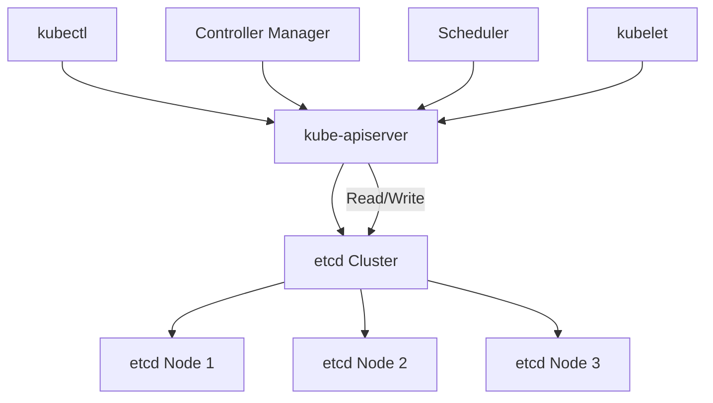
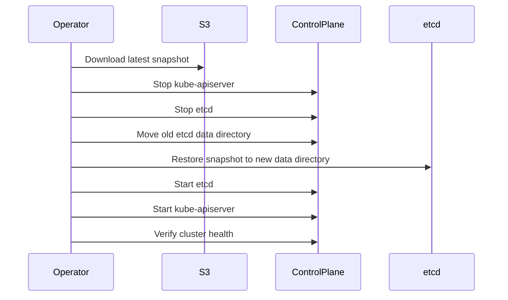

# How to Backup and Restore etcd for Kubernetes Disaster Recovery

Author: [nawazdhandala](https://www.github.com/nawazdhandala)

Tags: etcd, Kubernetes, Backup, Restore, Disaster Recovery

Description: Learn how to backup and restore etcd snapshots for Kubernetes cluster disaster recovery with automated backup strategies.

---

etcd is the brain of your Kubernetes cluster. Every object definition, every secret, every ConfigMap, and every RBAC rule lives in etcd. Losing etcd means losing your entire cluster state. No amount of infrastructure-as-code will save you if you also stored runtime state, custom resources, or operator-managed configurations that are not in your Git repository.

This guide covers manual snapshots, automated backup strategies, and the full restore procedure.

## etcd in the Kubernetes Architecture



## Taking a Manual Snapshot

```bash
# etcd-snapshot.sh
# Takes a point-in-time snapshot of the etcd database
# Run this on a control plane node or a pod with etcdctl access

# Set etcd connection parameters
# These paths are standard for kubeadm-managed clusters
ETCDCTL_API=3 etcdctl snapshot save /tmp/etcd-snapshot.db \
  --endpoints=https://127.0.0.1:2379 \
  --cacert=/etc/kubernetes/pki/etcd/ca.crt \
  --cert=/etc/kubernetes/pki/etcd/server.crt \
  --key=/etc/kubernetes/pki/etcd/server.key

# Verify the snapshot is valid
ETCDCTL_API=3 etcdctl snapshot status /tmp/etcd-snapshot.db \
  --write-out=table
```

The status command outputs a table showing the snapshot hash, revision, total keys, and total size. Always verify after taking a snapshot.

## Automated Backup CronJob

```yaml
# etcd-backup-cronjob.yaml
# Runs an etcd snapshot every 6 hours and uploads to S3
apiVersion: batch/v1
kind: CronJob
metadata:
  name: etcd-backup
  namespace: kube-system
spec:
  # Run every 6 hours
  schedule: "0 */6 * * *"
  # Keep the last 3 successful job records
  successfulJobsHistoryLimit: 3
  failedJobsHistoryLimit: 3
  concurrencyPolicy: Forbid
  jobTemplate:
    spec:
      template:
        spec:
          # Run on control plane nodes where etcd certs exist
          nodeSelector:
            node-role.kubernetes.io/control-plane: ""
          tolerations:
            - key: node-role.kubernetes.io/control-plane
              effect: NoSchedule
          containers:
            - name: etcd-backup
              image: bitnami/etcd:3.5
              command:
                - /bin/sh
                - -c
                - |
                  # Generate a timestamped filename
                  TIMESTAMP=$(date +%Y%m%d-%H%M%S)
                  SNAPSHOT_FILE="/tmp/etcd-${TIMESTAMP}.db"

                  # Take the snapshot
                  etcdctl snapshot save "${SNAPSHOT_FILE}" \
                    --endpoints=https://127.0.0.1:2379 \
                    --cacert=/etc/kubernetes/pki/etcd/ca.crt \
                    --cert=/etc/kubernetes/pki/etcd/server.crt \
                    --key=/etc/kubernetes/pki/etcd/server.key

                  # Verify snapshot integrity
                  etcdctl snapshot status "${SNAPSHOT_FILE}" \
                    --write-out=json

                  # Upload to S3 with server-side encryption
                  aws s3 cp "${SNAPSHOT_FILE}" \
                    "s3://k8s-backups/etcd/${TIMESTAMP}.db" \
                    --sse aws:kms

                  # Clean up local file
                  rm -f "${SNAPSHOT_FILE}"
                  echo "Backup completed: ${TIMESTAMP}"
              env:
                - name: ETCDCTL_API
                  value: "3"
                - name: AWS_ACCESS_KEY_ID
                  valueFrom:
                    secretKeyRef:
                      name: aws-backup-credentials
                      key: access-key
                - name: AWS_SECRET_ACCESS_KEY
                  valueFrom:
                    secretKeyRef:
                      name: aws-backup-credentials
                      key: secret-key
              volumeMounts:
                # Mount etcd PKI certificates
                - name: etcd-certs
                  mountPath: /etc/kubernetes/pki/etcd
                  readOnly: true
          volumes:
            - name: etcd-certs
              hostPath:
                path: /etc/kubernetes/pki/etcd
                type: DirectoryOrCreate
          restartPolicy: OnFailure
```

## Backup Verification Script

```python
# verify_etcd_backups.py
# Checks that recent etcd backups exist in S3 and are not corrupted
# Alerts if no valid backup exists within the retention window

import boto3
import sys
from datetime import datetime, timedelta

# Initialize the S3 client
s3 = boto3.client("s3")

BUCKET = "k8s-backups"
PREFIX = "etcd/"
# Alert if no backup is newer than 12 hours
MAX_AGE_HOURS = 12


def check_recent_backups():
    """Verify that a recent, valid backup exists in S3."""
    response = s3.list_objects_v2(Bucket=BUCKET, Prefix=PREFIX)

    if "Contents" not in response:
        print("CRITICAL: No etcd backups found in S3")
        sys.exit(2)

    # Sort by last modified, newest first
    objects = sorted(
        response["Contents"],
        key=lambda x: x["LastModified"],
        reverse=True,
    )

    newest = objects[0]
    age = datetime.now(newest["LastModified"].tzinfo) - newest["LastModified"]

    if age > timedelta(hours=MAX_AGE_HOURS):
        print(
            f"WARNING: Newest backup is {age.total_seconds() / 3600:.1f} "
            f"hours old: {newest['Key']}"
        )
        sys.exit(1)

    # Check file size - a valid snapshot should be at least 1 MB
    if newest["Size"] < 1_000_000:
        print(
            f"WARNING: Newest backup is suspiciously small: "
            f"{newest['Size']} bytes"
        )
        sys.exit(1)

    print(
        f"OK: Newest backup is {age.total_seconds() / 3600:.1f} hours old, "
        f"size {newest['Size'] / 1_000_000:.1f} MB"
    )
    sys.exit(0)


if __name__ == "__main__":
    check_recent_backups()
```

## Restore Procedure



## Restoring from a Snapshot

```bash
# etcd-restore.sh
# Restores an etcd cluster from a snapshot file
# WARNING: This replaces ALL cluster state

# Step 1: Download the snapshot from S3
aws s3 cp s3://k8s-backups/etcd/20260220-060000.db /tmp/restore.db

# Step 2: Stop the API server and etcd
# On kubeadm clusters, move the static pod manifests
sudo mv /etc/kubernetes/manifests/kube-apiserver.yaml /tmp/
sudo mv /etc/kubernetes/manifests/etcd.yaml /tmp/

# Wait for the containers to stop
sleep 30

# Step 3: Back up the current data directory (just in case)
sudo mv /var/lib/etcd /var/lib/etcd.bak

# Step 4: Restore the snapshot to a new data directory
ETCDCTL_API=3 etcdctl snapshot restore /tmp/restore.db \
  --data-dir=/var/lib/etcd \
  --name=controlplane \
  --initial-cluster=controlplane=https://127.0.0.1:2380 \
  --initial-advertise-peer-urls=https://127.0.0.1:2380

# Step 5: Fix ownership on the restored data directory
sudo chown -R etcd:etcd /var/lib/etcd

# Step 6: Restart etcd and the API server
sudo mv /tmp/etcd.yaml /etc/kubernetes/manifests/
sleep 15
sudo mv /tmp/kube-apiserver.yaml /etc/kubernetes/manifests/

# Step 7: Verify cluster health
sleep 30
kubectl get nodes
kubectl get pods --all-namespaces
```

## Multi-Node etcd Restore

For clusters with three etcd nodes, each node must restore independently with the correct cluster member configuration.

```bash
# restore-node1.sh
# Restore on etcd node 1 of a 3-node cluster

ETCDCTL_API=3 etcdctl snapshot restore /tmp/restore.db \
  --data-dir=/var/lib/etcd \
  --name=etcd-1 \
  --initial-cluster="etcd-1=https://10.0.1.10:2380,etcd-2=https://10.0.1.11:2380,etcd-3=https://10.0.1.12:2380" \
  --initial-advertise-peer-urls=https://10.0.1.10:2380 \
  --initial-cluster-token=etcd-cluster-restore
```

Repeat for nodes 2 and 3 with their respective names and peer URLs. Start all etcd instances only after all nodes have completed the restore.

## Backup Retention Policy


Implement this with S3 lifecycle rules:

```json
{
  "Rules": [
    {
      "ID": "etcd-retention",
      "Status": "Enabled",
      "Filter": {
        "Prefix": "etcd/"
      },
      "Transitions": [
        {
          "Days": 30,
          "StorageClass": "STANDARD_IA"
        },
        {
          "Days": 90,
          "StorageClass": "GLACIER"
        }
      ],
      "Expiration": {
        "Days": 365
      }
    }
  ]
}
```

## Key Takeaways

- Take etcd snapshots every 6 hours at minimum. More frequent backups reduce the recovery point gap.
- Always verify snapshots after creation. A corrupted snapshot is worse than no snapshot because it gives false confidence.
- Store backups off-cluster in S3 or equivalent object storage with encryption enabled.
- Practice the restore procedure regularly. A backup you have never tested is a backup you cannot trust.
- For multi-node etcd clusters, restore all nodes simultaneously with matching cluster configurations.

Automated backups only help if you know they are working. Use [OneUptime](https://oneuptime.com) to monitor your backup CronJobs, verify snapshot freshness, and alert your team immediately when a backup fails or falls behind schedule.
