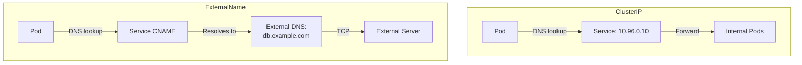
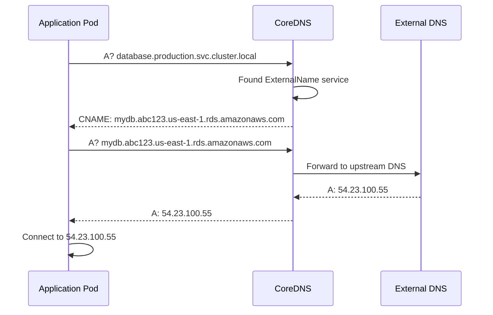
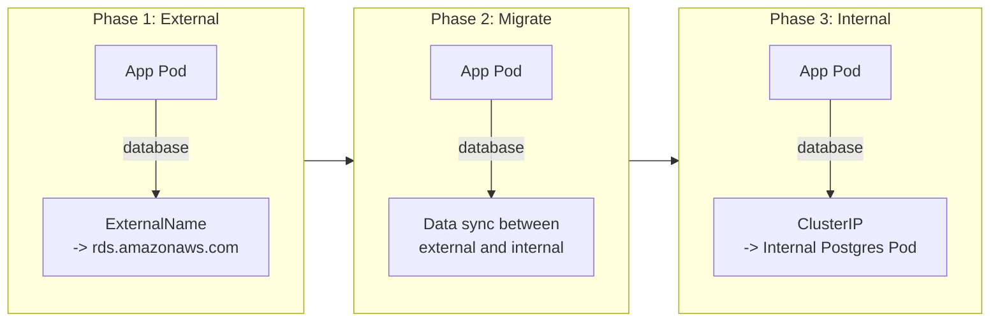

# How to Use Kubernetes ExternalName Services for External Endpoints

Author: [nawazdhandala](https://www.github.com/nawazdhandala)

Tags: Kubernetes, ExternalName, Services, DNS, External

Description: Learn how to use ExternalName services to map Kubernetes service names to external DNS names for seamless external service access.

---

## What Is an ExternalName Service?

An ExternalName service is a special Kubernetes service type that acts as a DNS alias. Instead of routing traffic to pods, it returns a CNAME record pointing to an external DNS name. This lets your pods access external services using a Kubernetes-native service name, without hard-coding external hostnames in your application code.

## How ExternalName Differs from Other Types



With a ClusterIP service, DNS returns a virtual IP that kube-proxy routes to pods. With an ExternalName service, DNS returns a CNAME record that resolves to the external hostname. There is no proxying, no virtual IP, and no kube-proxy involvement.

## When to Use ExternalName Services

- **Managed databases**: RDS, Cloud SQL, or other cloud-hosted databases
- **Third-party APIs**: External SaaS services your app depends on
- **Migration**: Gradually moving services into Kubernetes while keeping some external
- **Environment abstraction**: Same service name in all environments, different backends

## Creating an ExternalName Service

```yaml
# external-database.yaml
# Maps the in-cluster name "database" to an external RDS endpoint
apiVersion: v1
kind: Service
metadata:
  name: database
  namespace: production
spec:
  type: ExternalName
  # This is the external DNS name that the CNAME will point to
  externalName: mydb.abc123.us-east-1.rds.amazonaws.com
```

Now pods in the `production` namespace can connect to the database using:

```bash
# Instead of hard-coding the RDS endpoint, pods use the service name
# This resolves via CNAME to the actual RDS hostname
psql -h database.production.svc.cluster.local -U myuser -d mydb

# Or simply within the same namespace:
psql -h database -U myuser -d mydb
```

## DNS Resolution Flow



## Practical Examples

### Example 1: External Database

```yaml
# external-postgres.yaml
# Abstract away the cloud provider-specific database endpoint
apiVersion: v1
kind: Service
metadata:
  name: postgres
  namespace: production
  labels:
    app: postgres
    type: external
spec:
  type: ExternalName
  externalName: prod-db.abc123.us-east-1.rds.amazonaws.com
```

Application code stays clean:

```python
# app.py
# Database connection uses the Kubernetes service name
# No cloud provider-specific hostnames in application code
import os
import psycopg2

# Same connection string works in any environment
DATABASE_HOST = os.getenv("DATABASE_HOST", "postgres")
DATABASE_PORT = os.getenv("DATABASE_PORT", "5432")
DATABASE_NAME = os.getenv("DATABASE_NAME", "myapp")

connection = psycopg2.connect(
    host=DATABASE_HOST,
    port=DATABASE_PORT,
    dbname=DATABASE_NAME,
    user=os.getenv("DATABASE_USER"),
    password=os.getenv("DATABASE_PASSWORD"),
)
```

### Example 2: Third-Party API Gateway

```yaml
# external-payment-api.yaml
# Map a friendly name to the payment provider's API endpoint
apiVersion: v1
kind: Service
metadata:
  name: payment-api
  namespace: production
spec:
  type: ExternalName
  externalName: api.stripe.com
```

### Example 3: Cross-Namespace Service Alias

ExternalName can also reference services in other namespaces:

```yaml
# cross-namespace-alias.yaml
# Create a shortcut to a service in another namespace
apiVersion: v1
kind: Service
metadata:
  name: shared-cache
  namespace: app-team-a
spec:
  type: ExternalName
  # Points to a Redis service in the shared-infra namespace
  externalName: redis.shared-infra.svc.cluster.local
```

## Migration Pattern: External to Internal

ExternalName services are excellent for gradual migration. Start with an external service, then switch to an internal one without changing application code:



### Phase 1: Point to External

```yaml
# phase-1: ExternalName pointing to managed database
apiVersion: v1
kind: Service
metadata:
  name: database
  namespace: production
spec:
  type: ExternalName
  externalName: prod-db.abc123.us-east-1.rds.amazonaws.com
```

### Phase 3: Switch to Internal

```yaml
# phase-3: Replace with ClusterIP pointing to internal pods
# Application code does not change at all
apiVersion: v1
kind: Service
metadata:
  name: database
  namespace: production
spec:
  type: ClusterIP
  selector:
    app: postgres
  ports:
    - port: 5432
      targetPort: 5432
```

The switch is a single kubectl apply. No application redeployment needed.

## Limitations and Caveats

### No Port Mapping

ExternalName services do not support port mapping. The `ports` field is ignored:

```yaml
# The ports field has NO effect on ExternalName services
# Traffic goes directly to the external host on whatever port the client specifies
apiVersion: v1
kind: Service
metadata:
  name: external-api
spec:
  type: ExternalName
  externalName: api.example.com
  ports:
    # This is informational only, not enforced
    - port: 443
```

### No IP-Based ExternalName

ExternalName requires a DNS name, not an IP address:

```yaml
# This will NOT work - ExternalName needs a DNS hostname
spec:
  type: ExternalName
  externalName: 54.23.100.55  # Invalid

# Use Endpoints + ClusterIP service for IP-based external targets instead
```

### For IP-Based External Targets

If you need to point to an external IP address, use a ClusterIP service with manually managed Endpoints:

```yaml
# external-ip-service.yaml
# Service without a selector - requires manual Endpoints
apiVersion: v1
kind: Service
metadata:
  name: external-db
  namespace: production
spec:
  type: ClusterIP
  ports:
    - port: 5432
      targetPort: 5432
---
# Manually define the external IP as an endpoint
apiVersion: v1
kind: Endpoints
metadata:
  # Name must match the service name
  name: external-db
  namespace: production
subsets:
  - addresses:
      - ip: 54.23.100.55
    ports:
      - port: 5432
```

### TLS/SNI Considerations

When the external service uses TLS, the CNAME resolution can cause SNI mismatches:

```bash
# The client connects to "database.production.svc.cluster.local"
# But the TLS certificate on the server is for "mydb.abc123.rds.amazonaws.com"
# This causes a certificate validation error

# Solution: configure your client to use the external hostname for TLS
# Most database drivers support a separate sslhost or servername parameter
```

## Verifying ExternalName Services

```bash
# Check the service configuration
kubectl get svc database -n production -o yaml

# Verify DNS resolution from inside a pod
kubectl exec -it debug-pod -- nslookup database.production.svc.cluster.local

# Expected output shows CNAME chain:
# database.production.svc.cluster.local
#   canonical name = mydb.abc123.us-east-1.rds.amazonaws.com
#   Address: 54.23.100.55

# Test connectivity through the ExternalName service
kubectl exec -it debug-pod -- nc -zv database 5432
```

## Comparison Table

| Feature | ExternalName | ClusterIP + Endpoints |
|---------|-------------|----------------------|
| Target type | DNS hostname | IP address |
| Port mapping | No | Yes |
| Proxy/kube-proxy | No | Yes |
| Health checks | No | No (manual endpoints) |
| TLS | May cause SNI issues | Transparent |
| Setup complexity | Simple | Moderate |

## Summary

ExternalName services provide a clean abstraction for external dependencies. They let you reference external databases, APIs, and services using Kubernetes-native service names, keeping your application code free of environment-specific hostnames. They are especially valuable during migrations when services are gradually moved into the cluster.

To monitor the availability of both your external dependencies and internal services through a single pane of glass, [OneUptime](https://oneuptime.com) provides external URL monitors, TCP checks, and status pages that track every service your application depends on, whether it runs inside or outside Kubernetes.
