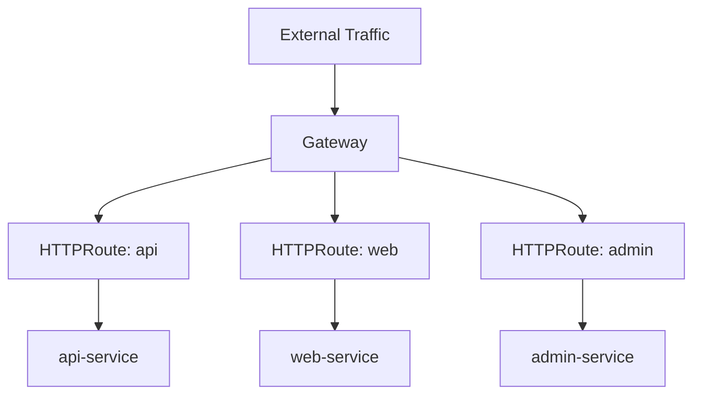
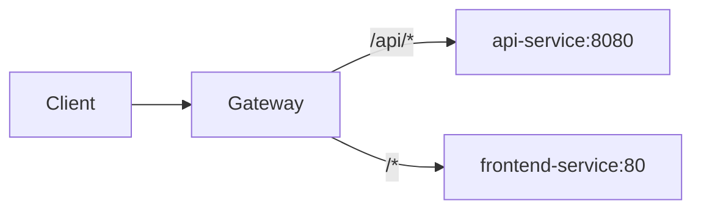
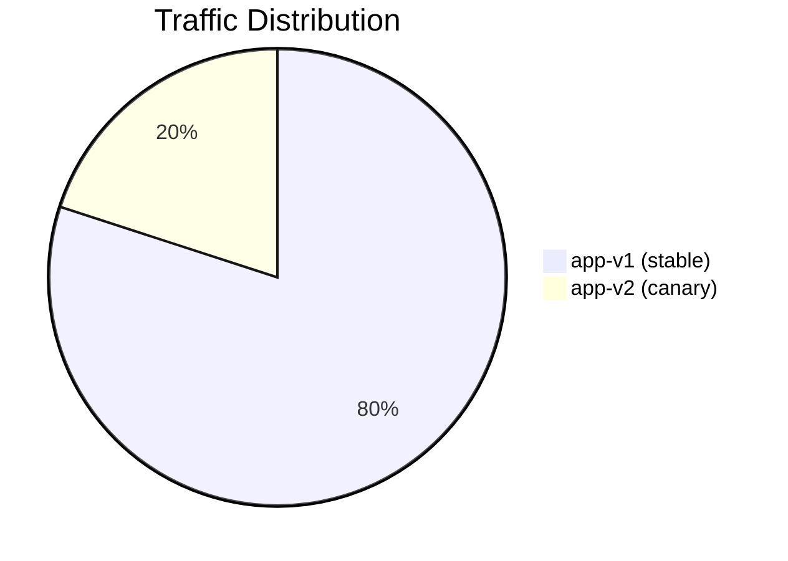

# How to Configure Kubernetes Gateway API with HTTPRoute

Author: [nawazdhandala](https://www.github.com/nawazdhandala)

Tags: Kubernetes, Gateway API, HTTPRoute, Networking, Traffic Management

Description: Step-by-step guide to configuring Kubernetes Gateway API with HTTPRoute for advanced HTTP routing including header matching and path routing.

---

## What Is the Gateway API?

The Gateway API is the next generation of Kubernetes traffic management. It replaces Ingress with a more expressive, role-oriented set of resources. The HTTPRoute resource is the most commonly used - it defines how HTTP traffic should be routed to your services.



## Prerequisites

Install the Gateway API CRDs and a compatible controller.

```bash
# Install Gateway API standard CRDs
kubectl apply -f https://github.com/kubernetes-sigs/gateway-api/releases/download/v1.2.0/standard-install.yaml

# Verify CRDs are installed
kubectl get crd | grep gateway.networking.k8s.io

# Expected output:
# gatewayclasses.gateway.networking.k8s.io
# gateways.gateway.networking.k8s.io
# httproutes.gateway.networking.k8s.io
# referencegrants.gateway.networking.k8s.io
```

Install a Gateway API controller. We will use Nginx Gateway Fabric:

```bash
# Install Nginx Gateway Fabric
kubectl apply -f https://github.com/nginx/nginx-gateway-fabric/releases/download/v1.5.0/nginx-gateway-fabric.yaml

# Verify the GatewayClass is available
kubectl get gatewayclass
# NAME    CONTROLLER                         ACCEPTED
# nginx   gateway.nginx.org/nginx-gateway    True
```

## Step 1: Create a Gateway

The Gateway defines listeners that accept incoming traffic.

```yaml
# gateway.yaml
# Create a Gateway with HTTP and HTTPS listeners
apiVersion: gateway.networking.k8s.io/v1
kind: Gateway
metadata:
  name: main-gateway
  namespace: default
spec:
  gatewayClassName: nginx
  listeners:
    # HTTP listener on port 80
    - name: http
      protocol: HTTP
      port: 80
      allowedRoutes:
        namespaces:
          from: Same  # Only allow routes from the same namespace
    # HTTPS listener on port 443
    - name: https
      protocol: HTTPS
      port: 443
      tls:
        mode: Terminate
        certificateRefs:
          - name: wildcard-tls-secret
      allowedRoutes:
        namespaces:
          from: All  # Allow routes from any namespace
```

```bash
# Apply the Gateway
kubectl apply -f gateway.yaml

# Check the Gateway status
kubectl get gateway main-gateway
# NAME           CLASS   ADDRESS        PROGRAMMED   AGE
# main-gateway   nginx   10.96.100.1    True         30s
```

## Step 2: Simple Path-Based HTTPRoute

Route traffic to different services based on the URL path.

```yaml
# path-routing.yaml
# Route /api to the API service and / to the frontend
apiVersion: gateway.networking.k8s.io/v1
kind: HTTPRoute
metadata:
  name: app-routes
  namespace: default
spec:
  parentRefs:
    # Attach to the main-gateway
    - name: main-gateway
  hostnames:
    - "app.example.com"
  rules:
    # Route /api/* to the api-service
    - matches:
        - path:
            type: PathPrefix
            value: /api
      backendRefs:
        - name: api-service
          port: 8080
    # Route everything else to the frontend
    - matches:
        - path:
            type: PathPrefix
            value: /
      backendRefs:
        - name: frontend-service
          port: 80
```



## Step 3: Header-Based Routing

Route traffic based on HTTP headers. This is useful for A/B testing and version routing.

```yaml
# header-routing.yaml
# Route based on custom headers
apiVersion: gateway.networking.k8s.io/v1
kind: HTTPRoute
metadata:
  name: header-routes
  namespace: default
spec:
  parentRefs:
    - name: main-gateway
  hostnames:
    - "api.example.com"
  rules:
    # Route requests with X-API-Version: v2 to the v2 service
    - matches:
        - headers:
            - name: X-API-Version
              value: "v2"
      backendRefs:
        - name: api-v2
          port: 8080
    # Route requests with X-API-Version: beta to beta service
    - matches:
        - headers:
            - name: X-API-Version
              value: "beta"
      backendRefs:
        - name: api-beta
          port: 8080
    # Default: route to v1
    - backendRefs:
        - name: api-v1
          port: 8080
```

Test it:

```bash
# Test default routing (v1)
curl -H "Host: api.example.com" http://gateway-ip/

# Test v2 routing
curl -H "Host: api.example.com" -H "X-API-Version: v2" http://gateway-ip/

# Test beta routing
curl -H "Host: api.example.com" -H "X-API-Version: beta" http://gateway-ip/
```

## Step 4: Traffic Splitting (Canary Deployments)

Split traffic between multiple backends using weights.

```yaml
# canary.yaml
# Gradually shift traffic from v1 to v2
apiVersion: gateway.networking.k8s.io/v1
kind: HTTPRoute
metadata:
  name: canary-route
  namespace: default
spec:
  parentRefs:
    - name: main-gateway
  hostnames:
    - "app.example.com"
  rules:
    - matches:
        - path:
            type: PathPrefix
            value: /
      backendRefs:
        # 80% to stable version
        - name: app-v1
          port: 8080
          weight: 80
        # 20% to canary version
        - name: app-v2
          port: 8080
          weight: 20
```



## Step 5: Request Redirect

Redirect HTTP requests to HTTPS or to a different host.

```yaml
# redirect.yaml
# Redirect HTTP to HTTPS
apiVersion: gateway.networking.k8s.io/v1
kind: HTTPRoute
metadata:
  name: http-redirect
  namespace: default
spec:
  parentRefs:
    - name: main-gateway
      sectionName: http  # Attach to the HTTP listener only
  hostnames:
    - "app.example.com"
  rules:
    - filters:
        # Redirect all HTTP traffic to HTTPS
        - type: RequestRedirect
          requestRedirect:
            scheme: https
            statusCode: 301
```

## Step 6: Request Header Modification

Add, set, or remove headers on requests before they reach the backend.

```yaml
# header-modification.yaml
# Modify request headers before forwarding
apiVersion: gateway.networking.k8s.io/v1
kind: HTTPRoute
metadata:
  name: header-mod-route
  namespace: default
spec:
  parentRefs:
    - name: main-gateway
  hostnames:
    - "app.example.com"
  rules:
    - matches:
        - path:
            type: PathPrefix
            value: /api
      filters:
        # Modify request headers
        - type: RequestHeaderModifier
          requestHeaderModifier:
            # Add a new header
            add:
              - name: X-Request-Source
                value: gateway
            # Set (overwrite) a header
            set:
              - name: X-Forwarded-Proto
                value: https
            # Remove a header
            remove:
              - X-Internal-Debug
      backendRefs:
        - name: api-service
          port: 8080
```

## Step 7: URL Rewriting

Rewrite the URL path before forwarding to the backend.

```yaml
# url-rewrite.yaml
# Rewrite /api/v2/* to /* before forwarding
apiVersion: gateway.networking.k8s.io/v1
kind: HTTPRoute
metadata:
  name: rewrite-route
  namespace: default
spec:
  parentRefs:
    - name: main-gateway
  hostnames:
    - "app.example.com"
  rules:
    - matches:
        - path:
            type: PathPrefix
            value: /api/v2
      filters:
        # Strip the /api/v2 prefix
        - type: URLRewrite
          urlRewrite:
            path:
              type: ReplacePrefixMatch
              replacePrefixMatch: /
      backendRefs:
        - name: api-v2-service
          port: 8080
```

## Step 8: Cross-Namespace Routing

Route traffic to services in other namespaces using ReferenceGrant.

```yaml
# reference-grant.yaml
# Allow HTTPRoutes in the default namespace to reference
# services in the backend namespace
apiVersion: gateway.networking.k8s.io/v1beta1
kind: ReferenceGrant
metadata:
  name: allow-default-to-backend
  namespace: backend  # This lives in the target namespace
spec:
  from:
    - group: gateway.networking.k8s.io
      kind: HTTPRoute
      namespace: default
  to:
    - group: ""
      kind: Service
---
# cross-namespace-route.yaml
# Reference a service in another namespace
apiVersion: gateway.networking.k8s.io/v1
kind: HTTPRoute
metadata:
  name: cross-ns-route
  namespace: default
spec:
  parentRefs:
    - name: main-gateway
  rules:
    - matches:
        - path:
            type: PathPrefix
            value: /backend
      backendRefs:
        - name: backend-service
          namespace: backend  # Service in another namespace
          port: 8080
```

## Debugging HTTPRoutes

Check the status of your routes:

```bash
# Check HTTPRoute status
kubectl get httproute app-routes -o yaml | grep -A 20 status

# Check Gateway status and attached routes
kubectl describe gateway main-gateway

# Verify the route is accepted
kubectl get httproute
# NAME         HOSTNAMES              PARENTREFS       AGE
# app-routes   ["app.example.com"]    ["main-gateway"] 5m
```

## Monitoring Gateway API Traffic

With the Gateway API handling your traffic, you need observability into routing decisions, latency, and error rates. OneUptime (https://oneuptime.com) provides endpoint monitoring and alerting for your Kubernetes services, helping you detect misrouted traffic, elevated error rates, or latency spikes in your Gateway API configuration.
