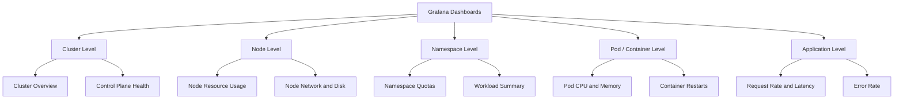
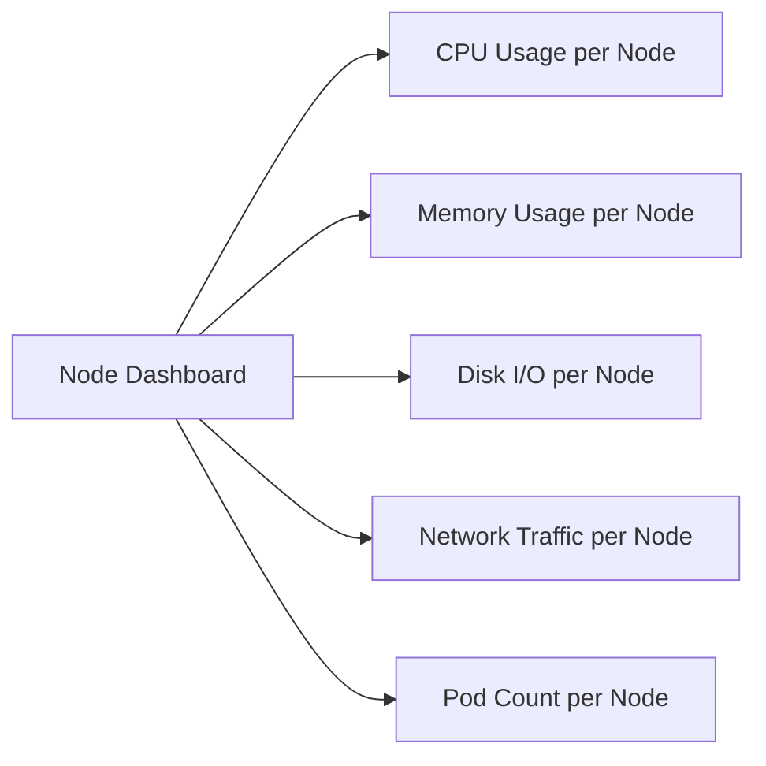
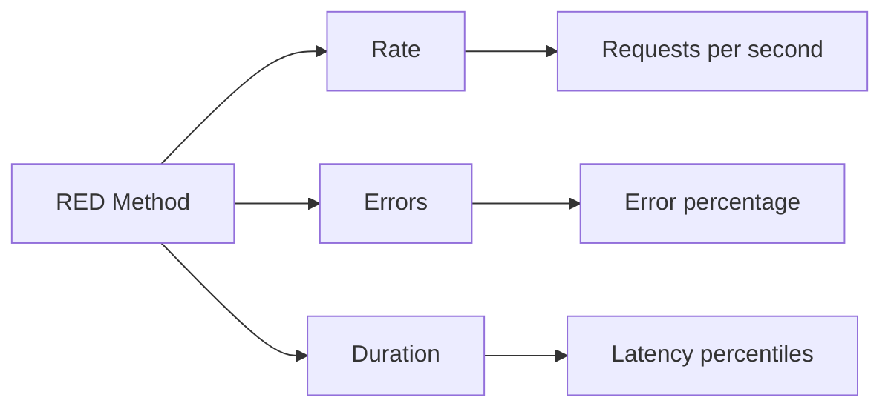
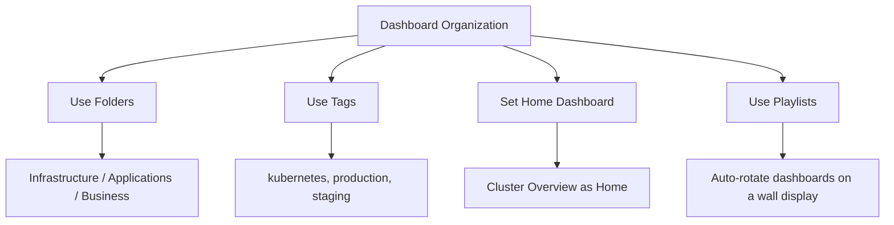

# Essential Grafana Dashboards for Kubernetes Monitoring

Author: [nawazdhandala](https://www.github.com/nawazdhandala)

Tags: Kubernetes, Grafana, Dashboards, Monitoring, Visualization

Description: A guide to the essential Grafana dashboards for Kubernetes monitoring including cluster, node, pod, and namespace level views.

---

Grafana turns raw Prometheus metrics into visual dashboards that help you understand the health and performance of your Kubernetes clusters. This guide covers the essential dashboards you need and how to build custom ones for your specific workloads.

## Dashboard Architecture

A well-organized Grafana setup provides visibility at every level of your Kubernetes infrastructure.



## Installing Pre-Built Dashboards

The kube-prometheus-stack includes many dashboards by default. You can also import dashboards from the Grafana community.

```bash
# Port-forward Grafana to access the UI
kubectl port-forward -n monitoring svc/prometheus-grafana 3000:80

# Default credentials (if using kube-prometheus-stack):
# Username: admin
# Password: (value you set in values.yaml)
```

Import a community dashboard by ID:

1. Open Grafana UI
2. Click the plus icon and select "Import"
3. Enter the dashboard ID
4. Select your Prometheus data source
5. Click Import

Essential dashboard IDs from the Grafana community:

| Dashboard | ID | Description |
|-----------|-----|-------------|
| Kubernetes Cluster Overview | 7249 | High-level cluster health |
| Node Exporter Full | 1860 | Detailed node metrics |
| Kubernetes Pod Overview | 15760 | Pod-level resource usage |
| CoreDNS | 15762 | DNS performance and errors |

## Dashboard 1: Cluster Overview

This dashboard answers: "Is my cluster healthy right now?"

```yaml
# cluster-overview-dashboard.yaml - Deploy as a ConfigMap
apiVersion: v1
kind: ConfigMap
metadata:
  name: cluster-overview-dashboard
  namespace: monitoring
  labels:
    # This label tells Grafana sidecar to load the dashboard
    grafana_dashboard: "1"
data:
  cluster-overview.json: |
    {
      "dashboard": {
        "title": "Kubernetes Cluster Overview",
        "panels": []
      }
    }
```

Key PromQL queries for the cluster overview:

```bash
# Total number of nodes
count(kube_node_info)

# Number of nodes in Ready state
count(kube_node_status_condition{condition="Ready", status="true"} == 1)

# Total pods running vs capacity
count(kube_pod_status_phase{phase="Running"})

# Cluster CPU utilization percentage
sum(rate(container_cpu_usage_seconds_total{container!=""}[5m]))
/ sum(machine_cpu_cores) * 100

# Cluster memory utilization percentage
sum(container_memory_working_set_bytes{container!=""})
/ sum(machine_memory_bytes) * 100

# Number of pods in error states
count(kube_pod_status_phase{phase=~"Failed|Unknown"})

# Total container restarts in the last hour
sum(increase(kube_pod_container_status_restarts_total[1h]))
```

## Dashboard 2: Node Resource Usage

This dashboard answers: "Which nodes are under pressure?"



Key PromQL queries:

```bash
# CPU usage per node as a percentage
100 - (avg by(instance) (rate(node_cpu_seconds_total{mode="idle"}[5m])) * 100)

# Memory usage per node as a percentage
(1 - (node_memory_MemAvailable_bytes / node_memory_MemTotal_bytes)) * 100

# Disk usage per node as a percentage
(1 - (node_filesystem_avail_bytes{mountpoint="/"} / node_filesystem_size_bytes{mountpoint="/"})) * 100

# Network received bytes per second per node
rate(node_network_receive_bytes_total{device!~"lo|veth.*|docker.*|flannel.*|cali.*"}[5m])

# Network transmitted bytes per second per node
rate(node_network_transmit_bytes_total{device!~"lo|veth.*|docker.*|flannel.*|cali.*"}[5m])

# Number of pods per node
count by(node) (kube_pod_info)
```

## Dashboard 3: Namespace Workload Summary

This dashboard answers: "How are my namespaces using resources?"

```bash
# CPU usage per namespace
sum by(namespace) (rate(container_cpu_usage_seconds_total{container!=""}[5m]))

# Memory usage per namespace
sum by(namespace) (container_memory_working_set_bytes{container!=""})

# Number of pods per namespace
count by(namespace) (kube_pod_info)

# CPU requests vs limits per namespace
sum by(namespace) (kube_pod_container_resource_requests{resource="cpu"})
sum by(namespace) (kube_pod_container_resource_limits{resource="cpu"})

# Memory requests vs limits per namespace
sum by(namespace) (kube_pod_container_resource_requests{resource="memory"})
sum by(namespace) (kube_pod_container_resource_limits{resource="memory"})

# Resource quota usage per namespace
kube_resourcequota{type="used"} / kube_resourcequota{type="hard"} * 100
```

## Dashboard 4: Pod and Container Metrics

This dashboard answers: "What is happening inside my pods?"

```bash
# CPU usage per pod
sum by(pod, namespace) (rate(container_cpu_usage_seconds_total{container!=""}[5m]))

# Memory usage per pod (working set - the relevant metric)
sum by(pod, namespace) (container_memory_working_set_bytes{container!=""})

# Memory usage as percentage of limit
sum by(pod, container) (container_memory_working_set_bytes{container!=""})
/ sum by(pod, container) (kube_pod_container_resource_limits{resource="memory"})
* 100

# Container restart count per pod
sum by(pod, namespace, container) (kube_pod_container_status_restarts_total)

# Pods not in Ready state
kube_pod_status_ready{condition="true"} == 0

# Container states (waiting, running, terminated)
kube_pod_container_status_waiting_reason
kube_pod_container_status_terminated_reason
```

## Dashboard 5: Application Performance (RED Method)

The RED method measures Rate, Errors, and Duration for your services.



These queries require your application to expose HTTP metrics (using a library like Prometheus client).

```bash
# Request rate per service
sum by(service) (rate(http_requests_total[5m]))

# Error rate as a percentage
sum by(service) (rate(http_requests_total{status=~"5.."}[5m]))
/ sum by(service) (rate(http_requests_total[5m])) * 100

# 50th percentile latency (median)
histogram_quantile(0.50, sum by(le, service) (rate(http_request_duration_seconds_bucket[5m])))

# 95th percentile latency
histogram_quantile(0.95, sum by(le, service) (rate(http_request_duration_seconds_bucket[5m])))

# 99th percentile latency
histogram_quantile(0.99, sum by(le, service) (rate(http_request_duration_seconds_bucket[5m])))
```

## Building Custom Dashboard Panels

### Stat Panel - Single Value

```json
{
  "type": "stat",
  "title": "Total Running Pods",
  "targets": [
    {
      "expr": "count(kube_pod_status_phase{phase=\"Running\"})",
      "legendFormat": "Running Pods"
    }
  ],
  "fieldConfig": {
    "defaults": {
      "thresholds": {
        "steps": [
          { "color": "red", "value": 0 },
          { "color": "green", "value": 1 }
        ]
      }
    }
  }
}
```

### Time Series Panel - Over Time

```json
{
  "type": "timeseries",
  "title": "Pod CPU Usage",
  "targets": [
    {
      "expr": "sum by(pod) (rate(container_cpu_usage_seconds_total{namespace=\"production\", container!=\"\"}[5m]))",
      "legendFormat": "{{ pod }}"
    }
  ],
  "fieldConfig": {
    "defaults": {
      "unit": "cores"
    }
  }
}
```

### Table Panel - List View

```json
{
  "type": "table",
  "title": "Pods with Most Restarts",
  "targets": [
    {
      "expr": "topk(10, sum by(namespace, pod) (kube_pod_container_status_restarts_total))",
      "legendFormat": "{{ namespace }}/{{ pod }}",
      "format": "table",
      "instant": true
    }
  ]
}
```

## Dashboard Variables

Use template variables to make dashboards interactive and reusable.

```bash
# Variable: namespace
# Query: label_values(kube_pod_info, namespace)
# This creates a dropdown of all namespaces

# Variable: pod
# Query: label_values(kube_pod_info{namespace="$namespace"}, pod)
# This creates a dropdown filtered by the selected namespace

# Use variables in panel queries:
# sum(rate(container_cpu_usage_seconds_total{namespace="$namespace", pod="$pod"}[5m]))
```

## Alerting from Grafana

```yaml
# You can also create alerts directly in Grafana panels
# But using PrometheusRules is generally preferred for production

# Example Grafana alert condition:
# Query: container_memory_working_set_bytes{pod="my-app"} / container_spec_memory_limit_bytes{pod="my-app"}
# Condition: IS ABOVE 0.85
# For: 5m
# Notification channel: Slack, Email, PagerDuty, etc.
```

## Dashboard Organization Tips



1. **Use folders** to organize by team or environment
2. **Tag dashboards** for easy searching
3. **Set the cluster overview as the home dashboard** for quick access
4. **Create playlists** for NOC displays that rotate through key dashboards
5. **Use annotations** to mark deployments, incidents, and maintenance windows on graphs

## Conclusion

Effective Kubernetes monitoring requires dashboards at every level: cluster, node, namespace, pod, and application. Start with the pre-built dashboards from the kube-prometheus-stack, then build custom panels for your specific workloads using the RED method. Keep your dashboards organized and focused on answering specific operational questions.

For a unified monitoring and incident management platform that complements your Grafana setup, check out [OneUptime](https://oneuptime.com). OneUptime provides status pages, on-call management, and automated incident workflows that integrate with your existing Prometheus and Grafana infrastructure.
