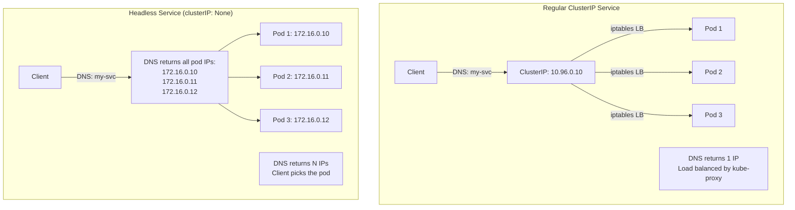
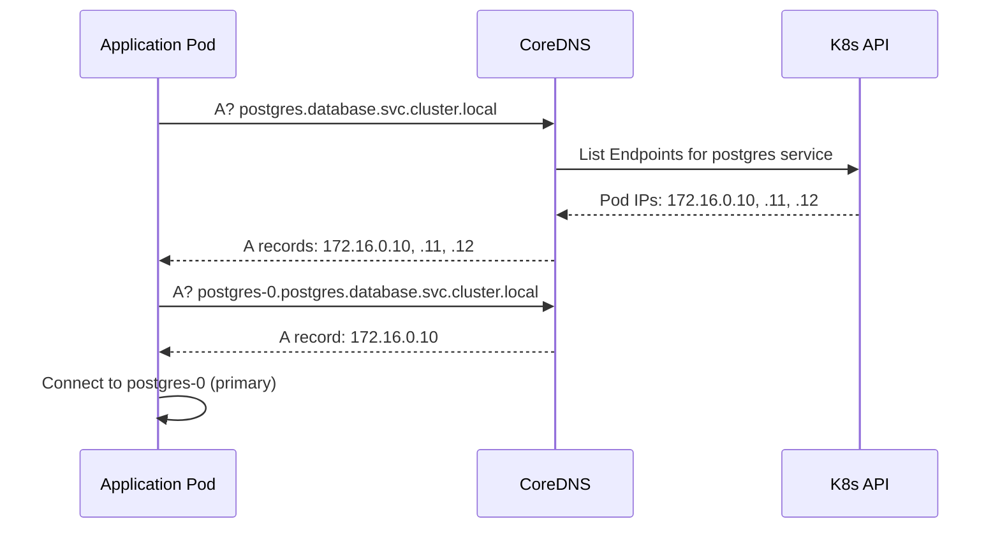
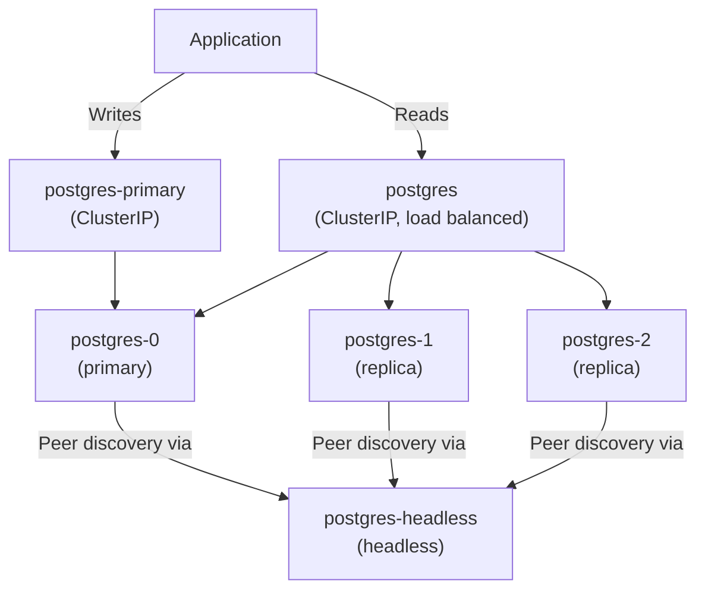

# How to Use Kubernetes Headless Services for StatefulSet Discovery

Author: [nawazdhandala](https://www.github.com/nawazdhandala)

Tags: Kubernetes, Headless Services, StatefulSet, DNS, Networking

Description: Learn how headless services provide direct pod-to-pod DNS resolution for StatefulSets and other workloads that need stable network identities.

---

## What Is a Headless Service?

A headless service is a Kubernetes service with `clusterIP: None`. Instead of assigning a single virtual IP that load-balances across pods, a headless service returns the individual IP addresses of all backing pods directly in DNS responses.

This is critical for stateful workloads like databases, where clients need to connect to a specific pod rather than any random pod behind a load balancer.

## Headless vs Regular Service



## When You Need Headless Services

- **Databases**: PostgreSQL replicas where clients need to distinguish primary from replicas
- **Distributed systems**: Kafka brokers, Elasticsearch nodes, Cassandra nodes
- **Leader election**: Services that need to discover and communicate with specific peers
- **StatefulSets**: Workloads that require stable, predictable DNS names per pod

## Creating a Headless Service

```yaml
# headless-service.yaml
# Headless service for a PostgreSQL StatefulSet
apiVersion: v1
kind: Service
metadata:
  name: postgres
  namespace: database
  labels:
    app: postgres
spec:
  # This makes it a headless service
  clusterIP: None
  selector:
    app: postgres
  ports:
    - name: postgresql
      port: 5432
      targetPort: 5432
      protocol: TCP
  # publishNotReadyAddresses includes pods that are not yet ready
  # Useful during initial bootstrapping of stateful clusters
  publishNotReadyAddresses: true
```

## StatefulSet with Headless Service

The real power of headless services comes when paired with StatefulSets. Each pod gets a predictable, stable DNS name:

```yaml
# postgres-statefulset.yaml
# StatefulSet that uses the headless service for peer discovery
apiVersion: apps/v1
kind: StatefulSet
metadata:
  name: postgres
  namespace: database
spec:
  # serviceName must match the headless service name
  # This is what creates per-pod DNS records
  serviceName: "postgres"
  replicas: 3
  selector:
    matchLabels:
      app: postgres
  template:
    metadata:
      labels:
        app: postgres
    spec:
      containers:
        - name: postgres
          image: postgres:16
          ports:
            - containerPort: 5432
              name: postgresql
          env:
            - name: POSTGRES_PASSWORD
              valueFrom:
                secretKeyRef:
                  name: postgres-secret
                  key: password
            - name: POD_NAME
              valueFrom:
                fieldRef:
                  fieldPath: metadata.name
          volumeMounts:
            - name: data
              mountPath: /var/lib/postgresql/data
  volumeClaimTemplates:
    - metadata:
        name: data
      spec:
        accessModes: ["ReadWriteOnce"]
        resources:
          requests:
            storage: 10Gi
```

## DNS Records Created

With the above StatefulSet, Kubernetes creates the following DNS records:

```text
# Service-level A record returns all pod IPs
postgres.database.svc.cluster.local -> 172.16.0.10, 172.16.0.11, 172.16.0.12

# Per-pod A records with stable names
postgres-0.postgres.database.svc.cluster.local -> 172.16.0.10
postgres-1.postgres.database.svc.cluster.local -> 172.16.0.11
postgres-2.postgres.database.svc.cluster.local -> 172.16.0.12
```

The per-pod DNS names follow the pattern:

```text
<pod-name>.<service-name>.<namespace>.svc.cluster.local
```

## DNS Resolution in Action



### Verifying DNS Records

```bash
# Query the headless service - returns all pod IPs
kubectl exec -it debug-pod -- nslookup postgres.database.svc.cluster.local

# Output:
# Name:    postgres.database.svc.cluster.local
# Address: 172.16.0.10
# Address: 172.16.0.11
# Address: 172.16.0.12

# Query a specific pod's DNS name
kubectl exec -it debug-pod -- nslookup \
  postgres-0.postgres.database.svc.cluster.local

# Output:
# Name:    postgres-0.postgres.database.svc.cluster.local
# Address: 172.16.0.10

# Query SRV records for port discovery
kubectl exec -it debug-pod -- dig SRV \
  _postgresql._tcp.postgres.database.svc.cluster.local
```

## Real-World Example: Kafka Cluster

Kafka brokers need to know about each other for partition replication. A headless service makes peer discovery automatic:

```yaml
# kafka-headless.yaml
# Headless service for Kafka broker discovery
apiVersion: v1
kind: Service
metadata:
  name: kafka-headless
  namespace: streaming
spec:
  clusterIP: None
  selector:
    app: kafka
  ports:
    - name: broker
      port: 9092
      targetPort: 9092
    - name: controller
      port: 9093
      targetPort: 9093
---
apiVersion: apps/v1
kind: StatefulSet
metadata:
  name: kafka
  namespace: streaming
spec:
  serviceName: "kafka-headless"
  replicas: 3
  selector:
    matchLabels:
      app: kafka
  template:
    metadata:
      labels:
        app: kafka
    spec:
      containers:
        - name: kafka
          image: apache/kafka:3.7.0
          ports:
            - containerPort: 9092
              name: broker
            - containerPort: 9093
              name: controller
          env:
            - name: KAFKA_NODE_ID
              valueFrom:
                fieldRef:
                  fieldPath: metadata.labels['apps.kubernetes.io/pod-index']
            # Each broker advertises its stable DNS name
            - name: KAFKA_ADVERTISED_LISTENERS
              value: "PLAINTEXT://$(POD_NAME).kafka-headless.streaming.svc.cluster.local:9092"
            - name: POD_NAME
              valueFrom:
                fieldRef:
                  fieldPath: metadata.name
```

## Combining Headless and Regular Services

A common pattern is to use both: a headless service for internal peer discovery and a regular ClusterIP service for client access:

```yaml
# postgres-dual-services.yaml
# Headless service for StatefulSet peer discovery
apiVersion: v1
kind: Service
metadata:
  name: postgres-headless
  namespace: database
spec:
  clusterIP: None
  selector:
    app: postgres
  ports:
    - port: 5432
---
# Regular ClusterIP service for application access
# This load-balances reads across all replicas
apiVersion: v1
kind: Service
metadata:
  name: postgres
  namespace: database
spec:
  type: ClusterIP
  selector:
    app: postgres
  ports:
    - port: 5432
      targetPort: 5432
---
# Dedicated service for the primary (write) node
apiVersion: v1
kind: Service
metadata:
  name: postgres-primary
  namespace: database
spec:
  type: ClusterIP
  selector:
    app: postgres
    role: primary
  ports:
    - port: 5432
      targetPort: 5432
```



## Troubleshooting Headless Services

```bash
# Verify the service has no ClusterIP
kubectl get svc postgres-headless -n database
# NAME                TYPE        CLUSTER-IP   EXTERNAL-IP   PORT(S)
# postgres-headless   ClusterIP   None         <none>        5432/TCP

# Check that endpoints are populated
kubectl get endpoints postgres-headless -n database
# NAME                ENDPOINTS
# postgres-headless   172.16.0.10:5432,172.16.0.11:5432,172.16.0.12:5432

# If endpoints are empty, check that the selector matches pod labels
kubectl get pods -n database -l app=postgres --show-labels

# Check that pods are in Ready state
# Unready pods are excluded unless publishNotReadyAddresses is true
kubectl get pods -n database -l app=postgres \
  -o custom-columns=NAME:.metadata.name,READY:.status.conditions[?(@.type=="Ready")].status
```

## Summary

Headless services are essential for stateful workloads in Kubernetes. By setting `clusterIP: None`, DNS returns all pod IPs directly, and when combined with a StatefulSet, each pod gets a stable, predictable DNS name. This enables peer discovery for databases, message brokers, and any distributed system that needs direct pod-to-pod communication.

To monitor the health of your stateful workloads and get alerted when individual pods in a StatefulSet become unreachable, [OneUptime](https://oneuptime.com) provides pod-level monitoring, synthetic checks, and incident management that keeps your team informed about the state of every node in your stateful clusters.
