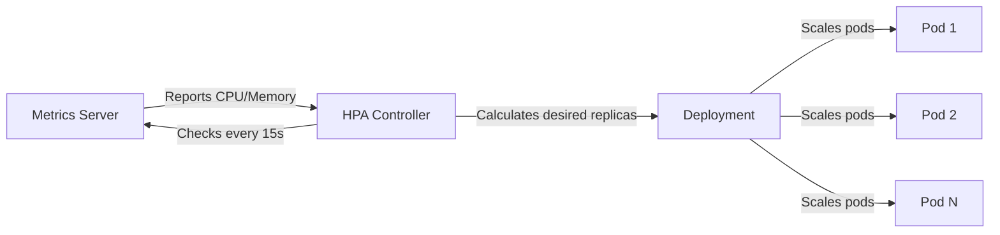
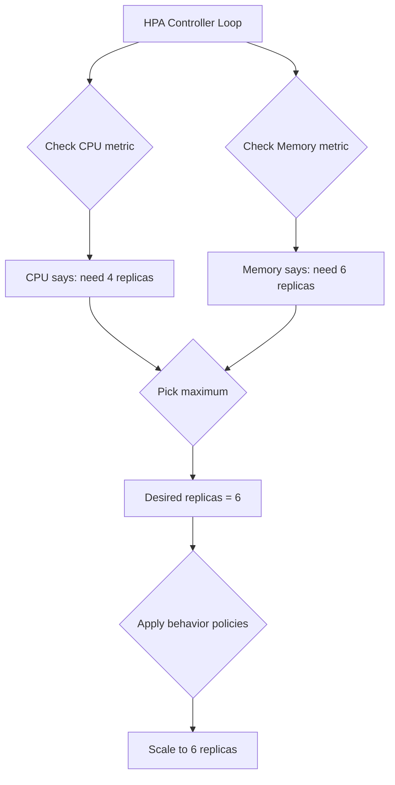

# How to Set Up Kubernetes Horizontal Pod Autoscaler Based on CPU and Memory

Author: [nawazdhandala](https://www.github.com/nawazdhandala)

Tags: Kubernetes, HPA, Autoscaling, CPU, Memory

Description: Step-by-step guide to configuring Kubernetes HPA for automatic scaling based on CPU and memory utilization metrics.

---

Kubernetes Horizontal Pod Autoscaler (HPA) automatically adjusts the number of pod replicas in a deployment based on observed resource utilization. Instead of manually scaling workloads up or down, HPA watches CPU and memory metrics and reacts accordingly. This post walks through setting up HPA for both CPU and memory targets.

## How HPA Works

HPA runs as a control loop that periodically queries the metrics API. It compares current utilization against the target you define, then calculates the desired replica count.



The formula HPA uses is:

```
desiredReplicas = ceil(currentReplicas * (currentMetricValue / desiredMetricValue))
```

If you have 2 replicas running at 80% CPU and your target is 50%, HPA calculates `ceil(2 * (80/50))` = 4 replicas.

## Prerequisites

Before HPA can read CPU and memory metrics, you need the Metrics Server installed in your cluster.

```bash
# Install Metrics Server in your cluster
kubectl apply -f https://github.com/kubernetes-sigs/metrics-server/releases/latest/download/components.yaml

# Verify it is running
kubectl get deployment metrics-server -n kube-system

# Check that metrics are available
kubectl top nodes
kubectl top pods
```

## Step 1: Deploy an Application with Resource Requests

HPA requires resource requests to calculate utilization percentages. Without them, HPA cannot determine how much of the allocated resources a pod is consuming.

```yaml
# deployment.yaml
# A simple nginx deployment with CPU and memory resource requests defined
apiVersion: apps/v1
kind: Deployment
metadata:
  name: web-app
  labels:
    app: web-app
spec:
  replicas: 2  # Starting replica count
  selector:
    matchLabels:
      app: web-app
  template:
    metadata:
      labels:
        app: web-app
    spec:
      containers:
        - name: web-app
          image: nginx:1.27
          ports:
            - containerPort: 80
          resources:
            requests:
              cpu: "200m"      # Request 200 millicores (0.2 CPU)
              memory: "128Mi"  # Request 128 MiB of memory
            limits:
              cpu: "500m"      # Hard cap at 500 millicores
              memory: "256Mi"  # Hard cap at 256 MiB
```

Apply this deployment:

```bash
# Create the deployment in your cluster
kubectl apply -f deployment.yaml

# Verify the pods are running and have resource requests set
kubectl get pods -l app=web-app
kubectl describe pod -l app=web-app | grep -A 5 "Requests"
```

## Step 2: Create an HPA for CPU Only

The simplest HPA configuration targets a single metric. Here we target 50% average CPU utilization.

```yaml
# hpa-cpu.yaml
# HPA that scales based on CPU utilization only
apiVersion: autoscaling/v2
kind: HorizontalPodAutoscaler
metadata:
  name: web-app-hpa-cpu
spec:
  scaleTargetRef:
    apiVersion: apps/v1
    kind: Deployment
    name: web-app
  minReplicas: 2   # Never scale below 2 pods
  maxReplicas: 10  # Never scale above 10 pods
  metrics:
    - type: Resource
      resource:
        name: cpu
        target:
          type: Utilization
          averageUtilization: 50  # Target 50% CPU usage across all pods
```

## Step 3: Create an HPA for CPU and Memory

You can specify multiple metrics. HPA evaluates each metric independently and picks the one that results in the highest replica count.

```yaml
# hpa-cpu-memory.yaml
# HPA that scales based on both CPU and memory utilization
apiVersion: autoscaling/v2
kind: HorizontalPodAutoscaler
metadata:
  name: web-app-hpa
spec:
  scaleTargetRef:
    apiVersion: apps/v1
    kind: Deployment
    name: web-app
  minReplicas: 2
  maxReplicas: 15
  metrics:
    # Scale when average CPU utilization exceeds 60%
    - type: Resource
      resource:
        name: cpu
        target:
          type: Utilization
          averageUtilization: 60
    # Scale when average memory utilization exceeds 70%
    - type: Resource
      resource:
        name: memory
        target:
          type: Utilization
          averageUtilization: 70
  behavior:
    scaleUp:
      stabilizationWindowSeconds: 30   # Wait 30s before scaling up further
      policies:
        - type: Percent
          value: 50                    # Scale up by at most 50% of current replicas
          periodSeconds: 60
    scaleDown:
      stabilizationWindowSeconds: 300  # Wait 5 minutes before scaling down
      policies:
        - type: Percent
          value: 25                    # Scale down by at most 25% at a time
          periodSeconds: 120
```

```bash
# Apply the HPA
kubectl apply -f hpa-cpu-memory.yaml

# Watch HPA status and current metrics
kubectl get hpa web-app-hpa --watch
```

## How Scaling Decisions Flow



## Step 4: Test the Autoscaler

Generate load to see HPA in action:

```bash
# Run a load generator pod that sends continuous requests
kubectl run load-generator \
  --image=busybox \
  --restart=Never \
  -- /bin/sh -c "while true; do wget -q -O- http://web-app; done"

# In another terminal, watch the HPA respond
kubectl get hpa web-app-hpa --watch

# After testing, remove the load generator
kubectl delete pod load-generator
```

## Step 5: Use AverageValue Instead of Utilization

Sometimes you want to target an absolute metric value rather than a percentage. Use `AverageValue` for this.

```yaml
# hpa-absolute.yaml
# HPA using absolute metric values instead of percentages
apiVersion: autoscaling/v2
kind: HorizontalPodAutoscaler
metadata:
  name: web-app-hpa-absolute
spec:
  scaleTargetRef:
    apiVersion: apps/v1
    kind: Deployment
    name: web-app
  minReplicas: 2
  maxReplicas: 10
  metrics:
    # Target 100 millicores per pod on average
    - type: Resource
      resource:
        name: cpu
        target:
          type: AverageValue
          averageValue: "100m"
    # Target 64 MiB per pod on average
    - type: Resource
      resource:
        name: memory
        target:
          type: AverageValue
          averageValue: "64Mi"
```

## Troubleshooting Common Issues

```bash
# Check if metrics server is providing data
kubectl top pods -l app=web-app

# Inspect HPA events for errors
kubectl describe hpa web-app-hpa

# Verify resource requests are set (required for Utilization targets)
kubectl get deployment web-app -o jsonpath='{.spec.template.spec.containers[0].resources}'

# Check HPA conditions
kubectl get hpa web-app-hpa -o jsonpath='{.status.conditions[*].message}'
```

Common pitfalls to watch for:

- Missing resource requests on containers makes utilization-based HPA fail
- Metrics Server not installed or not reporting data
- Setting minReplicas too low, causing downtime during sudden spikes
- Setting maxReplicas too high, risking runaway costs
- Not configuring scale-down stabilization, causing flapping

## Summary

HPA is one of the simplest and most effective ways to keep your Kubernetes workloads right-sized. By combining CPU and memory targets with well-tuned behavior policies, you get responsive scaling without the noise of constant replica changes.

If you want to monitor how your autoscaler is performing over time, check out [OneUptime](https://oneuptime.com). OneUptime provides infrastructure monitoring, alerting, and dashboards that give you full visibility into pod scaling events, resource utilization trends, and cluster health - all from a single platform.
