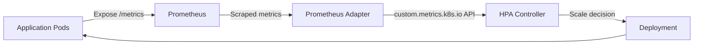
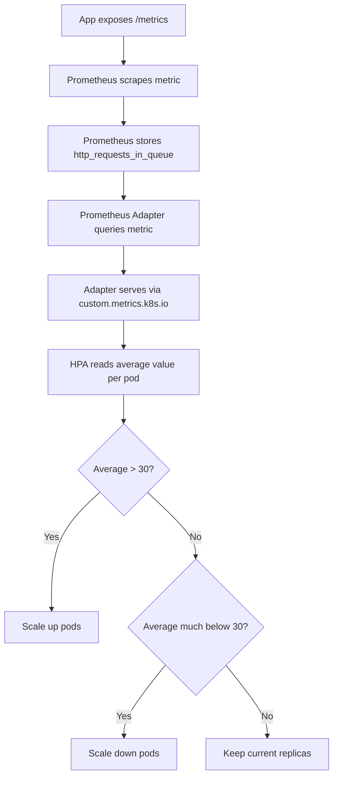

# How to Use Custom Metrics with Kubernetes HPA

Author: [nawazdhandala](https://www.github.com/nawazdhandala)

Tags: Kubernetes, HPA, Custom Metrics, Prometheus, Autoscaling

Description: Learn how to scale Kubernetes workloads based on custom Prometheus metrics using the custom metrics API and HPA.

---

Standard CPU and memory metrics are not always the best signals for scaling. A web application might need to scale based on request queue depth. A worker might scale based on pending jobs. Kubernetes HPA supports custom metrics for exactly these scenarios. This post shows you how to set it up end to end with Prometheus.

## Architecture Overview

Custom metrics HPA relies on a metrics adapter that translates Prometheus metrics into the Kubernetes custom metrics API format.



## Step 1: Install Prometheus

If you do not already have Prometheus in your cluster, install it using Helm.

```bash
# Add the Prometheus community Helm chart repository
helm repo add prometheus-community https://prometheus-community.github.io/helm-charts
helm repo update

# Install the kube-prometheus-stack (includes Prometheus, Grafana, and exporters)
helm install prometheus prometheus-community/kube-prometheus-stack \
  --namespace monitoring \
  --create-namespace \
  --set prometheus.prometheusSpec.serviceMonitorSelectorNilUsesHelmValues=false
```

## Step 2: Deploy an Application That Exposes Custom Metrics

Here is a sample Python application that exposes a custom metric called `http_requests_in_queue`.

```python
# app.py
# A simple Flask app that exposes a custom Prometheus metric
from flask import Flask
from prometheus_client import Gauge, generate_latest, CONTENT_TYPE_LATEST
import random
import threading
import time

app = Flask(__name__)

# Create a Prometheus gauge metric for queue depth
http_requests_in_queue = Gauge(
    'http_requests_in_queue',
    'Number of HTTP requests currently waiting in the queue'
)

def simulate_queue():
    """Simulate fluctuating queue depth for demonstration purposes."""
    while True:
        # Randomly set queue depth between 0 and 100
        http_requests_in_queue.set(random.randint(0, 100))
        time.sleep(5)

# Start the queue simulation in a background thread
threading.Thread(target=simulate_queue, daemon=True).start()

@app.route('/')
def index():
    return 'OK'

@app.route('/metrics')
def metrics():
    """Expose Prometheus metrics at the /metrics endpoint."""
    return generate_latest(), 200, {'Content-Type': CONTENT_TYPE_LATEST}

if __name__ == '__main__':
    app.run(host='0.0.0.0', port=8080)
```

Deploy this application to your cluster:

```yaml
# deployment.yaml
# Deployment for the custom-metrics demo application
apiVersion: apps/v1
kind: Deployment
metadata:
  name: queue-app
  labels:
    app: queue-app
spec:
  replicas: 2
  selector:
    matchLabels:
      app: queue-app
  template:
    metadata:
      labels:
        app: queue-app
      annotations:
        # Tell Prometheus to scrape this pod
        prometheus.io/scrape: "true"
        prometheus.io/port: "8080"
        prometheus.io/path: "/metrics"
    spec:
      containers:
        - name: queue-app
          image: your-registry/queue-app:latest
          ports:
            - containerPort: 8080
          resources:
            requests:
              cpu: "100m"
              memory: "128Mi"
---
# Service to expose the application internally
apiVersion: v1
kind: Service
metadata:
  name: queue-app
  labels:
    app: queue-app
spec:
  selector:
    app: queue-app
  ports:
    - port: 80
      targetPort: 8080
```

## Step 3: Create a ServiceMonitor

If you are using the kube-prometheus-stack, create a ServiceMonitor so Prometheus discovers and scrapes your app.

```yaml
# service-monitor.yaml
# ServiceMonitor tells Prometheus to scrape the queue-app service
apiVersion: monitoring.coreos.com/v1
kind: ServiceMonitor
metadata:
  name: queue-app-monitor
  namespace: default
  labels:
    release: prometheus  # Must match the Prometheus Helm release label
spec:
  selector:
    matchLabels:
      app: queue-app
  endpoints:
    - port: "80"
      path: /metrics
      interval: 15s  # Scrape every 15 seconds
```

## Step 4: Install the Prometheus Adapter

The Prometheus Adapter bridges Prometheus metrics to the Kubernetes custom metrics API.

```bash
# Install the Prometheus Adapter via Helm
helm install prometheus-adapter prometheus-community/prometheus-adapter \
  --namespace monitoring \
  --set prometheus.url=http://prometheus-kube-prometheus-prometheus.monitoring.svc \
  --set prometheus.port=9090
```

## Step 5: Configure the Adapter Rules

Create a custom configuration that maps your Prometheus metric to the custom metrics API.

```yaml
# adapter-config.yaml
# ConfigMap for Prometheus Adapter metric discovery rules
apiVersion: v1
kind: ConfigMap
metadata:
  name: prometheus-adapter
  namespace: monitoring
data:
  config.yaml: |
    rules:
      # Map http_requests_in_queue metric to the custom metrics API
      - seriesQuery: 'http_requests_in_queue{namespace!="",pod!=""}'
        resources:
          overrides:
            namespace:
              resource: namespace
            pod:
              resource: pod
        name:
          matches: "^(.*)$"
          as: "${1}"
        metricsQuery: 'avg(<<.Series>>{<<.LabelMatchers>>}) by (<<.GroupBy>>)'
```

After applying the config, restart the adapter:

```bash
# Apply the updated configuration
kubectl apply -f adapter-config.yaml

# Restart the adapter to pick up new rules
kubectl rollout restart deployment prometheus-adapter -n monitoring

# Verify the custom metric is available through the API
kubectl get --raw "/apis/custom.metrics.k8s.io/v1beta1/namespaces/default/pods/*/http_requests_in_queue" | jq .
```

## Step 6: Create HPA with Custom Metrics

Now create an HPA that uses your custom metric.

```yaml
# hpa-custom.yaml
# HPA that scales based on custom Prometheus metric
apiVersion: autoscaling/v2
kind: HorizontalPodAutoscaler
metadata:
  name: queue-app-hpa
spec:
  scaleTargetRef:
    apiVersion: apps/v1
    kind: Deployment
    name: queue-app
  minReplicas: 2
  maxReplicas: 20
  metrics:
    # Scale based on the average queue depth per pod
    - type: Pods
      pods:
        metric:
          name: http_requests_in_queue
        target:
          type: AverageValue
          averageValue: "30"  # Target 30 requests per pod in queue
  behavior:
    scaleUp:
      stabilizationWindowSeconds: 15  # React quickly to queue buildup
      policies:
        - type: Pods
          value: 4           # Add up to 4 pods at a time
          periodSeconds: 30
    scaleDown:
      stabilizationWindowSeconds: 120  # Wait 2 minutes before scaling down
      policies:
        - type: Percent
          value: 25           # Remove at most 25% of pods at a time
          periodSeconds: 60
```

## How Custom Metric Scaling Flows



## Combining Custom and Resource Metrics

You can mix custom metrics with standard CPU/memory metrics in a single HPA.

```yaml
# hpa-combined.yaml
# HPA combining resource metrics and custom metrics
apiVersion: autoscaling/v2
kind: HorizontalPodAutoscaler
metadata:
  name: queue-app-hpa-combined
spec:
  scaleTargetRef:
    apiVersion: apps/v1
    kind: Deployment
    name: queue-app
  minReplicas: 2
  maxReplicas: 20
  metrics:
    # Standard CPU target
    - type: Resource
      resource:
        name: cpu
        target:
          type: Utilization
          averageUtilization: 60
    # Custom queue depth target
    - type: Pods
      pods:
        metric:
          name: http_requests_in_queue
        target:
          type: AverageValue
          averageValue: "30"
```

HPA evaluates all metrics and picks the one that results in the highest replica count. This ensures your app scales up whenever any metric crosses its threshold.

## Debugging Custom Metrics

```bash
# Check if the custom metrics API is registered
kubectl api-resources | grep custom.metrics

# List all available custom metrics
kubectl get --raw "/apis/custom.metrics.k8s.io/v1beta1" | jq '.resources[].name'

# Query a specific metric for your pods
kubectl get --raw "/apis/custom.metrics.k8s.io/v1beta1/namespaces/default/pods/*/http_requests_in_queue" | jq .

# Check HPA status and events
kubectl describe hpa queue-app-hpa
```

## Summary

Custom metrics HPA lets you scale on signals that actually matter to your application instead of relying solely on CPU and memory. By combining Prometheus, the Prometheus Adapter, and HPA, you get a powerful event-aware autoscaling pipeline.

To monitor your custom metrics, scaling events, and cluster health in one place, try [OneUptime](https://oneuptime.com). OneUptime integrates with Prometheus and gives you dashboards, alerting, and incident management so you can track how your autoscaler performs and catch problems before your users do.
