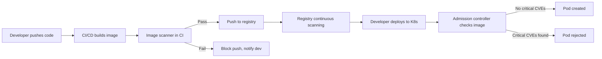
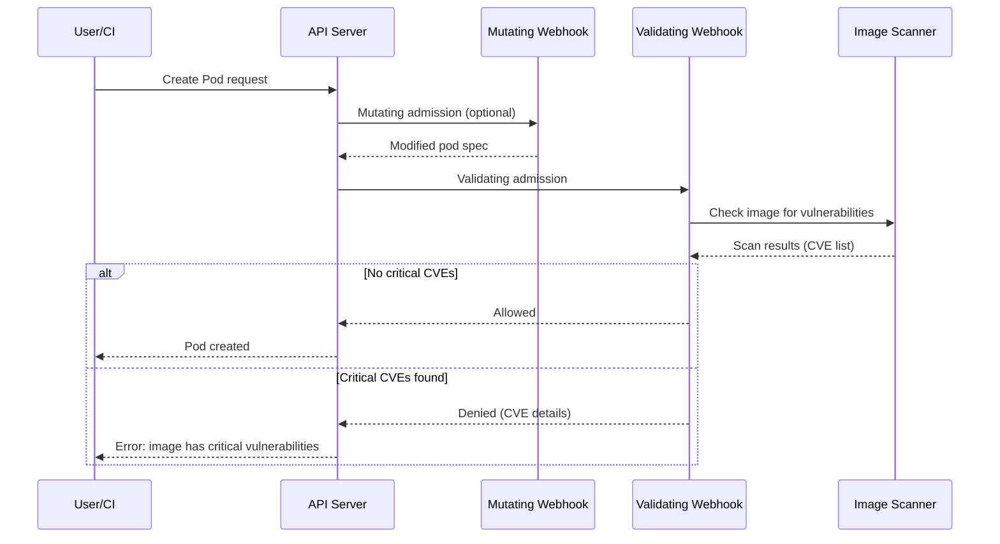
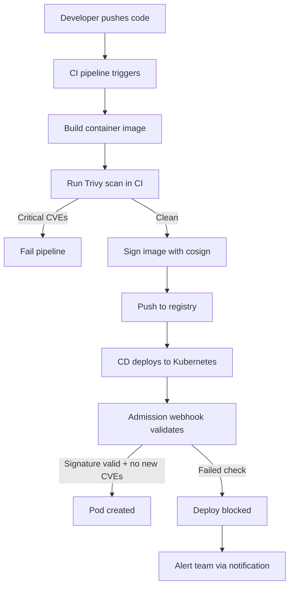

# How to Block Vulnerable Container Images with Kubernetes Admission Controllers

Author: [nawazdhandala](https://www.github.com/nawazdhandala)

Tags: Kubernetes, Security, Container Scanning, Admission Controllers, Vulnerability

Description: Learn how to use Kubernetes admission controllers to block vulnerable container images from being deployed to your cluster.

---

A container image with a known critical vulnerability is a ticking time bomb. If it gets deployed to production, attackers can exploit it before your team even notices. The best defense is to block vulnerable images at the door using Kubernetes admission controllers that check images against vulnerability databases before allowing pods to run.

## The Image Security Pipeline

A layered approach catches vulnerabilities at multiple stages.



Admission controllers are the last line of defense. Even if an image passes CI scanning, new CVEs are discovered daily. An admission controller ensures that at deploy time, the image is still clean.

## How Admission Controllers Work

Kubernetes admission controllers intercept API requests after authentication and authorization but before the object is persisted.



## Setting Up Trivy as an Admission Controller

Trivy is an open-source vulnerability scanner that can run as a Kubernetes admission webhook.

```bash
# Install Trivy Operator using Helm
helm repo add aqua https://aquasecurity.github.io/helm-charts
helm repo update

# Install the Trivy operator with admission webhook enabled
helm install trivy-operator aqua/trivy-operator \
  --namespace trivy-system \
  --create-namespace \
  --set trivy.severity="CRITICAL,HIGH" \
  --set operator.scanJobsConcurrentLimit=5 \
  --set operator.vulnerabilityScannerEnabled=true

# Verify the installation
kubectl get pods -n trivy-system
```

## Kyverno Image Verification Policy

Kyverno is a Kubernetes-native policy engine that can verify image signatures and check for vulnerabilities.

```bash
# Install Kyverno
helm repo add kyverno https://kyverno.github.io/kyverno
helm repo update

helm install kyverno kyverno/kyverno \
  --namespace kyverno \
  --create-namespace \
  --set replicaCount=3
```

### Block Unsigned Images

```yaml
# policy-verify-signatures.yaml
# This policy requires all images to be signed with cosign.
# Unsigned images are rejected.
apiVersion: kyverno.io/v1
kind: ClusterPolicy
metadata:
  name: verify-image-signatures
spec:
  validationFailureAction: Enforce
  background: false
  rules:
    - name: verify-cosign-signature
      match:
        any:
          - resources:
              kinds:
                - Pod
      verifyImages:
        - imageReferences:
            # Apply to all images from your registry
            - "ghcr.io/my-org/*"
          attestors:
            - count: 1
              entries:
                - keys:
                    # The public key used to verify signatures
                    publicKeys: |-
                      -----BEGIN PUBLIC KEY-----
                      MFkwEwYHKoZIzj0CAQYIKoZIzj0DAQcDQgAE...
                      -----END PUBLIC KEY-----
```

### Block Images with Critical CVEs

```yaml
# policy-block-critical-cves.yaml
# This policy blocks pods that use images with critical vulnerabilities.
# It checks Trivy vulnerability reports created by the Trivy Operator.
apiVersion: kyverno.io/v1
kind: ClusterPolicy
metadata:
  name: block-critical-vulnerabilities
spec:
  validationFailureAction: Enforce
  background: true
  rules:
    - name: check-vulnerability-report
      match:
        any:
          - resources:
              kinds:
                - Pod
      preconditions:
        all:
          - key: "{{request.operation}}"
            operator: In
            value: ["CREATE", "UPDATE"]
      validate:
        message: >-
          Image {{element.image}} has critical vulnerabilities.
          Please update to a patched version before deploying.
        foreach:
          - list: "request.object.spec.containers"
            context:
              - name: vulnReport
                apiCall:
                  urlPath: "/apis/aquasecurity.github.io/v1alpha1/namespaces/{{request.namespace}}/vulnerabilityreports"
                  jmesPath: "items[?metadata.labels.\"trivy-operator.container.name\"=='{{element.name}}'] | [0]"
            deny:
              conditions:
                any:
                  - key: "{{vulnReport.report.summary.criticalCount}}"
                    operator: GreaterThan
                    value: 0
```

## Custom Admission Webhook

You can build your own admission webhook that calls an image scanner API.

```yaml
# webhook-config.yaml
# Register a validating webhook that intercepts pod creation.
apiVersion: admissionregistration.k8s.io/v1
kind: ValidatingWebhookConfiguration
metadata:
  name: image-scanner-webhook
webhooks:
  - name: scan.images.example.com
    admissionReviewVersions: ["v1"]
    sideEffects: None
    # Only intercept pod creation
    rules:
      - apiGroups: [""]
        apiVersions: ["v1"]
        operations: ["CREATE"]
        resources: ["pods"]
    clientConfig:
      # The webhook service running in the cluster
      service:
        name: image-scanner
        namespace: security
        path: /validate
        port: 443
      # CA bundle for TLS verification
      caBundle: "LS0tLS1..."
    # Fail open if the webhook is unavailable
    failurePolicy: Ignore
    # Timeout for webhook calls
    timeoutSeconds: 10
    # Skip scanning for system namespaces
    namespaceSelector:
      matchExpressions:
        - key: kubernetes.io/metadata.name
          operator: NotIn
          values:
            - kube-system
            - kube-node-lease
            - trivy-system
```

### Webhook Server Implementation

```python
# webhook_server.py
# A simple validating admission webhook that checks images
# against a vulnerability database before allowing pod creation.

from flask import Flask, request, jsonify
import json
import subprocess
import logging

logging.basicConfig(level=logging.INFO)
logger = logging.getLogger(__name__)

app = Flask(__name__)

# Maximum allowed critical vulnerabilities
MAX_CRITICAL = 0
MAX_HIGH = 5

def scan_image(image_ref):
    """
    Scan a container image using Trivy and return vulnerability counts.
    Returns a dict with severity counts.
    """
    try:
        # Run Trivy in JSON output mode
        result = subprocess.run(
            [
                "trivy", "image",
                "--format", "json",
                "--severity", "CRITICAL,HIGH",
                "--quiet",
                image_ref
            ],
            capture_output=True,
            text=True,
            timeout=120
        )

        if result.returncode != 0:
            logger.error(f"Trivy scan failed for {image_ref}: {result.stderr}")
            return None

        scan_data = json.loads(result.stdout)
        # Count vulnerabilities by severity
        counts = {"CRITICAL": 0, "HIGH": 0}
        for target_result in scan_data.get("Results", []):
            for vuln in target_result.get("Vulnerabilities", []):
                severity = vuln.get("Severity", "UNKNOWN")
                if severity in counts:
                    counts[severity] += 1

        return counts

    except subprocess.TimeoutExpired:
        logger.error(f"Trivy scan timed out for {image_ref}")
        return None

@app.route("/validate", methods=["POST"])
def validate():
    """
    Handle admission review requests.
    Check all container images in the pod spec for vulnerabilities.
    """
    admission_review = request.get_json()
    pod_spec = admission_review["request"]["object"]["spec"]
    pod_name = admission_review["request"]["object"]["metadata"].get("name", "unknown")

    # Collect all container images
    containers = pod_spec.get("containers", [])
    init_containers = pod_spec.get("initContainers", [])
    all_containers = containers + init_containers

    # Check each image
    denied_reasons = []
    for container in all_containers:
        image = container["image"]
        logger.info(f"Scanning image: {image}")

        counts = scan_image(image)
        if counts is None:
            # Fail open - allow if scan fails
            logger.warning(f"Scan failed for {image}, allowing by default")
            continue

        if counts["CRITICAL"] > MAX_CRITICAL:
            denied_reasons.append(
                f"Image '{image}' has {counts['CRITICAL']} critical vulnerabilities"
            )

        if counts["HIGH"] > MAX_HIGH:
            denied_reasons.append(
                f"Image '{image}' has {counts['HIGH']} high vulnerabilities (max: {MAX_HIGH})"
            )

    # Build the admission response
    allowed = len(denied_reasons) == 0
    response = {
        "apiVersion": "admission.k8s.io/v1",
        "kind": "AdmissionReview",
        "response": {
            "uid": admission_review["request"]["uid"],
            "allowed": allowed,
        }
    }

    if not allowed:
        response["response"]["status"] = {
            "code": 403,
            "message": "; ".join(denied_reasons)
        }
        logger.warning(f"Pod '{pod_name}' denied: {denied_reasons}")

    return jsonify(response)

if __name__ == "__main__":
    # Run with TLS in production
    app.run(host="0.0.0.0", port=8443)
```

## Signing Images with Cosign

Pair admission controls with image signing for a complete supply chain security model.

```bash
# Generate a cosign key pair
cosign generate-key-pair

# Sign an image after building
cosign sign --key cosign.key ghcr.io/my-org/myapp:v2.1.0

# Verify an image signature
cosign verify --key cosign.pub ghcr.io/my-org/myapp:v2.1.0
```

## Deployment Workflow with Scanning



## Monitoring Image Security with OneUptime

Blocking vulnerable images is only part of the picture. You also need visibility into what is running and what was blocked. [OneUptime](https://oneuptime.com) integrates with your Kubernetes cluster to monitor admission webhook health, track rejected deployments, and alert your security team when critical vulnerabilities are detected in running workloads. Combine image scanning with OneUptime's monitoring to build a complete security observability pipeline.
