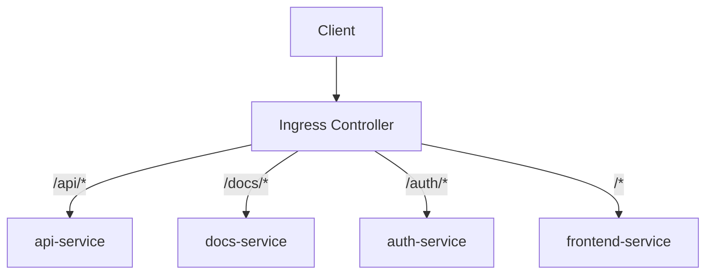
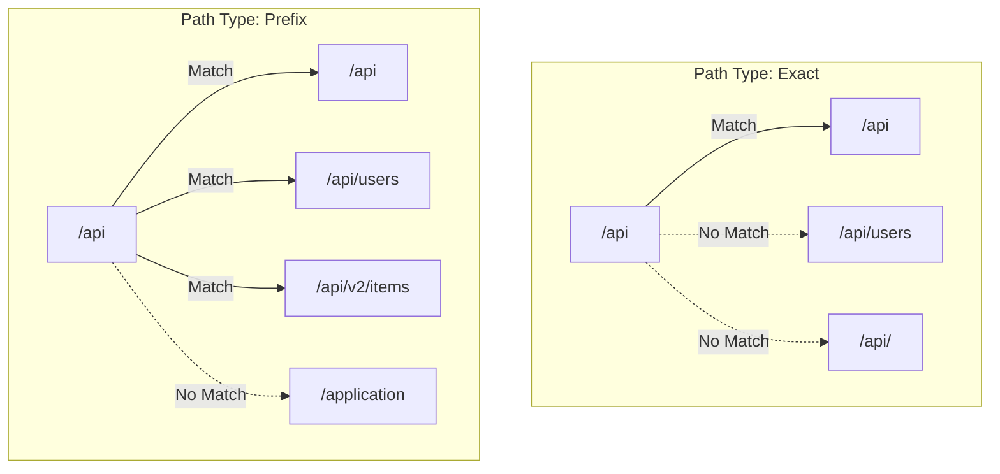
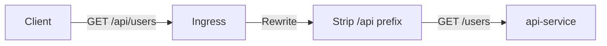
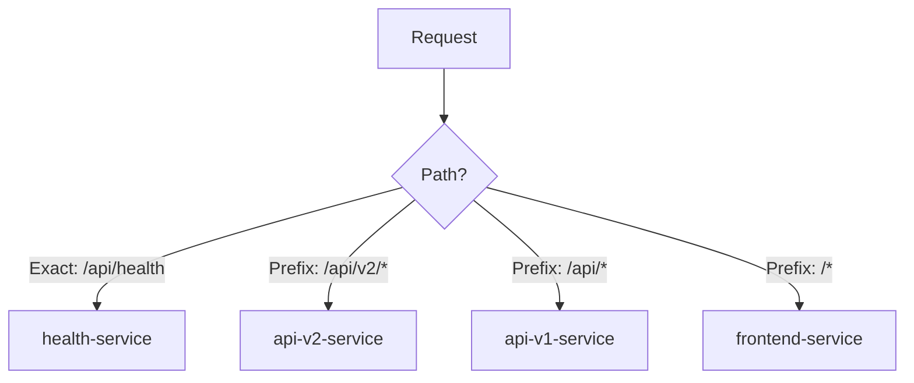

# How to Set Up Path-Based Routing with Kubernetes Ingress

Author: [nawazdhandala](https://www.github.com/nawazdhandala)

Tags: Kubernetes, Ingress, Routing, Path-Based, Networking

Description: Learn how to configure path-based routing in Kubernetes Ingress to route traffic to different services based on URL paths.

---

## What Is Path-Based Routing?

Path-based routing directs incoming HTTP requests to different backend services based on the URL path. A single domain can serve multiple services - `/api` goes to your API, `/docs` goes to your documentation, and `/` goes to your frontend.



This is essential for microservices architectures where you want a unified entry point without exposing separate domains for each service.

## Prerequisites

Make sure you have an Ingress controller installed:

```bash
# Install Nginx Ingress Controller using Helm
helm repo add ingress-nginx https://kubernetes.github.io/ingress-nginx
helm repo update

helm install ingress-nginx ingress-nginx/ingress-nginx \
  --namespace ingress-nginx \
  --create-namespace

# Verify the controller is running
kubectl get pods -n ingress-nginx
kubectl get svc -n ingress-nginx
```

Deploy sample backend services for testing:

```yaml
# backend-services.yaml
# Deploy three sample services to demonstrate path-based routing
apiVersion: apps/v1
kind: Deployment
metadata:
  name: api-deployment
spec:
  replicas: 2
  selector:
    matchLabels:
      app: api
  template:
    metadata:
      labels:
        app: api
    spec:
      containers:
        - name: api
          image: hashicorp/http-echo
          args:
            - "-text=Hello from API service"
          ports:
            - containerPort: 5678
---
apiVersion: v1
kind: Service
metadata:
  name: api-service
spec:
  selector:
    app: api
  ports:
    - port: 80
      targetPort: 5678
---
apiVersion: apps/v1
kind: Deployment
metadata:
  name: docs-deployment
spec:
  replicas: 1
  selector:
    matchLabels:
      app: docs
  template:
    metadata:
      labels:
        app: docs
    spec:
      containers:
        - name: docs
          image: hashicorp/http-echo
          args:
            - "-text=Hello from Docs service"
          ports:
            - containerPort: 5678
---
apiVersion: v1
kind: Service
metadata:
  name: docs-service
spec:
  selector:
    app: docs
  ports:
    - port: 80
      targetPort: 5678
---
apiVersion: apps/v1
kind: Deployment
metadata:
  name: frontend-deployment
spec:
  replicas: 2
  selector:
    matchLabels:
      app: frontend
  template:
    metadata:
      labels:
        app: frontend
    spec:
      containers:
        - name: frontend
          image: hashicorp/http-echo
          args:
            - "-text=Hello from Frontend"
          ports:
            - containerPort: 5678
---
apiVersion: v1
kind: Service
metadata:
  name: frontend-service
spec:
  selector:
    app: frontend
  ports:
    - port: 80
      targetPort: 5678
```

```bash
# Deploy the sample services
kubectl apply -f backend-services.yaml

# Verify all services are running
kubectl get deployments
kubectl get services
```

## Understanding Path Types

Kubernetes Ingress supports three path types:

### Exact

Matches the URL path exactly. `/api` matches only `/api`, not `/api/` or `/api/users`.

### Prefix

Matches based on a URL path prefix split by `/`. `/api` matches `/api`, `/api/`, and `/api/users`.

### ImplementationSpecific

Matching depends on the Ingress controller. For Nginx, this allows regex patterns.



## Basic Path-Based Routing

```yaml
# path-routing.yaml
# Route traffic to different services based on URL path
apiVersion: networking.k8s.io/v1
kind: Ingress
metadata:
  name: path-based-routing
spec:
  ingressClassName: nginx
  rules:
    - host: myapp.example.com
      http:
        paths:
          # Route /api/* to the API service
          - path: /api
            pathType: Prefix
            backend:
              service:
                name: api-service
                port:
                  number: 80
          # Route /docs/* to the docs service
          - path: /docs
            pathType: Prefix
            backend:
              service:
                name: docs-service
                port:
                  number: 80
          # Route everything else to the frontend
          - path: /
            pathType: Prefix
            backend:
              service:
                name: frontend-service
                port:
                  number: 80
```

```bash
# Apply the Ingress
kubectl apply -f path-routing.yaml

# Check the Ingress status
kubectl get ingress path-based-routing
```

## Path Routing with URL Rewriting

Backend services often expect requests at their root path. If your API service does not know about the `/api` prefix, you need to strip it.

```yaml
# rewrite-routing.yaml
# Strip the path prefix before forwarding to backends
apiVersion: networking.k8s.io/v1
kind: Ingress
metadata:
  name: rewrite-routing
  annotations:
    # Use regex for path matching
    nginx.ingress.kubernetes.io/use-regex: "true"
    # Rewrite the URL to strip the prefix
    nginx.ingress.kubernetes.io/rewrite-target: /$2
spec:
  ingressClassName: nginx
  rules:
    - host: myapp.example.com
      http:
        paths:
          # /api/users -> backend receives /users
          - path: /api(/|$)(.*)
            pathType: ImplementationSpecific
            backend:
              service:
                name: api-service
                port:
                  number: 80
          # /docs/getting-started -> backend receives /getting-started
          - path: /docs(/|$)(.*)
            pathType: ImplementationSpecific
            backend:
              service:
                name: docs-service
                port:
                  number: 80
```



## Multiple Ingress Resources

You can split routing across multiple Ingress resources. This is useful when different teams own different services.

```yaml
# api-ingress.yaml
# Team A manages the API routes
apiVersion: networking.k8s.io/v1
kind: Ingress
metadata:
  name: api-ingress
  namespace: default
spec:
  ingressClassName: nginx
  rules:
    - host: myapp.example.com
      http:
        paths:
          - path: /api
            pathType: Prefix
            backend:
              service:
                name: api-service
                port:
                  number: 80
---
# frontend-ingress.yaml
# Team B manages the frontend routes
apiVersion: networking.k8s.io/v1
kind: Ingress
metadata:
  name: frontend-ingress
  namespace: default
spec:
  ingressClassName: nginx
  rules:
    - host: myapp.example.com
      http:
        paths:
          - path: /
            pathType: Prefix
            backend:
              service:
                name: frontend-service
                port:
                  number: 80
```

The Ingress controller merges rules from all Ingress resources for the same host.

## Path Priority and Ordering

When multiple paths match a request, Kubernetes uses these rules:

1. **Exact** matches take priority over **Prefix** matches
2. Longer prefix paths take priority over shorter ones
3. If two paths are equal, the one defined first wins

```yaml
# priority-routing.yaml
# Demonstrate path priority rules
apiVersion: networking.k8s.io/v1
kind: Ingress
metadata:
  name: priority-routing
spec:
  ingressClassName: nginx
  rules:
    - host: myapp.example.com
      http:
        paths:
          # Exact match: highest priority for /api/health
          - path: /api/health
            pathType: Exact
            backend:
              service:
                name: health-service
                port:
                  number: 80
          # Longer prefix: higher priority than /api
          - path: /api/v2
            pathType: Prefix
            backend:
              service:
                name: api-v2-service
                port:
                  number: 80
          # Shorter prefix: lower priority
          - path: /api
            pathType: Prefix
            backend:
              service:
                name: api-v1-service
                port:
                  number: 80
          # Catch-all: lowest priority
          - path: /
            pathType: Prefix
            backend:
              service:
                name: frontend-service
                port:
                  number: 80
```



## Adding TLS to Path-Based Routing

Combine path routing with TLS termination:

```yaml
# tls-path-routing.yaml
# Path-based routing with HTTPS
apiVersion: networking.k8s.io/v1
kind: Ingress
metadata:
  name: tls-path-routing
  annotations:
    nginx.ingress.kubernetes.io/ssl-redirect: "true"
    cert-manager.io/cluster-issuer: "letsencrypt-prod"
spec:
  ingressClassName: nginx
  tls:
    - hosts:
        - myapp.example.com
      secretName: myapp-tls
  rules:
    - host: myapp.example.com
      http:
        paths:
          - path: /api
            pathType: Prefix
            backend:
              service:
                name: api-service
                port:
                  number: 80
          - path: /
            pathType: Prefix
            backend:
              service:
                name: frontend-service
                port:
                  number: 80
```

## Testing Path-Based Routing

Verify your routing configuration:

```bash
# Get the Ingress controller external IP
INGRESS_IP=$(kubectl get svc -n ingress-nginx ingress-nginx-controller -o jsonpath='{.status.loadBalancer.ingress[0].ip}')

# Test each path
curl -H "Host: myapp.example.com" http://$INGRESS_IP/
# Expected: Hello from Frontend

curl -H "Host: myapp.example.com" http://$INGRESS_IP/api/
# Expected: Hello from API service

curl -H "Host: myapp.example.com" http://$INGRESS_IP/docs/
# Expected: Hello from Docs service

# Check the generated Nginx configuration
kubectl exec -n ingress-nginx deploy/ingress-nginx-controller -- cat /etc/nginx/nginx.conf | grep -B2 -A10 "location /api"
```

## Debugging Routing Issues

When paths do not route as expected:

```bash
# Check Ingress resource details and events
kubectl describe ingress path-based-routing

# Verify backend services are reachable
kubectl get endpoints api-service
kubectl get endpoints docs-service
kubectl get endpoints frontend-service

# Check Nginx Ingress Controller logs for routing decisions
kubectl logs -n ingress-nginx deploy/ingress-nginx-controller --tail=100 | grep "myapp.example.com"
```

## Monitoring Path-Based Routes

With traffic split across multiple services via path routing, monitoring each service independently is critical. OneUptime (https://oneuptime.com) lets you monitor individual URL paths as separate endpoints, tracking availability and response times for `/api`, `/docs`, and `/` independently, so you know exactly which service is experiencing issues.
