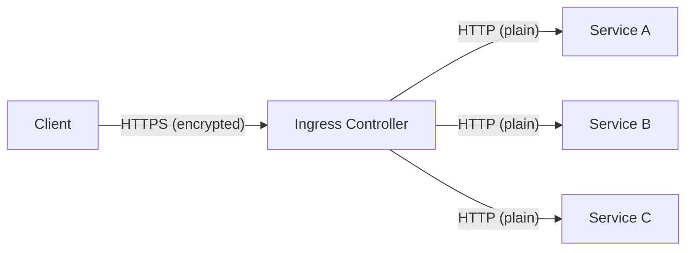
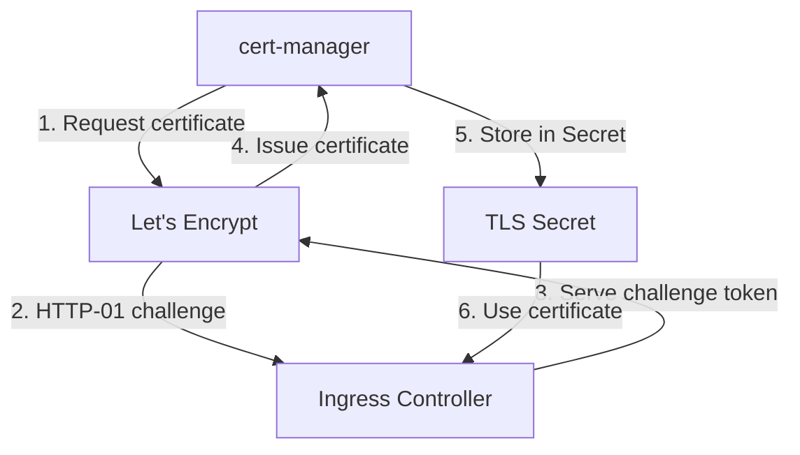
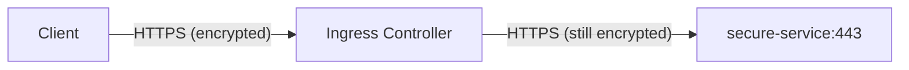

# How to Configure TLS Termination at the Kubernetes Ingress

Author: [nawazdhandala](https://www.github.com/nawazdhandala)

Tags: Kubernetes, Ingress, TLS, SSL, Security

Description: Learn how to configure TLS termination at the Kubernetes Ingress controller including certificate management and HTTPS redirects.

---

## What Is TLS Termination?

TLS termination is the process of decrypting HTTPS traffic at the Ingress controller before forwarding it as plain HTTP to backend services. This offloads the cryptographic overhead from your application pods and centralizes certificate management.



There are three TLS modes:

- **Terminate** - Decrypt at Ingress, forward HTTP to backend (most common)
- **Passthrough** - Forward encrypted traffic directly to backend (backend handles TLS)
- **Re-encrypt** - Decrypt at Ingress, re-encrypt before forwarding to backend

## Creating TLS Certificates

### Option 1: Self-Signed Certificates (Development)

```bash
# Generate a self-signed certificate for development
openssl req -x509 -nodes -days 365 -newkey rsa:2048 \
  -keyout tls.key \
  -out tls.crt \
  -subj "/CN=app.example.com/O=MyOrg"

# Create a Kubernetes TLS secret from the certificate
kubectl create secret tls app-tls \
  --key tls.key \
  --cert tls.crt

# Verify the secret was created
kubectl get secret app-tls
# NAME      TYPE                DATA   AGE
# app-tls   kubernetes.io/tls   2      5s
```

### Option 2: Let's Encrypt with cert-manager (Production)

cert-manager automates certificate issuance and renewal.

```bash
# Install cert-manager
kubectl apply -f https://github.com/cert-manager/cert-manager/releases/download/v1.16.0/cert-manager.yaml

# Wait for cert-manager to be ready
kubectl wait --for=condition=ready pod -l app=cert-manager -n cert-manager --timeout=120s
```

Create a ClusterIssuer for Let's Encrypt:

```yaml
# cluster-issuer.yaml
# Configure Let's Encrypt as the certificate issuer
apiVersion: cert-manager.io/v1
kind: ClusterIssuer
metadata:
  name: letsencrypt-prod
spec:
  acme:
    # Let's Encrypt production server
    server: https://acme-v02.api.letsencrypt.org/directory
    # Email for certificate expiry notifications
    email: admin@example.com
    privateKeySecretRef:
      name: letsencrypt-prod-key
    solvers:
      # Use HTTP-01 challenge via Ingress
      - http01:
          ingress:
            ingressClassName: nginx
```

```bash
# Apply the ClusterIssuer
kubectl apply -f cluster-issuer.yaml

# Verify the issuer is ready
kubectl get clusterissuer letsencrypt-prod
# NAME               READY   AGE
# letsencrypt-prod   True    30s
```



## Configuring TLS Termination with Ingress

### Basic TLS Termination

```yaml
# tls-ingress.yaml
# Terminate TLS at the Ingress for a single host
apiVersion: networking.k8s.io/v1
kind: Ingress
metadata:
  name: tls-app
  annotations:
    # Force HTTP to HTTPS redirect
    nginx.ingress.kubernetes.io/ssl-redirect: "true"
spec:
  ingressClassName: nginx
  tls:
    # TLS configuration for the host
    - hosts:
        - app.example.com
      # Reference the TLS secret containing cert and key
      secretName: app-tls
  rules:
    - host: app.example.com
      http:
        paths:
          - path: /
            pathType: Prefix
            backend:
              service:
                name: app-service
                port:
                  number: 80
```

### Automatic Certificate with cert-manager

```yaml
# auto-tls-ingress.yaml
# Automatically provision a TLS certificate using cert-manager
apiVersion: networking.k8s.io/v1
kind: Ingress
metadata:
  name: auto-tls-app
  annotations:
    # Tell cert-manager which issuer to use
    cert-manager.io/cluster-issuer: "letsencrypt-prod"
    # Force HTTPS redirect
    nginx.ingress.kubernetes.io/ssl-redirect: "true"
spec:
  ingressClassName: nginx
  tls:
    - hosts:
        - app.example.com
      # cert-manager will create this secret automatically
      secretName: app-tls-auto
  rules:
    - host: app.example.com
      http:
        paths:
          - path: /
            pathType: Prefix
            backend:
              service:
                name: app-service
                port:
                  number: 80
```

cert-manager will automatically:
1. Detect the annotation on the Ingress
2. Create a Certificate resource
3. Complete the ACME challenge
4. Store the certificate in the specified secret
5. Renew the certificate before it expires

### Multiple Hosts with TLS

```yaml
# multi-host-tls.yaml
# TLS termination for multiple hosts
apiVersion: networking.k8s.io/v1
kind: Ingress
metadata:
  name: multi-host-tls
  annotations:
    cert-manager.io/cluster-issuer: "letsencrypt-prod"
    nginx.ingress.kubernetes.io/ssl-redirect: "true"
spec:
  ingressClassName: nginx
  tls:
    # Each host can have its own certificate
    - hosts:
        - app.example.com
      secretName: app-tls
    - hosts:
        - api.example.com
      secretName: api-tls
    # Or use a wildcard certificate for all subdomains
    - hosts:
        - "*.example.com"
      secretName: wildcard-tls
  rules:
    - host: app.example.com
      http:
        paths:
          - path: /
            pathType: Prefix
            backend:
              service:
                name: app-service
                port:
                  number: 80
    - host: api.example.com
      http:
        paths:
          - path: /
            pathType: Prefix
            backend:
              service:
                name: api-service
                port:
                  number: 8080
```

## TLS Passthrough

For applications that need to handle TLS themselves (e.g., mutual TLS):

```yaml
# tls-passthrough.yaml
# Pass encrypted traffic directly to the backend
apiVersion: networking.k8s.io/v1
kind: Ingress
metadata:
  name: tls-passthrough
  annotations:
    # Enable TLS passthrough - Ingress does NOT decrypt
    nginx.ingress.kubernetes.io/ssl-passthrough: "true"
spec:
  ingressClassName: nginx
  rules:
    - host: secure.example.com
      http:
        paths:
          - path: /
            pathType: Prefix
            backend:
              service:
                name: secure-service
                port:
                  number: 443
```



Note: TLS passthrough requires the `--enable-ssl-passthrough` flag on the Nginx Ingress Controller.

## Configuring TLS Versions and Ciphers

Control which TLS versions and ciphers are accepted:

```yaml
# tls-config.yaml
# Configure TLS security settings
apiVersion: networking.k8s.io/v1
kind: Ingress
metadata:
  name: strict-tls
  annotations:
    nginx.ingress.kubernetes.io/ssl-redirect: "true"
    # Set minimum TLS version to 1.2
    nginx.ingress.kubernetes.io/ssl-protocols: "TLSv1.2 TLSv1.3"
    # Specify allowed cipher suites
    nginx.ingress.kubernetes.io/ssl-ciphers: "ECDHE-ECDSA-AES128-GCM-SHA256:ECDHE-RSA-AES128-GCM-SHA256:ECDHE-ECDSA-AES256-GCM-SHA384"
    # Prefer server cipher order
    nginx.ingress.kubernetes.io/ssl-prefer-server-ciphers: "true"
spec:
  ingressClassName: nginx
  tls:
    - hosts:
        - app.example.com
      secretName: app-tls
  rules:
    - host: app.example.com
      http:
        paths:
          - path: /
            pathType: Prefix
            backend:
              service:
                name: app-service
                port:
                  number: 80
```

## Verifying TLS Configuration

Test your TLS setup:

```bash
# Test the TLS connection
curl -vI https://app.example.com 2>&1 | grep -E "SSL|TLS|subject|issuer"

# Check certificate details
openssl s_client -connect app.example.com:443 -servername app.example.com </dev/null 2>/dev/null | openssl x509 -noout -text | head -20

# Verify certificate expiry
openssl s_client -connect app.example.com:443 -servername app.example.com </dev/null 2>/dev/null | openssl x509 -noout -dates

# Check certificate stored in Kubernetes secret
kubectl get secret app-tls -o jsonpath='{.data.tls\.crt}' | base64 -d | openssl x509 -noout -text | head -20
```

## Troubleshooting TLS Issues

```bash
# Check cert-manager certificate status
kubectl get certificate --all-namespaces
# NAME      READY   SECRET    AGE
# app-tls   True    app-tls   1h

# Check for certificate request issues
kubectl get certificaterequest --all-namespaces

# Check ACME challenges
kubectl get challenges --all-namespaces

# View cert-manager logs for errors
kubectl logs -n cert-manager deploy/cert-manager --tail=50

# Check Ingress controller logs for TLS errors
kubectl logs -n ingress-nginx deploy/ingress-nginx-controller --tail=50 | grep -i tls
```

## Monitoring Certificate Expiry

TLS certificates expire, and expired certificates cause outages. Proactive monitoring is essential. OneUptime (https://oneuptime.com) can monitor your TLS certificates, alert you before they expire, and track HTTPS endpoint availability, ensuring your users never encounter certificate-related errors.
